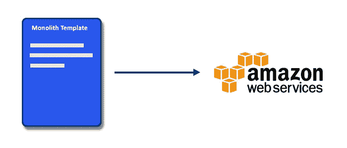
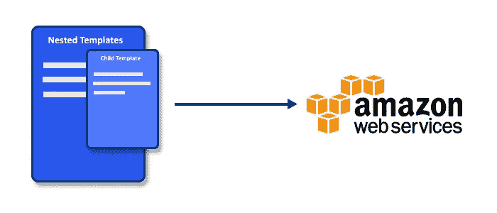
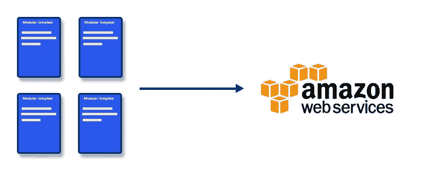

# 我们如何管理我们的基础设施:Stacker 简介

> 原文：<https://medium.com/hackernoon/intro-to-stacker-3cf999fff19b>

Stacker 是 Remind 的解决方案，用于大规模部署云基础架构。它允许您快速构建、更新、验证和部署 AWS cloudformation 模板。它建立在流行的对流层库之上，当你编写模板时，它给你 python 的全部能力。Stacker 是一个生产就绪的解决方案，Remind 使用它来部署我们的 **100 多个堆栈**，并且在许多其他公司以更大的规模使用。

这是演示 Stacker 系列博客文章的第一部分。

# 云的形成简介

当您管理云基础架构时，版本控制和跟踪变更可能非常具有挑战性。当您出于开发和测试目的需要多次复制整个生产栈时，这项任务变得更加困难。

您可以尝试编写自己的脚本来创建所有的资源，但是当您有许多相互依赖的资源并且您需要确定正确的创建顺序时，这些很快就会变得复杂。

为了解决这个问题，亚马逊创建了 Cloudformation，这是一种让你编写可定制的低级模板的方法，你可以将这些模板发送到亚马逊，以自动为你创建所有资源。

> ***栈:*** *栈是 AWS 资源的集合，您可以将其作为一个单元来管理。换句话说，您可以通过创建、更新或删除堆栈来创建、更新或删除资源集合。堆栈中的所有资源都由堆栈的 AWS CloudFormation 模板定义。*

# 堆垛机之道

让我们从一个故事开始，我们是如何开始构建 Stacker 的，以及在这个过程中做出了哪些设计决策。这将使您对利用 Stacker 的正确方法有所了解，并从中获得最大收益。

# 第一章:巨石柱

我们从一个整体堆栈开始，一个单一的模板创建了我们所有的 AWS 资源。生活很简单，所有的东西都可以从一个文件中访问，不需要堆栈之间相互通信。然而，这种方法有几个问题:

*   **这很危险:**我们一次更新我们所有的基础设施，这需要很长时间，如果堆栈执行失败，它将进入回滚模式。这意味着，如果一个资源创建失败，它将不得不恢复所有其他资源上的更改。更糟糕的是，如果它进入一个糟糕的回滚状态，它将被卡住，您的生产堆栈将需要被删除并重新创建。这不是一个有趣的过程！
*   **这很复杂:**我们的模板一度超过 8000 行代码，处理起来非常棘手，尤其是当每个变化都影响到您的任务关键型基础架构时。

# 第二章:嵌套的整体

当嵌套云形成堆栈出现时，我们非常兴奋。我们认为它可以解决我们之前遇到的所有问题，不幸的是，它没有:

*   这仍然是危险的:回退问题仍然会发生在嵌套栈中，因为所有的东西仍然是作为单个模板提交的。
*   **仍然很复杂:**云的形成模板仍然会变得又长又复杂，使得变化难以推理。

# 第 3 章:当前—模块化堆栈

Stacker 的当前版本允许您生成许多单独的堆栈。每个堆栈代表一个独立的基础设施。交叉堆栈引用是实现这种方法的最大障碍，它是通过使用我们前面介绍的“输出查找”特性创建的。

以下是我们信奉的一些指导原则:

*   **小型可组合堆栈:**每个独立的基础设施都可以表示为自己的堆栈。这解决了回滚问题，因为当某个基础架构发生故障时，它只会影响该隔离的资源，而不会影响整个生产堆栈，这使得解决问题变得更加容易和安全。此外，这允许我们为常用的部署堆栈创建预制模板。您可以在 [stacker_blueprints](https://github.com/remind101/stacker_blueprints) repo 查看我们创建的几十个定制模板，让您的生活更加轻松。
*   **可交换环境:**当部署一个栈时，您指定一个配置文件和一个环境文件。这允许您根据启动的环境来修改堆栈。例如，我们为使用不同密码的**生产**和**生产**准备了单独的环境文件，并且准备使用较便宜的资源以节省资金。
*   **AWS Exclusive:** 许多其他基础设施管理工具支持多家供应商。我们明确决定只支持 AWS。AWS 制造了非常可靠的软件，只支持它们就可以让我们简化应用程序代码，可以让我们创建更好的插件，还可以让我们将大量逻辑卸载到 AWS 本身。如果你担心供应商锁定，那么转换供应商的障碍要比 Stacker 大得多。

# 堆叠器功能

# 用 Python 编写的强大模板

Cloudformation 模板是用 JSON 或者 YAML 写的。呸！

这些都是简单的配置语言，并没有给你太多的工作。Stacker 允许你使用[对流层](https://github.com/cloudtools/troposphere)库来构建你的模板，这个库给了你 Python 的全部能力。

您可以使用**条件**和**变量**来选择何时创建或不创建某些资源。你可以使用**循环**来避免重复同样的事情 100 次。你可以传递**函数**来帮助你轻松创建不同类型的资源。

# 堆栈验证

我们使用对流层允许 Stacker 在您提交到云之前检查您的堆栈是否有效，允许您更快地修复问题，并保护您免受任何意外更改。

此外，如果在云中创建资源时出现故障，它会将错误直接输出到您的控制台，因此您可以在一个地方看到所有内容，而不必一直打开浏览器。

> *创建模板、验证语法、提交给 AWS、等待失败、清洗的工作流程&非常耗时*
> 
> *——本·威利，*[*whaletech.co*](https://whaletech.co/2017/02/28/Tooling-around-with-CloudFormation-helpers.html)

# 有用的附件

此外，我们可以为 Stacker 编写定制的附加组件，帮助完成常见的任务。有两种可以为 stacker 编写的“插件”。

## **挂钩**

这些允许您在部署所有堆栈之前或之后运行一些东西。为了说明这一点，让我们以创建一个可以 SSH 到其中的 EC2 实例为例。去 AWS 控制台，创建一个密钥对，然后把秘密信息复制到你的模板中，这是非常烦人的。keypair hook 会自动为您完成所有这些工作，而且它更加安全，因为它每次都会生成一个新的秘密，而且这个信息永远不会离开云。其他有用的挂钩包括:

**Keypair:** 提示您在运行堆栈之前导入或使用现有的 Keypair。

**Route53:** 允许您创建一个自定义的 Route53 域，以便在您的模板中使用。

**Lambda:** 从用户配置中构建 Lambda 有效负载，并将它们上传到 S3。

定制:我们让你创建和插入自己的挂钩变得超级简单。

## **查找:**

查找有点难以理解，但是当你理解的时候，它是一个非常有用的工具。例如，假设你创建了一个 S3 桶，你想创建另一个栈，以某种方式使用这个 S3 桶。你可以使用我们称之为输出查找的方法来做到这一点，它允许你获取关于那个 S3 桶的信息，并注入到另一个堆栈中。同样，我们有许多有用的查找:

**Output:**Output lookup 就是上面提到的那个，它允许你访问其他栈的输出。

**KMS:**KMS 查找允许您将加密的敏感信息(如密码)放入您的配置中，然后使用 KMS 解密。

**文件:**这允许你将一个文件传递到你的栈中，最常用于 UserData 内容。

**定制:**我们让你创建和插入自己的代码变得超级简单。

# 预建蓝图

鉴于栈很小并且可以组合，我们可以创建通用的蓝图供每个人使用。我们在 [stacker_blueprints](https://github.com/remind101/stacker_blueprints) 开源了我们的通用模板公共列表。这些蓝图包括:

*   **VPC 的**
*   **(MySQL，Postgres) RDS 实例**
*   **消防软管**
*   **自动缩放组**
*   **整个** [**帝国**](https://github.com/remind101/empire) 栈**帝国**
*   **更多！**

# 试试看！

Stacker 是大规模部署云基础设施的超级简单的工具。尝试一下，让我们知道它对你的效果如何。如果你看到任何你想添加到 Stacker 的东西，我们非常欢迎公关。让我们让基础设施自动化的世界变得更美好:)

**把你的创作推给我们:**[***@ remindeng***](https://twitter.com/remindeng)

**Github 回购:**[https://github.com/remind101/stacker](https://github.com/remind101/stacker)

**在线文档:**[http://stacker.readthedocs.io/en/latest/](http://stacker.readthedocs.io/en/latest/)

【https://empire-slack.herokuapp.com/】松松垮垮的支持渠道:

*原载于*[*engineering.remind.com*](http://engineering.remind.com/introduction-to-stacker/)*由*[*@ tau*](/@tau)*。*

> [黑客中午](http://bit.ly/Hackernoon)是黑客如何开始他们的下午。我们是 [@AMI](http://bit.ly/atAMIatAMI) 家庭的一员。我们现在[接受投稿](http://bit.ly/hackernoonsubmission)，并乐意[讨论广告&赞助](mailto:partners@amipublications.com)机会。
> 
> 如果你喜欢这个故事，我们推荐你阅读我们的[最新科技故事](http://bit.ly/hackernoonlatestt)和[趋势科技故事](https://hackernoon.com/trending)。直到下一次，不要把世界的现实想当然！

