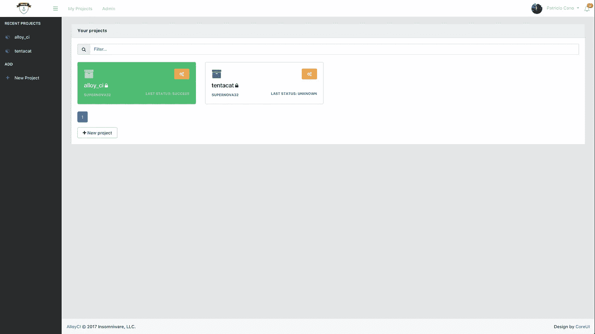
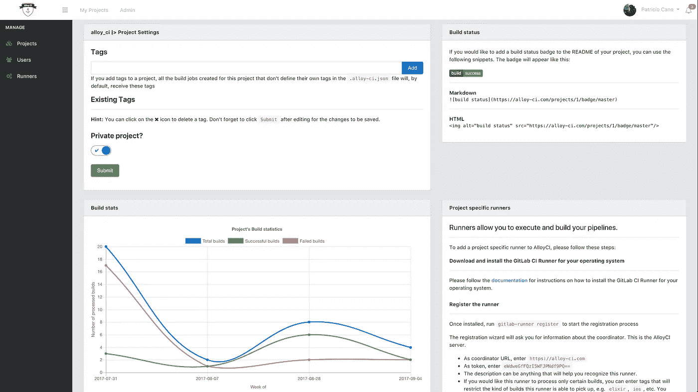
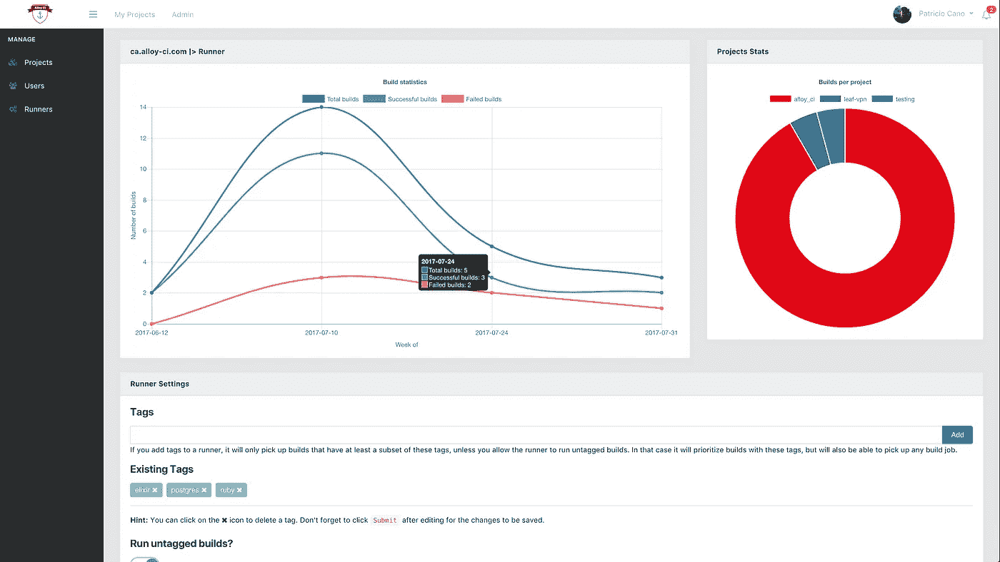
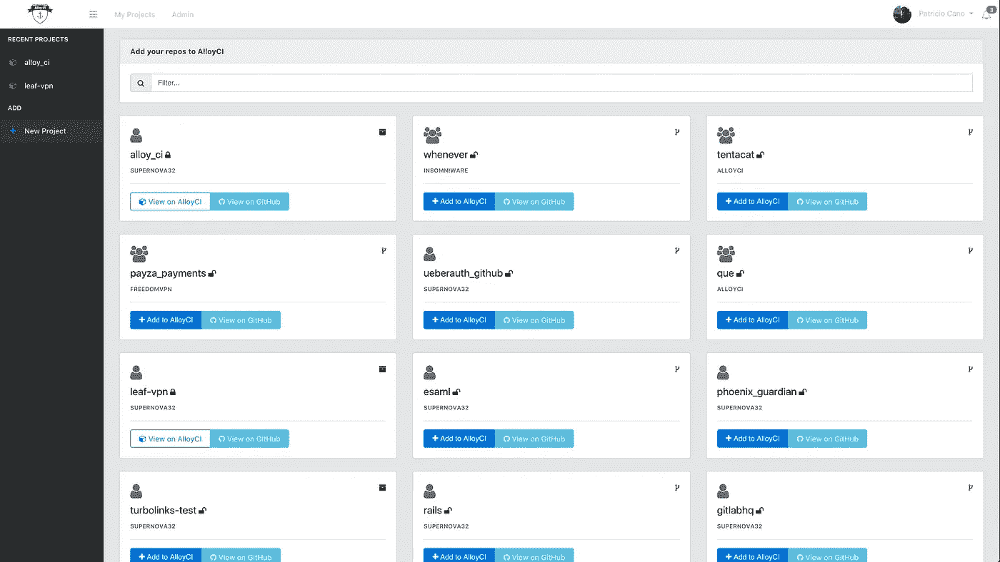
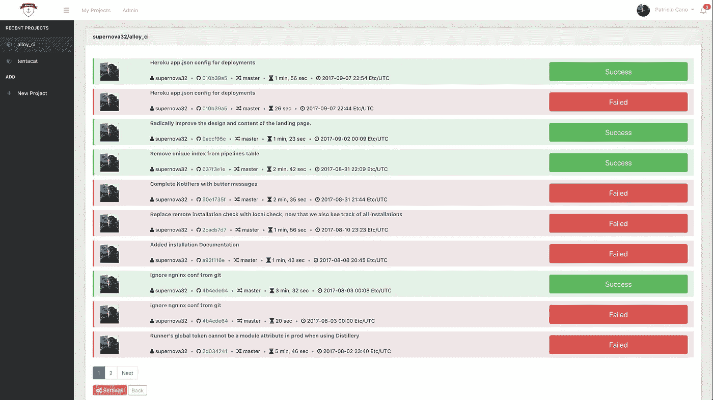
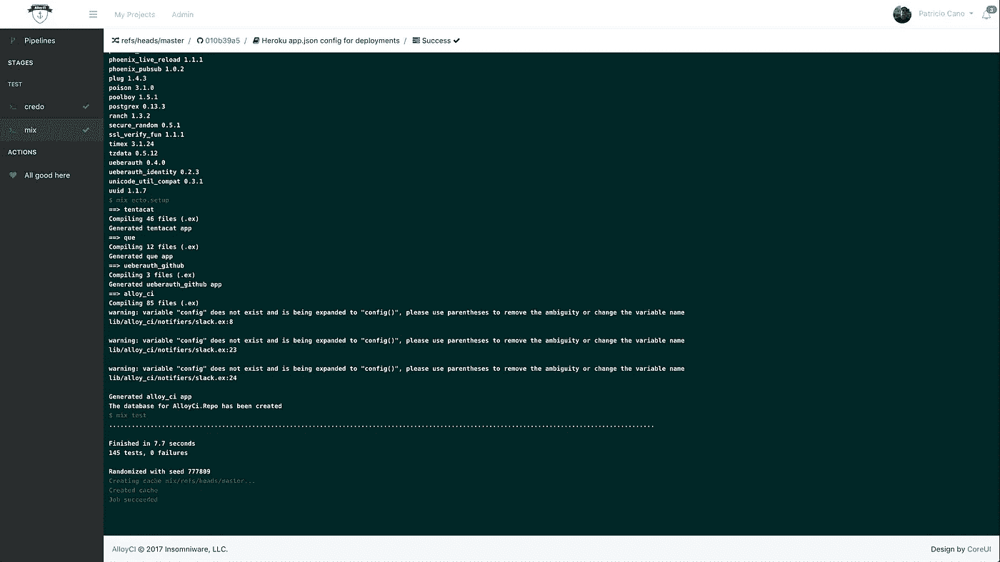

# AlloyCI 简介

> 原文：<https://medium.com/hackernoon/introducing-alloyci-a41aef2dd2f1>

## 用 Elixir & Phoenix 编写的新的持续集成协调器

我想学长生不老药和凤凰已经有一段时间了，几个月前我终于决定尝试一下。我开始阅读迪夫·托马斯的《编程[灵丹妙药](https://hackernoon.com/tagged/elixir) 1.3》和克里斯·麦考德等人的《编程凤凰》。艾尔。(均来自《实用主义书架》，如果想入门《仙丹与凤凰》，强烈推荐)。

我遵循了书中的大部分代码指南，但有时仍然感觉有点陌生。我想做一些更复杂、更有挑战性的东西。我还想把它作为开源软件发布，所以它必须对更广泛的受众有用，而不仅仅是我。

我一直喜欢 CI 系统和它们提供的价值，但是我还没有找到一个能提供我所需要的一切的系统。我希望它高度可配置，易于扩展，易于安装，有一个健壮的执行器，可以在多种操作系统上运行，并且是**开源的**。与此最接近的 CI 服务是 GitLab CI，但它与 GitLab 本身紧密耦合，所以我不能在 GitHub 中使用它。我也不想安装一个完整的源代码管理系统 ***只是为了它的 CI 服务*** 。

这就是创建竞争情报系统的想法的来源。我在 GitLab 的时候学到了很多关于 CI 系统应该如何工作的知识，所以我觉得这是向前迈出的正确一步。事实上，我决定使用 GitLab CI Runner 作为这个项目的执行者。

GitLab CI Runner 是在 **Go** 中编写的，它是实际负责运行构建的一段代码，以及执行管道所需的任何其他操作。最棒的是，它基本上是一个**“哑盒子”**，这意味着你需要做的就是告诉它以它期望的方式做什么，它就会去做！它也非常强大和可配置，它可以使用 Docker 来执行您的构建，并利用 Docker Machine 让您自动缩放它用于您的构建的机器，它可以使用 Kubernetes，在 Digital Ocean 的虚拟机上运行，运行 Xcode 和 Windows 构建，等等。

使用一个已经存在的项目作为我的 CI 系统的执行程序，让我可以专注于协调程序，这是一个软件，它读取项目的配置，创建管道，构建，并以它期望的方式将所有这些信息发送给执行程序。它还收集由执行者传递的所有信息，如构建跟踪和其他工件，并以一种易于理解的方式呈现给用户。

因为这是一篇介绍性的文章，所以我不会详细介绍 AlloyCI 不同部分的实现。为此，我将创建几个独立的帖子，并尽可能详细地介绍。现在，让我告诉你它的特点。

( [AlloyCI Dev 日记的第 1 部分是 **live！**](https://hackernoon.com/alloyci-dev-diary-part-1-8ae564fce9f3) )

# 特征

请记住，这是 AlloyCI 的第一次公开发布，而且它只有 0.1.0 版本。随着时间的推移，许多功能将会得到改进，随着我们向 1.0 迈进，还会有更多的功能出现。你可以在这里查看 1.0 的路线图:[https://github.com/AlloyCI/alloy_ci/projects/1](https://github.com/supernova32/alloy_ci/projects/1)如果你想贡献点什么，请继续。



User’s Dashboard

## 基本配置项功能

对于 0.1 版，目标是至少具备 CI 功能的最基本要素。其中包括以下内容:

*   解析配置文件以创建和准备构建和管道
*   支持不同的构建阶段
*   允许构建和运行者被标记，从而允许细粒度的控制哪个运行者选择哪个构建
*   以预期的格式处理并发送构建信息到 GitLab Runner
*   接受从 GitLab Runner 收到的关于特定构建的信息
*   显示每个构建的输出跟踪，并在查看活动构建时跟踪它
*   正确管理每个构建的状态，并且只向运行者发送应该被处理的构建
*   通过上次提交的 **SHA** 引用向 GitHub 报告每次推送的状态
*   通过电子邮件和/或 Slack 向用户发送有关管道状态的通知
*   通过`deploy`阶段执行自动部署

就商业上可用的 CI 系统而言，AlloyCI 与其他 CI 服务提供的过多功能相比相形见绌，但这没关系。我想从简单开始，从 CI 体验中提炼出最必要的特性。铃声和汽笛声将随后出现😉

## 临时演员

我只是为了“值得拥有”的价值添加了一些东西，即每个项目和运行者的构建统计数据。您可以看到一些漂亮的图表，描绘了过去一周的构建数量、成功或失败的数量以及处理的构建总数。



Project’s Settings

runners 图表还将减少 project 处理的构建数量，因此您可以看到哪些 runners 正在处理哪些构建。



Runner’s Admin Settings

# 怎么才能试出来呢？

您可以使用 Docker 和 Docker Compose 在自己的服务器上安装 AlloyCI。请按照我们的[文档](https://github.com/AlloyCI/alloy_ci/tree/master/doc#installation)开始。

试用 AlloyCI 最简单的方法是去[https://alloy-ci.com](https://alloy-ci.com)，用你的 GitHub 账户登录，然后添加一个项目。



New Project’s View

在添加项目之前，系统会提示您在自己的帐户上安装 AlloyCI 集成。这样做之后，您想要添加的项目在添加之前需要有一个`.alloy-ci.json`配置文件。你可以阅读更多关于如何创建这个文件[在这里](https://github.com/AlloyCI/alloy_ci/tree/master/doc/json)。这里有一个关于灵丹妙药的简单例子:

```
{
  "image": "elixir:latest",
  "services": [
    "postgres"
  ],
  "before_script": [
    "mix deps.get"
  ],
  "after_script": [
    "rm secrets"
  ],
  "stages": [
    "build",
    "test",
    "deploy"
  ],
  "mix credo": {
    "stage": "build",
    "script": ["mix credo"],
    "tags": ["elixir"]   
  },
  "mix test": {
    "stage": "test",
    "script": ["mix test"],
    "tags": ["postgres", "elixir"]   
  }
}
```

一旦文件被提交到存储库中，您就可以将它添加到 AlloyCI 中了。添加项目并推送新代码后，您将在项目的仪表板中看到新创建的管道。



Project’s Dashboard

如果您单击 pipeline，它会将您带到它的构建，在那里您可以跟踪它们的输出和整体状态。



Build Job’s Output

测试服务器资源有限，并且只有 2 个注册的运行者来处理构建，所以处理您的管道需要一段时间。幸运的是，你可以将你自己的跑步者注册为“项目特定跑步者”，这意味着它将只从你自己的特定项目中获取构建。有关如何添加特定跑步者的说明，请转到您项目的设置。

# 我为什么要建造 AlloyCI？

我之前提到过，我建 AlloyCI 是为了学习仙丹和凤凰。我选择了一个 CI 协调人，因为我对他们很熟悉，并想加入我自己对他们的看法。我也将它作为 **GPLv3** 许可开源代码发布，因为我认为其他人可能会觉得它有用。拥有一个重要的代码库是学习一门新语言的绝佳资源。我知道我的代码远非完美，但这是一个开始，我希望人们能看看它，批评它，并提供有用的反馈，这样我、**和其他人**，就可以从这个项目中学习和受益。

我将继续开发 AlloyCI 一段时间。我计划在可预见的未来维护它，我甚至可能考虑在 Elixir 本身中编写一个新的 runner/executor，这样项目就不依赖于 GitLab 保持 GitLab Runner 开源和维护的良好意图。

—

如果你喜欢这个项目，请把它放在 GitHub 上，如果你想到这个项目可以使用的东西，或者有一些建议或反馈，无论如何，请打开一个问题。我想去❤️听听你的想法。