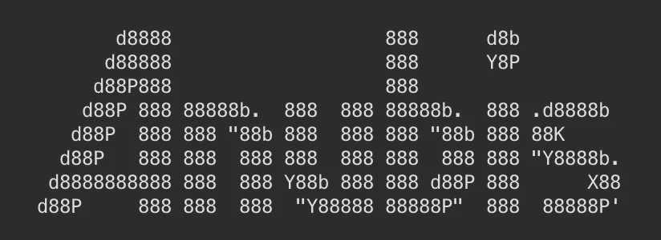
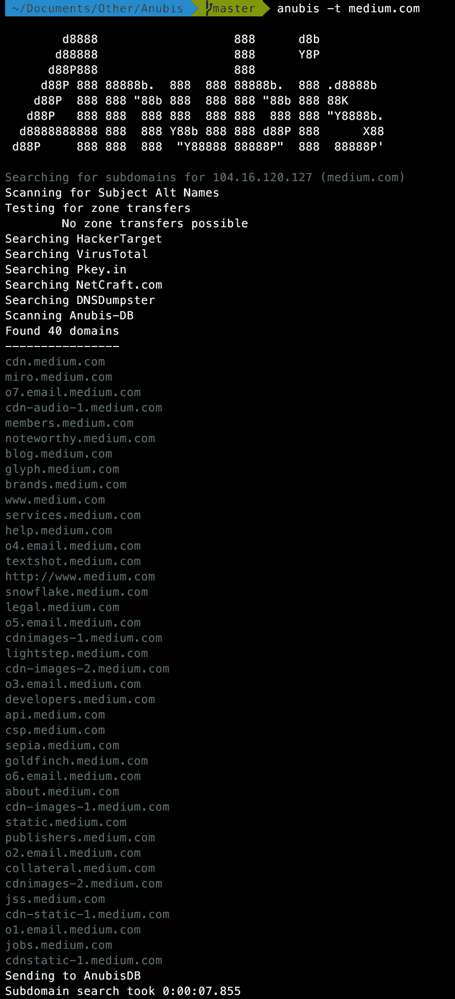
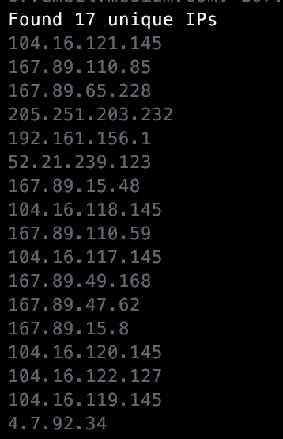

# 介绍 Anubis，一个新的子域枚举器和信息收集工具

> 原文：<https://medium.com/hackernoon/introducing-anubis-a-new-subdomain-enumerator-and-information-gathering-tool-d25b39ad98f2>

以埃及寻找失物之神命名的两个配套项目[阿努比斯](https://github.com/jonluca/Anubis)和[阿努比斯 DB](https://github.com/jonluca/Anubis-DB) ，是由于缺乏针对[子域](https://hackernoon.com/tagged/sundomain)枚举的免费开放 API 而创建的。子域枚举是信息收集阶段的第一步，是获得目标攻击面的完整范围所必需的。

Anubis 整理了来自各种来源的数据，为子域枚举提供了最全面的工具之一。它从公共资源、索引搜索结果和 [AnubisDB](https://github.com/jonluca/Anubis-DB) 中提取子域，AnubisDB 是一个用于子域的集中式开放 API。

Sample enumeration for medium.com

此外，Anubis 能够识别域背后的所有关键服务器，并输出任何感兴趣的 IP。例如，使用-p 标志运行与上面相同的命令，可以获得所有唯一解析的 IP 地址，这使得安全研究人员可以更全面地了解他们的目标范围。

The unique IPs associated with the 40 domains above

Anubis 还能够从较少使用但有潜在回报的渠道提取信息，包括 DNSSEC 子域列表和区域转移。

更多示例和完整文档可在 [Anubis repo](https://github.com/jonluca/Anubis) 上找到。