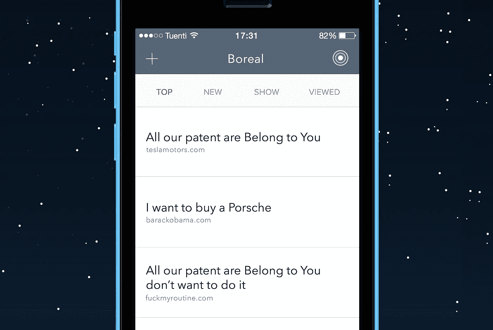
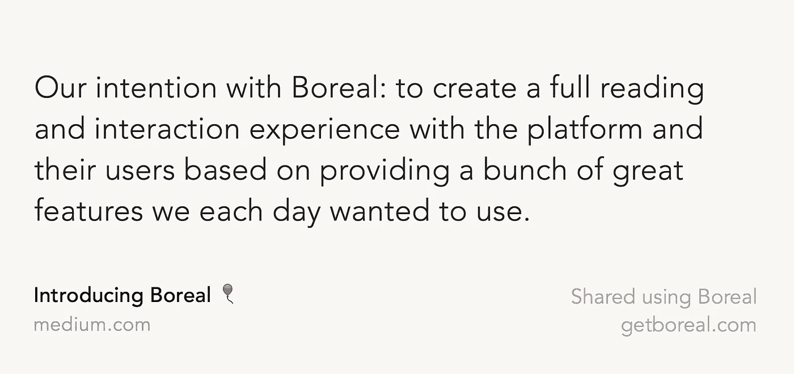
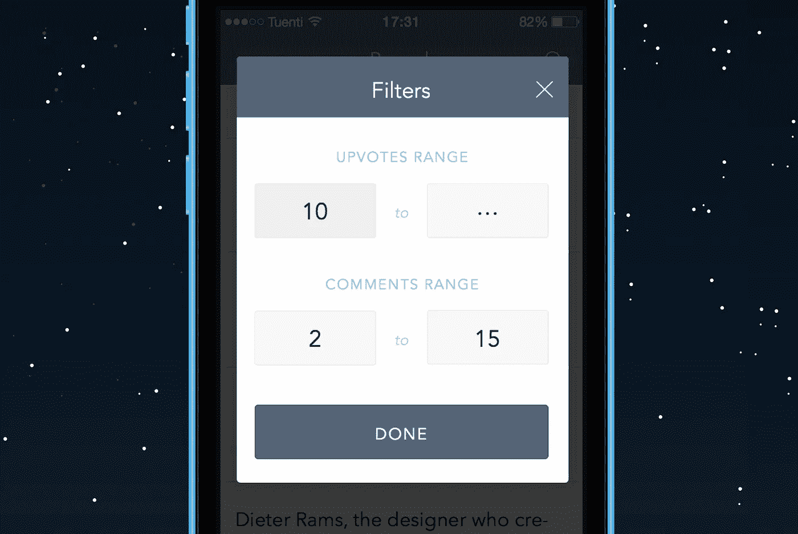

# 从用户到用户介绍 Boreal:我们的黑客新闻客户端

> 原文：<https://medium.com/hackernoon/introducing-boreal-5fc6066d86db>

## 反思工作的共同过程

让我们介绍一下。我们是两个高中创业者，都是设计爱好者，也是黑客新闻用户。我使用《黑客新闻》已经有一年了，你可能知道,《黑客新闻》对移动设备不太友好，这也是我和 Nestor(设计师)以及 Juan(开发人员)合作开发一款产品来改变这一现状的原因，它让《黑客新闻》的用户有机会与该平台及其用户进行充分的阅读和互动。

## 分裂

有一首乔纳森·库尔顿的歌我很喜欢，叫做“[你毁了一切](https://www.youtube.com/watch?v=-LrZ01A6Q_M)”。这是一种半开玩笑的哀叹，说日常生活会被一些“以最美好的方式”打乱。

那是我们与[北方](https://itunes.apple.com/us/app/boreal-a-hacker-news-client/id925851179?ls=1&mt=8)的一个意向。享受黑客新闻中我们每天都想使用的一系列强大功能。

[黑客新闻](https://news.ycombinator.com)是分享、阅读和讨论科技的最大场所之一。**黑客新闻**唯一的问题是它**不是手机友好的**。这就是为什么我们创建了一个黑客新闻客户端，它拥有大量的功能，而这些功能是 Boreal 能够提供给你的。

## 你可能会问自己，Boreal 和其他客户有什么不同？

这就是我们喜欢 Boreal 的地方，也是我们想与你分享的原因。北方完全不同。从设计到体验。当我们将 [Boreal](https://itunes.apple.com/us/app/boreal-a-hacker-news-client/id925851179?ls=1&mt=8) 与其他客户进行比较时，我们发现*你不仅仅可以阅读故事*，你还可以评论、投票甚至发表自己的帖子！在 feed 中，你可以通过上传投票和评论来过滤帖子，这样你就能找到最感兴趣的。

我是一个喜欢在 twitter 上分享内容的人，这就是为什么我们还增加了一个选项，通过选择你想要分享的文本来分享文本，我们把这个功能称为“TweetShot”。耶！

TweetShot example :)

每次你阅读一篇文章，它都会被保存到“已浏览”部分。千万不要丢了一篇好文章。

你也可以在两种不同的模式下打开新闻:我们的应用内浏览器或在自定义视图中，这是充满优势的。

> 我们确信，Boreal 将改变人们与黑客新闻互动的方式，为我们的用户提供最佳的个性化体验。

探索其他用户的个人资料，他们发布的新闻，以及他们的所有信息，如因果报应，简历等…

## 更多地

关于我们的应用程序最令人兴奋的事情是，这只是第一个版本，在下一个版本中，我们可以告诉你，我们正在包括一些大的功能。例如，你可以订阅一个用户，当他们发布一个新的故事时，你会收到通知。

所以，尝试一下又有什么损失呢？点击此处下载 Boreal！

玩得开心点，请告诉我们我们如何能让 Boreal 为您达到目标，因此如果您有任何反馈，请通过 [@GetBoreal](http://twitter.com/getboreal) 或[contact@getboreal.com](mailto:contact@getboreal.com)告诉我们。

尽情享受吧！*——北方队*

> [黑客中午](http://bit.ly/Hackernoon)是黑客如何开始他们的下午。我们是 [@AMI](http://bit.ly/atAMIatAMI) 家庭的一员。我们现在[接受投稿](http://bit.ly/hackernoonsubmission)并乐意[讨论广告&赞助](mailto:partners@amipublications.com)机会。
> 
> 如果你喜欢这个故事，我们推荐你阅读我们的[最新科技故事](http://bit.ly/hackernoonlatestt)和[趋势科技故事](https://hackernoon.com/trending)。直到下一次，不要把世界的现实想当然！

