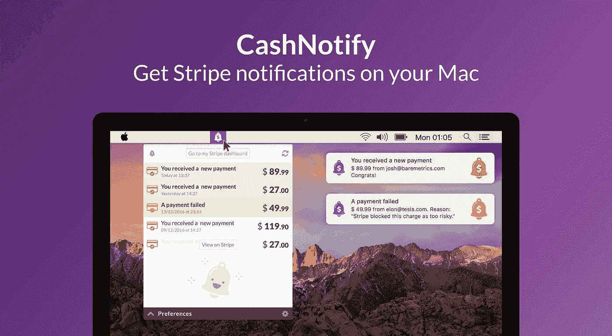
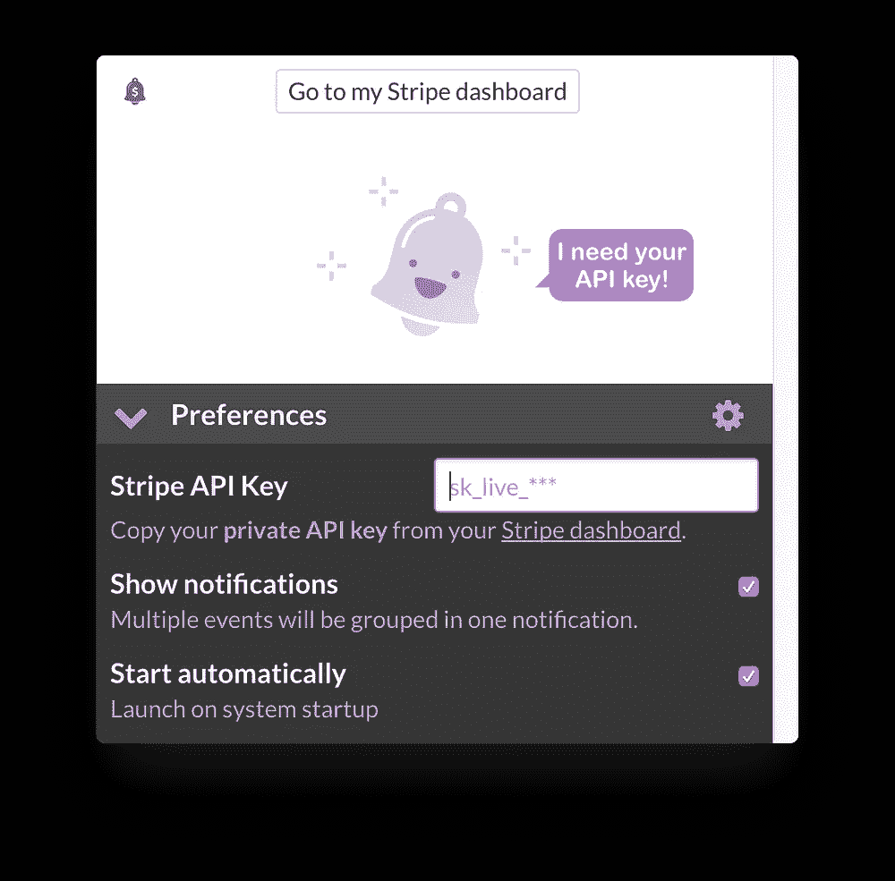
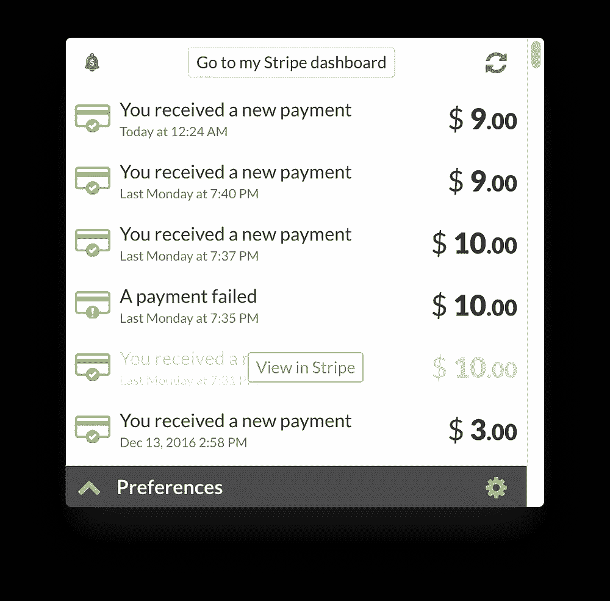

# 推送您喜欢阅读的通知💰

> 原文：<https://medium.com/hackernoon/introducing-cashnotify-stripe-notifications-for-mac-33ecc781e215>

## CashNotify 在您的业务发生的地方提供条带警报

两周前我推出了 [**CashNotify**](https://cashnotify.com/) ，这是我为 [Mac](https://hackernoon.com/tagged/mac) 开发的第一款应用。

最初的反馈是**惊人的**，有这么多建设性的要求(多账户支持有人吗？)我和我的犯罪搭档 [Bastien](https://bastienpetit.com) 联手，共同发展 CashNotify。

这就是我们建造它的原因，也是您应该关注它的原因。

*这是我们关于 CashNotify 的介绍性帖子，这是一款为希望了解自己*[*Stripe*](https://hackernoon.com/tagged/stripe)*账户情况的企业提供的应用。要充分享受它，你应该边读边听* [*阿爸—钱钱钱*](https://www.youtube.com/watch?v=ETxmCCsMoD0) *。*

# 无条纹警报=赔钱

我们最近开发的一款数字产品(Slack 社区的[付费墙](https://inviterobot.com/))使用 Stripe 处理支付。我记得花了几个小时刷新 Stripe 仪表盘，看着我们的第一批客户付钱给我们。激动人心的时刻🤑

然后我们有了第一次失败的付款。整个经历是如此的**痛苦**:首先，我们的客户必须通知 **us** 。然后，我们必须找出如何消除欺诈警报，最终才能要求我们的客户再试一次。

最后，我们解决了问题，并获得了报酬。但是我们可能会失去那个客户。至少，我们本可以主动出击，在得知付款有问题时**立即给他打电话，从而让我们自己和我们的客户免受一些压力。**

因此，我寻找解决方案来获得此类事件的通知。原来**不容易**。 [Stripe 的官方文档](https://stripe.com/docs/recipes/sending-emails-for-failed-payments)要求你设置一个 webhook，编写服务器端代码(PHP，Ruby 等。).你可以通过 IFTTT 食谱来破解一些东西，但我不认为那是可靠的。电子邮件和移动应用是大忌，因为这两者都是我所谓的“生产力时间吸盘”。

# 通知，而不是压力

我理想的应用程序应该**适合我当前的工作流程**，而不是相反。我的工作流程是，和我所知道的大多数自由职业者或其他数字企业家一样:

1.  我坐在办公桌前，
2.  我打开我的笔记本电脑(好吧，“我打开我的 macbook”)，
3.  我工作，我努力保持专注。

这意味着理想的通知应该:

*   来吧我的苹果电脑，
*   不要占用空间——精神或屏幕，
*   总是**帮我看重要事件**，一有消息就通知我，
*   并让我很容易地抓住不可避免地错过通知。

我发现最接近的是亚历克斯·麦克考的[条纹推动](https://blog.alexmaccaw.com/stripe-push)项目。不幸的是，它没有得到维护，我从来没有设法让它工作。

# 构建我理想的 Stripe 应用程序

于是我着手打造**一个简单易用的应用程序** [**在 macOS**](https://cashnotify.com) 上获取条纹通知，命名为 **CashNotify** 。

它会自动从您的 Stripe 帐户中检索事件(如成功或失败的支付)，当您的帐户中发生事情时，**会将通知**推送到您的桌面。如果你不想要通知，不用担心！您仍将**从菜单栏中查看所有最新的 Stripe 事件**，并且只需一次点击即可访问 Stripe 的完整详细信息页面。

CashNotify: Get Stripe notifications on your Mac

CashNotify 允许您:

*   **从菜单栏**访问您的条纹事件，仅一个图标之遥。不用再登录你的浏览器或加载那个(否则很好的)仪表板。
*   掌握失败的付款。一旦支付失败，原生通知会提醒你，所以你可以立即采取行动。当然，您也会收到付款成功的通知，这样您就可以庆祝了:)
*   **起步容易。您的 Stripe API 密钥是 CashNotify 唯一需要使用的东西。这是一键获取，一键粘贴。然后让 CashNotify 一直在后台运行，这样你就不会错过什么了。**
*   保持安全。所有数据直接从条带存储到您的桌面。不涉及中间服务器。您的条带 API 密钥在本地钥匙串中加密。所以你知道，它是安全的。
*   **使用 Stripe 处理任何服务。无论你是通过他们的 API 直接使用 Stripe，还是通过 Shopify、Squarespace、Weebly、BigCommerce 或任何其他兼容的电子商务，CashNotify 都会起作用。**
*   **自信一点:**收录在 [Stripe 的官方应用目录](https://stripe.com/works-with/cashnotify)里。

Access all your Stripe notifications in 1 click

# 别人爱死了！

我花了几周时间联系那些我认为能从这个应用中获取最大价值的人。人们喜欢创业者、独立创始人、顾问、数字游民，喜欢在网上销售产品的人。

原来，这些家伙**爱兑现通知**！

# 使用条纹？以下是 CashNotify 可以帮助你的方法。

世界各地都有很多人使用 Stripe 来创建令人敬畏的业务。以下是 CashNotify 如何帮助他们的:

*   彼得是一名企业家，销售许多数码产品。CashNotify 使他能够一目了然地跟踪**每天在他的业务中赚了多少钱。**
*   克莱尔有一份咨询工作，收入少/多。如果付款失败，CashNotify 触发她立即打电话联系客户**。**
*   David 是一个小企业主，销售一种定期订阅产品。他们经常需要在 Stripe 上进行测试支付。CashNotify 帮助他的团队更好更快地完成这项工作，因为他们不必查看 Stripe 的日志来查看支付结果。

CashNotify 是为自由职业者和小型企业设计的。如果你重视你的时间和金钱，并且**不能整天呆在 Stripe 的仪表盘**里，那么它就是为你设计的。

# 您可以[立即购买 cash notify](https://cashnotify.com/buy/?ref=medium#now)或[下载试用版](https://cashnotify.com/)。

干杯，
马
[@supacruz](https://twitter.com/supacruz)

> 这有帮助吗？请给它一个💚这样别人就能找到了。

*本帖部分内容改编自* [*我对 BetaList*](https://stories.betalist.com/get-stripe-notifications-for-macos-with-cashnotify-a034cd08dcf) *的采访。最初发表于*[*cashnotify.com*](https://cashnotify.com/journal/introducing-cashnotify-stripe-notifications-for-mac/)*。*

> [黑客中午](http://bit.ly/Hackernoon)是黑客如何开始他们的下午。我们是 [@AMI](http://bit.ly/atAMIatAMI) 家庭的一员。我们现在[接受投稿](http://bit.ly/hackernoonsubmission)并乐意[讨论广告&赞助](mailto:partners@amipublications.com)机会。
> 
> 如果你喜欢这个故事，我们推荐你阅读我们的[最新科技故事](http://bit.ly/hackernoonlatestt)和[趋势科技故事](https://hackernoon.com/trending)。直到下一次，不要把世界的现实想当然！

