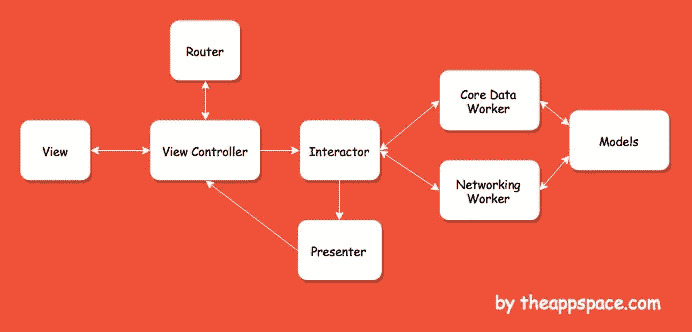

# 引入干净的 Swift 架构(VIP)

> 原文：<https://medium.com/hackernoon/introducing-clean-swift-architecture-vip-770a639ad7bf>

## 忘了 MVC 吧，现在！

[https://clean-swift.com/clean-swift-ios-architecture/](https://clean-swift.com/clean-swift-ios-architecture/)

几年前，所有的 iOS 应用都很小，屏幕不到 10 个。代码库很小，故事板工作得很好，并且很容易维护你的项目。从架构的角度来看，MVC 做得很好。

## 今天怎么样？

今天，我们面临着巨大的技术进步和疯狂的应用市场增长。换句话说，应用程序正在变得庞大而复杂。我们正在开发包含 20、30 甚至 40 个屏幕的项目，这使得用 MVC 来维护变得不可能。

> **随着技术的进步，我们(开发者)也应该进步。**

最近真的厌倦了 MVC，开始寻找新的[架构](https://hackernoon.com/tagged/architecture)。经过短暂的研究，我注意到了 [**干净迅捷**](https://clean-swift.com/) 的架构，并瞬间爱上了它！这种建筑正是我一直在寻找的。🚀

# 关于干净的 Swift 架构

Clean Swift(又名 VIP)是 Bob 大叔应用于 iOS 和 Mac 项目的 Clean 架构。干净的 Swift 架构不是一个框架。它是一套 [Xcode 模板](https://github.com/Clean-Swift/CleanStore)为你生成干净的架构组件。这意味着您可以根据自己的需要自由修改模板。

 [## 在 Xcode 中安装干净的 Swift 模板

### Clean Swift 在 iOS 开发者中越来越受欢迎。这个简短的教程将向您展示如何安装…

medium.com](/theappspace/installing-the-clean-swift-template-in-xcode-6b4367006827) 

在 MVC 项目中，您的代码是围绕模型、视图和控制器来组织和分组的。在 Clean Swift 中，你的项目结构是围绕*场景*构建的。这是一个场景的例子。换句话说，我们将为每个场景准备一套组件，为我们的控制器“工作”。这些是组件:

*   **型号**
*   **路由器**
*   **工人**
*   互动者
*   **主持人**

## 沟通

组件之间的通信通过**协议**完成。每个组件将包含用于在它们之间接收和传递数据的协议。*工作人员*与*互动器*通讯，然后*互动器*与*演示器*通讯，*演示器*与*视图控制器*通讯。

我还设计了一个流程图，这样你就可以直观地看到这些组件之间的关系。

Clean Swift (VIP) Flow Diagram

# 模型

我们将存储与控制器相关的所有型号。正如您在流程图中所看到的，模型类将与每个组件相关联。它将属于结构类型，并且主要包含请求、响应和视图模型结构。

对于这个例子，假设您正在这个场景中处理一个 API 调用。您将需要以下结构:

*   **请求-** 需要发送到 API 请求的参数。
*   **响应** -拦截来自 API 的响应并存储相应的数据。
*   **视图模型** -所有你需要显示给用户界面的东西都存储在这里。例如，您的 API 返回具有 10 个参数的对象，但是您只需要显示其中的 4 个。

# 路由器

路由器负责视图控制器之间的转换和数据传递。此外，您可以使用 segues，不像 VIPER 架构，您不能这样做。

生成的路由器文件附带了用于导航和传递数据的示例方法。*route tohaush()*方法就是一个例子，它向我们展示了如何通过使用 segue 或初始化目的视图控制器来转换到另一个视图控制器。

声明了两个协议:

1.  ***路由逻辑协议*** *-* 所有用于路由的方法都保存在该协议下。
2.  ***数据传输协议*** *-* 一种包含需要传输到目的控制器的数据的协议。

 [## 干净的 Swift (VIP)架构中的路由

### 了解如何正确使用路由器组件

hackernoon.com](https://hackernoon.com/routing-in-clean-swift-vip-architecture-dcc9a0ee9eb3) 

# 工人

工作器组件将处理所有 API/CoreData 请求和响应。响应结构(来自模型)将为交互器准备好数据。它将处理成功/错误响应，因此交互者将知道如何继续。

# 交互器

这是工作者和演示者之间的“调解人”。以下是交互器的工作方式。首先，它与视图控制器通信，视图控制器传递工作器所需的所有请求参数。在继续工作之前，将进行验证，以检查是否所有内容都已正确发送。工作人员返回一个响应，交互人员将该响应传递给演示者。

交互器还包含两种类型的协议，如路由器:

1.  ***业务逻辑协议*** *-* 声明了该协议中所有的交互方法，可以在 ViewController 中使用。
2.  ***数据存储协议***——所有应该保持当前状态的属性都在这里声明。该协议主要用于路由器，在控制器之间传递数据。

# 提出者

现在我们有了来自交互器的响应，是时候将它格式化成一个 ViewModel 并将结果传递回 ViewController 了。演示者将负责演示逻辑。该组件决定如何将数据呈现给用户。

该组件中只声明了一个协议，用于存储表示逻辑方法。在 *presentFetchResults()* 函数中，您可以看到我调用了两个在视图控制器中声明的委托方法，并期望一个合适的视图模型将其呈现给 UI。(1)处理成功案例，(2)处理错误案例。

# 视图控制器

我们完成了组件。我希望到目前为止你已经明白发生了什么。但是，我们还没有完成。这是最后一步，它是关于将组件付诸行动。正如您在上面的流程图中所看到的，ViewController 将与交互器进行通信，并从演示者那里获得响应。还有，当需要过渡的时候，它会和路由器进行通信。

我们创建了两个名为 *successFetchedItems()* 和 *errorFetchingItems()* 的委托方法。这些方法为我们提供了合适的视图模型，因此我们可以分别处理这两种情况。

## 结论

我希望你喜欢这个教程，它帮助你理解新的和令人兴奋的干净的 Swift 架构。试图尽可能详细地解释它。我知道对大多数人来说 MVC 是舒适区，但是一旦你走出它，尝试一些新的东西，你会对结果感到惊讶。Clean Swift 比 MVC 包含更多的编码和更少的文件，但是这使得维护和编写测试用例变得非常容易。😎

如果您对该架构有任何疑问，请不要犹豫，在下面给我发送评论，我将很乐意提供帮助。另外，不要忘记👏或者把这个分享给你同样在 MVC 中挣扎的朋友。🤓

感谢您的关注！👋

## 查看我的最新项目:

 [## 足球比分预测赌注

### 我们提供专业的足球比分预测投注提示，胜率高。每个比赛模拟包含一个…

apps.apple.com](https://apps.apple.com/app/football-score-prediction-bets/id1517623538)  [## Google Play 上的篮球、曲棍球和手球应用程序的下注技巧

### 超过 500，000 名职业博彩客户、体彩投注者和体育博彩爱好者信任我们的日常体育博彩…

play.google.com](https://play.google.com/store/apps/details?id=betting.tips.sportsbet)  [## BetScore:Google Play 上的足球博彩技巧、比分和赔率应用

### 我们提供高胜率的专业足球技巧。每个比赛模拟包含三个预测…

play.google.com](https://play.google.com/store/apps/details?id=betting.tips.goals)  [## Instagram 的长视频故事

### Instagram 的 Long Story 是一个非常棒的工具，允许您录制或选择任意长度的视频并进行转换…

apps.apple.com](https://apps.apple.com/app/long-video-story-for-instagram/id1511499427) 

## 在媒体上阅读更多故事:

 [## 使用 Swift 4 在 iOS 上使用 Google Maps SDK 的终极指南

### 许多 iOS 应用程序使用谷歌地图。这是一个非常普遍的特点，所以我决定准备一个终极指南…

medium.freecodecamp.org](https://medium.freecodecamp.org/how-you-can-use-the-google-maps-sdk-with-ios-using-swift-4-a9bba26d9c4d)  [## SWIFT —带有 XIB 文件的自定义 UIView

### 用 XIB 文件定制 UIView 是 iOS 开发中非常常见的做法。自定义 UIView 类不包含 XIB 文件…

medium.com](/theappspace/swift-custom-uiview-with-xib-file-211bb8bbd6eb)  [## 如何将 Spotlight 支持添加到您的 iOS 应用程序

### Swift 教程将使您的应用程序在 Spotlight search 中可用

hackernoon.com](https://hackernoon.com/how-to-add-spotlight-support-to-your-ios-app-4a89054aff89)  [## 核心数据关系

### 理解一对一和一对多关系

hackernoon.com](https://hackernoon.com/core-data-relationships-d813ed66ba8c)  [## 了解 Xcode 9 中的自动布局

### 所有你需要知道的关于自动布局

hackernoon.com](https://hackernoon.com/understanding-auto-layout-in-xcode-9-2719710f0706) 

## 订阅我的时事通讯: