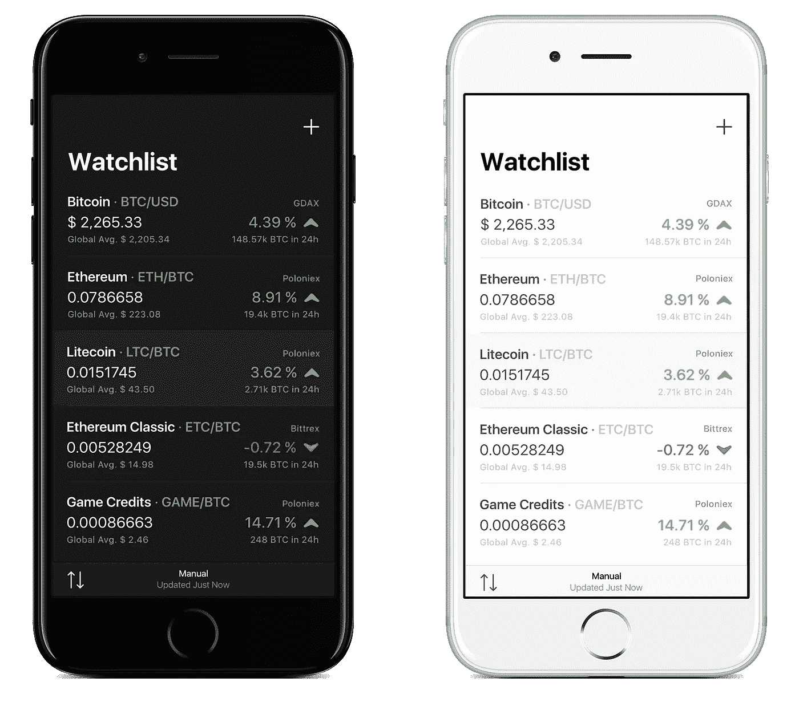
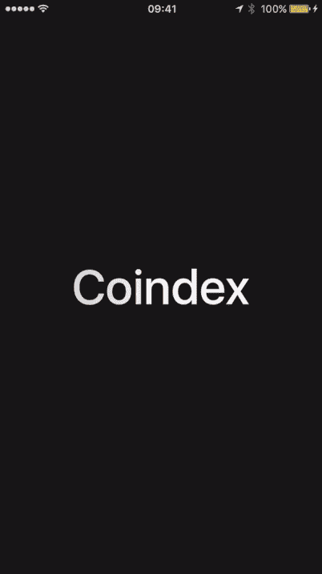

# Coindex 简介📱iOS 上的加密货币价格跟踪

> 原文：<https://medium.com/hackernoon/introducing-coindex-cryptocurrency-price-tracking-on-ios-3d3cc24217f4>

## 更好地跟踪您最喜爱的数字资产的价格。

经过数周的努力，我们自豪地宣布我们最新项目[**coin index**](https://coindexapp.com)**的公开测试版。**

**在 iOS 上下载 Coindex 加密价格跟踪器**

 [## iOS 上的加密货币追踪器。

### Coindex 可让您随时了解您想要关注的加密货币市场。

z5wg9.app.goo.gl](https://z5wg9.app.goo.gl/39sw) 

[Coindex](https://coindexapp.com) helps you track the price of Bitcoin, Litecoin, Ethereum, and more!

# 莫加密，莫问题

当我在 2011 年第一次听说[比特币](https://en.wikipedia.org/wiki/Bitcoin)的时候，没过多久，我就让我的朋友、家人和同事为这项被称为[区块链](https://en.wikipedia.org/wiki/Blockchain)的神秘技术而疯狂。到 2013 年，我们的办公室里有了一个小型的[采矿](https://en.bitcoin.it/wiki/Mining)作业。**最近，我启动了** [**加密水族馆**](https://cryptoaquarium.com)——一个面向区块链和加密货币爱好者、矿工、投资者、开发者和企业家的社区。

去年圣诞节，我在一次加密货币交易比赛中挑战了 Cellaflora 团队，我们很快意识到跟踪价格和交易表现是多么痛苦。提供了一种用户友好的买卖比特币、[莱特币](https://litecoin.org)和[以太坊](https://www.ethereum.org)的方式，但如果我们想投资其他数字资产，如 [Zcash](https://z.cash) 或 [Sia](http://sia.tech) ，事情就变得复杂了。问题是，许多流行的加密货币交易所，如 [Bittrex](https://bittrex.com) 和 [Poloniex](https://poloniex.com) 并不提供移动应用。**我们看到了对加密货币的**[**robin hood**](https://robinhood.com)**的需求，并且看到软件设计和开发是我们的核心业务，我们着手解决这个问题。**

—[coin index](https://coindexapp.com)诞生**👶**

[**注册比特币基地，这是世界上最流行的买卖比特币、以太坊和莱特币的方式。**](https://www.coinbase.com/join/520b0393dd2a5a697d000001) **【公元】**

# Coindex 是做什么的？

这个 [Pokedex](https://bulbapedia.bulbagarden.net/wiki/List_of_Pokémon_by_National_Pokédex_number) 启发的 iOS 应用程序仍处于婴儿阶段，但它为建立观察列表和查看你最喜欢的[加密货币](https://en.wikipedia.org/wiki/Cryptocurrency)的图表提供了令人愉快的用户体验。它有一个简单直观的[纸交易](http://www.investopedia.com/terms/p/papertrade.asp)功能，并包括一个“关于”每枚硬币的部分。

Build and share your watchlist, simulate trades, and track progress.

# 人们对这款应用有什么看法？

我们的社区在整个过程中起到了真正的推动作用，并提供了一些令人惊叹的反馈。在很短的时间内，Coindex iOS 公测已经收到了来自 20+个国家的用户的**4000+次注册(感谢[公测名单](https://betalist.com/startups/coindex)和[隐密](https://cryptominded.com/resource/coindex/)👏).**

Coindex will switch from day to night mode depending on your screen brightness.

Dylan Buckley — Founder of [SpareDesk](https://sparedesk.co) and [HackerMetrics](https://www.hackermetrics.co)

Condensed layout allows you conveniently track more prices.

☺️

# 下一步是什么？

我们希望成为世界上主要的加密货币应用，我们相信与我们的用户建立关系是我们产品成功的关键。

> "鉴于软件设计和开发是我们的核心业务，我们着手解决这个问题."

从我们的早期用户那里得到了大量的反馈。以下是一些受欢迎的请求:

*   价格提醒
*   新闻提要
*   现场交易
*   ICO 日历
*   投资组合跟踪
*   通知中心小部件
*   Android 和桌面应用
*   Bittrex(目前我们支持 Poloniex)
*   其他法定货币配对(欧元、英镑、日元等)

# 我们需要你的帮助

构建一个解决问题的完美产品是困难的。我们从用户那里获得诚实的反馈(尽早的和经常的)来帮助推动产品是至关重要的。这将有助于我们在[产品搜寻](https://www.producthunt.com/upcoming/coindex)上为 1.0 版本发布准备 Coindex。

**在产品搜寻上支持共同指数**😸

## 资源

*   [coin index](https://coindexapp.com)—iOS 上的加密货币价格跟踪
*   [产品搜寻](https://www.producthunt.com/posts/coindex) —产品搜寻的共同指标
*   Vinny Lingham——为什么代币正在吞噬世界
*   [cella flora](https://cellaflora.com)——软件设计开发工作室
*   加密货币资源精选目录
*   [加密水族馆](https://coindexapp.com)——区块链和加密货币社区
*   [中本聪](https://bitcoin.org/bitcoin.pdf)——比特币:一种点对点的电子现金系统
*   比特币基地博客——什么时候是投资数字货币的合适时机？

## 乔希·佩蒂的其他文章

*   这个社区正在区块链上放鱼🐟[https://medium . com/@ jashpetty/this-community-is-put-the-fish-on-the-区块链-2a56450cedcb](/@jashpetty/this-community-is-putting-fish-on-the-blockchain-2a56450cedcb)
*   分叉🍴-比特币硬分叉的简短解释。【https://medium.com/@jashpetty/the-forkening-d3acda735af2 

***附:如果你想帮助我们实现伟大的梦想，请把这篇文章分享给你的朋友*** 🐳

> 谢谢大家的支持！✌️保持冷静和冷静