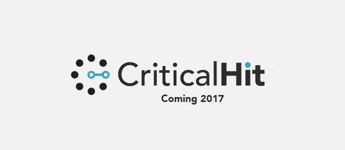
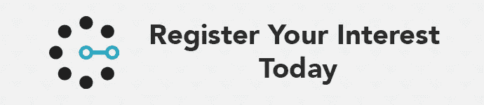
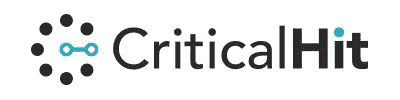

# 介绍《致命一击》——一个新的早期游戏平台

> 原文：<https://medium.com/hackernoon/introducing-critical-hit-a-new-early-access-games-platform-880ab9756775>

在过去的几个月里，我们一直在为游戏开发者设计一种新的方式，让他们的游戏更早地提供给你反馈。我们现在很自豪地介绍我们的新平台，暴击。

暴击让你能够比以前更早地玩游戏，并对你最喜欢的游戏的发展产生真正的影响。与 Steam 的早期访问不同，这项服务是在上架之前(在 alpha/beta 阶段)向开发者提供反馈，因此是完全免费的。

《致命一击》旨在确保游戏落入关心它的人手中。通过它的自定义受众搜索，开发者可以快速确定他们的理想受众。

我们的目标是让这项服务对玩家和开发者来说都易于使用，这意味着你从第一天起就有资格参加通过该平台运行的每个测试会话。

我们的目标是让这项服务对玩家和开发者来说都容易使用，这就是为什么当你对一个新游戏感兴趣时，你永远不需要重新输入你的信息。

就像开发人员一样，我们总是热衷于参与我们的社区，并将定期询问您的想法。我们想知道是什么让你想早点玩游戏？

我们现在正在寻找数量非常有限的早期采用者，以便在更广泛的发布之前帮助塑造平台。如果你有兴趣成为《致命一击》的首批用户，请在这里注册。

We’re only accepting a limited number of users right now so register your interest to avoid missing out!

如果你是一名开发者，想了解更多关于将你的游戏加入暴击的信息，请发邮件给 hello@criticalhit.co.uk。

谢谢，
暴击队。

> [黑客中午](http://bit.ly/Hackernoon)是黑客们下午的开始。我们是 [@AMI](http://bit.ly/atAMIatAMI) 家庭的一员。我们现在[接受投稿](http://bit.ly/hackernoonsubmission)并乐意[讨论广告&赞助](mailto:partners@amipublications.com)机会。
> 
> 如果你喜欢这个故事，我们推荐你阅读我们的[最新科技故事](http://bit.ly/hackernoonlatestt)和[趋势科技故事](https://hackernoon.com/trending)。直到下一次，不要把世界的现实想当然！

