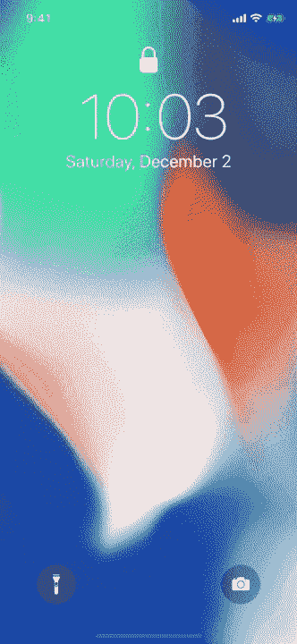
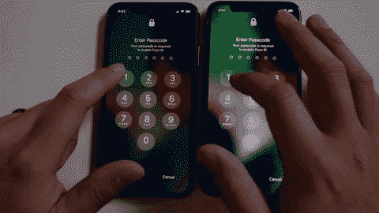

# 介绍 dead ringer:iPhone X 锁屏复制品

> 原文：<https://medium.com/hackernoon/introducing-deadringer-an-iphone-x-lockscreen-replica-9a3e613c833c>



前几天，当我看着我同事放在桌子上的 iPhone X 时，我有了一个想法。我想我可能会把它误认为我自己的手机，因为 iPhone X 有两种颜色，你有 50%的机会和其他任何人拥有相同的手机颜色。我在想，如果我真的把它误认为我的手机并输入了我的密码，我基本上就是在传输我所有个人数据的密钥。

这让我想到重现 iPhone X 的锁屏并恶搞一个自己的会有多难。事实证明，有了一些 iOS 开发的经验，并没有那么难。由于 iPhone X 的超级视网膜显示屏，充满黑色像素的屏幕与睡眠中的设备没有什么区别。由于省略了 home 键，以及一个禁用滑动回家手势的公共 API，我能够制作一个非常令人信服的 iPhone X 锁屏副本。如果你试图欺骗其他 iPhone X 型号，你的里程数可能会有所不同。

哦，我刚刚决定叫它“DeadRinger ”,因为我受到了像 [HeartBleed](http://heartbleed.com/) 这样的安全漏洞的启发，它们基本上都有自己的营销部门。我希望我的应用程序也有一个稍微有点吓人和时髦的名字。



On the left is the app, on the right is the real lock screen.

我将源代码上传到了一个 [Github repo](https://github.com/hungtruong/DeadRinger) 上，它有一个很好的自述文件，但是我将在这篇文章的剩余部分更详细地介绍一些有趣的代码实现。如果想看完整的演示视频，可以在下面看:

# 使用

我并不建议你真的使用这个应用程序，但这是理论上的攻击媒介。你可以把这个应用程序加载到你提供的手机上(你必须接受丢失它)。你可能需要做的唯一改变是壁纸图片应该匹配目标的手机。将您的手机与目标的手机交换，然后等待他们尝试解锁他们的设备。如果目标有一个箱子，我猜你会想要一个相同的，或者在换手机的时候换一个。理论上，你可以编写一些网络代码来传输输入的密码，然后用它来解锁你拥有的真正的手机。

该应用程序通过进入非活动状态来工作，这只是显示一个黑屏，模拟手机处于睡眠状态。在唤醒手机或轻按设备时，将显示锁定屏幕，然后稍后将显示密码输入视图。用户可以取消返回到锁定屏幕，如果他们愿意，他们可以点击返回到密码输入模式。该应用程序不够复杂，无法处理按下物理锁定按钮之类的事情，但这超出了本概念验证的范围。该应用程序确实会拦截从底部向上的滑动，这通常会将用户带回到主屏幕。

# 履行

也许这个项目最有趣的部分是禁用滑动回家手势。你可以在这里找到关于 iPhone X 推迟系统手势方法的文档。下面是我在 UIViewController 中的实现。

这阻止了初始手势，但如果用户再次尝试，他们将返回主屏幕，你的应用将被击败。你的目标也可能会很困惑。应用程序中还有处理主页指示器可见性的代码，因为你希望它隐藏在“非活动”屏幕上，但在锁定屏幕上可见。

随着家庭指示器逻辑的消失，还有一些其他的任务，比如确保手机不会真的进入睡眠状态。从 iOS 2 开始，这已经成为可能。实现这一点的代码行是

```
 UIApplication.shared.isIdleTimerDisabled = true
```

为了重新创建倾斜唤醒功能，我使用 CMMotionManager 来采样设备的倾斜度。我只是猜测 0.5 将是一个很好的值，但它可能会有所调整。如果设备被放回原位，它将进入非活动状态，但不是在用户输入密码时。真实设备似乎也会延迟唤醒，所以我使用了一个计时器来处理状态变化。

# 待办事项

我想说，我对锁屏的再现足够好，足以让大多数人相信他们使用的是真实的东西，但出于时间的考虑，我没有提到一些吹毛求疵的细节(因为我实际上不会使用这个应用程序来窃取任何人的密码)。

锁屏上的相机和手电筒按钮有一种很酷的 3D 触摸效果，需要你用力才能让它们开火。我没有实现这些，因为我不想让我的目标拍照，我想要他们的密码。不过，手电筒的实现其实很简单。

iOS 11.2 在锁屏上有一个特殊的控制中心指示器，我还没有实现。如果我使用的是 iOS 11.2 或更高版本，我只需要检查操作系统版本并添加视图。

当在真实视图中进入密码输入模式时，键盘上有一些很酷的转换动画，我还没有重新创建。按钮动画从底部向上稍微延迟，并有轻微的缩放动画。不过，一般人不会注意到这种差异。

没有办法从用户的设备上获得真正的通知中心项目，并把它们放在另一个设备上，所以我不打算去那里。对一些人来说，我想没有十亿次的通知意味着有些事情是可疑的。

# 可能的解决方案

我认为有几种方法可以解决这个“漏洞”(我把它放在引号中，因为它在我看来并不太可怕)。一个解决办法是像银行一样在登录屏幕上显示“个人安全图像”。不过，如果你知道目标的形象，也很容易被打败。再加上它可能太俗气，苹果公司无法实现。

另一个解决方案是添加一个硬件功能，比如当你在操作系统控件中输入内容时会亮起的 LED。这是有先例的，就像 MacBook 相机在打开时会让 LED 灯亮起。这也将缓解一些已经出现的其他安全问题。只要软件中的一切都是可复制的，就总有办法欺骗它。

作为用户，你也可以立即用贴纸或其他容易识别的东西盖住你的手机。或者把你的手机弄得很脏。或者找一些其他的方式[以独特的方式](https://www.cnet.com/news/apple-iphone-x-drop-test/)装饰你的手机。

随着我们的手机成为我们宇宙的中心，将安全作为重中之重是非常有意义的。希望苹果能做些什么，让我们的锁屏更加安全，免受欺骗！

# 放弃

请不要使用这个应用程序来窃取别人的密码。这可不酷。

# 结论

我做这个应用程序仅仅是为了验证概念，我从解决上面提到的一些技术问题中获得了很多乐趣。尝试让应用程序的[设计](https://hackernoon.com/tagged/design)尽可能接近真实的锁屏也很有趣。我学到了很多关于支持一些新的 iPhone X 特性的知识，希望你也能从这篇文章中学到一些东西！查看我的 [Github repo](https://github.com/hungtruong/DeadRinger) 了解更多细节，如果你能解决上面列出的任何 TODOs，请随意投稿。