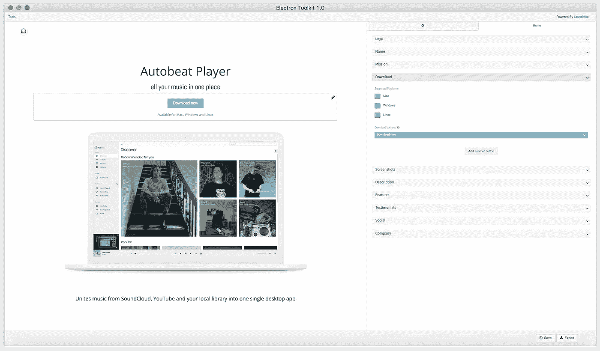

# 🚀介绍电子工具包:构建和启动电子应用程序的电子应用程序

> 原文：<https://medium.com/hackernoon/introducing-electron-toolkit-the-electron-app-to-build-and-launch-electron-apps-6530450e257e>

最近，我写了一篇文章[🦋电子:不好的部分"](https://hackernoon.com/electron-the-bad-parts-2b710c491547)关于我和电子在一起的所有*期望与现实相遇*的时刻。反馈是压倒性的。reddit 上有超过 300 条评论，播客、YouTube 视频中有提及，数百名电子邮件订阅者和数万名媒体读者，结果证明许多人都遇到了类似的问题。写问题是一回事。它创造了意识，但不是解决方案。抱怨和让别人做艰苦的工作感觉不太好。所以我想了一些方法来解决一些与部署相关的问题。幸运的是， [launchfox 网站](https://medium.com/u/1be7fee67c99#/)上留下你的电子邮件，并获得关于即将发布的通知。

# 网站(全球资讯网的主机站)

创建网站是一件耗费大量时间的事情。已经有一些服务可以帮助你加快这个过程，让你一起点击网站，比如 Squarespace(即“作为基于服务的跟踪和数据收集服务的软件，作为内容管理系统集成网站生成器进行营销”——维基百科)。

但是因为你非常了解 Web 技术，所以你可能想建立自己的网站，并把它放在 GitHub 页面上。您将花几天时间将所有东西放在一起，设计样式，使其具有响应性，在不同的设备上测试，优化页面加载时间，缩小源代码，创建能够调试的源地图，捆绑脚本，捆绑资产，配置构建管道，考虑内容交付网络，针对不同的屏幕分辨率和设备类型缩放和优化图像，注册域，获得证书，设置 https，创建自动部署脚本，到处注册帐户等等…

这需要很多时间。电子工具包可以帮助你完成这个过程。您可以使用 package.json 中的图标、截图、描述和您的产品信息，从该工具中引导一个外观精美的产品页面。

Left: the real-time website preview, right: insert content & change style

该网站已经实现了产品网站的最佳实践，并为访问者提供了一个干净和有吸引力的用户界面。您可以根据自己的喜好调整设置，重新设计风格，使用设备模板使您的屏幕截图突出并描述功能，添加评价，社交档案等。

Changes are displayed in real-time

您可以随时保存并继续工作。完成后，只需按“导出”即可将生成的页面以 zip 格式保存在您的计算机上。这项服务是由 launchfox 提供的，但是 100%免费，没有数据存储在我们的服务器上。导出的 webiste 是您的，您可以按照自己的方式定制和使用它。

利用节省下来的时间和家人一起享受假期。

# 更大的

Alina 和我希望你喜欢电子工具包，它将使你的产品发布更顺利，更有趣。让我们了解您构建的酷应用程序！

如果您想获得有关电子注册的变更、新工具或文章的通知，请点击此处:

下面是表单的 l [墨迹](https://docs.google.com/forms/d/e/1FAIpQLSf8BomWq45EWXgoFN5ZryGmuok3RXGI79g4w4LiO54-7dlgAA/viewform?usp=sf_link)

如果你想支持开发，签出这个库，留下一个星号，并使用问题跟踪器来报告错误或请求特性:【https://github.com/PhilippLgh/electron-toolkit】T2

**更新:**

电子工具包刚刚出现在产品搜索中，这给了你另一个选择来支持 xD

如果你喜欢这篇文章，请鼓掌，如果你有问题，请发表评论:)