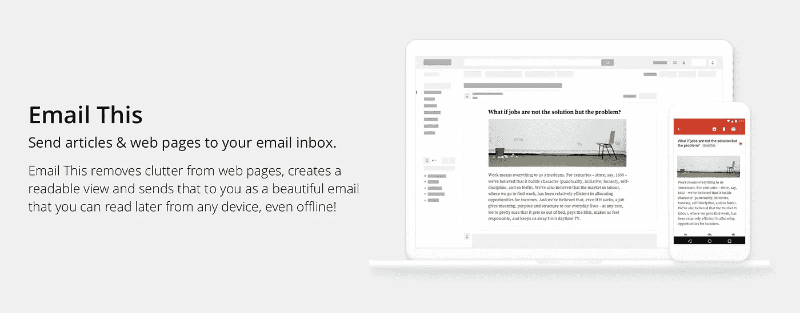
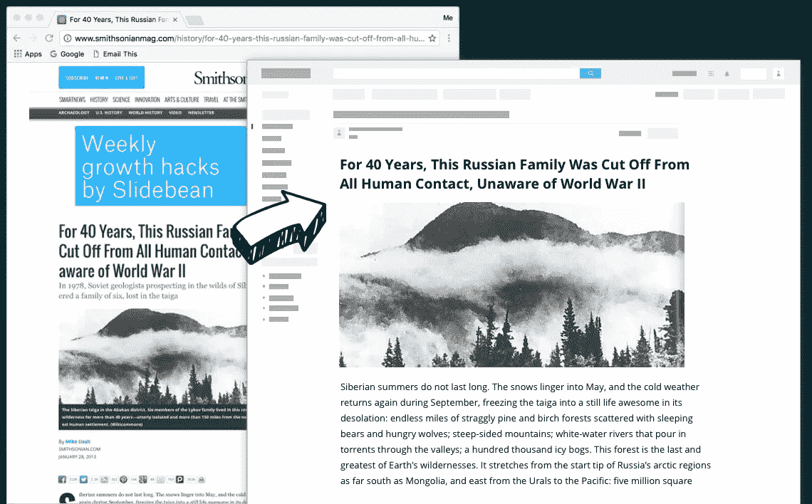
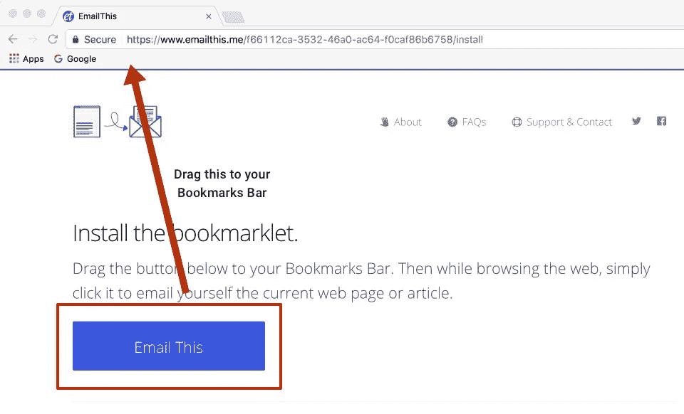
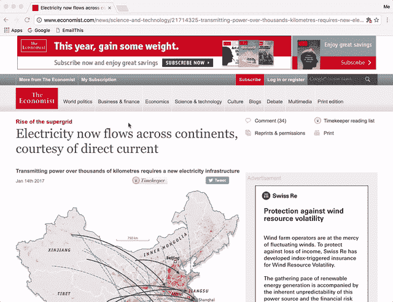
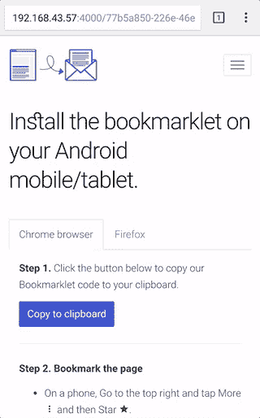
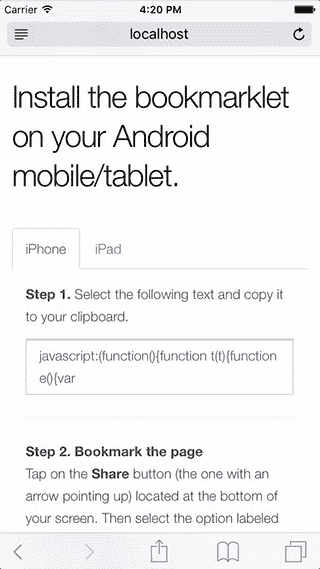
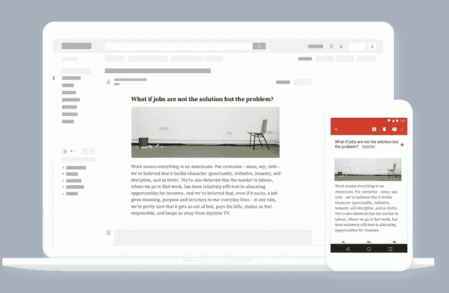

# 电子邮件简介——将无广告文章发送到您的电子邮件收件箱，以便日后阅读。

> 原文：<https://medium.com/hackernoon/introducing-email-this-send-ad-free-articles-to-your-email-inbox-for-later-reading-5a5c972b98f1>

我非常兴奋地介绍我的最新项目，[电子邮件这个](https://www.emailthis.me)。

[Email](https://hackernoon.com/tagged/email) 这是一个简单的“ **email me this web page** ”服务。如果你发现了一篇很棒的文章，但现在没有时间阅读，你可以使用 Email This 给自己发送一封格式精美的电子邮件，只包含该文章的文本和图像(**没有广告，没有劣质的边栏和干扰**！).然后，你可以打开你的电子邮件客户端，赶上你的阅读清单。

Email This sends you ad-free articles via email.

# 它是如何工作的？

1.  将我们的 [bookmarklet](https://hackernoon.com/tagged/bookmarklet) 添加到您浏览器的书签栏。
2.  当你看到有趣的文章或网页时，点击你的电子邮件这个书签。
3.  就是这样！打开你的电子邮件收件箱，随时阅读你保存的文章。

Add our bookmarklet to your browser’s Bookmarks Bar.

Click your EmailThis bookmark to save articles to your email.

# 我可以用它保存 iPhone/Android 设备上的网页吗？

是的，在移动设备上浏览时，您可以使用 Email This 保存网页和文章。在移动设备上添加 bookmarklet 并不是世界上最容易的事情，但也不太难。

Adding the Email This bookmarklet to Chrome (Android) and Safari (iOS)

请查看[如何保存网页指南](https://www.emailthis.me/web-page-to-email/how-to-save)以更清楚地了解如何从各种设备——PC、平板电脑&智能手机——使用电子邮件这个书签。

# 和 Instapaper 以及可读性有什么不同？

> *“一切都要尽可能简单，但不能再简单。”*——阿尔伯特·爱因斯坦

电子邮件这是 Pocket、Instapaper、Evernote Web Clipper 和 Readability 等工具的一个更简单的选择。

上面提到的所有工具都很优秀，但是它们做的有点多。为了使用这些工具，您需要在所有设备上安装它们的应用程序，或者您需要登录它们的 web 应用程序来访问您保存的链接/书签。如果你使用多个设备(一部手机+一台平板电脑+一台 PC/笔记本电脑)，那么你需要在每一个设备上安装应用程序。

电子邮件这将简单地向您发送一封电子邮件，其中包含您书签中页面的文本和图像，然后离开。由于电子邮件客户端是大多数设备的内置功能，因此不需要安装任何额外的应用程序。

**电子邮件会自动同步到您设备上的电子邮件客户端，因此即使您离线也可以阅读您的文章**。

Sync your emails on your mobile for offline reading

第一批“以后再读”的工具之一就是可读性。最近他们宣布将关闭他们的服务。在这种情况下，您可能需要寻找备份或下载书签的方法。

类似地，使用 Instapaper 和 Pocket 这样的工具，如果他们的服务器发生问题或者服务中断(我确信这些服务将会存在很长一段时间，但仍然…)，你可能需要考虑导出书签的方法。这不是电子邮件的情况。我们会将你所有的书签转发到你的邮箱地址，这样**你就不用担心备份书签或者担心丢失书签**。

此外，像 Outlook 和 Gmail 这样的电子邮件服务已经花费了大量的时间和金钱来使它们的**搜索和过滤能力**成为一流的。使用 Email This，您可以充分利用搜索功能来找到您正在寻找的特定书签/文章。

## [现在就查看电子邮件本](https://www.emailthis.me)！如果你能通过[一条快速推文](https://twitter.com/home?status=Found%20a%20great%20article%20but%20don%27t%20have%20time%20to%20read%20it%20now?%20Remove%20clutter%20from%20it%20and%20email%20it%20to%20yourself.%20Check%20out%20https%3A//www.emailthis.me)帮助传播关于电子邮件的消息，我将不胜感激。谢谢！

如果您有任何问题、意见或建议，请告诉我 [@bharani91](https://twitter.com/bharani91)

> [黑客中午](http://bit.ly/Hackernoon)是黑客如何开始他们的下午。我们是 AMI 家庭的一员。我们现在[接受投稿](http://bit.ly/hackernoonsubmission)并乐意[讨论广告&赞助](mailto:partners@amipublications.com)机会。
> 
> 如果你喜欢这个故事，我们推荐你阅读我们的[最新科技故事](http://bit.ly/hackernoonlatestt)和[趋势科技故事](https://hackernoon.com/trending)。直到下一次，不要把世界的现实想当然！

