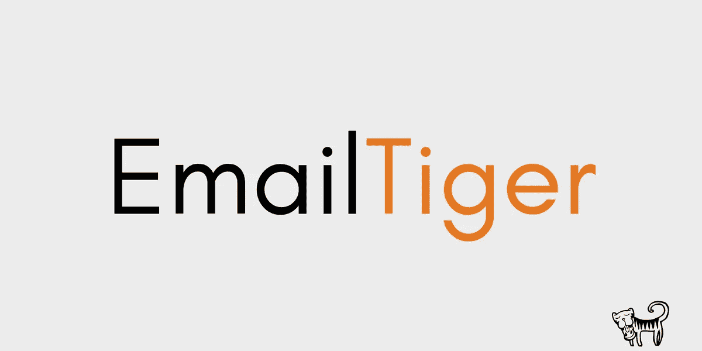

# 介绍电子邮件老虎:按发件人排列未读邮件的优先级

> 原文：<https://medium.com/hackernoon/introducing-email-tiger-prioritize-your-unread-emails-by-sender-4ed6f977a27b>

# 充分利用电子邮件

专家们早就呼吁电子邮件的死亡。令他们沮丧的是，电子邮件仍然存在，而且运行良好。而且理由很充分。电子邮件对于商业和个人通信、通知、时事通讯等是必不可少的。不管喜欢与否，电子邮件是我们生活中重要的一部分。

> Email Tiger 会给你发送一份未读邮件的邮件摘要，甚至会为你优先排序。

# 电子邮件老虎简介

通常，我们收到的电子邮件数量是一个问题。没有人希望他们收到更多的电子邮件。如果你有一个微软 Outlook 电子邮件账户，你很幸运。 [Email Tiger](http://www.email-tiger.com/) 是一款免费的应用程序，它会给你发送一份未读邮件的邮件摘要，甚至会为你对它们进行优先排序。只需点击一个按钮，电子邮件老虎收集和总结您最近的未读邮件，并立即将它们发送到您的收件箱。你可以[在这里](/@support_57283/how-it-works-85287d4bb313#.l9h9lxbtm)了解更多它是如何运作的。

# 按发件人排列未读邮件的优先级

使用 Email Tiger，您可以对某些电子邮件地址进行优先排序，以便来自这些发件人的未读邮件将首先出现在您的摘要中，而不管这些邮件是何时发送的。这可以确保你永远不会错过重要的邮件，让你更有条理地处理邮件。此外，您可以随时添加或删除优先电子邮件地址。

创建电子邮件老虎是为了帮助人们以一种新的方式处理电子邮件。无论你收到大量的电子邮件还是喜欢尝试生产力黑客，我们建议你试试电子邮件老虎。为一个更有条理的收件箱干杯！

[**带我去邮箱老虎**](http://www.email-tiger.com/)

**问题或反馈？**通过[support@email-tiger.com 联系我们。](mailto:support@email-tiger.com)

> [黑客中午](http://bit.ly/Hackernoon)是黑客如何开始他们的下午。我们是阿妹家庭的一员。我们现在[接受投稿](http://bit.ly/hackernoonsubmission)并乐意[讨论广告&赞助](mailto:partners@amipublications.com)的机会。
> 
> 如果你喜欢这个故事，我们推荐你阅读我们的[最新科技故事](http://bit.ly/hackernoonlatestt)和[趋势科技故事](https://hackernoon.com/trending)。直到下一次，不要把世界的现实想当然！

