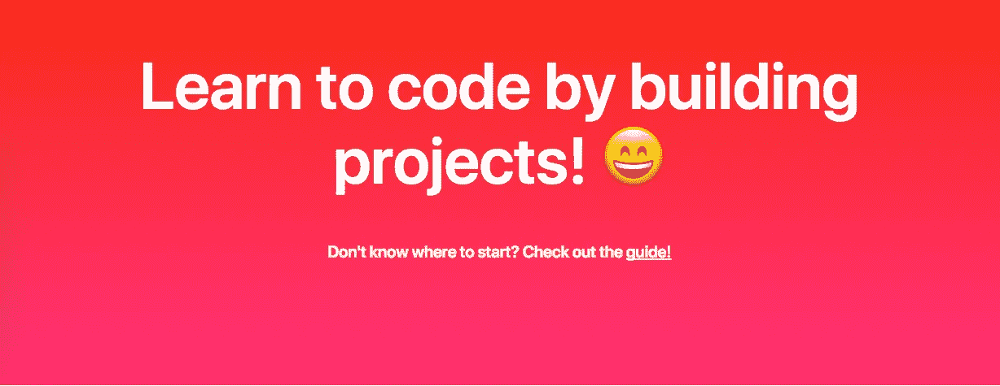

# Enlight 简介:开源编程教程

> 原文：<https://medium.com/hackernoon/introducing-enlight-open-source-programming-tutorials-20b6452e2d59>

Enlight in 6 words

几年前，一个刚刚步入青春期的男孩接受了挑战，参加了一个关于 HTML & CSS 的 [codeacademy](https://codeacademy.com) 课程。他一点也不知道，从 8 岁第一眼看到 iPod Touch 开始，他对[技术](https://hackernoon.com/tagged/technology)的热情就一直存在于他的生活中，直到今天。

那个天真的 13 岁女孩就是我。而且，我可以自信地说，虽然我在技术上已经成熟，但我仍在[学习](https://hackernoon.com/tagged/learning)。事实上，我们都在学习。

这就是为什么我创建了[Enlight](https://enlight.nyc)——一个让我们以项目的形式贡献知识的地方。无论你是初学者还是专家，双方都受益于初学者自学，专家分享真正无价的知识。

Enlight 是我的一个小项目，旨在成为所有项目开发相关的枢纽。用 Python 搭建了一个很酷的图像分类器？还是一个变态的 iOS 游戏？厉害！写个教程，分享给全世界:)

这个网站不应该是一门课程。它应该是指导你制作真正应用程序的教程汇编。当然，你可以知道每一个对象或函数的属性，但是你能使用它们吗？Enlight 教程在项目本身中实现该主题时会引用该主题，以便您理解该过程的每个部分。

> 知识如果不付诸实践是没有价值的——安东·契诃夫

说到这里，我强烈建议你去看看 [Enlight](https://enlight.nyc) 并试一试！如果你已经建立了一些你认为我们都可以从中受益的东西，请随时提交[拉请求](https://github.com/TryEnlight/tryenlight.github.io)并在网站上展示它。

编码快乐！