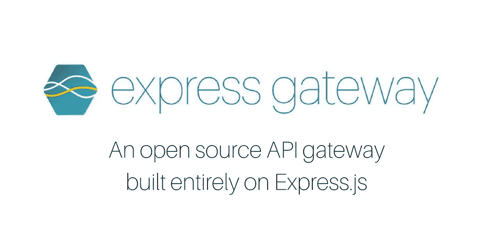
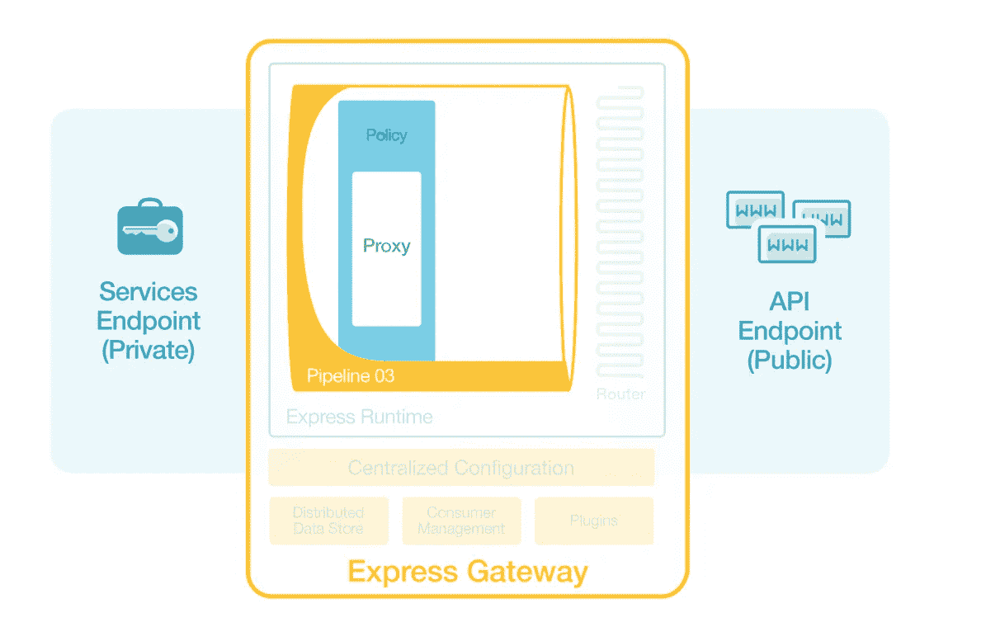
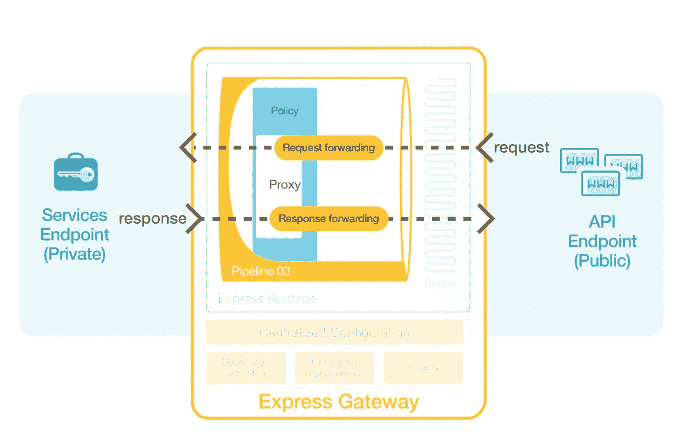
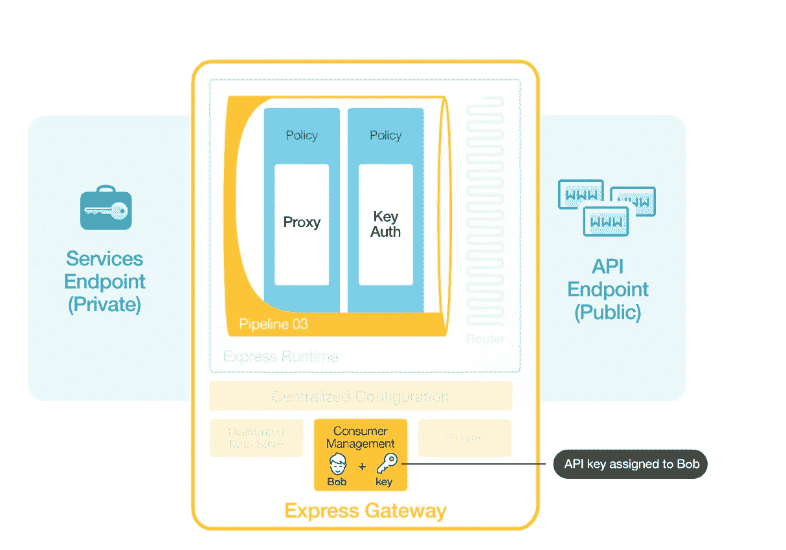
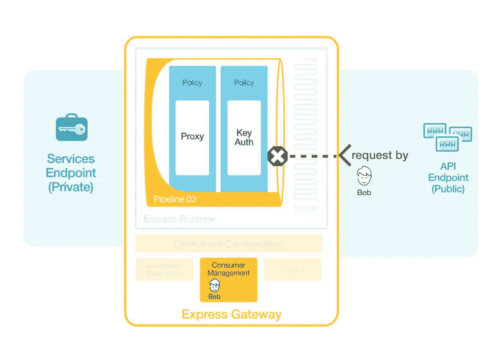
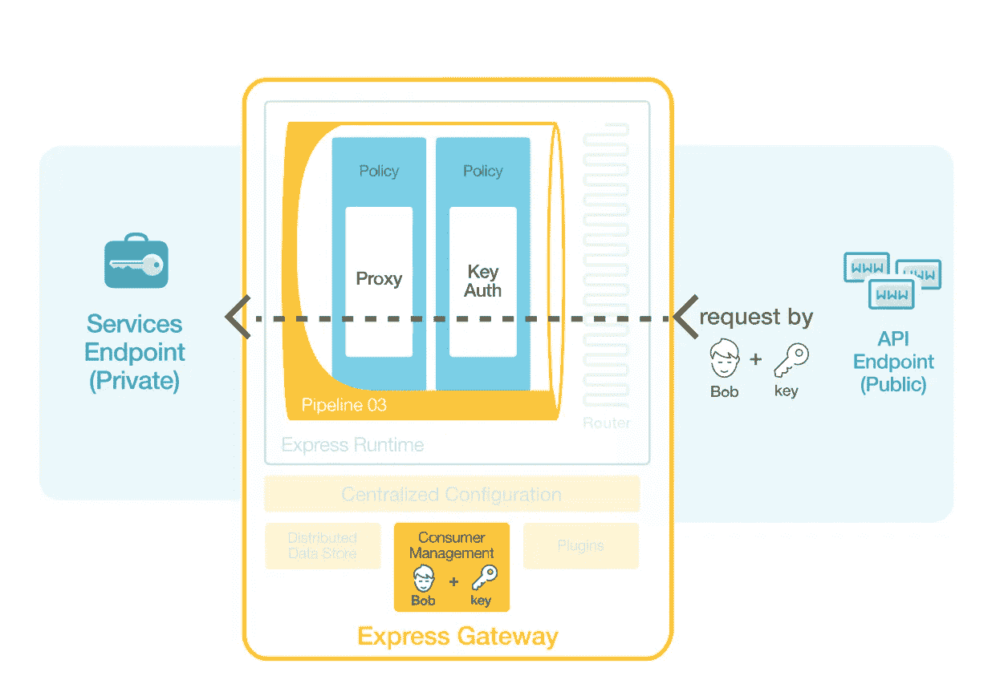

# 快速网关 1.2.0 简介

> 原文：<https://medium.com/hackernoon/introducing-express-gateway-1-2-0-19a1fc29587b>



先说，今天对我们来说是重要的一天。自从我们在 NodeJS 峰会上首次推出 [Express Gateway](http://www.express-gateway.io) 以来的几个月里，这是一次不可思议的学习之旅，回馈了开发者社区，最重要的是，查看了一些令人惊叹的开源项目。

如果你刚刚加入对话，我们想让 Express Gateway，[一个完全基于 Express.js](http://www.express-gateway.io/about/) 构建的开源 API 网关更容易被那些被迫手动推出这个解决方案的开发人员使用。

*军规？*

使用 Express Gateway，您实际上可以利用 Express.js 中间件和其他开源软件的庞大生态系统来完成工作。

# 社区驱动

作为我们对社区的持续承诺的一部分，作为 Express Gateway 项目的赞助商，我们扩展了我们最初的想法,[制定了一个路线图，该路线图足够灵活，可以根据社区的意见进行调整](http://www.express-gateway.io/express-gateway-roadmap-overview),而且还发出了正确的外部信号，因此，如果您——或任何其他人,[希望更多地参与进来](https://gitter.im/ExpressGateway/express-gateway),我们可以分享我们最初的愿景。

# 灵活的

在几次用户访谈中，一些关键的见解脱颖而出。即使当你试图启动一个开源项目，同样的设计思维原则仍然适用。为了获得我们所寻求的灵活性，团队决定坚持几个核心概念:

*   为任何语言、框架
*   将所有微服务用例都考虑在内，打造这种网关

# 简单的

最重要的是，我们希望让 Express Gateway 变得简单。API 网关和微服务已经够复杂了。

以下是我们在初始构建阶段关注的几件事:
* [一个声明性配置，它与控制这一切的代码分开](http://www.express-gateway.io/docs/configuration/)
*构建一些[最常用的网关策略，如 OAuth2](http://www.express-gateway.io/getting-started-with-oauth2) 、速率限制等
*一个现成的成熟的消费者和凭证管理系统
[自动检测和热重新加载配置更改](http://www.express-gateway.io/docs/runtime/)

# 关注我们的最新发布

如果你错过了，我们最近也有一个[版本，包括一个可扩展的插件框架](http://www.express-gateway.io/plugin-part-1-anatomy-of-a-plugin)。Express Gateway 1.2.0 增加了一个新的插件引擎，允许任何人在插件中添加自己的扩展实体。然后，您可以在 Express Gateway 中动态安装和使用它。

## 快速和肮脏:

Express Gateway 插件充当一个容器，有三个关键要素:

*   **Package.json**
*   **每个实体扩展的一个文件夹**
*   **Manifest.js**

package.json 声明了插件需要的所有依赖项，就像任何 Node.js 模块一样。

我们开始着手分解[所有的安装、实体扩展点文件夹、manifest.js 以及更多神奇的东西](http://www.express-gateway.io/plugin-part-1-anatomy-of-a-plugin)。

# 关于代码的一切

但是，使用像 **Express Gateway** 这样的开源 API Gateway 有多容易呢？

嗯，让我们看看。

启动并运行实时应用，完成身份验证。首先通过运行。

# 指定一个微服务并作为 API 公开

**第一步**

我们将指定一个现有的服务—[http://httpbin.org/ip](http://httpbin.org/ip)来进行代理和管理，就好像它是我们自己从防火墙内部发起的一样。该服务允许用户获取一个 get 并返回一个 JSON 字符串作为输出。它是免费提供的，我们将展示快速网关的功能

打开另一个终端窗口

```
curl [http://httpbin.org/ip](http://httpbin.org/ip)
```

`{ "origin": "73.92.47.31" # this will be your own IP address }`

第二步

该服务将在 Express Gateway 的默认管道中被指定为服务端点。管道是一组策略。快速网关有代理策略。使用默认管道中的代理策略，网关现在将位于 [http://httpbin/ip](http://httpbin/ip) 服务的前面，并将外部请求作为服务端点路由到它

```
cd my-gateway/config
```

打开 gateway.config.yml 并找到 serviceEndpoints 部分，其中定义了一个名为 httpbin 的服务端点

`serviceEndpoints: httpbin: url: 'https://httpbin.org'`

接下来，在默认管道的代理策略中找到 httpbin serviceEndpoint

```
…
 — proxy:
 — action:
 serviceEndpoint: httpbin
 changeOrigin: true
 …
```

**第三步**



我们将通过 Express Gateway 将 httpbin 服务公开为 API 端点。当 API 通过 API 端点公开时，可以从外部访问该 API。

打开 gateway.config.yml

找到 apiEndpoints 部分，其中定义了名为“api”的 API 端点

`apiEndpoints: api: host: 'localhost' paths: '/ip'`

*注意:代理策略默认将 API 请求的路径附加到服务端点*

**第四步**



现在我们有了一个 API 端点，我们应该能够通过 Express Gateway 访问 API。

`curl [http://localhost:8080/ip](http://localhost:8080/ip)`

# 定义 API 消费者

**第一步**

为了管理我们的 API，我们将定义被称为“消费者”的授权用户，他们被允许使用 API。

```
cd my-gateway
```


```
eg users create$ eg users create 
? Enter username [required]: bob 
? Enter firstname [required]: Bob 
? Enter lastname [required]: Smith 
? Enter email: 
? Enter redirectUri: 
✔ Created bob
```

# 使用密钥授权保护 API

**第一步**

现在，API 是完全公开的，可以通过它的 API 端点访问。我们现在要用密钥授权来保护它。为此，我们将把密钥授权策略添加到默认管道中。

在 gateway.config.yml 中，找到定义了“默认”管道的管道部分

```
pipelines:    
- name: getting-started       
  apiEndpoints:         
    - api       
  policies:         
    - key-auth:         
    - proxy:           
       - action:                
           serviceEndpoint: httpbin                 
           changeOrigin: true
```

**第二步**



将密钥凭据分配给 Bob

`eg credentials create -c bob -t key-auth -q`

`$ eg credentials create -c bob -t key-auth -q 0Er0Ldv5EHSUE364Dj9Gv:2Yzq1Pngs1JYaB2my9Ge4u`

*注意:上面的-q 选项将输出限制为 API 键，使得复制和粘贴更加容易。*

**第三步**



没有凭据的 Curl API 端点—失败

```
curl [http://localhost:8080/ip](http://localhost:8080/ip)$ curl http://localhost:8080/ip     Forbidden
```

**第四步**



使用密钥凭证将 API 端点卷曲为 Bob 成功！

```
curl -H “Authorization: apiKey ${keyId}:${keySecret}” [http://localhost:8080/ip](http://localhost:8080/ip)$ curl -H "Authorization: apiKey 0Er0Ldv5EHSUE364Dj9Gv:2Yzq1Pngs1JYaB2my9Ge4u" http://localhost:8080/ip   {     "origin": "73.92.47.31"   }
```

# 准备好试用插件了吗？

获取您需要的代码片段，以便[开始安装、插件上下文和其他关键路径示例。](http://www.express-gateway.io/plugin-part-1-anatomy-of-a-plugin)

# 就是这样！

在过去的几个月里，自从我们在 NodeJS 峰会上首次发布以来，Express Gateway 已经从一个想法成长为一个更成熟的框架，随着[插件](http://www.express-gateway.io/docs/plugins/)生态系统的不断增长和更易访问，构建可持续的 API 和微服务变得非常容易。这个新版本只是一个开始。

一如既往，我们很高兴看到您使用 [Express Gateway](http://www.express-gateway.io) 构建的东西。

在我们出发之前，我们今天还在 [***进行产品搜索***](https://www.producthunt.com/posts/express-gateway) *所以请留下一些反馈，如果你喜欢你看到的，别忘了提问。*