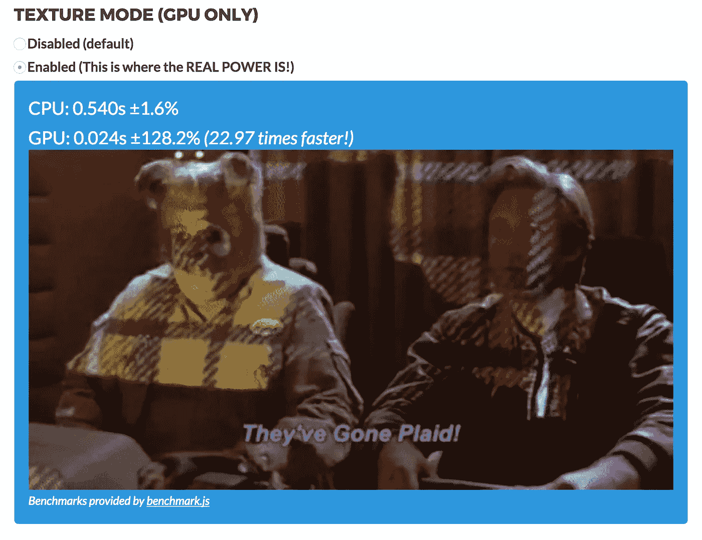
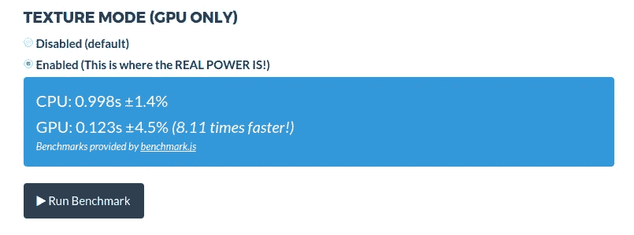
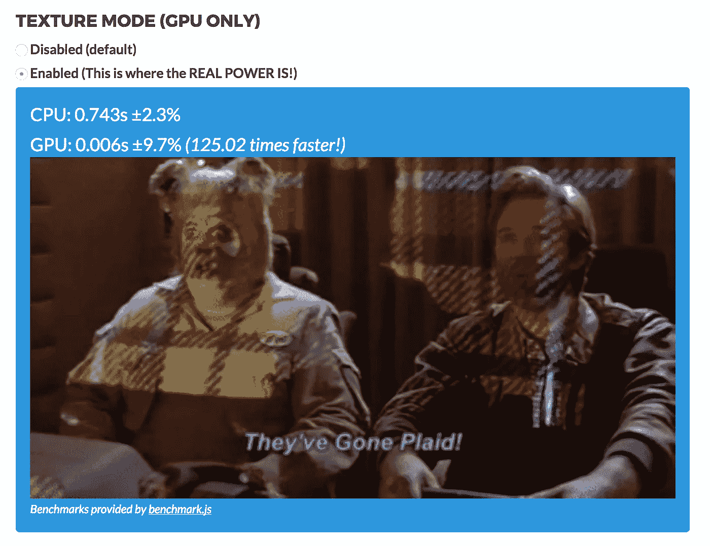

# gpu.js 简介:gpu 加速 JavaScript

> 原文：<https://medium.com/hackernoon/introducing-gpu-js-gpu-accelerated-javascript-ba11a6069327>

## 做不可能的事情很有趣。


[gpu.rocks](http://gpu.rocks)

S **o，问题来了:**你是一名厨师，你被要求为你最好的朋友的婴儿送礼会准备奶昔。因为厨师通常有巨大的收入，你自豪地拥有一个圆柱形自动化变压器(**猫**)，你可以用它来制作奶昔等等。

选项 1: 你可以自己做奶昔，只需要 2 分钟。

**选项 2:** 您可以使用 **CAT** ，这大约需要 *20 分钟*，无论要求如何。

你选: ***选项 1*** *(不错的选择)*

你在厨房的速度给鲸鱼女王留下了深刻的印象，她要求你在她儿子的婚礼上做一顿有八道菜的晚餐，包括开胃菜、甜点和奶昔。

如果你现在选择独自面对这一切，你不仅无法完成这项工作，你还将在余生中被禁止接触鲸鱼和王国。然而，如果你在数学方面稍微聪明一点，你会选择猫，在 20 分钟内完成任务(对！？！)，并获得英国最高档酒店的通票。

机器学习是一顿有八道菜的晚餐，在一场有 20 万宾客参加的鲸鱼王子的婚礼上。你想自己做饭(CPU)还是使用服务？(*提示:* gpu.js 就是那个服务。)

在 ***机器学习中，***GPU 可以帮你把时间削减到原来所用时间的 1/100。也许更多。(继续走！结果会显示出来。)

> 介绍， **gpu.js！**

如果你感到困惑，想直接跳入*支架*池中，请随意跳到下一部分。

**gpu.js** 是一个 GPgpu(图形处理单元通用编程)库，可以让你将繁重的计算交给 GPU 进行超快速的操作和输出。它目前运行在浏览器和 node.js 上，其中它在浏览器中使用 WebGl API，并且在 node.js 上的单线程操作 *OpenCL* 在路线图上。（🎉)


Github Stars ⭐️

你可能会问:“但是为什么呢？英特尔的 i7，甚至 i9 还不够快吗？它们似乎对我很有效。我不需要这个。”

在你陷入困境之前，先看看结果:



MacBook Pro ***Retina*** *2015, Google Chrome*

> *快了 22.97* 倍！？！

(*规格* : MacBook Pro *视网膜*，2015)

对对！这是一台功能强大的机器，所以下面是在一个带有集成显卡(**英特尔 HD 3000** )但没有专用 GPU 的系统上的结果:



Intel HD 3000, Google Chrome

总而言之，`gpu.js`与 lot 的区别在于，它不会束缚你以特定的方式使用库。它做到了标语所说的:它让你加速你沉重的 JavaScript。

现在来点代码:我们要进行矩阵乘法，基准测试 CPU 与 GPU 的性能。矩阵的大小: **512** X **512**

# 密码

你是对的。它托管在 GitHub: [gpu.js-demo](https://github.com/abhisheksoni27/gpu.js-demo)

源文件`gpu.min.js`和`gpu-core.min.js`可以从我们的网站( [gpu.rocks](http://gpu.rocks) )或者 github( [gpu.js](https://github.com/gpujs/gpu.js) )下载。

***注意:*** 我假设你已经初始化了一个 HTML/JS/CSS 项目的原型(`index.html`、`index.js`、`style.css`)

## 第一步。导入 gpu 库文件

在您的 index.html 中，导入文件，您就可以开始了:

## 第二步。CPU 上的矩阵乘法

要将两个矩阵相乘，我们需要确保第一个矩阵的列数等于第二个矩阵的行数。

矩阵 A: `512` X `512` (m X n)

矩阵 B: `512` X `512` (n X r)

结果:`512` X `512` (m X r)

下面是一个在 CPU 上运行的通用矩阵乘法算法:

下一步是魔法开始的地方。(WebGL 魔法😆)

## 第三步。设置 GPU

lib 文件导出一个名为`GPU`的全局函数，您可以用它来创建一个新的 gpu 实例。一个图形处理器

```
const gpu = new GPU({mode: 'webgl'});
```

一些选项可以发送给构造函数，完整的列表可以在 GitHub 和自动生成的`JSDocs`中找到。

`mode`选项指定函数将在哪里运行。有三个选项:

1.  "图形处理器"
2.  " webgl "
3.  "中央处理器"

gpu 和 webgl 都是别名，暂且不说。我们的目标是将`OpenCL`整合到`v2`中，然后 gpu 将只意味着通过服务器上的 OpenCL API 使用 gpu。

目前，webgl 和 gpu 都使用 WebGL API 将工作委托给 GPU。

## **步骤四。GPU 上的矩阵乘法**

我们刚刚初始化的 gpu 变量有几个不同的方法，它们都有不同的用例。

我们将使用`createKernel`方法，本质上，它创建了一个“内核”(一个抽象术语，实际上可能是`function`)，您可以从 JS 调用它。在幕后，使用基于 AST 和 jison 的解析器将您的代码编译为 GLSL 着色器。这确保了内核内部编写的代码将在 GPU 上执行。

您将一个 JS 函数作为参数传递给内核，并且可以访问线程尺寸(作为一种记忆方法，您可以将线程尺寸想象成我们在 CPU 模式中使用的 for 循环的长度。)

`.setDimensions`设置循环的尺寸。(完整参考见 API 页面。)

这是大多数 GPU 编写的软件工作方式中的一个固有问题:*转移惩罚*。GPU 就像自己的电脑；我们从 CPU 向其发送命令的黑匣子。我们可以向它传输数据，也可以从它那里读取数据，但这一切都是有代价的。如果您的情况涉及在 GPU 上执行几个数学运算，那么传输的整体损失尤其会成为瓶颈，并且净损失会随着每次运算而不断增加。

但是，您可以将值留在 GPU 上。它们作为纹理存在于 GPU 上。(你可以把纹理想象成某种数据容器，但是，对于 GPU 来说。)通过将`outputToTexture`标志设置为`true`，您可以确保不会招致传输损失，从而获得重要的速度提升。

`.setOutputToTexture`是*真实事件*发生的地方！


[WiffleGif.com](http://WiffleGif.com)

和**一样重要的是，A** 和 **B** 是我们将在下一步创建的矩阵。

## 第五步。初始化矩阵

这段代码摘自你在我们网站上看到的演示。如果你没有得到它，没问题。它是这样做的:它将 **512*512** 元素添加到一个 JavaScript 数组中。( *1D* )然后把它们分成 **512** 个部分，也就是说，最后我们有了一个 *2D* 大小为 **512*512** 的数组。(每个数组元素都有子元素。)

全部完成！让我们踩油门。

## **第六步。运行它并进行基准测试**

为了简单起见，我们将使用 Web performance API 对此进行基准测试，但是您也可以使用`benchmark.js`。(我们的网站用那个。)

首先我们通过调用上述函数生成矩阵，然后我们为 **CPU** 和 **GPU** 运行`matMult`方法。

嘭！在浏览器中打开`index.html`，自己看看。下面是我得到的:(对 *Safari* 的支持即将到来！)

## 铬合金:


## 火狐(怎么了， *Chrome？*):



而那只是**512×512。**如果你把这个数字改为 1024，你会发现 GPU 是一个强大的怪兽，它运行代码的速度比 CPU 快得多*。*

*我们想让社区知道 JavaScript 已经得到了一枚火箭。🚀你会用它做什么？*

**

*所有的代码都在 GitHub 上，团队会很高兴有更多的用户和贡献者。 [gpu.js](https://github.com/gpujs/gpu.js) —去顿悟一下吧。🎉*