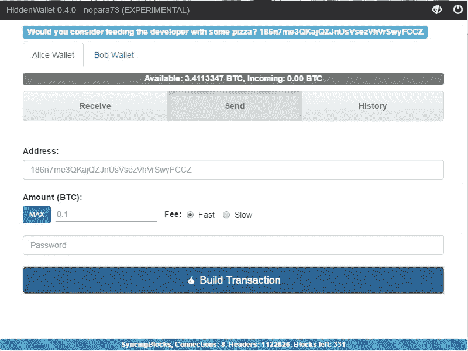
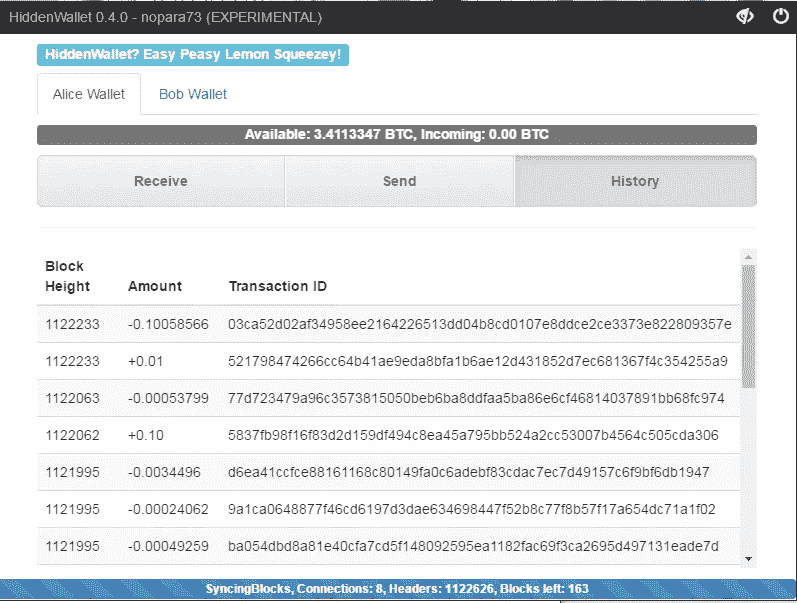

# HiddenWallet 简介:全块 SPV TumbleBit 钱包—测试版

> 原文：<https://medium.com/hackernoon/introducing-hiddenwallet-full-block-spv-tumblebit-wallet-testing-release-1054a15a9bb1>

我非常兴奋，不仅因为今天是我的生日，还因为我宣布 HiddenWallet 的首次发布，我相信这是让比特币再次匿名的道路上迈出的一大步。

## [在 GitHub 上下载并阅读更多关于 HiddenWallet 的内容！](https://github.com/nopara73/HiddenWallet)

# TumbleBit 和 HiddenWallet 是什么？

简而言之， [TumbleBit](https://hackernoon.com/understanding-tumblebit-part-1-making-the-case-823d786113f3) 是一个不可信的比特币混合器，在这里，tumbler 不能窃取你的硬币，也不能取消你的匿名。*我还想指出 TumbleBit 还没有集成，这是路线图的下一步。*
tumble bit 为什么需要专用钱包？为什么不把它集成到 Electrum 或 Blockchain.info 或其他钱包中呢？问题是，**如果从隐私的角度来看，你的同行在组合中使用的钱包被搞砸了，即使你以正确的方式使用 TumbleBit 和 fullnode，你的匿名设置也被搞砸了，因为你的同行。**
为什么全节点比普通比特币钱包提供更多隐私？乍一看，他们正在区块链上留下类似的轨迹，但这不是你想要保护的隐私的唯一方面。区块链监控公司或各种第三方可以通过结合区块链和网络分析技术来重建你的钱包地址之间的链接。这不仅仅是理论上的威胁，这是今天的现实，他们在这方面非常成功。如果你使用一个完整的节点作为你的个人比特币钱包，你就失去了网络分析的可能性，因为它不仅要求它需要的第三方数据，如地址平衡，而且要求比特币网络拥有的所有 a 数据，如所有块，所以其他节点无法找出它需要的数据。如果你想深入了解，你可以阅读我对这个话题的研究。

然而，运行一个比特币完整节点是很麻烦的，随着时间的推移，随着比特币的规模不断扩大，情况预计会变得更糟，但我们可以做得更好，如果我们的唯一要求是保持完整节点级别的隐私，这就是隐藏钱包和完整块下载 SVP 钱包的用武之地。有趣的是，这就是 Satoshi 在他的白皮书中描述的那种特殊目的载体钱包，但是今天的特殊目的载体钱包都没有实现。HiddenWallet 不存储区块链，也不验证区块，而是使用 merkle 证明，像其他 SPV 钱包一样，以确保交易有效。与其他 SPV 钱包不同，像完整节点一样，它下载完整的块，因此好奇的听众不知道我们对什么信息感兴趣，因此它无法重新稳定我们钱包地址之间的链接。这是 TumbleBit 理想工作所需要的隐私。

# 路标

1.  [整块下载 SPV](/@nopara73/bitcoin-privacy-landscape-in-2017-zero-to-hero-guidelines-and-research-a10d30f1e034)——**就绪，不稳定。**此功能通过 SPV 安全性提供了针对网络分析的完整节点级隐私保护。
2.  [TumbleBit 集成，经典不倒翁模式](https://hackernoon.com/understanding-tumblebit-part-1-making-the-case-823d786113f3)——**接下来。TumbleBit 是一个比特币混合器，即使是不倒翁也不能偷你的硬币，也不能剥夺你的隐私。**
3.  [事务过滤块下载](/@nopara73/full-node-level-privacy-even-for-mobile-wallets-transaction-filtered-full-block-downloading-wallet-16ef1847c21)—10–100 倍的性能提升，同时仍然保持完整节点级别隐私不受网络分析影响，但将 SPV 安全替换为可信完整节点安全。
4.  发布稳定版。
5.  TumbleBit Paymen Hub 模式？联合市场整合？隐形地址支持？

> [黑客中午](http://bit.ly/Hackernoon)是黑客如何开始他们的下午。我们是 AMI 家庭的一员。我们现在[接受投稿](http://bit.ly/hackernoonsubmission)并乐意[讨论广告&赞助](mailto:partners@amipublications.com)机会。
> 
> 如果你喜欢这个故事，我们推荐你阅读我们的[最新科技故事](http://bit.ly/hackernoonlatestt)和[趋势科技故事](https://hackernoon.com/trending)。直到下一次，不要把世界的现实想当然！

