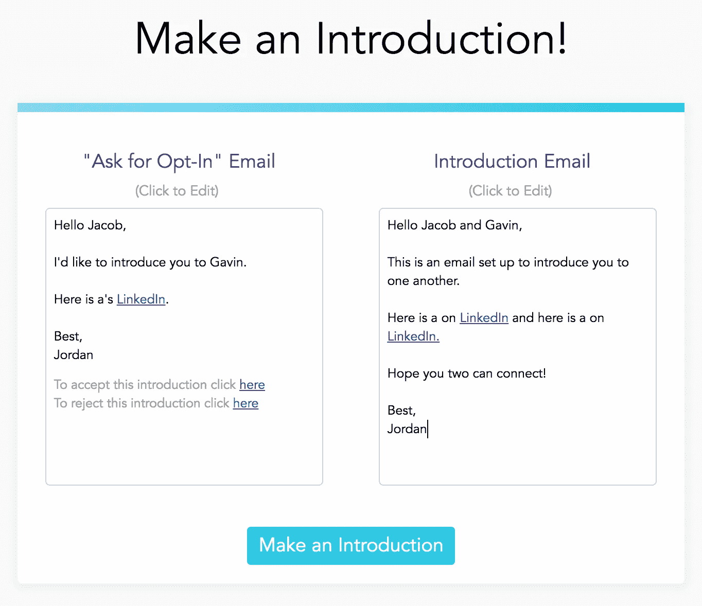

# 介绍 IntroSender

> 原文：<https://medium.com/hackernoon/introducing-introsender-4edaace485fc>

## 做介绍最简单的方法

我们做的“真正的工作”和消耗我们大部分时间的“工作”有很大的区别。每当我发现自己沉迷于后者，我就会提醒自己什么才是真正重要的。为什么我在做我正在做的事情。

**调度。电子邮件。组织。打扫卫生。设置流程。**

那是我的“工作”，它分散了我对“真正工作”的注意力。你一天中有多少时间花在你认为重要的事情上？我想我们大多数人都会承认，在我们并不真正关心的事情上，我们花了比我们想要的更多的时间。

**好消息:**智能技术将使我们能够自动化那些我们讨厌重复做的过程——这样，我们就可以把更多的时间花在我们关心的事情上。

今天，我们推出了一个工具，可以自动完成我们很多人花费太多时间的一个过程:**在我们认识的人之间发送介绍邮件。**

我们都喜欢乐于助人，但是做介绍的“过程”是不必要的冗长，而且容易搞砸。玩密件抄送，选择加入，等等。是没有人喜欢做的事情。

## 所以，我们建立了一个超级简单的工具，叫做 [IntroSender](http://www.introsender.com/#/)

Built by [Jacob Schein](http://jacobschein.me/) and [Me](http://www.jordangonen.com/)

它真的很容易使用:

## 1.输入您想介绍给🕺的人的详细信息

## 2.定制并确认您的电子邮件介绍内容📝

## 3.如果第一个人确认的话，我们来介绍一下🚀

> *如果人员 1 确认(是)，将发送介绍邮件！*
> 
> *如果第二个人拒绝，你会收到一封电子邮件，说明原因！*

让我们知道您的想法！一如既往的感谢支持:)

*注:* ***是的—*** *这绝对是一款小众产品。有些人可能会发现这非常有用，可以节省大量时间。你们中的一些人可能不会发现这对你们的日常生活特别有用。我明白了* :) *也就是说，在过去的一周里把这些放在一起确实很有趣，我也从中学到了很多。感谢支持*

## 我们也在寻找产品(希望得到您的支持):

## 另外，看看[Mesh](http://www.meshteams.co/)——一个电子邮件机器人🤖介绍你的团队/社区的人