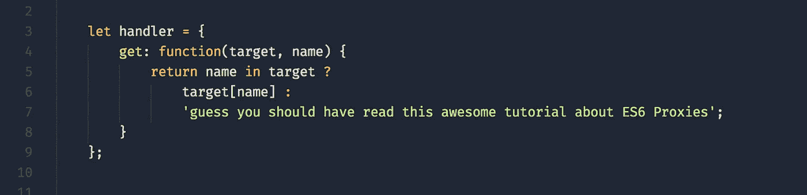
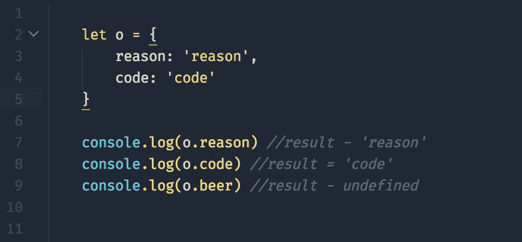
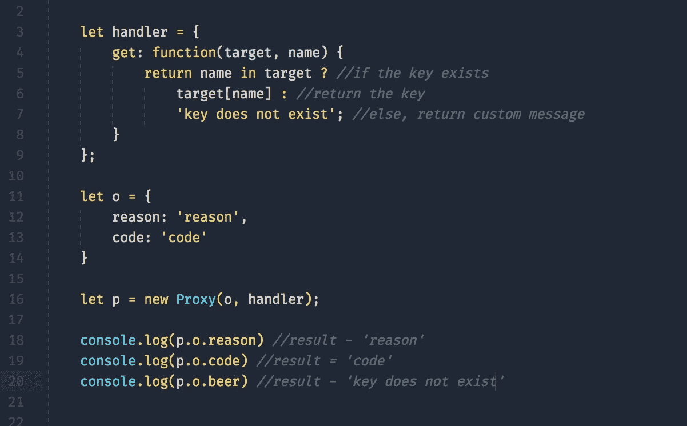
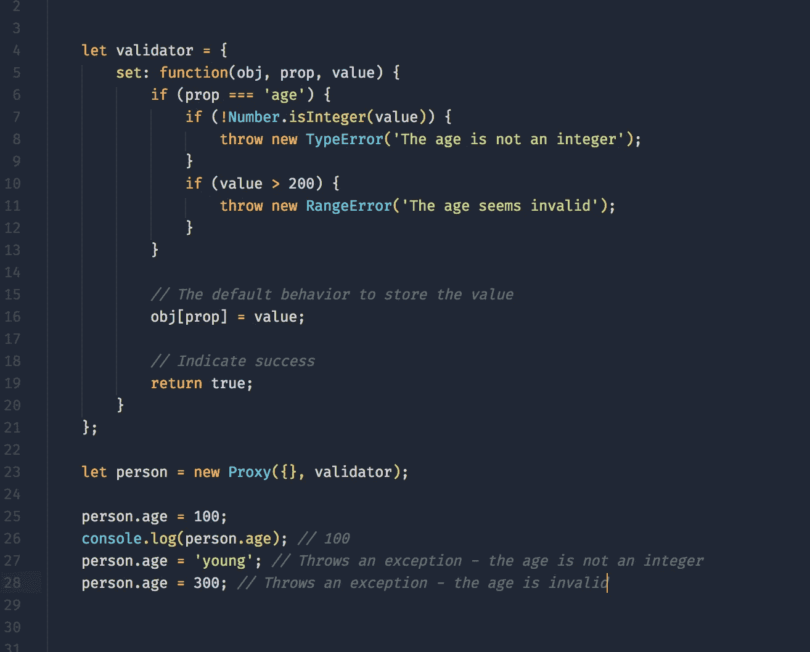

# Javascript ES6 代理简介

> 原文：<https://medium.com/hackernoon/introducing-javascript-es6-proxies-1327419ab413>

introducing javascript es6 proxies

ES6 标准中引入的新特性之一是**代理**对象。**代理**对象用于定义基本操作的自定义行为(如属性查找、赋值、枚举、函数调用等)。

你可能很快会遇到一些对你来说陌生的术语/概念，我鼓励你坚持下去，因为**代理**概念实际上相当简单和有用。

在继续之前，我们需要定义 3 个关键术语:

*   **处理程序** —包含陷阱的占位符对象
*   **陷阱** —提供属性访问的方法
*   **目标** —代理虚拟化的对象

检查此处的[以获得所有可用**陷阱的列表。**](http://www.zsoltnagy.eu/es6-proxies-in-practice/)

让我们看一些例子和实际应用。

# 句法

下面是一个代理语法的例子，其中我们传入了一个**目标**(在这个例子中是一个空对象)和一个**处理程序**。

proxy syntax

# 通用对象特性查找行为

common object property lookup behavior

在上面的代码片段中，我们有一个带有两个键的简单对象(**原因**和**代码**)。注意，第 7 行和第 8 行的控制台日志返回键值。然后注意第 9 行的正常行为。我们试图检索一个不存在的键( **beer** ，所以我们收到 *undefined。*

# 代理对象属性查找行为

proxied object lookup behavior

在这个片段中还有更多的内容。我们定义了使用 **GET** 陷阱的处理程序(第 3 行)。处理程序将目标和请求的键名传递到陷阱中。第 11 行包含我们的通用对象查找示例中的相同对象。我们的**代理**在第 16 行被实例化。

注意第 18 行和第 19 行的控制台日志返回预期的键值。但是请看一下日志第 20 行的规则—*‘键不存在’。*

我们已经用自定义代理覆盖了操作的默认行为。

# 使用代理来执行值验证

proxies to enforce value validation

在这个代码片段中，我们在第 4 行定义了我们的**处理程序**。然后，我们检查以确保 *age* prop 是正在设置的那个，如果是，我们验证类型和可接受的值范围。如果验证失败，则会传递自定义错误消息。否则，在第 16 行，我们设置新的属性值，并返回 true 来表示属性值设置成功。没什么。

**代理** 有很多现实世界的应用

*   确认
*   价值修正
*   属性查找扩展
*   跟踪属性访问
*   可撤销的引用
*   用 javascript 实现 DOM

这就是 ES6 中的代理。在[推特](https://twitter.com/reasoncode)上让我们知道你的想法和问题。坚持下去。

# 如果你喜欢这篇文章，请推荐分享，帮助别人找到！

