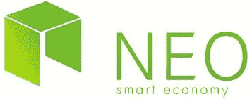

# 引入幸运近地天体——一个开源密码货币抽奖项目

> 原文：<https://medium.com/hackernoon/introducing-lucky-neo-an-open-source-cryptocurrency-raffle-project-6f241f3501c2>

[链接至我们的 dApp-Lucky NEO](https://github.com/mmoravec/luckyneo)

[锡安城](https://cityofzion.io/dapps/1)开源组织最近发布了一项 dApps 竞赛，向获胜者授予 1350 GAS，约合 24000 美元。2 个月前，我通过一个在旧金山成立的[meetiup 小组](https://www.meetup.com/Bay-Area-NEO-Meetup/)找到了 4 个队友，并开始了一段通往成功的 dApp 提交的旅程。我们的最终目标是创造一些可以成为社区资源的东西，这样其他人就可以理解智能合同开发过程。

我们的 dApp 是一种抽奖活动，任何人都可以使用 Gas 提交参赛作品以赢得奖项。鉴于天然气在近地天体网络中的作用，它是作为划界案提交工具的自然候选物。您押的近地天体越多，您就能在不放弃近地天体的情况下为自己创造越多的进入机会！

# 它是如何工作的

幸运的近地天体通过发送您所拥有的气体的合同散列整数来工作。在两周的时间结束时，随机选择一名获胜者。目前，参赛总人数上限为 1024 人。

# 概述

我们在任何地方的任何[区块链](https://hackernoon.com/tagged/blockchain)上构建了第一个用 Python 编写的 dApps 之一！能够用 Python 编写这些分散的应用程序使得 dApp [编程](https://hackernoon.com/tagged/programming)变得更加容易理解，因为我们在学校和工作中已经有了一些编写 Python 应用程序的经验。

我们在近地天体区块链上编写应用程序的经验有时颇具挑战性。[新 Python](http://neo-python.readthedocs.io/en/latest/) ，我们用来编写 dApp 的 Python 库，仍然处于 Alpha 状态。非常感谢图书馆的开发者，一个笔名为 localhuman 的程序员，他通过锡安城的 slack 组和 Github 页面对我们提供了难以置信的帮助。支持和知识社区是我们选择建造近地天体区块链的一个重要原因。

我们在这个领域的观察结果之一是，工具和开发人员环境对于他们各自的网络来说是孤立和微妙的。从开发人员的角度来看，这仍然是一个新生的领域，没有太多的共享资源来帮助人们开始。我预计，在这场竞赛之后，将会有更多的开源内容来帮助开发者开始在 NEO 网络上编码。

# 前 3 条经验教训

1.  分散式应用程序生态系统仍处于初级阶段。今天可用的工具都处于初级阶段，并且变化很快。这使得它成为一个有趣的空间，而且非常不稳定。查看 [awesome-neo](https://github.com/CityOfZion/awesome-neo) 获得 neo 生态系统中可用的伟大工具列表
2.  机会是无穷无尽的:我们必须从团队的数百个想法中选择一个。最终，我们为我们的第一个 dApp 选择了简单的功能，以确保我们有东西可以提交。
3.  拥有一个可以依靠的团队有时是至关重要的。我们的 5 人团队加上我们在锡安城得到的所有帮助帮助我们到达了终点线。由于工具处于 alpha 阶段，让多个问题解决者在一个房间里是关键。

# 结论

我们已经提交了我们的应用程序参加比赛，并焦急地等待着 11 月 26 日的结果。如果我们是前 10 名提交，我们将赢得天然气奖！如果您对在 NEO 区块链上构建 dApp 感兴趣，请查看 neo-python 和在接下来的几天中影响开源生态系统的优秀资源。

# 下一步是什么

我们将推出一个网络界面，您可以在这里与我们的智能合同互动，并查看比赛的当前状态。我们还想回到我们最初的目标，创建文档来帮助社区。最后，随着支持库的不断发展，我们将不断重构和改进我们的智能契约。