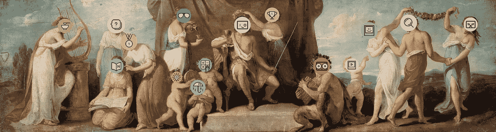
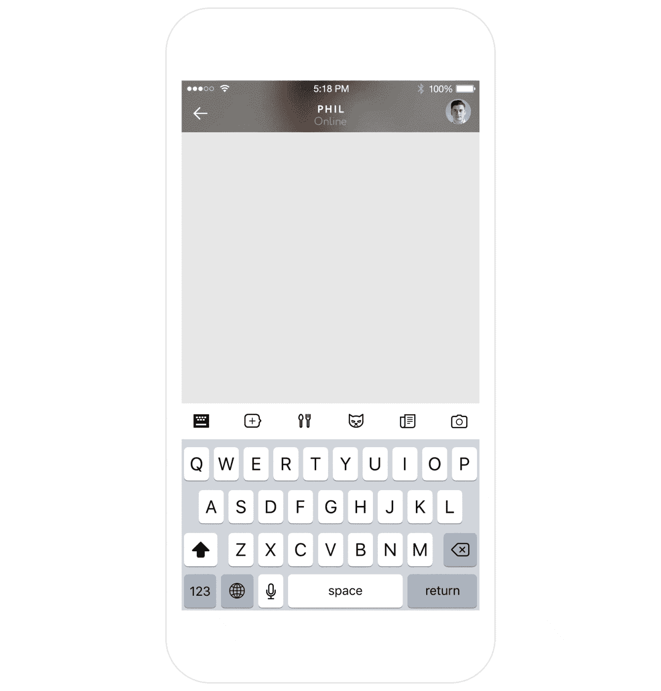
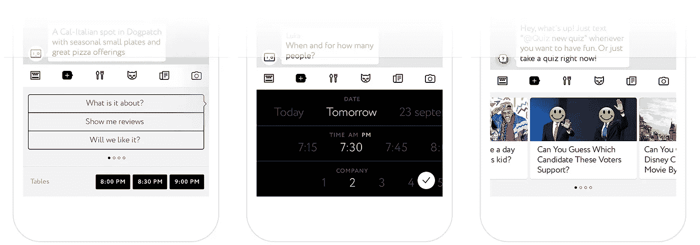
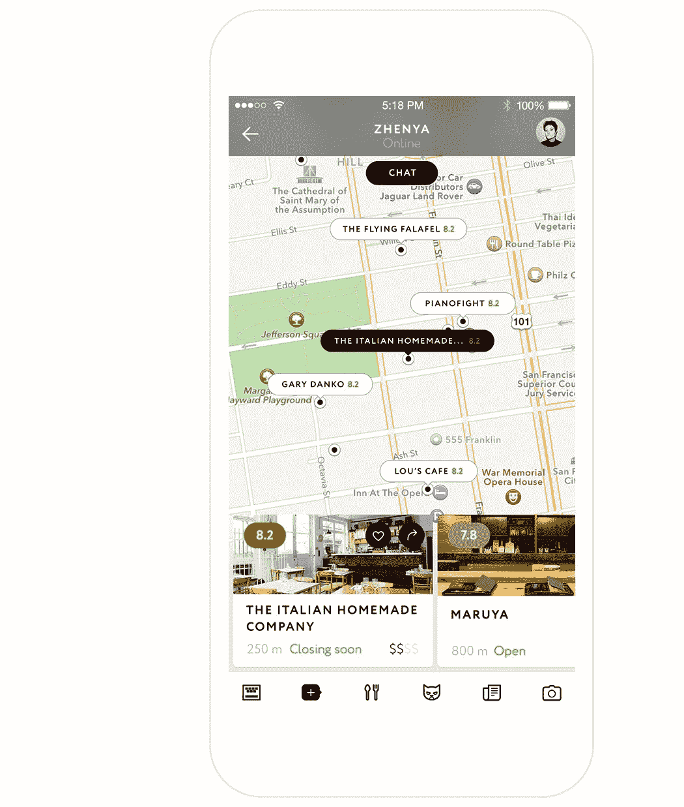

# 介绍卢卡信息和他的人工智能朋友舰队

> 原文：<https://medium.com/hackernoon/introducing-luka-messaging-and-his-fleet-of-ai-friends-69219eb478d9>

认识 Luka——一个信息应用程序，它有一个你希望在每次对话中都有的朋友。想知道周四晚上吃饭或聚会的最佳地点吗？想要一个能让你了解你真正关心的新闻的朋友吗？卢卡支持你。

Luka 是第一个为任何对话中的任何事情带来一系列直观的人工智能机器人的信使。

这就是为什么你会爱卢卡，为什么它会爱你回来。

## 这是一个消息平台，也是一个强大的机器人平台

你可以预订晚餐、玩游戏、获取最新消息、制定周末计划，而不用离开你的对话。而且如果你找不到可以聊天的朋友，总有一个 [AI](https://hackernoon.com/tagged/ai) 会很乐意聊天。告诉 Luka 你很无聊或者很孤独，你就离幸福更近了一步。

## 通过向你介绍他的人工智能朋友，Luka 使机器人的发现最终变得直观，并成为消息传递体验的一部分

你有没有发现自己花费宝贵的时间寻找合适的[机器人](https://hackernoon.com/tagged/bot)来插入 Slack 或 Kik？有了 Luka，你不需要搜索正确的机器人，甚至不需要记住它们的名字！告诉 **@Luka** 你想要什么，你就会找到合适的人工智能。

Luka is your God bot — just tell him what you need, he’ll find the right AI for you

## 更快地与人工智能通信

打字可能会很累。尤其是当你和人工智能发短信的时候。这就是 Luka 为您提供快捷方式(小工具和按钮)以加快沟通速度的原因。

Hybrid interfaces to speed up your communication

## 每个人工智能都有一个独特的界面

我们的机器人是高度智能的，但有时文本不足以让机器人帮助你。这就是为什么我们通过在界面上增加一些额外的功能来丰富我们的机器人。例如，如果不在地图上查找，很难选择一家餐馆——这就是为什么我们的 **@Foodie** 机器人会为你调出地图。

## 更多的机器人来了

最初是一个餐馆推荐机器人，今天已经变成了一个人工智能平台，以建立下一代移动通讯和搜索。新的机器人会定期出现。如果您现在想将您的机器人添加到 Luka，请发送电子邮件至 [bots@luka.ai](mailto:bots@luka.ai) 。我们已经建立对话式人工智能很长时间了，并且拥有你所需要的一切。

在 Luka，我们一直想建立一个对话式人工智能。对我们来说，这绝不是给 messenger 添加 API 或斜杠命令行。

这是谈话的美妙之处，情感脆弱的感觉，最终，信任是最重要的。

这就是我们努力实现的目标。未来的人工智能不仅仅具有简单的功能——它爱你。你也爱它。

这就是我们的使命——让卢卡成为你的朋友。

给卢卡一个尝试[这里](https://luka.ai/)。如果你想添加你的机器人或者告诉我们你喜欢什么或者讨厌什么——发邮件到 [bots@luka.ai](http://bots@luka.ai) 给我们。

> [黑客中午](http://bit.ly/Hackernoon)是黑客如何开始他们的下午。我们是 [@AMI](http://bit.ly/atAMIatAMI) 家庭的一员。我们现在[接受投稿](http://bit.ly/hackernoonsubmission)并乐意[讨论广告&赞助](mailto:partners@amipublications.com)机会。
> 
> 如果你喜欢这个故事，我们推荐你阅读我们的[最新科技故事](http://bit.ly/hackernoonlatestt)和[趋势科技故事](https://hackernoon.com/trending)。直到下一次，不要把世界的现实想当然！

