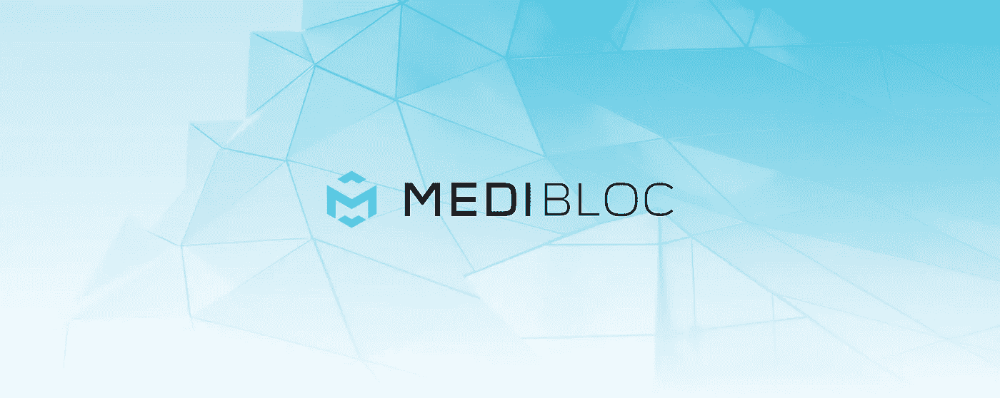
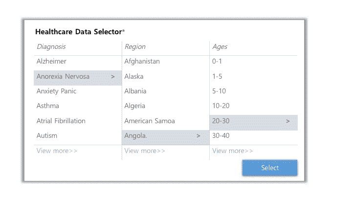
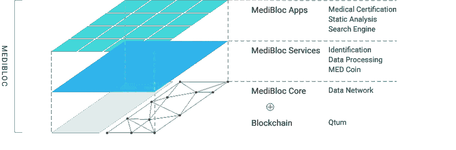

# 介绍 MediBloc

> 原文：<https://medium.com/hackernoon/introducing-medibloc-2d70958b1c86>

## 建立在区块链之上的个人医疗保健信息生态系统

医疗保健就是一切。除了食物、水和住所，人们可以说获得医疗保健在提高我们的预期寿命方面发挥了巨大作用。然而，医疗保健行业及其流程在许多方面效率低下且过时，这并不奇怪。

还记得上一次你不得不打电话给你的医生索要病历吗？斯坦福医学杂志发表的密歇根大学的一项研究强调了我们在医疗保健中经历的摩擦，仅仅因为患者记录不能在诊所之间共享。

> 当他们的急诊都在通过[健康信息交换]共享信息的医院时，患者进行重复 CT 扫描的可能性降低了 59%，重复超声波扫描的可能性降低了 44%，重复胸部 x 光检查的可能性降低了 67%。

分散的医疗记录导致比医疗冗余更糟糕的问题，但是改变医疗不是一个小任务。这是我们的头在哪里。

MediBloc 的团队了解 HIPAA 合规性(健康保险便携性和责任法案)的重要性，该法案考虑到了美国患者信息的安全性和隐私性。我们正在设计一个基于区块链技术的医疗数据管理平台。这最终让患者成为信息的中心。他们持有并控制自己的医疗记录，医疗服务提供者在患者同意的情况下访问和更新信息。这减少了冗余、管理任务、患者健康的延迟、不准确的诊断，同时确保了患者信息的安全性和隐私性。

## 医疗保健领域的区块链颠覆

区块链技术促进信任，验证身份；消除了对中间第三方的需求。这保护了个人隐私，增加了数据完整性，并创造了[价值互联网](https://www-01.ibm.com/common/ssi/cgi-bin/ssialias?htmlfid=GBE03678USEN)。

用简单的英语来说，像比特币和以太坊这样的加密货币背后的底层技术可以应用于私人患者医疗数据。这些记录以前是过时的、孤立的、患者无法访问的，现在可以由个人而不是中央实体(即:您的提供者、医疗诊所等)安全地存储和管理。区块链可以为医疗保健行业带来前所未有的数据互操作性。

## **医疗集团**

MediBloc 的医疗保健信息平台是基于区块链技术为患者、提供商和研究人员构建的个人数据生态系统。我们的使命是:

> 通过重新分配个人医疗保健数据所有权背后的价值，为患者、提供商和研究人员简化医疗流程。

通过 MediBloc，您可以有效地拥有您的医疗数据，提供商可以消除冗余以提供更好的护理，您的宝贵数据可以帮助研究人员以前所未有的速度推动医学进步。

## 拥有您的医疗数据

今天，您的医疗记录由您的医生和他们的诊所管理和拥有。如果你下半辈子只看一个医生，这没什么，但是想想你最后一次去看专科医生还是在你搬家的时候。您自己的医疗记录是分散的，请求这些信息需要几天，有时几周的时间，延误了您应该得到的患者护理。

区块链技术允许前所未有的安全和隐私。因此，我们平台上的一个应用程序最终可以在一个地方保存、存储和更新您的所有医疗记录。想象一下，一个数字医疗钱包，如果你愿意。

想象一下，走进一家诊所，您的提供者将要求访问您在 MediBloc 上的医疗健康记录。当你签字的时候，他们将会有你的全部病史，有条理并有时间标记。您与提供者的每一次谈话，他们记录的每一份笔记，您获得的每一份处方，您重新配药的每一份处方。你所做的每一次 x 光检查，实验室测试，身体检查都很容易拿到。

## 消除冗余以提供更好的护理

医疗效率低下对病人护理产生负面影响的例子不胜枚举。仅在美国，仅误诊一项每年就导致数十万人死亡。

> …在美国每年花费在医疗保健上的 2.7 万亿美元中，有近三分之一被认为是浪费的美元。

> Evan Falchuk 在他的论文《误诊流行病》中继续说道，他强调了造成这种情况的首要原因是“医疗服务分散”。

> …我们的医疗保健系统非常分散。当有如此多的机会推迟或误读测试、错误传达结果或首先安排错误的测试时，获得正确诊断和正确治疗的几率往往对患者不利。
> 
> — Evan Falchuk，最佳医生公司副主席。

它不止于此。《内科医学年鉴》发表的一项研究跟踪了 4 个专科的医生，调查了他们在诊所的时间。

> 内科医生每天花 27%的时间与患者进行直接的临床交流，花 49.2%的时间做电子病历和其他案头工作。

医疗保健必须朝着以病人为中心的过程发展。从初级保健到急诊外科医生，再到附近的牙医，每个医疗专业人员都可以获得干净、规范、完整、准确和可靠的病历来源。修复患者数据碎片是医疗创新中最重要的一步，这在 MediBloc 区块链平台上是可能的。

## 帮助研究人员以前所未有的速度推动医学进步。

当前的医疗保健数据是孤立的，但是您可以增加数据提供商和研究人员之间的互操作性。医疗保健数据很有价值，但由于安全性和法规遵从性，访问总是受到限制。通过 MediBloc，医疗数据将得到加密保护，从而将个人医疗保健数据的价值带回给患者。这使得研究人员能够为他们的研究提供更大规模的准确信息，激励患者参与他们的记录交易，创造医疗数据经济，促进更好的研究并最终创造更美好的世界。

## 我们对医疗集团的愿景

我们对 MediBloc 的愿景是一个开放的平台，开发者和医疗保健专业人员可以在这个平台上合作构建面向未来的应用程序。可能性是无穷的。有了足够的患者数据和定期活动，我们可以建立自动化的保险索赔、个性化的健康报告，甚至可以建立人工智能医疗聊天机器人，帮助回答一些最常见的医学问题。

但也许最令人兴奋的想法是，“医疗数据交易”现在实际上是可行的。

拥有自己医疗数据的患者可以选择向研究人员、医疗专业人员和机构(制药公司、实验室)出售部分私人数据。这推动了研究和进步，同时激励患者保持他们的记录是最新的。

医疗行业颠覆的时机已经成熟。直到现在，围绕隐私、安全和政策的监管使得横向创新几乎不可能。区块链代表了我们对数据理解的根本性转变。加入我们的行列，为生活在第三世界国家农村地区、完全没有历史记录的患者组织更好的医疗保健信息。

[**MediBloc**](http://www.medibloc.org) 是一个由医疗专业人士、数据架构师和区块链技术专家组成的团队。两位创始人都是计算机科学家，后来转向医学，成为企业家。