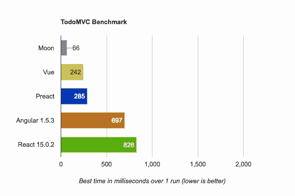

# 介绍月亮

> 原文：<https://medium.com/hackernoon/introducing-moon-1d44a99635f0>

## 极快的用户界面库

我已经使用 [Vue](https://vuejs.org) 有一段时间了，它解决了我所有的问题，而且做得很漂亮。过了一段时间，在 2015 年末，我开始注意到我的应用程序出现了一些性能问题。所以我开始创造一些新的东西，作为一个学习项目。希望能看到这个 DOM 东西实际上是如何工作的，并专门为我写一个解决方案。

在研究了 Vue 在引擎盖下的实际工作方式后，我遇到了[反应](https://facebook.github.io/react/)。它有一个虚拟 DOM 的概念，每次都与之前的状态不同。我也偶然发现了一个事实，那就是 Vue 当时并没有使用这个想法(现在也是)。

我开始编写一个简单的库，不打算让任何人使用。只有一个文件，混杂着代码，试图做些什么。我只是还不知道那是什么。

开机后，无论我做什么，都是*慢得离谱* *！所以我放弃了，只是继续使用我缓慢的实现。*

# 再制

后来，我遇到了 [Preact](https://preactjs.com/) 。这改变了游戏规则，一个[反应](https://hackernoon.com/tagged/react)的选择，那就是*更快*，并且只有 *3kb！我读了代码，它很漂亮，易于阅读，我学到了很多关于 UI 库实际上是如何工作的。*

所以我开始再造一个我称之为“月亮”的东西。目标是像 Preact 一样，但对于 Vue，因为我更喜欢 Vue 的 API。

# 表演

这些框架的性能可以好得多，只是没有一个库是正确的。它们都有自己的优势，但在某些领域仍然很弱。例如，库 A 可能擅长将项目添加到大型列表的末尾，而库 B 可能擅长将项目添加到大型列表的开头。

有一篇很棒的文章解释了为什么一些抽象很慢。简而言之，直接与 DOM 交互比在 DOM 上抽象要快。

尽管如此，直接处理 DOM 可能会变得混乱，如果没有正确编写，经常会导致代码混乱。所有库都有自己的抽象，React 和 Vue 使用虚拟 DOM，Ember 团队创建了 Glimmer，hyperHTML 使用 DOM 和上下文片段之间的绑定。

这些都是特定于库的，每一个都有自己的性能优点和缺点。问题是，你应该使用哪个库？

# 月亮来拯救

经过几个月的开发，原本应该是供我使用的库，被改写成了一个任何人都可以使用的库。

*   ⚡️它使用虚拟 DOM 的一个版本，但是智能地标记静态节点并跳过它们，并且只更新 DOM 中已经改变的部分。
*   💎它提供了一个漂亮的 API，与 Vue 非常相似。包括指令、反应式 DOM 更新、计算属性等。
*   🎉才 *5kb* ！
*   🔨它有一个内置的组件系统，允许你用不同的组件组成你的用户界面。

## 基准

以下是 DBMonster 的结果(越高越好):

*   月球——每秒 102 次渲染
*   预渲染—每秒 85 次重渲染
*   Vue —每秒 50 次重渲染
*   反应—每秒 50 次重新渲染

以下是 TodoMVC 实现的基准测试结果(越低越好):

Benchmark for adding 100 items, completing 100 items, and deleting 100 items

## 又一个？

我知道，我知道，似乎每天都有新的 [Javascript](https://hackernoon.com/tagged/javascript) 框架发布。月亮就是其中之一。

这并不意味着你必须使用它，事实上，这并不意味着任何人都必须使用它。如果您对当前的解决方案满意，那太好了！继续磨。

如果您正在开始一个新项目，或者正在寻找一些性能优势，或者想要一个不错的 API，请随时尝试 Moon！

## 为什么这么久？

Moon 是 2015 年末开始的一个想法，现在几乎可以在 2017 年初投入生产。为什么花了这么长时间？

请记住，Moon 最初是一个学习项目。那时，我只是想为自己做点什么，没有流行库的那些臃肿的功能，我根本不需要这些功能。我也对大教堂一无所知。

从那以后，我学到了很多东西，真令人吃惊。

> 更多信息，请查看[月球网站](http://moonjs.ga)。如果你喜欢这个，请点击👏