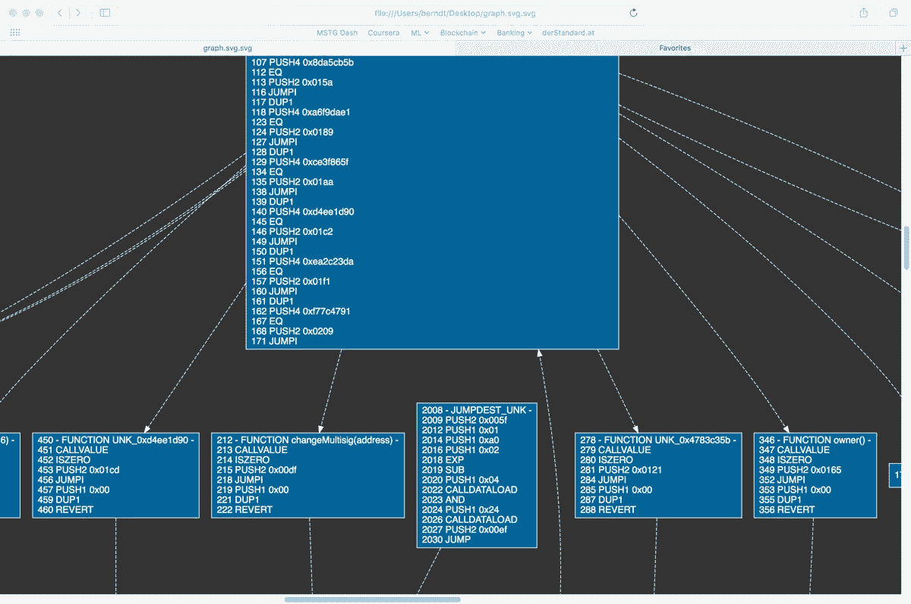

# 介绍 Mythril:以太坊区块链上的 bug 搜索框架

> 原文：<https://medium.com/hackernoon/introducing-mythril-a-framework-for-bug-hunting-on-the-ethereum-blockchain-9dc5588f82f6>

*注:这是古代的一篇文章。有关 Mythril 的最新介绍，请改为阅读* [*这篇文章*](https://hackernoon.com/practical-smart-contract-security-analysis-and-exploitation-part-1-6c2f2320b0c) *。*

除非你在过去三年一直生活在岩石下，否则你肯定会注意到一个让“机器学习”大受欢迎的行业流行语:*区块链*。

以太坊是这个概念最成功的实现之一。与提供有限脚本功能的比特币相反，以太坊提供了一个图灵完全虚拟机。网络中的状态转换(例如特定令牌的帐户余额的变化)由虚拟机中运行的代码来管理，也称为“智能合约”。

一句古老的安全谚语说:“灵活性越大，潜在的漏洞也越多”。更糟糕的是，以太坊最流行的高级编程语言 Solidity 的语义往往是反直觉的，这为开发人员创造了许多搞砸的可能性。这方面的一个很好的例子是[奇偶多签名钱包漏洞](http://hackingdistributed.com/2017/07/22/deep-dive-parity-bug/)，它允许一个未知的攻击者[在他们的 tinder 日期被证明是一个真正的蠕变之后提取 153，037 乙醚(价值超过 3000 万美元)](/@rtaylor30/how-i-snatched-your-153-037-eth-after-a-bad-tinder-date-d1d84422a50b)。

奇偶校验失败表明，实现错误可以在数月内不被发现，即使当契约被部署在 mainnet 上并且其源代码可以公开获得。人们只能猜测链上部署的数千个合同中可能隐藏着什么样的漏洞，其中许多是黑盒(从源代码没有在 [Etherscan](/@rtaylor30/how-i-snatched-your-153-037-eth-after-a-bad-tinder-date-d1d84422a50b) 上发布的意义上来说)。

不足为奇的是，如此丰富的潜在漏洞来源和金钱回报并没有逃过“白帽”和“黑帽”安全人员的注意。这是*为了乐趣和利益*而砸栈*的又一次——只是这次有真正的利益(*注意，EVM 不仅有栈，它也没有寄存器，所以几乎每个指令都使用栈)。

当我几周前开始研究以太坊时，我在 mainnet 上发现了不少分析合同的有用工具。 [Etherscan](http://therscan and remix allow researchers to conveniently disassemble and debug contracts in the web browser.) 和 [remix](https://remix.ethereum.org/) 允许研究人员在网络浏览器中方便地浏览、分解和调试合同。[孔隙度反编译器](https://github.com/comaeio/porosity)可以(在一定程度上)从给定的字节码中恢复源代码。 [Truffle](https://github.com/trufflesuite/truffle) 和 [testrpc](https://github.com/ethereumjs/testrpc) 让 Solidity 代码的编译和调试变得简单。

然而，我也发现有很多事情我不能高效地完成:最明显的是，在区块链中搜索有趣的合同，用 Python 编写静态/动态分析脚本(我还没有完全赶上用 JavaScript 做所有事情的火车)。因此，我开始编写一些 Python 模块和命令行工具。最重要的是，我把这个东西打磨到了其他人可以使用的程度。结果是 [Mythril](https://github.com/ConsenSys/mythril) ，一个以太坊反汇编器/区块链探索&分析工具。下面是一个简短的教程。

# 设置

最初，我希望运行 [PyEthApp](https://github.com/ethereum/pyethapp) 并直接访问其 LevelDB 中的状态。不幸的是，PyEthApp 似乎在相当长的一段时间内缺乏维护和开发，并且与以太坊主网不同步。因此，Mythril 需要 RPC 访问一个完全连接的 [go-ethereum](https://github.com/ethereum/go-ethereum) 节点。[安装 go-ethereum](https://geth.ethereum.org/install/) 并按如下方式启动节点:

```
$ geth --rpc --rpcapi eth,debug --syncmode fast console 2>/dev/null
```

请注意，Mythril 使用了[非标准的 go-ethereum 调试 API](https://github.com/ethereum/go-ethereum/wiki/Management-APIs)，因此，虽然它应该可以与其他 ethereum 客户端一起工作，但有些功能将不可用。

Mythril 本身可以通过 Pypi 安装:

```
$ pip install mythril
```

这将安装 Python 模块和`myth`命令行工具。

## 数据库初始化

Mythril 可以在几分钟内而不是几天内实现搜索操作，就像传奇的“Mitch Brenner”博客文章中描述的那样。为此，它创建了部署在 mainnet 上的契约的快照。运行以下命令初始化数据库:

```
$ myth --init-db
```

整个过程需要一些时间(老实说效率不是很高，我希望在某个时候提供一个更好的实现)。如果您不想立即同步整个链，您可以在任何时候点击 `ctrl+c`，并且同步将在您下次使用`--init-db`标志运行 mythril 时自动恢复。

# 命令行用法

一旦数据库中有了一些契约，就可以运行搜索命令来查找函数签名和操作码序列。表达式语法如下:

*   func #[函数签名]#
*   代码#[操作码]#

例如，下面的命令将输出具有名为`changeMultisig(address)`的函数的所有合同:

```
$ myth --search “func#changeMultisig(address)#”
Matched contract with code hash 2bfa6e34330ac57501bd0f6c84d50fcd
Address: 0x3665f2bf19ee5e207645f3e635bf0f4961d661c0, balance: 4999600000000000000
Matched contract with code hash 98623854d849f0d97c55b98e0238eb7b
Address: 0x2d36cb89a977209703c1d6304f23198c22b7a498, balance: 63686800960937000000
```

搜索功能支持简单的布尔表达式。上面的命令打印所有包含名为`changeMultisig(address)`的函数和操作码序列`PUSH1 0x50, POP`的契约:

```
$ myth --search “func#changeMultisig(address)# and code#PUSH1 0x50,POP#”
```

## 反汇编程序

用`-d`标志调用反汇编程序。它要么通过`-c`参数接受一个字节码字符串，要么通过`-a ADDRESS`接受一个契约地址(这将从您的以太坊节点下载契约代码)。

Mythril 试图使用一个内置的签名文件来解析函数名，该文件最初是从[以太坊签名数据库](https://www.4byte.directory)中获得的。如果您最终使用 Mythril，非常欢迎您使用[提交对文件](https://github.com/b-mueller/mythril/edit/master/mythril/disassembler/signatures.json)的更新。

```
$ myth -d -a 0x2d36cb89a977209703c1d6304f23198c22b7a498
0 PUSH1 0x60
2 PUSH1 0x40
4 MSTORE
(…)
212 — FUNCTION changeMultisig(address) -
213 CALLVALUE
214 ISZERO
```

## 调用图

Mythril 的“杀手级特性”之一是调用图生成器。添加参数`-g OUTPUT_FILE`将导致 Mythril 以 HTML 格式保存图表:

```
myth -g ~/Desktop/graph.html -a 0x2d36cb89a977209703c1d6304f23198c22b7a498
```

在 web 浏览器中打开结果文件以查看图表。通常，您可以很好地了解可用的执行路径(幸运的是，智能契约并不那么复杂)。



使用调用图和执行跟踪来逐步对合同进行逆向工程，对我来说效果很好，尽管最好有一个基于 GUI 的 SVG 编辑器来注释(如果你知道的话，请在评论中告诉我)。

## 查找交叉引用

标识特定合同引用的其他合同通常很有用。让我们假设您想要搜索在回退函数中使用`DELEGATECALL`指令的契约，就像奇偶错误中的情况一样。您可以使用动态分析来做到这一点:简单地运行 PyEthereum VM 中的每个契约，不需要任何输入，并检查是否执行了`DELEGATECALL`指令。Mythril repo 包含一个[示例脚本](https://github.com/b-mueller/mythril/blob/master/examples/find-fallback-dcl.py)来展示如何做到这一点。它应该输出如下所示的内容:

```
$ python examples/find-fallback-dcl.py
DELEGATECALL in fallback function: Contract 0x07459966443977122e639cbf7804c446
DELEGATECALL in fallback function: Contract 0x17c9e5b7f2bfd8307d628f2d9fcc9352
DELEGATECALL in fallback function: Contract 0x17f9db8b6ffa854335b319d01f09ba39(…)
```

顾名思义，`DELEGATECALL`指令将执行委托给一个不同的契约，所以您自然会对调用哪个契约感兴趣。您可以通过`--xrefs`选项打印被引用合同的地址:

```
$ myth --xrefs 0x07459966443977122e639cbf7804c446
0x5b9e8728e316bbeb692d22daaab74f6cbf2c4691
```

除了使用命令行工具，您还可以以编程方式跟踪交叉引用，并对引用的合同运行进一步的分析(`find-fallback-dcl.py`也包含了一个这样的例子)。

# 高级用法

虽然命令行工具很简洁，但是只有使用定制代码才能释放 Mythril 的全部力量。除了契约数据库、反汇编器和 EVM 跟踪模块，Mythril 还包括修改版的 [ethjsonrpc](https://github.com/ConsenSys/ethjsonrpc) ，允许您在 [testrpc](https://github.com/ethereumjs/testrpc) 节点上部署和跟踪代码。通过结合所有这些，您可以拼凑出一些不错的静态和动态分析。

## 搜索

使用`get_persistent_storage`功能从 Python 程序打开合同数据库。这将返回一个`ContractStorage`对象(默认情况下，数据库位于`[your-home]/.mythril`中，但是您可以在构造函数中覆盖它)。调用方法`search(expression, callback)`开始搜索:

```
from mythril.ether.contractstorage import get_persistent_storagecontract_storage = get_persistent_storage()contract_storage.search("FUNC#getOwner()#", myCallback)
```

每个搜索结果都将调用第二个参数中传递的回调函数。它接收以下参数:

*   标识 Mythril 数据库中合同的散列密钥
*   包含当前合同的 [ETHContract](https://github.com/b-mueller/mythril/blob/master/mythril/ether/ethcontract.py) 对象
*   合同在区块链的地址列表
*   每个已部署合同的列表余额

```
def myCallBack(contract_hash, contract, addresses, balances):
  # Do something…
```

一个有用的模式是搜索某种特定类型的合同，然后对每个结果执行一组分析任务。让我们来看看第二个例子[就是这样做的](https://github.com/b-mueller/mythril)。

## 跟踪执行

让我们假设您想要扫描契约数据库，寻找类似于奇偶校验错误的条件，但是是以一种通用的方式。一个想法是寻找*任何*函数，当没有传递参数、地址或地址列表时，最终用`SSTORE`指令将你的地址写入存储器。当然，这并不一定意味着您正在覆盖一个重要的状态变量，比如`owner`或`owners`，但是这绝对是您想要进一步研究的那种行为。

在前面的[示例](https://github.com/b-mueller/mythril/blob/master/examples/find-fallback-dcl.py)中，我们看到了如何在 PyEthereum 虚拟机中跟踪代码。对于更高级的分析，还包括状态(如可用帐户、契约存储、调用构造函数等。)最好将契约部署在 [testrpc](https://github.com/ethereumjs/testrpc) 上。在我的测试环境中，我在端口 8545 上运行 geth，在端口 8546 上运行 testrpc 实例，这允许我立即将契约从真实网络转移到 testrpc。要运行[示例代码](https://github.com/b-mueller/mythril/blob/master/examples/discover_writes.py)，按如下方式启动 testrpc:

```
$ testrpc --port 8546 --gasLimit 0xFFFFFFF --account \
0x0b6f3fd29ca0e570faf9d0bb8945858b9c337cd2a2ff89d65013eec412a4a811,500000000000000000000 --account \
0x2194ac1cd3b9ca6cccc1a90aa2c6f944994b80bb50c82b973adce7f288734d5c,500000000000000000000
```

我们希望查看数据库中的所有合同，因此我们可以使用匹配每个合同的搜索词，或者简单地迭代这些合同:

```
for k in contract_keys: contract = contract_storage.contracts[k]
```

这将返回 [ETHContract](https://github.com/b-mueller/mythril/blob/master/mythril/ether/ethcontract.py) 对象，这些对象存储了合同代码(`contact.code`)和创建合同的交易代码(`contract.creation_code`)。

要在您自己的私有链或 testrpc 上重新创建契约，使用 Mythril 的 [JSON RPC 客户端](https://github.com/b-mueller/mythril/blob/master/mythril/rpc/client.py)重放契约创建事务:

```
from mythril.rpc.client import EthJsonRpctestrpc = EthJsonRpc(“localhost”, 8546)# Deploy on testrpccreator_addr = "0xadc2f8617191ff60a36c3c136170cc69c03e64cd"ret = testrpc.eth_sendTransaction(from_address=creator_addr, gas=5000000, value=0, data=contract.creation_code)
receipt = testrpc.eth_getTransactionReceipt(ret)
contract_addr = receipt[‘contractAddress’]
```

这将返回包含合同地址的交易收据。注意，每当 testrpc 接收到一个事务时，它就会“挖掘”一个新的块，因此您的契约会被即时部署。

`Disassembly`类允许您访问指令列表、格式化的 easm 代码、交叉引用和合同函数。它采用一个构造函数参数，即契约字节码:

```
disas = Disassembly(contract.code)
```

反汇编对象有两个列表`func_to_addr`和`addr_to_func`，其中包含函数名和地址之间的映射。您可以迭代`func_to_addr`来获得每个函数的签名(注意未识别的函数被标记为“UNK_ 地址”)。

```
for function_selector in disas.func_to_addr: # do something with the function signature. E.g.:
  # "changeOwner(address)"
  # "deposit()"
  # "UNK_0x5b980628"
```

在[示例脚本](https://github.com/b-mueller/mythril/blob/master/examples/discover_writes.py)中，每个可用的函数都用不同的参数调用多次(例如，没有参数、一个地址、一个地址列表)。我不会在这里详细解释所有这些——请查看代码，了解如何对调用数据进行编码并发送事务。

最后，要跟踪函数调用的执行，使用`traceTransaction` RPC 方法:

```
tx = testrpc.eth_sendTransaction(to_address=contract_addr, from_address=addr_schnupper, gas=5000000, value=0, data=data)trace = testrpc.traceTransaction(tx)
```

这将返回一个包含每个执行指令的字典，以及每个执行点的堆栈。我们只对目标地址位于堆栈倒数第二位的`SSTORE`指令感兴趣(即“攻击者”的地址被写入存储器)。我们可以按如下方式搜索说明列表:

```
for t in trace[‘structLogs’]:
  if t['op'] == 'SSTORE':
    if addr_schnupper[2:] in t['stack'][-2]:
      return True
```

可能的后续步骤可能包括运行进一步的静态和动态分析，以确定被覆盖地址的影响，或者转储调用图进行手动分析。

这里详细描述的使用场景只是冰山一角:你可以在 Mythril 的 API 之上构建几乎任意复杂的区块链扫描仪。然而，请注意，Mythril 的许多组件，如合同存储、搜索表达式和其他组件，仍然有很大的改进空间。欢迎您在 [GitHub 存储库](https://github.com/ConsenSys/mythril)上贡献更好的实现和额外的分析脚本。

# 关于神话和神话

[Mythril](https://github.com/ConsenSys/mythril) 是一款免费的开源智能合同安全分析器。它使用符号执行来检测各种安全漏洞。

[MythX](https://mythx.io) 是一种基于云的智能合约安全服务，可以无缝集成到智能合约开发环境中并构建管道。它将多个领先的安全分析流程捆绑到一个易于使用的 API 中，允许任何人创建专门构建的智能合同安全工具。MythX 兼容以太坊、Tron、Vechain、Quorum、Roostock 和其他基于 EVM 的平台。