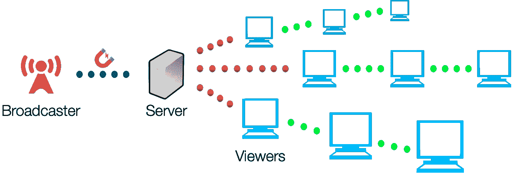

# Nile.js 简介

> 原文：<https://medium.com/hackernoon/introducing-nile-js-81d83a31cfe3>

## 一个基于 WebTorrent 的点对点实时视频流库

## *简介*

我们建立了 [Nile.js](http://nilejs.com/) ，这是一个点对点直播视频流库，旨在处理缩放。我们的库使用的是 [WebTorrent](https://webtorrent.io/) ，这是一个受 [BitTorrent](http://www.bittorrent.com/) 启发，用 [WebRTC](https://webrtc.org/) 构建的分布式文件交付协议。我们选择 WebTorrent 作为我们广播流的方式，因为随着更多的对等点加入视频流，视频流会变得越来越强。这也使得它比实现典型的 WebRTC 对等连接更合适，因为 WebTorrent 能够减轻每个对等点大约 10 到 20 个连接的限制。

## *我们如何使用 WebTorrent 进行流式传输*

首先，WebTorrent 使用的 torrent 文件是不可变的，这使得它不太适合直播。为了模拟流媒体，我们将视频流分割成片段，通过观众自己生成的种子文件分发给观众。

一旦 WebTorrent 客户端开始播种，就会生成一个磁铁链接(字符串形式的标识符)。我们通过一系列的 WebSocket 和 WebRTC 连接将这种吸引力传播给观看者。磁体首先被传递到连接到有限数量的 WebSockets 的节点/Express 服务器。服务器将磁铁发送到初始 WebSocket 连接，这些连接通过链表结构中的 WebRTC 对等体传递磁铁。在收到磁铁后，每个观众客户端将开始吸取(下载)和播种(上传)流。

Broadcasting Model

Distributed Video Streaming via WebTorrent

## *注意事项*

由于我们的 WebSocket 到 WebRTC 连接的链表结构，如果一个对等体断开连接，这个链就会被破坏。我们的图书馆被设计成在服务中断时自动重新连接。断开连接的 webRTC 对等方将打开与服务器的 WebSocket 连接，在那里它将被重新分配给新的 WebSocket 对等方。

如果只有几个对等点观看该流，初始上传速度高度依赖于广播公司的带宽和网络速度，从而产生一个主要的瓶颈。为了抵消这种糟糕的初始性能，我们允许广播公司有足够的时间向每个对等点发送足够的数据，以便在不丢失一秒钟的情况下进行查看。从这一经验中，我们进一步认识到将点对点交付与 CDN(类似于 [Peer5](https://peer5.com/) )相结合的有效性，以处理低到高数量的观众。

## *问题*

当我们在广播端积累 WebTorrent 种子数量时，似乎有一个客户端内存泄漏，最终导致浏览器崩溃。我们已经检查了 CPU 和内存的使用情况，但没有发现错误消息或异常。

我们为解决问题而采取的不成功的方法:

*   服务器端播种代替客户端播种
*   用网络工作者播种
*   iframes 中的播种
*   在每个新种子上销毁 WebTorrent 客户端
*   在每个新种子上销毁 WebTorrent 文件

我们发现的一个解决方案是特定于浏览器的。如果使用 Chrome Canary 来测试库，它似乎会无限期运行。如果开源社区中的任何人能够提供一些见解，请在我们的 [GitHub](https://github.com/gitsummore/nile.js) repo 上提出请求。

## *结论*

作为概念的证明，我们希望其他开发人员尝试我们的库，并留下反馈，告诉我们如何改进项目，甚至在它的基础上进行构建。来我们的网站、 [GitHub](https://github.com/gitsummore/nile.js) 和 [npm](https://www.npmjs.com/package/nile.js) 看看我们吧。

*Nile.js 是* [*德瑞克米兰达*](https://medium.com/u/8689739f5747?source=post_page-----81d83a31cfe3--------------------------------)*[*凯文邱*](https://medium.com/u/735b24064ab9?source=post_page-----81d83a31cfe3--------------------------------)*[*贾斯汀皮尔森*](https://medium.com/u/b0b7e8f684e5?source=post_page-----81d83a31cfe3--------------------------------) *。***

************

> **[黑客中午](http://bit.ly/Hackernoon)是黑客如何开始他们的下午。我们是 [@AMI](http://bit.ly/atAMIatAMI) 家庭的一员。我们现在[接受投稿](http://bit.ly/hackernoonsubmission)并乐意[讨论广告&赞助](mailto:partners@amipublications.com)机会。**
> 
> **如果你喜欢这个故事，我们推荐你阅读我们的[最新科技故事](http://bit.ly/hackernoonlatestt)和[趋势科技故事](https://hackernoon.com/trending)。直到下一次，不要把世界的现实想当然！**

****