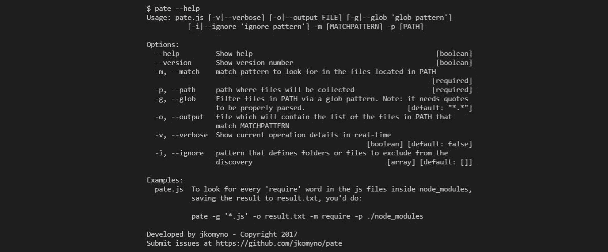
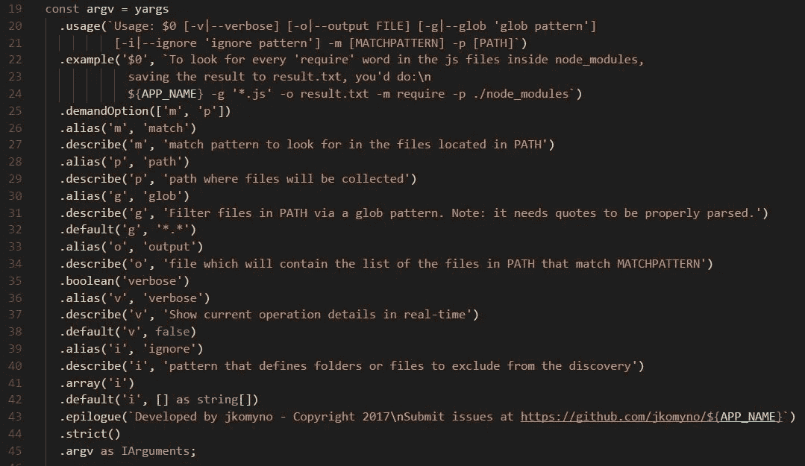
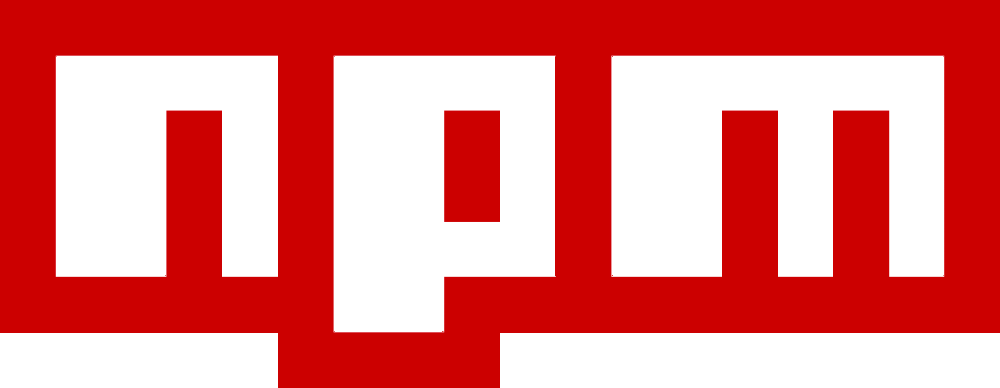
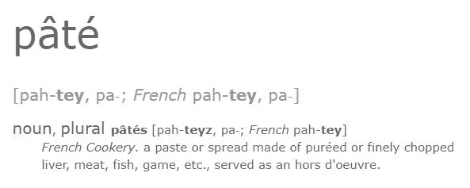

# 介绍 Pate，我最新的开源项目

> 原文：<https://medium.com/hackernoon/introducing-pate-my-latest-open-source-side-project-12da4fccd9fc>

如果你对软件工程感兴趣，但你认为自己缺乏实践经验，无法在科技行业找到一份有意义的工作——即使你在大学或以[替代方式](https://medium.freecodecamp.org/200-universities-just-launched-560-free-online-courses-heres-the-full-list-d9dd13600b04)学习了很多计算机科学——你可能会想开始从事一个副业项目。
为什么？因为它能给你提供很多好处！

这里有一个简短的优点列表，它应该能让你明白为什么副业是有用的:

*   你有机会学到很多东西，同时享受没有截止日期的放松
*   你可以专注于你最喜欢的事情，甚至自动化一项你花费大量时间的任务
*   你甚至可以推动你的科技事业，用不同于令人讨厌的"*Todo lis*t "/*Tic tac toe*"/*随机滥用辅导项目*的项目来丰富你的投资组合

在这篇文章中，我想给你一个我所做的概述，希望能启发其他人遵循同样的指导方针。

# **第一步:找到坏掉的东西进行修复**

在我看来，最好的开始方式是想出一个能帮助你或别人的主意。通常这是一个简单的步骤，并且它不应该花费你太长时间的事实是非常重要的:如果你在某件事情上花费太多时间，而没有任何具体的东西，你可能会以一大堆永远不会看到发布的代码而告终。从有明确目的的东西开始，也许在它第一次发布后扩展它。你不一定需要创建新的 Airbnb 或 Pinterest 来满足你的小项目。

我已经(相当成功地)试图解决的问题如下:我希望能够找到所有在其内容中包含某种模式的文件，无论是一个单词、一个编程语言关键字还是一个复杂的正则表达式。我很确定这可以通过像`grep`和`awk`这样的工具轻松实现，但是:

*   我真的不喜欢这个命令隐含的术语
*   我花在 Windows 上的时间比花在像 Ubuntu 或 Mac OS 这样的 UNIX 环境上的时间要多得多
*   兼职项目的主要目的是靠你自己创造一些东西

# 第二步:决定使用什么仪器/API

自从我在高中听说 NodeJS 之后，我花了很长时间和它在一起。自从 2016 年夏天以来，我一直在 [Brainwise.it](https://brainwise.it/?lang=en) 担任全栈开发人员，我开始了解 V8 运行时和节点 API 的许多棘手方面，但我从未有机会摆弄流 API。

由于 NodeJS 是我最喜欢的环境(其次是 Golang ),并且由于我需要扫描大量文件，所以用它作为我的小项目的基础对我来说是很自然的。

此外，我有点忍受 JavaScript 缺乏类型化的事实(我也经常使用 Golang，我发现它们在很多不同的方面都是基本的)，所以我决定尝试最新的 TypeScript 版本。

# 第三步:决定你申请的方面

注意，通过“方面”,我不一定需要考虑 UI 层。我主要说的是决定你希望如何与应用程序进行交互。应该是移动应用吧？还是网络版的？甚至是桌面应用？为了让事情简单明了，我决定遵循 CLI 方式。此外，我希望终端 UX 以一种干净的方式丰富多彩，信息丰富:命令行不一定需要像我们所期望的那样灰色和复古。

# 第四步:如果有你可以重复使用的东西，就重复使用它

因为我的主要精力是尽可能快地处理大量的文件扫描，所以我并不真的想考虑如何在 CLI 中呈现丰富多彩的进度输出，或者如何像 UNIX shell 那样通过 glob 模式过滤文件。所以我最后用了下面这些神奇的 npm 包:

*   [粉笔](https://www.npmjs.com/package/chalk):用于渲染航站楼内欢快的色彩
*   [进度](https://www.npmjs.com/package/progress):在应用程序处理文件时，向用户提供有意义的输出
*   [yargs](https://www.npmjs.com/package/yargs) :解析命令行选项
*   [glob](https://www.npmjs.com/package/glob) :像 shell 一样匹配文件名

**第五步:享受你项目的实现，并从过程中学到的东西中获利！**

在这一步，你必须向全世界(以及潜在的未来同事，甚至员工)展示你的能力。

如果让我总结一下我提高了哪些技能，学到了什么，我会总结如下:

*   如果一个模块的 TypeScript 定义没有在 [DefinitelyTyped](https://github.com/DefinitelyTyped/DefinitelyTyped) 上发布，你必须自己创建它。专业提示:如果你扩展了一个开源项目，[你应该回报](https://github.com/DefinitelyTyped/DefinitelyTyped/pull/22037)
*   我学会了如何在 TypeScript 中创建通用函数，这与 C++模板非常相似
*   我亲自验证过，如果你打开很多文件而不关闭它们，你会有一段非常糟糕的时间
*   我发现在某些情况下，在一个数组上使用[减少](https://developer.mozilla.org/en-US/docs/Web/JavaScript/Reference/Global_Objects/Array/Reduce)方法比结合[贴图](https://developer.mozilla.org/en-US/docs/Web/JavaScript/Reference/Global_Objects/Array/Map)和[滤镜](https://developer.mozilla.org/en-US/docs/Web/JavaScript/Reference/Global_Objects/Array/Filter)更有效
*   当我用`fs.createReadStream`读取一个流时，我学会了如何创建一个自定义的缓冲区大小。您必须使用`highWaterMark`属性，这在官方文档中很少提到
*   我还设法创建了一个小的 NodeJS 应用程序，这个应用程序足够可调，可以从 CLI 和另一个 npm 模块轻松使用

除此之外，如果您想最终将您的回购作为一个包发布到 npm，请检查您选择的名称是否已经被占用。我的是。最初我的项目被称为“发现”，因为你知道，它的目的是发现一组特定文件中的模式。在承认别人在我之前取了这个名字之后，我最终称它为“Pate ”,发音如下:

它相当类似于“模式”，我也渴望发布这个项目，当我焦虑时，我会变得饥饿。

你可以在 [Github](https://github.com/jkomyno/pate) 和 [npm](https://npmjs.com/packages/pate) 注册表上找到 Pate。我希望这篇文章对你有所帮助，我已经试着把它写成我想在写这个控制台应用程序之前阅读的文章。如果你有建议或意见，请在下面发表回应，如果你喜欢你目前所读的内容，请击碎那个按钮！