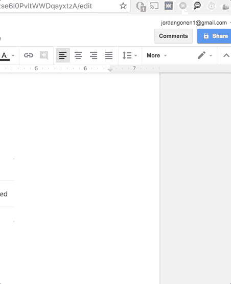

# 介绍小袋👝

> 原文：<https://medium.com/hackernoon/introducing-pouch-eb9354ffe103>

## 从书签栏访问/搜索您的 Google Drive 文件

作为一个依赖于许多不同工具来完成日常工作的人，我总是着迷于寻找方法来提高我的工作流程 1%的效率。

无论我是在做自己的个人项目，还是在一家大公司实习，我总是试图找到服务和流程的最佳平衡，以最好地提高我的生产率。

为了达到这个目标，我经常发现自己试图删除“工作系统”中我觉得不必要/无聊/低效的部分。现代工作环境中有如此多的辅助部分，以至于我们经常花费大量的时间在那些只是为了支持我们重要工作而设计的工作上；即:我们真正关心的工作。

我最近在我的同事和我自己的工作流程中注意到的一个低效之处是，我花费了大量的时间在标签之间切换和搜索信息。

我的书签栏总是满满的。我的标签到处都是。

而且…最讨厌的是…我一遍又一遍地打开同样的服务。一天之内，我发现自己打开和关闭 google drive 超过 30 次！

所以…我和我的朋友(雅各布和泰勒)认为一定有更好的方法。

# 所以我们做了[小袋](https://chrome.google.com/webstore/detail/pouch/ehojdlabkjlfkaaniakcidndhagflnkh)👝

这是一个简单的， [**免费的 chrome 扩展**](https://chrome.google.com/webstore/detail/pouch/ehojdlabkjlfkaaniakcidndhagflnkh) ，可以让你轻松地访问/搜索你的 google drive 文件——全部来自你的书签栏。

您也可以轻松地复制和粘贴链接到您的文件！

Pouch 的整个想法是，我们可以消除你不断通过标签和服务寻找你的信息的需要。从 Google Drive(和 Dropbox)开始，你可以访问你需要的所有相关信息，而不必离开你的工作状态。

## 那么，您认为我们接下来应该构建哪些集成呢？

我们还在[寻找产品](https://medium.com/u/b8b4445269d0?source=post_page-----eb9354ffe103--------------------------------)，感谢您的支持:)

## 感谢阅读！