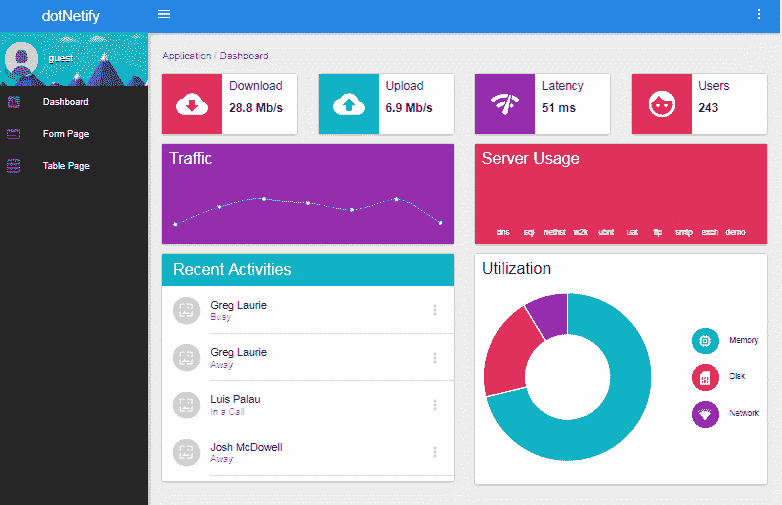

# 引入实时 React SPA 模板。网络核心 2.0

> 原文：<https://medium.com/hackernoon/introducing-real-time-react-spa-template-for-net-core-2-0-f13e64c3b7e9>



我很高兴地宣布，一个定制的 dotnet 模板现在可以用来快速构建实时、跨平台、 [React](https://hackernoon.com/tagged/react) SPA。NET Core 2.0 后端，通过 WebSocket (SignalR)通信！

## 快速启动

该模板可从 NuGet(或[github 站点](https://github.com/dsuryd/dotnetify-react-demo-vs2017/tree/master/ReactTemplate))获得。你需要安装 [Node.js](https://hackernoon.com/tagged/nodejs) 和。NET Core 2.0 SDK，然后使用以下命令在本地安装模板:

```
dotnet new -i DotNetify.React.Template
```

使用模板创建名为“MyApp”的新项目:

```
dotnet new dotnetify -o MyApp
cd MyApp
npm i
dotnet run
```

## 模板特征

微软为 React SPA 提供了标准的 dotnet 模板，但我希望这个模板能够在简单性、功能丰富性和全新的 web 开发方式方面为您带来更多价值。

我喜欢保持事情简单(但不是更简单！)模板反映了这一点，它使编程模型变得精简，将外部库的使用保持在最低限度，同时提供与标准模板同等的功能，并超越了这一点。

以下是功能列表:

*   带[react vex](http://reactivex.io/)的实时仪表盘。
*   可编辑的表单页面。
*   具有 CRUD 功能和分页的表格页面。
*   使用 JWT 不记名验证的登录页面。
*   [OpenID Connect/OAuth2](https://github.com/aspnet-contrib/AspNet.Security.OpenIdConnect.Server) 认证服务器。
*   来自 [Material-UI](http://www.material-ui.com/#/) 的漂亮 UI 组件。
*   具有深层链接的路由(可以在后端动态配置)。
*   Webpack 热模块替换+ dotnet watch(自动编译 C#代码的更改。)

## 后端 MVVM

该模板由我的开源库 [dotnetify](http://dotnetify.net/react) 提供支持，它为 web 应用程序提供了服务器端 MVVM 抽象。该模式是对 MVC 模式的改进，原因如下:

*   它允许更好地分离关注点。服务器端控制器通常有太多的责任，因为它需要确保请求被正确路由，并为视图引擎提供所有必要的数据来呈现响应。
*   它简化了开发。当编排逻辑只属于视图模型时，控制器就会变得非常精简和简单，甚至会收缩成一个端点，其唯一的工作是路由请求和响应，以及中间件的另一部分，不需要定制编程。
*   它提供了更大的可测试性。视图模型没有与数据传输或视图呈现的机制相耦合，因此可以更容易地单独测试。
*   它使客户端视图变得单薄。视图模型抽象其视图并驱动每一个数据驱动的操作，因此视图中的逻辑被最小化，以至于它只处理依赖于平台的用户交互。

MVVM 的一个关键部分是促进双向数据绑定，允许视图模型与视图完全解耦。DotNetify 使用 SignalR 来提供这种功能，SignalR 通过 WebSocket 实现 RPC(当 WebSocket 不可用时，可以降级为 HTTP 长轮询)。

包括各种现场演示在内的完整 dotNetify 文档可在[http://dotnetify.net](http://dotnetify.net)获得。还可以访问[github 网站](https://github.com/dsuryd/dotNetify)查看源代码！

***

自从今年早些时候我第一次在[宣布 dotNetify-React](https://hackernoon.com/react-net-core-signalr-amazing-ea0a83e4357e) 以来，我很幸运有人表达了兴趣和赞赏，在生产中使用它，并为路线图提供想法。未来有很酷的计划。我很高兴你能尝试一下，并得到你的反馈！