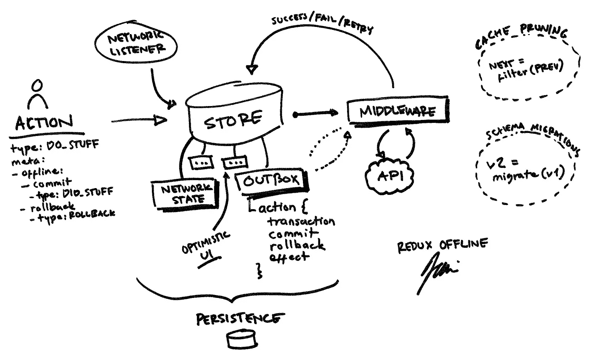

# Redux Offline 简介:渐进式 Web 应用程序和 React Native 的离线优先架构

> 原文：<https://medium.com/hackernoon/introducing-redux-offline-offline-first-architecture-for-progressive-web-applications-and-react-68c5167ecfe0>

这篇文章是一篇关于构建离线友好的网络和移动应用的长篇旅行报告。如果你想了解离线友好应用的好处和挑战，请继续阅读。

*如果你赶时间，或者只是在 Redux Offline library 上寻找信息，请前往* [*Redux Offline GitHub 资源库*](https://github.com/jevakallio/redux-offline) *。*

# 从我的错误中吸取教训

两年前，我用[做了第一个手机 app React Native](https://facebook.github.io/react-native/)。它看起来像一个真正的应用程序:你可以滑动它，你可以点击它，它甚至可以接收推送通知。它拥有你所期待的移动应用程序的所有功能。作为一名网络开发人员，我非常满意我能够发布一个真正的移动应用程序*就像那个*一样。

但后来人们开始使用这款应用，我开始听到用户的反馈。*“这个 app 烂透了！为什么它告诉我没有连接到网络？”* *“我不管网络，我只想看到我的图片！”结果是，我让这个应用看起来像一个真正的应用，但在一个重要的方面，它并不像一个真正的应用:它没有考虑到网络弹性。*

这是一个愚蠢的新手错误，我很快修复了它，但这个错误一直困扰着我，我沉迷于发现用 [React](https://hackernoon.com/tagged/react) 开发离线应用的正确方法。

当然，正确的方法并不只有一个，但是随着我对一些离线功能的 React 应用的研究，我发现了一个很好的方法，我想在这里分享一下。

# 移动目标

你们中的许多人将会有和我一样的经历。多亏了 ServiceWorker API，所谓的渐进式网络应用程序现在可以离线工作了。

两年前，我是一名跨越到移动领域的 web 开发人员。今年，将有更多的 web 开发人员编写他们的第一个移动应用程序，他们可能会发现，我在 React Native 中学到的教训同样适用于 PWAs。

总的来说，我们将开始看到移动和 web 开发领域之间越来越多的交叉。为了创建成功的移动应用程序，不仅看起来像真正的应用程序，而且行为也像它们一样，web 开发人员需要发现新的模式和实践。

但是在我们讨论这些模式之前，还有一个原因说明为什么离线支持在今天如此重要。

# 新兴市场

今天，超过 10 亿人可以使用高速互联网，30 亿人可以访问网络，超过 50 亿人拥有移动电话。每年都会有更多的人接入互联网。他们中的大多数将是移动用户，通过低速、间歇的连接进行连接。

对于这些人来说，线下支持不是奢侈品，是基本的可及性。阅读布鲁斯·劳森的文章[万维网，而不是财富西方网](https://www.smashingmagazine.com/2017/03/world-wide-web-not-wealthy-western-web-part-1/)有更深入的了解。

但是假设你不关心可访问性。或许你在乎，但付钱给你开发应用的人却不在乎。要求他们投入宝贵的工程资源来声援世界上一半的人是很难的。

但事实是:许多获得互联网接入的用户正在随着收入的增加而步入中产阶级，他们代表着全球化互联网业务的巨大机遇。

此外，投资离线优先的应用程序将使你的所有用户受益。我住在伦敦，虽然这里的网络和设备要好得多，但仍然有很好的理由让你的应用先离线。即使在 3G 和 4G 网络中，延迟仍然很可怕，离线优先的应用程序有更好的感知性能。所有网络仍然偶尔会出现故障或变得遥不可及，离线优先应用程序可以提供更好的用户体验。

总而言之，虽然互联网的可访问性和民主化访问是重要的目标，但对于企业来说，没有比利润更强烈的动机了。为新兴市场创造丰富的网络和应用程序体验需要我们应用离线优先的工程实践，这些实践将使您的所有用户受益，而不仅仅是那些网络条件差的用户。

# 我如何下线？

现在，我们已经确定了离线支持是一个好主意，让我们来谈谈如何实现它。

## 如果在线，那么…否则…

最简单的方法就是检查你是否在线，并相应地扩展你的程序逻辑。当然，你可以看到这种方法非常原始，难以测试，并且会像滚雪球一样迅速失控。

这种方法最重要的问题是，在**现实世界的移动网络条件下，不可能真正检测到你何时在线**。网络状态不是二进制的真或假。您的移动接收器可能在技术上连接到网络，但无法到达远程服务器。或者连接延迟、故障或挂起非常严重，无论操作系统怎么说，你实际上都处于离线状态。最后，网络访问是易变的和非原子的。如果你检查你现在是否在线，当你发出请求的时候，现实可能已经改变了。因此，唯一真正的方法是努力去做这件事，并对失败有弹性。

## 直通网络缓存

如果网络是问题所在，也许我们可以在网络层解决问题。如果网络请求成功，则提供新数据并缓存以备后用。如果失败，则从后备存储中提供缓存的数据。乍一看，这似乎与 ServiceWorker 缓存 API 配合得很好，但事实证明这种缓存很难管理，而且不太灵活。此外，这种缓存并不自然地支持突变。您只能缓存数据获取，但很难在网络层实现状态的网络弹性更新。

## 数据库同步

更高级的解决方案是在存储抽象层实现离线支持。难道我们不能把数据保存到数据库中，然后让数据库想办法把数据同步到后端吗？

有很多很好的工具可以做到这一点。 [PouchDB](https://pouchdb.com/) 同步到服务器端的 CouchDB。移动数据库产品公司去年发布的同名端对端同步解决方案 [Realm platform](https://realm.io/products/realm-mobile-platform/) ，在这方面为本地应用做了出色的工作。Clojure 的 Datomic 是一个令人眼花缭乱的工程壮举。

我发现这些解决方案非常棒，令人兴奋——当它们起作用时。数据存储同步开始时容易使用，但是机制不容易推理或修改。

对于大多数用例来说，数据存储同步的最后一个问题是，它要求您围绕一个特例数据库产品来设计后端。大多数应用开发者，当然不是像我们这样的顾问，无法证明构建一个完整的系统架构来让你的应用离线工作是正确的。

# 购物单

当我开始研究离线应用如何反应时，我列出了几个要求:

我想要一个不会强迫我采用全新的数据同步或后端模式的解决方案。

我希望我的团队中的大多数 React 开发人员已经熟悉并能够可靠地实现的东西，并对机制进行推理。

我想要一个能在本地移动应用、移动浏览器和桌面浏览器中通用的解决方案。

我想要一个在任意需求面前不会崩溃的解决方案:

1.  **只读**离线支持是一个好的开始，但更多时候，你需要**读写**网络弹性。
2.  大多数情况下，你想让你的应用程序支持**乐观更新**，但是其他时候你需要**悲观 UI 状态**，甚至是不同步更改的审计日志。
3.  大多数情况下，对数据进行**延迟**和增量缓存就足够了，但有时你需要**提前**加载数据。
4.  **后台同步**是一个复杂的需求，但通常是必须的需求，所以架构应该足够灵活来支持它。
5.  离线缓存应该能够经受住应用程序更新，这意味着我们需要一种简单的方式在版本之间迁移我们的数据库模式。

这是一个很长的要求列表。哪种数据库产品可以满足这些要求？它自然会产生什么样的应用架构？

事实证明，我们已经有了主要的工具。

到目前为止，大多数 React 开发人员已经使用了 Redux，并对使用它构建应用程序感到满意。

在某些圈子里，Redux 最近名声不好。“太多样板”、“太多仪式”、“太罗嗦”。至少有十几篇几乎完全相同的博客文章写道，用 MobX 编写应用程序要简单得多，也不那么冗长。

虽然 MobX 是一个很好的工具，但与任何基于代码行度量的论点一样，这些文章中的一些没有抓住要点。

Redux 不太适合快速制作简单的东西。它能让非常困难的事情变得简单。

简单，就像这样:

下面是我已经在多个应用程序中成功部署的基本机制，并且已经证明足够灵活和简单。不过，还是有一些活动部件。

基本思想是你的 **redux 存储就是你的数据库**。当您的存储发生变化时，您可以序列化并持久化它，当您的应用程序启动时，您可以将它读回内存。存储机制其实没多大关系，但是在浏览器中你可以使用 localStorage 或者 IndexedDB，在 React Native 中你可以使用 AsyncStorage，或者 roll your own。

你需要离线工作的任何操作都会在你的商店中保持，你的应用程序应该知道如何在重启后继续处理这些操作。这意味着我们不能依赖任何内存中的状态，同步这些动作所需的整个上下文需要与动作一起存储。

在这个架构中，**离线支持的动作用一个离线元字段**来修饰，该字段描述了网络效果应该如何执行，以及当它成功或失败时应该触发什么动作。离线操作然后排队，一旦在线就发送到服务器。发送的方式、地点和时间可能会有所不同。

这种架构并不新颖。我是在研究如何做线下对的时候一块一块发现的，别人之前也发现过类似的模式。这个架构的大约 70%可以用现有的中间件完全实现。特别是， **redux-persist** 是一个神奇的库，可以满足你所有与持久性相关的需求， **redux-optimist** 为乐观的行动提供了全面的支持。

但是，一如既往，细节决定成败。不同中间件之间的互操作可能会变得非常复杂，而且仍然有许多功能需要您自己实现。更糟糕的是，使用这些库的成功离线策略的路径没有在任何地方被记录。

这最终让我们…

我很高兴地宣布一个为 web 和 React Native 创建离线优先应用程序的新解决方案。

[**Redux Offline**](https://github.com/jevakallio/redux-offline) 是一个小型的模块化库，为离线优先的应用程序提供全面支持。它的目标是易于使用，与任何后端 API 一起工作，并且可以在不到 30 分钟的时间内投入使用。

现在可以从 npm 安装的实现是新的和试验性的，但是它是基于一个可靠的和经过实战检验的模式。这是未来许多版本中的第一个，有了你的反馈，我希望它成为创建离线 web 应用程序的最佳解决方案。

注意，我没有说**反应**应用。Redux Offline 对 React 没有依赖性。Redux Offline 是一个独立的持久状态容器，可以与任何能够基于单一数据源以声明方式呈现自身的 web 应用程序一起工作，包括 React、Angular 2、Vue、Preact 和 Inferno。

# 那么，它是做什么的？

Redux Offline 旨在为离线优先体验的各个方面提供细粒度的控制。这包括如何编排网络弹性 API 调用，如何保持状态，如何批处理消息，以及如何处理错误、重试、乐观 UI 更新、迁移、缓存修剪等等。

如果这听起来很复杂，那是因为它可能是。这就是为什么 Redux Offline 旨在提供一组合理的默认行为，您可以开始使用，并根据需要逐个覆盖，同时继续利用该库的核心编排功能。

# 怎么用？

在一个罕见的转变中，Redux Offline 在发布前我花了最多时间改进的特性是文档。离线优先应用不是火箭科学，我也不是火箭科学家。从根本上说，Redux Offline 解决的问题不是工程问题，而是架构问题。架构可以用代码实现，但是为了被理解、采用和遵循，它们需要被很好地交流。

因此，与其在这里解释基本机制，不如去 [Redux Offline repository](https://github.com/jevakallio/redux-offline/tree/develop) 了解 API 以及如何在您的应用程序中使用 Redux Offline。

# 最后

无论你是否已经制作了第一个支持离线的 web 或 React 原生应用，大多数 web 开发人员在未来都会面临这个问题。

正如我希望在这里展示的那样，离线能力不需要成为火箭科学。不一定需要数据库产品，也不需要放弃自己熟悉的架构。困难的部分不是编写代码让你的应用程序离线工作，而是应用一个足够强大和灵活的模式来适应不断发展的软件需求

希望 [Redux Offline](https://github.com/jevakallio/redux-offline) 能对你有所帮助。去试试吧，告诉我你的想法。

> [黑客中午](http://bit.ly/Hackernoon)是黑客如何开始他们的下午。我们是 [@AMI](http://bit.ly/atAMIatAMI) 家庭的一员。我们现在[接受投稿](http://bit.ly/hackernoonsubmission)并乐意[讨论广告&赞助](mailto:partners@amipublications.com)机会。
> 
> 如果你喜欢这个故事，我们推荐你阅读我们的[最新科技故事](http://bit.ly/hackernoonlatestt)和[趋势科技故事](https://hackernoon.com/trending)。直到下一次，不要把世界的现实想当然！

