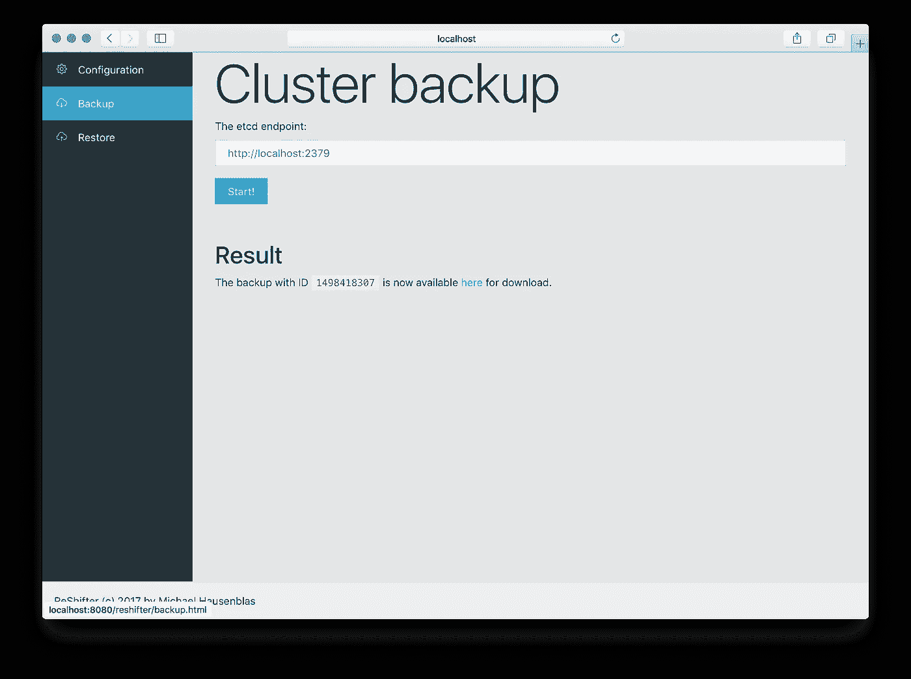
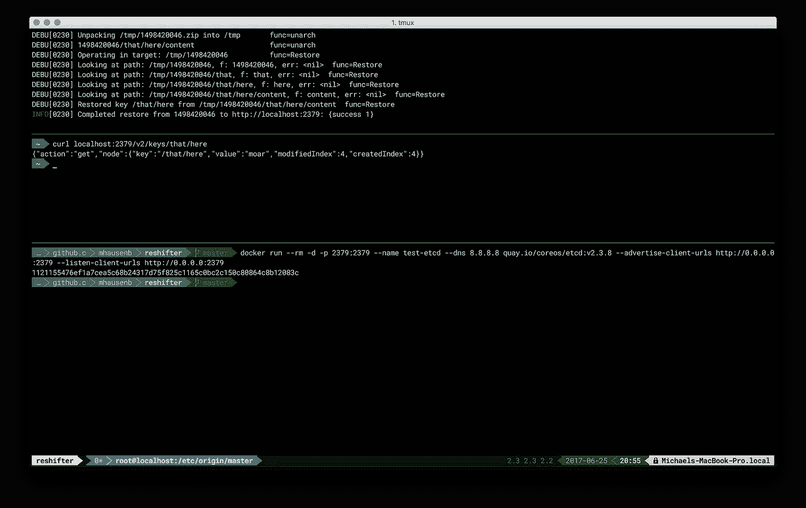

# Kubernetes re shifter 简介:备份、恢复、迁移、升级

> 原文：<https://medium.com/hackernoon/introducing-reshifter-for-kubernetes-backup-restore-migration-upgrade-ffaf78da36>

Screen shot of the WIP ReShifter tool UI.

TL；DR:如果你在开发/测试之外使用 Kubernete，也就是说，在生产中，你需要一个恢复和升级集群的策略。ReShifter 是针对[支持](https://hackernoon.com/tagged/supporting)你这些操作的 WIP。

[A Kubernetes cluster admin has a lot of responsibility …](https://www.reddit.com/r/ProgrammerHumor/comments/65896a/when_unix_says_you_lack_permissions/)

*除了开发和测试，你还在生产环境中使用 Kubernetes 吗？您是否希望能够(自动)备份和恢复您的整个 Kubernetes 集群，并且只需一次操作即可恢复？升级到新版本的 Kubernetes 怎么样？你能在不停机的情况下做到吗？*

如果你发现自己对以上任何一个问题点头附和/或回答*是*，请继续读下去。

虽然在 GKE 或 OpenShift Online 等托管环境中，您不会遇到有关恢复集群状态或升级到新的 Kubernetes 版本的问题，但在公共云中进行内部设置或部署，您自己操作集群将会面临这一挑战。

说到这里，来认识一下 [ReShifter](https://github.com/mhausenblas/reshifter) ，Kubernetes 和 OpenShift 的集群管理备份和恢复工具。请注意，ReShifter 还处于早期阶段，在撰写本文时，它还只是一个功能最少的 MVP。诸如安装、集群设置、运行定时备份等主要部分仍然缺失。然而，我现在决定与你分享 ReShifter，因为我需要你的反馈:什么功能对你来说是最重要的？1.0 版本缺少什么？请在这里留言，在 [GitHub](https://github.com/mhausenblas/reshifter/issues) 上，在[投在织机](https://www.useloom.com/share/e590aedeb95b441fb23ab4f9e9e80c32)上的屏幕上，或者在 Twitter 上打我[。](https://twitter.com/mhausenblas)

到目前为止，我在 ReShifter MVP 中拥有的是:

*   一个简单但或多或少稳定的 HTTP API
*   一个基本的用户界面
*   支持不安全和安全的 etcd v2，支持 v3 的工作正在进行中
*   可以创建存储在本地文件系统中的集群备份
*   可以从本地文件系统恢复备份
*   可以下载备份

整个事情看起来像这样[在行动](https://www.useloom.com/share/e590aedeb95b441fb23ab4f9e9e80c32):

Screen cast available via [Loom](https://www.useloom.com/share/e590aedeb95b441fb23ab4f9e9e80c32).

好了，就这样。

感谢您的时间和关注，并希望收到您的回复！

> [黑客中午](http://bit.ly/Hackernoon)是黑客如何开始他们的下午。我们是 [@AMI](http://bit.ly/atAMIatAMI) 家庭的一员。我们现在[接受投稿](http://bit.ly/hackernoonsubmission)，并乐意[讨论广告&赞助](mailto:partners@amipublications.com)机会。
> 
> 如果你喜欢这个故事，我们推荐你阅读我们的[最新科技故事](http://bit.ly/hackernoonlatestt)和[趋势科技故事](https://hackernoon.com/trending)。直到下一次，不要把世界的现实想当然！

