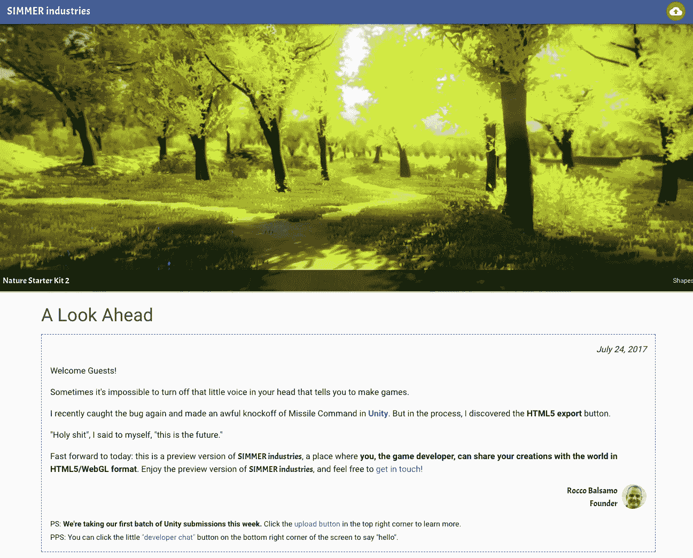
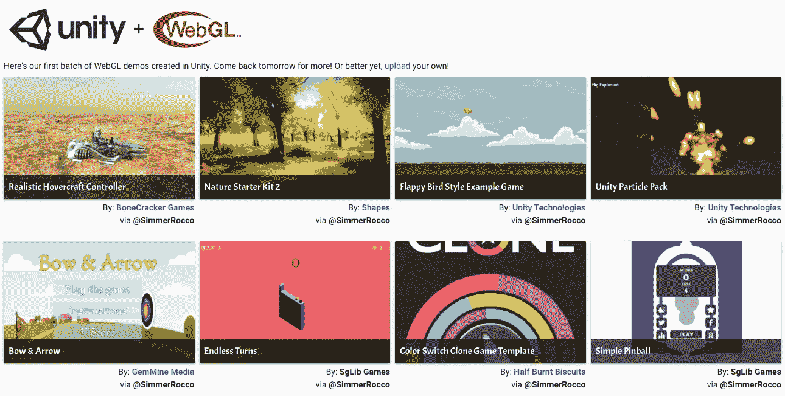
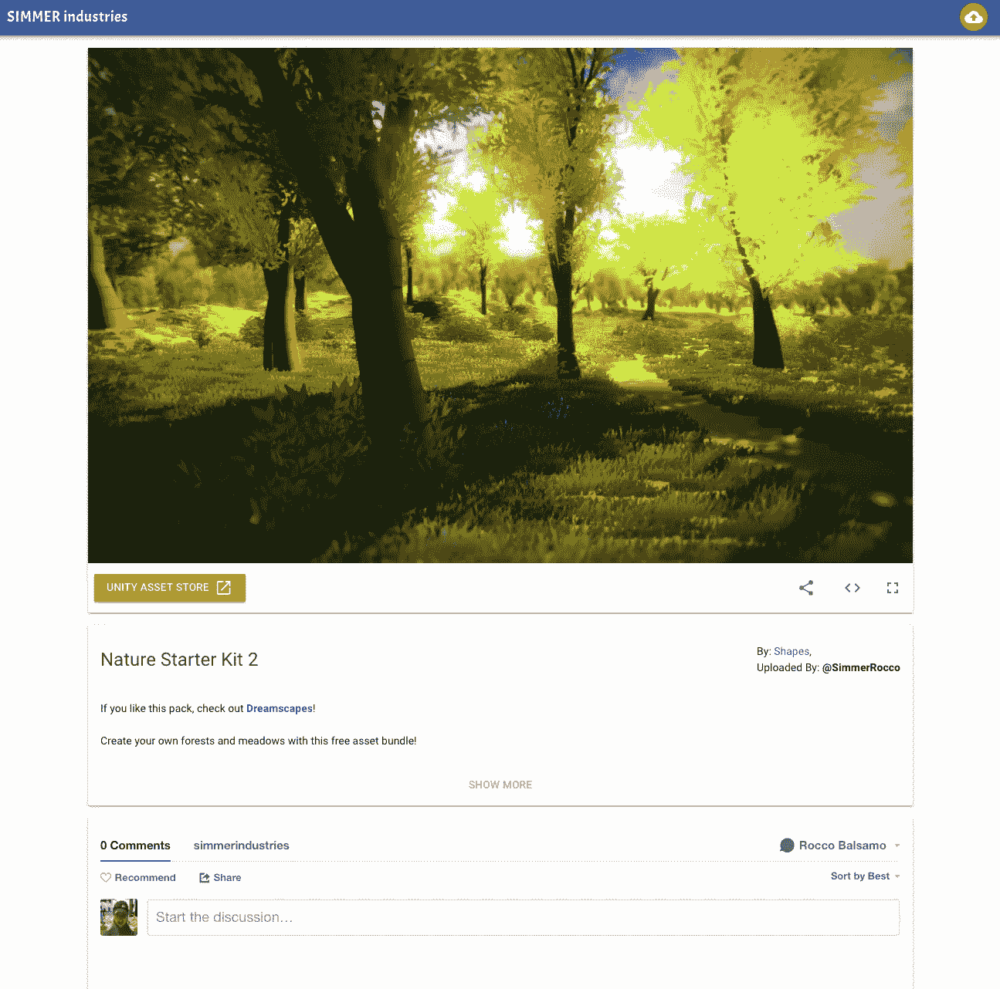
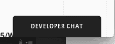

# 介绍煨煮工业

> 原文：<https://medium.com/hackernoon/introducing-simmer-industries-c1025f001e68>

this is a real screenshot from a SIMMER demo

WebGL + Unity 的家。

多么美好的一天啊！ [Adobe 刚刚宣布了 Flash 在 2020 年](https://techcrunch.com/2017/07/25/get-ready-to-say-goodbye-to-flash-in-2020/)的 EOL，WebGL 是即将接管的激动人心的技术。这就是煨的意义所在。

那么我们就来说说 smelle industries 的预览版(V0.0.0.0.1 ALPHA)。share 是 Unity 开发者上传、托管和分享 WebGL 格式的 3D 内容的地方。

**更新:预览版现在已经没有了，煨业现在是** [**煨. io**](https://simmer.io) **！**

其他 WebGL 内容将在未来添加。但是今天，团结！

今年早些时候，我发现有必要帮助 Unity 开发者以一种简单直接的方式在网上分享他们的游戏、资产和演示。没有一个[内聚的地方](https://hackernoon.com/webgl-needs-a-home-6f11fddc01df)来做这件事。

所以我开始建造。我会设计一个干净、优雅、类似于流行的视频分享网站的网站。我会提供工具，使上传简单，并使网站面向社区。

现在这已经成为现实了！

# 让我们参观一下

## 画廊

在首页，有一个演示，游戏和资产画廊。

现在只有几个项目可用，但我迫不及待地想看到 Unity 开发者开始创造的东西:

我正在积极开发工具来帮助发现和搜索。随着项目列表的增长，请查找这些内容。

## 观众

当您在画廊中选择一个项目时，它会将您带到一个查看器。您可以在这里查看游戏或资产，或对其进行评论。

## 清楚明白的细节

我已经添加了一堆好东西，使上传煨一个没有大脑。有分享工具、嵌入功能(像 youtube)和到 Unity 资产商店的直接链接。

阅读这篇文章中关于花里胡哨的内容:

 [## 煨行业详情

### 这是 https://hackernoon . com/introducing-smelle-industries-c 1025 f 001 e 68 的后续。

medium.com](/@theroccob/simmer-industries-details-1c65c9eeba6a) 

## 知道谁可能感兴趣吗？

你是一个有兴趣上传到煨 Unity 开发者吗？有问题吗？请随时通过[电子邮件](mailto:rocco@simmerindustries.com)或[推特](http://@TheRoccoB)或[聊天](https://gitter.im/simmerindustries/Lobby)联系我。

You can even chat with me on [preview.simmerindustries.com](http://preview.simmerindustries.com)!

# 这是一个总结(排序)！

我真的很期待煨行业预览网站的第一轮提交。我等不及要建立这个超棒的社区了。

(煨工业现在是[煨. io！](https://simmer.io))

*请在 Medium 上关注我，了解更多关于发布的进展情况。我也爱💚如果你有空的话；——)*

PS 我 7 月 27 日在旧金山的 [forwardJS](http://forwardjs.com) 演讲！

 [## 煨工业

preview.simmerindustries.com](https://preview.simmerindustries.com)