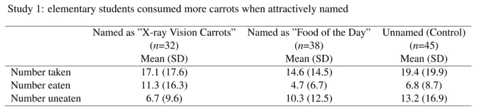
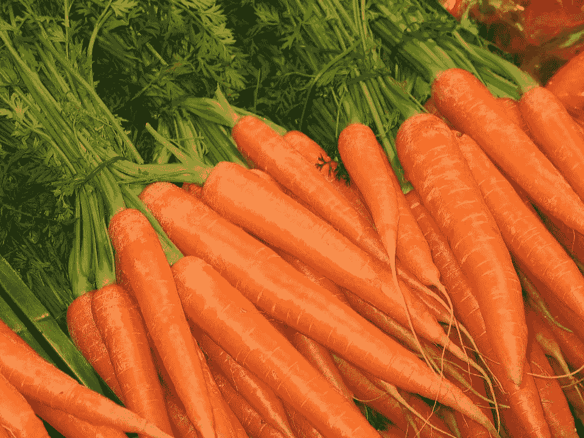
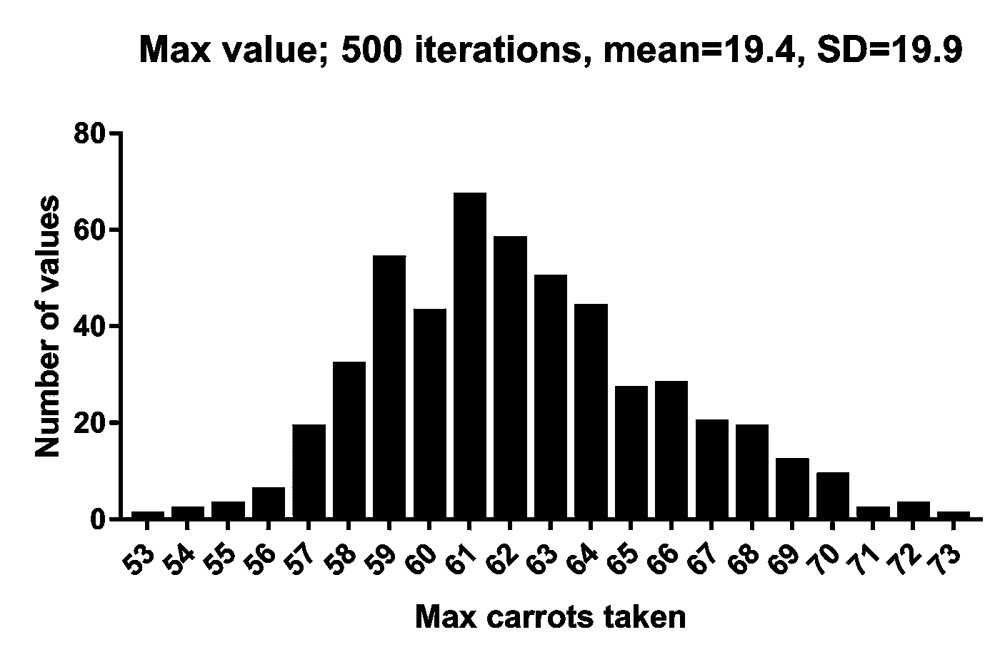
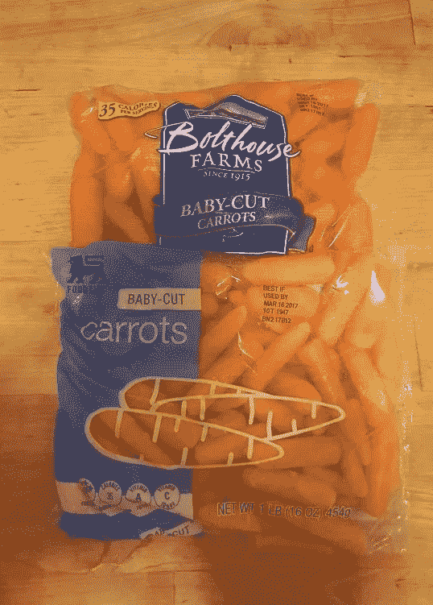
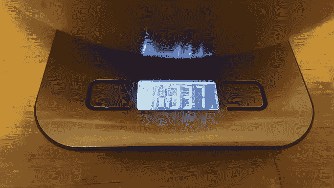
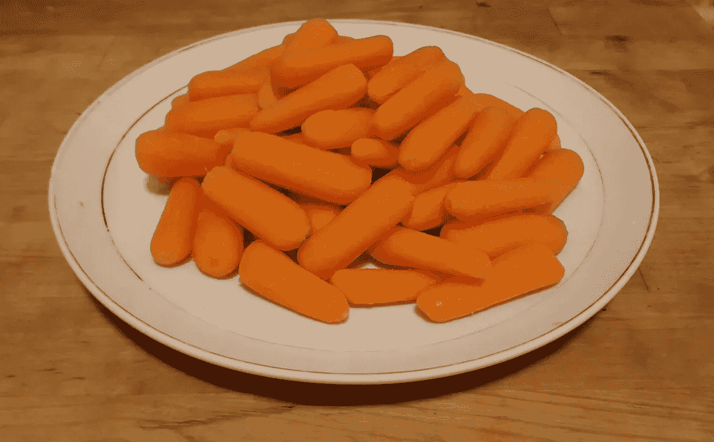

# 介绍雪碧(和 Carthorse 儿童的情况)

> 原文：<https://medium.com/hackernoon/introducing-sprite-and-the-case-of-the-carthorse-child-58683c2bfeb>

## 2018 年 2 月 26 日编者按:这篇博客文章提到的论文之前已被更正(也是在本月)，现在已被撤回。

## 2018 . 5 . 30 编辑注:[雪碧预印在这里。](https://peerj.com/preprints/26968v1/)

关心社会科学的[完整性](https://hackernoon.com/tagged/integrity)的人生活在一个联系紧密的世界里。

所以，如果你正在读这篇文章，你可能已经听说了最近康奈尔食品和品牌实验室的一系列论文带来的麻烦。

如果你还没有，好吧，你有一些赶上去做。流行的账号有[这里](http://www.slate.com/articles/health_and_science/science/2017/02/stop_getting_diet_advice_from_the_news.html) (Slate)，这里(New York Magazine)，这里(Andrew gel man)；具体论文的问题在这里[概述](https://peerj.com/preprints/2748/)(中央预印本)[在这里](/@OmnesRes/the-donald-trump-of-food-research-49e2bc7daa41#.6hsgoipn4)；此处给出或链接[响应，此处](http://retractionwatch.com/2017/02/02/backlash-prompts-prominent-nutrition-researcher-reanalyze-multiple-papers/)给出或链接[响应。](http://retractionwatch.com/2017/02/16/social-science-isnt-definitive-like-chemistry-embattled-food-researcher-defends-work/)

哦，现在——从昨天开始——还有这个。

简而言之:这个实验室的工作目前正在接受大量的严格审查。几篇论文中存在着难以解释的不规则现象。

但是现在把这些都推到餐具柜上，因为我们要谈论胡萝卜。

YES, CARROTS. YOU SHOULD BE THIS EXCITED.

[在这里](/@OmnesRes/cornell-and-the-first-law-of-fooddynamics-cb2ed34d7e7f#.xstg1wwgz)你可以看到乔丹·安纳亚写下了下面这张复制的表格。它来自 Wansink 等人(2012 年)的论文:“有吸引力的名字维持了学校蔬菜摄入量的增加”。它提出了一个简单的论点:把“胡萝卜”、“豆子”和“花椰菜”的名字改成孩子们正在做的令人兴奋的东西(我不知道，“巴斯光年 chard”或“口袋妖怪 kale”等等。)而且孩子会吃的更多。该论文目前有 99 篇引文。这是研究 1 的结果:

乔丹对上述内容的反对非常简单，而且完全正确——如果你拿一些东西[A],然后你吃一些[B],不吃其他的[非 B],那么[A]将等于[B]+[非 B]。

如果不是，那么你就犯了一个错误。换句话说，就拿上面第一列来说——17.1 不是 11.3 和 6.7 之和，应该是。

论文的其余部分也有类似的错误。

*但是还有一个错误还没有人指出，我认为你应该看看。*

*坦白地说，这很有趣。*

要看到这个错误，你得去见我的一个新朋友…

## 介绍雪碧

**SPRITE** 代表 **S** 充足 **P** 参数 **R** 通过 **I** 迭代 **TE** 技术重构。这是一种类似于[严酷测试](/@jamesheathers/the-grim-test-a-method-for-evaluating-published-research-9a4e5f05e870#.pg09nqu3c)的统计技术，原因如下:

1.  它使用描述性统计来调查已发布数据集的属性
2.  它非常简单，并且能够自动化
3.  谈论它我感到有点尴尬，因为我不确定它是否重要或新颖…我只有足够的信心来讨论它，因为我用它发现了这么多有趣的事情

为了解释它是如何工作的，一个故事:

*********

假设我们有一个从 1 到 7 的范围，20 个人在这个范围内回答“你觉得胡萝卜怎么样？”

在这个尺度上，1 是“纯白滚烫燃烧的厌恶”，7 是“超越时空和现实的爱情故事”。

还有，假设大家都放 3。嘿，这是可能发生的——这是一个糟糕的设计规模。3 相当于“是的，胡萝卜，当然，它们很好…？我是说，不管怎样？”

(注:这其实是美国人说话的方式)

AREN’T THEY EXCITING

这是我们的例子:

3,3,3,3,3,3,3,3,3,3,3,3,3,3,3,3,3,3,3,3

不是很有趣，是吗？它的平均值为 3，标准差为 0。没有偏差，标准或其他。

现在，收集这些数据的 ***假设的*** 基于胡萝卜的研究员很失望，并悄悄地对他的 Excel 2010 副本抱怨“这不是我希望的基于胡萝卜的荣耀”。看起来不太对。这破坏了他的计算。因此，他决定偷偷改变一些价值观，让他以胡萝卜为基础的生活变得更有活力。

这是他的第一次努力:

三，三，三，三，三，三，**四**，三，三，三，三，三，三，三，三，三，三，三

然后他记起来:他已经向一位同事提到平均值是*正好三个*。胡说。啊，但是！如果他向上改变一个值…

3，3，3，3，3，3， **4** ， **2** ，3，3，3，3，3，3，3，3，3，3，3，3，3，3

…他可以换下一个！均值保持不变，但标准差开始增长，现在是 0.32。他变得更加大胆，开始交换一系列的价值观——一个向上，一个向下，一个向上，一个向下，然后突然:

2,3,1,2,4,3,5,2,2,2,7,3,2,3,6,1,3,2,3,4

现在，它看起来更真实了:平均值仍然是 3，但是 SD=1.56。

他邪恶的工作完成后，他去自助餐厅吃午餐(是胡萝卜)。

*********

SPRITE 所做的事情，在最基本的层面上，很简单——它自动执行上述操作，而且速度非常快。生成具有上述特性的样本(M=3.00，SD=1.56，n=20)所需的中值时间为 7.37 毫秒

换句话说，对于任何给定的平均值，我们(非常快速地)调整可用的值，直到生成一个包含我们感兴趣的参数的样本。然后我们一次又一次地重复。我们找到成百上千个似乎合理的解决方案。如果我们愿意，我们可以进一步模拟它们。

这让我们可以做很多事情。

*   在最基本的层面上，我们可以给 SPRITE 一个平均值和标准差，它会找到一个符合这些值的分布。如果我们只想检查数据*可能是什么样子的*，这很好。我们可以对那些容易得到的多重解进行分布拟合。
*   我们可以很容易地给 SPRITE 一个均值和标准差，*以及一系列的限制*，比如“1 以下没有值，7 以上没有值”，或者“只能用整数”。
*   我们可以让 SPRITE 找到样本的实际限制——如果我们给它一个平均值、标准差和限制，我们就可以找到样本在哪里可能有最大值或最小值。
*   通过一些微小的修改，我们可以让 SPRITE 为我们找到中间值和四分位数范围。
*   说到范围，我们可以很容易地把它们结合起来。
*   我们可以根据样本大小确定细胞大小，反之亦然。
*   通过比较产生正确测试统计数据的多个 SPRITE 分布，我们可以从 ANOVA、t-test、卡方检验等中近似出简单的结果。
*   我们可以通过将精确的测试统计数据或 p 值与样本值进行比较来确定舍入误差。
*   自然地，我们可以做到以上所有，然后查看我们生成的值，并应用*常识*。

这让我们干净利落地回到了胡萝卜。

## Wansink 等人(2012 年)，研究 1

回头再看一遍那个值表。看到右边的栏了吗？

**平均值=19.4，标准差=19.9，n=45**

那看起来是不是有点…滑稽？也许不是。再补充一个事实:*胡萝卜不能少于零*(没有消极的胡萝卜，这不是星际迷航)。

所以，让我们问雪碧:一个孩子吃胡萝卜的最大*数量*有哪些看似合理的值？使用一个漂亮的小脚本，我们生成 500 个似是而非的数据集(和以前一样，mean=19.45，SD = 19.9，没有低于零的值，也没有上限)，并记录我们生成的每个数据集的最大值。

哦。

如果你没有读过原始论文，或者现在已经忘记了，让我提醒你一下:我们的原始值描述了在控制条件下午餐时给小学生(8 到 11 岁)提供的胡萝卜量。

显然，其中至少有一匹是马。

HELLO I AM REGULAR HUMAN CHILD GIVE CARROTS NO

还有什么动物认为它能吃掉 60 根胡萝卜？还要注意:这是在控制干预中让学生多吃胡萝卜。坦白说，我认为这个孩子是有问题的。

即使考虑到“小胡萝卜”的大小(小胡萝卜是由真正的胡萝卜加工而成的橙色小胡萝卜管，所以它们的几何形状足以让美国人接受，他们在很大程度上将蔬菜视为一个概念)，这也是一个完全令人困惑的蔬菜量。特别是对于一个 a)还在读甜谷高中的书[和 b)可能还在吃其他非胡萝卜食物的孩子来说。](https://hackernoon.com/tagged/books)

“60 根胡萝卜”里到底有多少胡萝卜？我决定找出答案。

## 快速购物之旅

这里有两包胡萝卜。

我仔细挑选了一包，里面有尽可能多的精致的小胡萝卜，通过简单的动作，翻遍了整个超市的货架，看了看袋子(“你需要什么，呃，帮助吗，先生？”“不，孩子！我在找小胡萝卜！”).

另一包看起来更厚。他们会做合理的限制。

60 个小的，随机选择:

About three quarters of a pound in imperial “measurement”

60 个大的实际上是整包的价值——里面只有 55 个。我不得不用 5 个小的来弥补差额。

More than a pound.

最后一个侮辱，你想看看盘子里的 60 根普通胡萝卜是什么样子吗？

How’s your eyesight now?

注意:这是全尺寸的普通餐盘，不是边盘。

另外两个方法注释:

1.  根据[数据警察学员布朗](https://twitter.com/steamtraen)在互联网上为我提供的这篇论文的草稿，这些胡萝卜没有被拿走——就像，一个总是让事情变得困难的孩子(我们都知道他)没有简单地拿着四大把胡萝卜回到他的午餐桌上，胡萝卜从每个口袋和孔中溢出——他们被端上来了。所以，有人拿着一个平底锅大小的勺子看着一个孩子的眼睛说“*这是你要的一磅胡萝卜，小辛迪……记得要刷你的鬃毛*”。
2.  显然，这些胡萝卜也是在一个小碟子里秘密称重的。嗯，那会是一个很大的盘子。

## 结论

科学论文中发现的任何不一致，本身并没有多大意义。我在各种论文中看到过数百个不一致的地方，把它们踢来踢去，分析它们，想知道它们是如何出现的。

你知道吗？

*大部分只是不一致*。它们没有比破损的页边空白或脱落的牛津逗号更令人不安的出处。它们是过程错误，有逻辑解释，对得出的科学结论影响极小。甚至这种相当有趣的基于马儿/胡萝卜的矛盾也可能会落空。雪碧可能是错的，我可能做了不好的假设，等等。永远不要忽视这种可能性。

**但是。**

比不一致更成指数问题的是不一致的模式，当我们考虑现有的问题并加上 Carthorse 儿童的情况时，这种情况非常多。

这篇论文似乎出了严重的问题。我们不知道具体是什么——数据收集、分析、测量技术，或者以上所有这些。我们会看到的。

撇开基于蔬菜的幽默不谈，这也是对如何使用 SPRITE 来研究样本属性以及当我们找到这些属性时它们的含义的一个非常简短的介绍。

预计很快会听到更多关于这方面的消息。

**注意:对于那些感兴趣的人，我将很快提供关于 SPRITE 的工作代码、示例和所有技术细节。它旨在对 GRIM 和 GRIM-SD 测试进行某种程度的补充，并且将以与 GRIM 论文** [**此处**](https://peerj.com/preprints/2064/) **的原始预印本相同的方式呈现。该技术可以用于各种各样的场景，我想补充一系列的改进，以及其他一些到目前为止用它检测到的相关结果。**

如果你现在还在阅读，你可以做两件事来帮助你:

1) *提建议*，如果你是一个比较科学、统计或工程类型的人——我的代码笨拙而糟糕，你可能有更好的方法来解决这个问题
2) *把你在论文*中发现的任何奇怪的结果发给我，如果可能的话，我们会看看 SPRITE 对它们有什么看法

对于这两个，电子邮件是 jamesheathers@gmail.com。一如既往，很高兴与你交谈。和往常一样，在脸书[会有更多的混乱。](https://www.facebook.com/JamesAJHeathers/)

更可怕的是，我激活了我五岁零六个月大的 Twitter 账户。我想用它来吓唬人。

附注:在这篇博文的制作过程中，没有小胡萝卜受到伤害。

事实上，那不是真的，我把奇怪的小虫子做成汤了。

我很自豪成为第一个使用中号标签“胡萝卜”的人

> [黑客中午](http://bit.ly/Hackernoon)是黑客如何开始他们的下午。我们是这个家庭的一员。我们现在[接受投稿](http://bit.ly/hackernoonsubmission)并乐意[讨论广告&赞助](mailto:partners@amipublications.com)机会。
> 
> 如果你喜欢这个故事，我们推荐你阅读我们的[最新科技故事](http://bit.ly/hackernoonlatestt)和[趋势科技故事](https://hackernoon.com/trending)。直到下一次，不要把世界的现实想当然！

