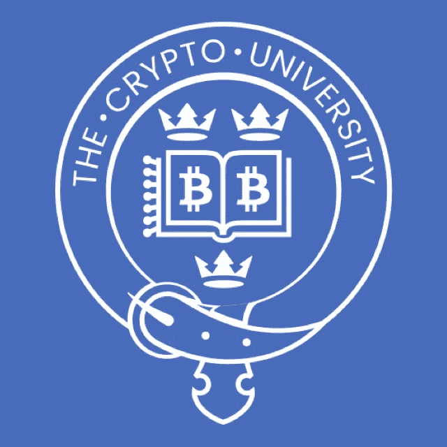

# 介绍加密大学

> 原文：<https://medium.com/hackernoon/introducing-the-crypto-university-5f6b07c4805c>

我很高兴地宣布“加密大学”的成立，这是一所学习区块链所有加密知识的在线学校。

我的好友瑞安([瑞安·查达](https://medium.com/u/ca5a6041dd14?source=post_page-----5f6b07c4805c--------------------------------))和我密切关注加密领域(不，不仅仅是比特币)已经有一段时间了，我们对其中一些加密技术在解决会计、房地产和金融等行业存在的低效率方面的潜力很感兴趣。

同样令人着迷(也有点可怕)的是，大量的人把钱投入到加密领域，却完全不知道他们到底在投资什么。

*比特币到底是什么？为什么买这么贵？*

*钱包私钥到底是什么？如果我弄丢了会怎么样？*

*我一直听说的 Ripple、Stellar Lumens 等新硬币是什么？*

*这些加密货币的价值是如何确定的？*

*这些密码产生了什么样的收入？*

这些只是人们经常问我们的一些问题。

Ryan 和我决定创办加密大学，因为我们想帮助人们真正理解加密空间中这些“硬币”背后的潜在技术和价值。

# 我们是谁？

Ryan Chadha 是我的一个好朋友，他放弃了伦敦商品交易商的生活，在班加罗尔开办了一所学校，旨在培养孩子们的好奇心、信心和毅力。在吸收信息方面，他是一块海绵，并且不可思议地对自己的投资进行风险调整。

我( [Rohith Salim](https://www.linkedin.com/in/rohith-salim-87253024/) )本质上是一名工程师，曾在微软、Yelp、Rent The Runway、Oyster & Cuemath 等公司担任软件工程师和产品工程师。自从我在卡耐基梅隆大学学习信息安全课程以来，我就对密码学产生了兴趣，并且对构建在区块链之上的应用程序非常着迷。

在秘密世界里有许多“骗局”。然而，Ryan 和我真诚地相信，我们正在努力解决困扰当今世界的一些重大问题——例如，Dash 与 KuvaCash 合作解决津巴布韦的通货膨胀问题。

许多发达经济体可能没有意识到这些问题，但是在像印度这样的地方，证明你的身份甚至获得银行账户这样简单的东西都是一个大问题。

我们不认为区块链技术是解决所有问题的灵丹妙药，但它可以用来解决系统中的许多低效问题。

# **关于学校的更多信息**

瑞安和我都想确保这所学校提供大量的价值，不管你在密码世界的经验。这些是我们最近创建的一些课程:

1.  [**比特币简体【免费】**](https://thecryptouniversity.io/p/bitcoin-simplified)这是我们为了尽可能简单地解释比特币&区块链而打造的课程。事实上，这些都是我用来教我 13 岁的侄女关于这个生态系统的讲座。
2.  [**比特币历史上的丰碑【免费】**](https://thecryptouniversity.io/p/monuments-of-bitcoin-history)这是对比特币的历史分析——从 2008 年的信贷紧缩开始，一直到最近 2017 年 12 月 10 日比特币期货的推出。比特币经历了坎坷，自 2009 年第一笔交易以来，发生了很多事情。学完本课程后，您将对投资不同加密货币时需要注意的事项有一个很好的了解，并对与该市场相关的事件赋予意义。
3.  [通过我们的](https://thecryptouniversity.io/p/the-crypto-masterclass) [Indiegogo 活动](https://www.indiegogo.com/projects/the-crypto-masterclass-education)，我们将在有限的时间内为该课程提供惊人的首发优惠(高达 90%的折扣)。

这真的只是开始。Ryan 有一些与投资相关的非常有趣的课程，他想教你们所有人，我将教你们在以太坊这样的平台上构建应用程序的基础。

瑞安和我都非常感谢在我们建立加密大学的时候一直支持我们的每一个人。从提供建设性的反馈到给我们热情的介绍给秘密空间的人，我们真的很感谢所有的帮助。

我们希望你来看看我们的学校([www . thecryptouniversity . io](http://www.thecryptouniversity.io))，并与你的任何家庭成员的朋友分享，他们可能有兴趣了解这个领域的更多信息。