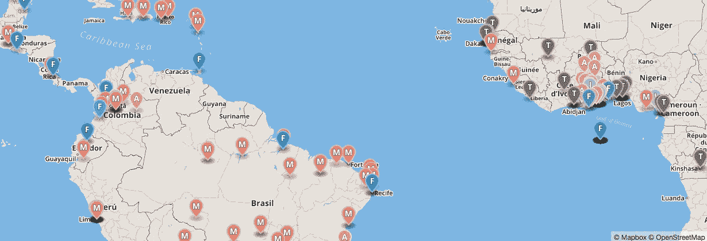

# 介绍全球创新空间图谱

> 原文：<https://medium.com/hackernoon/introducing-the-global-atlas-of-innovation-spaces-bcd1a4f1af3c>

A very preliminary version of the global map, which is slow to load and may freeze your browser.

更新:按照互联网上许多雄心勃勃的项目的伟大传统，我们已经被推迟了几个月。我们期待在 2017 年末发布。

你有没有发现自己在某个随机的城市想知道，*那些疯狂的有创造力的人都在哪里？我们试图为世界各地的每个人回答这个问题——通过合作建立一个巨大的开放数据库，包括 Fab Labs、hackerspaces、makerspaces、impact hubs、孵化器、艺术家集体、合作网络、Maker Faires 和其他社区工作室。*

欢迎来到全球创新空间图集——我们将于下个月正式推出。[(应大众要求，这里有一个丑陋、不准确、难以导航、加载痛苦的 alpha 版本的预览。](http://anansegroup.com/mapping.html)请注意，最终的地图将完全不同，并且数据库将包含更多关于每个空间的信息。)

首先，我们感谢德国政府(BMZ 联邦经济合作与发展部)赞助这个项目，感谢德国开发署 GIZ 为项目的实施提供便利。感谢 [Fab 基金会](http://fabfoundation.org/)对这个数据库的支持，感谢[美国机械工程师协会](http://asme.org/)对我们早期绘图工作的赞助。这个项目由安娜·沃尔德曼-布朗和来自[安纳斯集团](http://anansegroup.com)的 Chinmayi SK 领导，我们很高兴地宣布我们的核心团队包括来自创新空间的大多数主要网络的代表:[开放运动](http://open.co)、[Hackerspaces.org](http://Hackerspaces.org)、[Fab 实验室网络](http://fablabs.io)、[创客媒体和 Makerspace.com](https://makermedia.com/)、 [TheMakerMap](http://themakermap.com/) 、[维基工厂](http://wikifactory.com/)和[全球我们在世界银行集团、美国国际开发署，当然还有 GIZ 也有合作者。(我们将很快在网站上公布整个工作组。)也感谢我们在](http://www.globalinnovationgathering.com/) [Makery](http://makery.info) 、[超级英雄空间](http://superherospaces.com/)、[指示物](http://instructables.com)、 [Hacedores](http://hacedores.com/) 和[邦戈蜂房](http://bongohive.co.zm/)的了不起的制图伙伴们，他们做了大量的基础工作。

通过与几个不同的社区空间网络的讨论，我们发现需要一个更具活力和协作性的平台，以保持所有志同道合的空间的最新数据库，并鼓励更多的网络和联系。我们的数据库将保存完整的全球创新空间列表，我们正在与 Rob Baker 的 Maker.json 联合开发一个 API [，以便所有数据可以在其他网站之间轻松共享。我们的下一步将是创建一个开放的、维基百科式的合作平台，通过众包提交来保持一切最新。](/@rrbaker/launching-maker-json-ecaac6cd38ed#.ookhn732m)

在我们的地图上包含给定的创新空间，我们有三个主要标准:

1.  促进创造力和培养新想法的空间(即“创新”)
2.  一个渴望与他人合作的社区:这个空间必须要么对公众开放，要么对外部合作伙伴开放
3.  利用新旧技术的空间，包括硬件、软件、金属加工、手工艺品、再利用的垃圾、社会框架、农业等。

为了给地图集提供更有效的过滤器，我们[正在开发一组数据字段](https://docs.google.com/document/d/1GwviwpJ9TjProGdTj65uOFW8PLWgmShzt-r2E4aU2Qw/edit#heading=h.eub2f8h7h7k1)和一个标签系统，以帮助空间找到共同主题的合作者。

我们期待在二月份推出我们的测试平台，并希望尽快与您合作！

# 常见问题

## 问:这个平台与所有其他创新空间平台有什么不同？

答:我们自己在新兴市场做了一些测绘工作，但我们更感兴趣的是建立一个强大的 API 和信息交换，而不是创建一个全新的创新空间地图。其他团队在地图绘制方面做得非常好，我们不想重复工作。(事实上，我们已经有了 50 多个不同的创新空间列表。)套用 Open.co 的 Jonathan Robinson 的话，想想不同的航空公司是如何在 Kayak 这样的航班搜索网站上共享他们的信息的；我们正在为各种创新空间平台开发类似的标准。

当然，我们也在建立我们自己的维基数据库和用户界面，所以任何人都可以在不同的平台上看到在某个地区映射的所有空间。这一部分与我们的合作伙伴和潜在合作伙伴正在做的事情直接重叠…但希望我们能够一起工作，合作而不是竞争。(我们都相信开源，对吧？)我们实际上更喜欢使用其他人的数据库架构，但不幸的是，Atlas 可能包含超过 10，000 个空间，而其他平台都没有为该容量做好准备。

请注意，我们实际上并不关心我们自己网站的浏览量，或者“拥有”任何数据——我们只是想在 10 月底之前建立一个真正好的信息交流平台。欢迎每个人使用我们的 API，并在自己的网站上托管地图集(或部分内容)——只要你信任提供数据的 Ananse 和我们所有的地图合作伙伴。

## 问:如果你成功构建了一个非常棒的平台，我们能把我们的空间集合移植到你的数据库吗？

答:当然！我们所做的一切都是完全开源的，我们很乐意为您提供空间。

## 问:我们可以保留自己的数据库，只分享关于共享空间的信息吗？

答:当然！如果你还没有一个 API，希望我们能在接下来的几个月里筹集更多的资金来为你建立一个。

## 问:你的长期计划是什么？你会把平台货币化吗？

答:我们对这个项目进行了长期投资；它将保持开源和非盈利。我们正在与几个组织讨论长期资助和合作关系，欢迎任何建议。

## 问:一切有多开放？

答:我们的代码将受到麻省理工学院许可的保护。数据库结构和任何受版权保护的数据(不属于各个合作伙伴)将根据[知识共享署名-共享 4.0 国际公共许可证](https://creativecommons.org/licenses/by-sa/4.0/legalcode)以及[开放数据共享署名许可证](http://opendatacommons.org/licenses/by/1.0/)进行许可。所有列出的空间将提供一个明确的方式来删除和/或修改他们的任何信息，所以任何人都可以随时退出数据库。

## 问:我对地图集有一个想法，并且/或者我想参与其中…

甲:甜！请在[anansegroup@gmail.com](mailto:anansegroup@gmail.com)与 Chinmayi 和 Anna 取得联系——我们期待听到您的想法。

> [黑客中午](http://bit.ly/Hackernoon)是黑客如何开始他们的下午。我们是 [@AMI](http://bit.ly/atAMIatAMI) 家庭的一员。我们现在[接受投稿](http://bit.ly/hackernoonsubmission)并乐意[讨论广告&赞助](mailto:partners@amipublications.com)机会。
> 
> 如果你喜欢这个故事，我们推荐你阅读我们的[最新科技故事](http://bit.ly/hackernoonlatestt)和[趋势科技故事](https://hackernoon.com/trending)。直到下一次，不要把世界的现实想当然！

