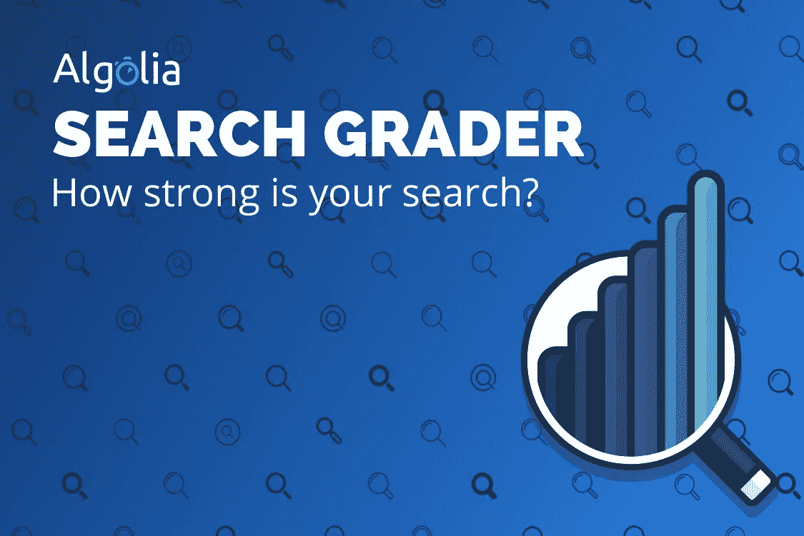
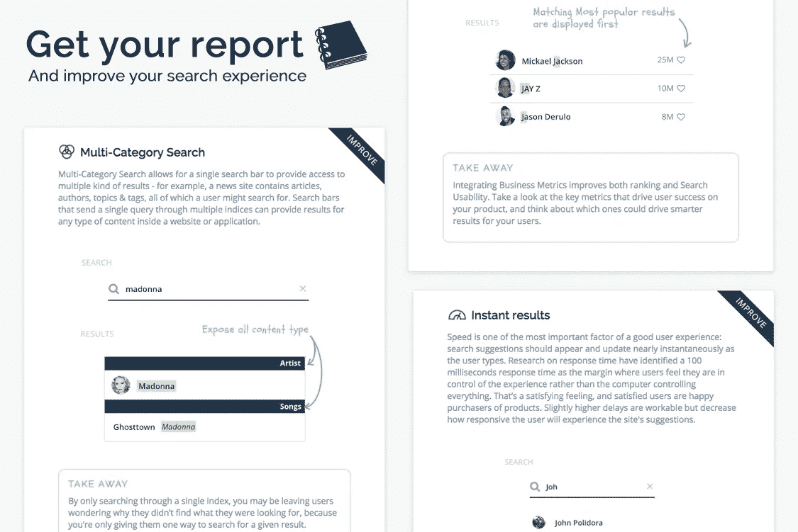

# 介绍 Algolia 的搜索分级器

> 原文：<https://medium.com/hackernoon/introducing-the-search-grader-by-algolia-2c908f6d748b>

我们很高兴今天推出了[搜索分级器](http://grader.algolia.com)，这是一款免费工具，产品构建者可以使用它来评估他们当前的搜索体验，并获得一份关于提高速度和相关性&设计的具体建议的报告。搜索是用户在互联网上获取信息的一个基本部分，今天的互联网用户希望每个产品都有快速、直观的相关搜索。

搜索分级器可以免费使用，可以在任何浏览器或设备上工作，并帮助你将搜索分解成具体的功能，这些功能很容易用 gif 和例子来理解。在评分结束时，您将收到一份报告，显示您可以改进的地方，您可以留下您的电子邮件以接收免费的 PDF 副本，您可以在团队内部传阅。

上周，我们在[网络峰会](http://websummit.net)上花了一周时间，为 5 万多名飞赴里斯本参观科技世界最新最棒产品的创新者演示分级器。

At the end of the Search Grader, get a free report full of tips to improve your product’s search experience!

搜索教育对 Algolia 来说非常重要——我们认为，拥有出色的搜索体验的关键首先是理解一个出色的搜索是什么样的(当然，第二部分是实施最佳实践)。我们的每一条建议都解释了最佳实践的工作原理，以及如何在自己的产品中实现最佳实践的快速建议(无论是否使用 Algolia)。

对于那些希望获得更详细的搜索体验评估以及如何改进的搜索分级用户，他们可以在收到报告后跟进，并发送电子邮件至 grader@algolia.com[与我们的产品专家交流。](mailto:grader@algolia.com)

Algolia 是由开发人员为开发人员构建的，我们目前与 2000+客户合作，包括 Twitch、ProductHunt、Medium &甚至 Web Summit 应用程序，以及 12000+用户参与我们的免费黑客计划。

我们很高兴让您试用我们的搜索分级器，并让我们知道您的想法！

> [黑客中午](http://bit.ly/Hackernoon)是黑客如何开始他们的下午。我们是 [@AMI](http://bit.ly/atAMIatAMI) 家庭的一员。我们现在[接受投稿](http://bit.ly/hackernoonsubmission)并乐意[讨论广告&赞助](mailto:partners@amipublications.com)机会。
> 
> 如果你喜欢这个故事，我们推荐你阅读我们的[最新科技故事](http://bit.ly/hackernoonlatestt)和[趋势科技故事](https://hackernoon.com/trending)。直到下一次，不要把世界的现实想当然！

