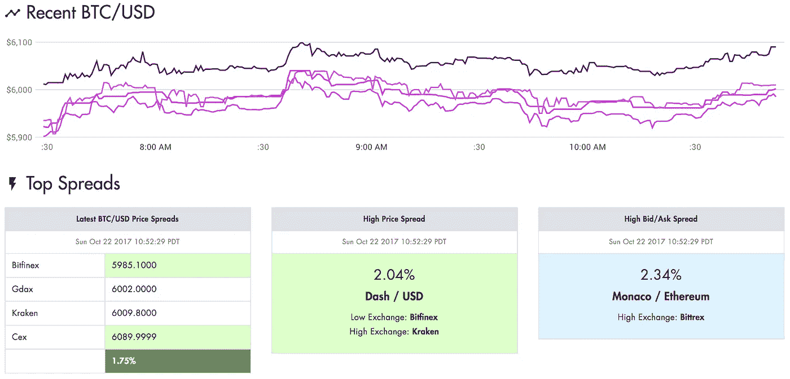
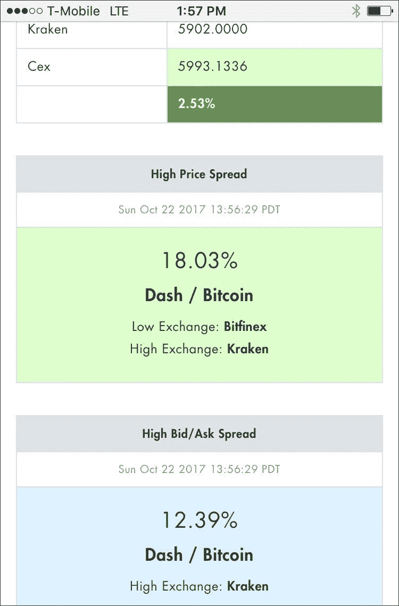

# 介绍——令牌价差:用于套利的简单比特币/加密价差监控。

> 原文：<https://medium.com/hackernoon/introducing-token-spread-simple-bitcoin-crypto-spread-monitoring-for-arbitrage-67ca0cb88358>

我最近启动了一个个人项目，来监测一些交易所中许多流行的加密货币的价格和买卖差价。

[https://www.tokenspread.com/](https://www.tokenspread.com/)

我的实验范围是:

*   交易所间人工套利
*   交易所内自动套利

我一直在跟踪比特币(BTC)、以太坊(Ethereum)、Monero (XMR)、Ripple (XRP)、Neo 等货币——通过 Bitfinex、Bittrex、北海巨妖、Gdax 等交易所。

## 总体信心

加密货币套利的潜力巨大，每天都有许多信号和许多机会。有些机会需要完全自动化才能实现。

## 秘密市场问题

1.  *音量*
    音量低。真的很低。可操作的清晰信号通常受到音量的限制。
2.  *买卖价差* 低成交量对的买卖价差相当高。这引入了大量的可变性，并影响了机会信号的可预测性。
3.  *订书*
    因为成交量低，订书薄。这意味着不同价格下的“深度”或可用兴趣非常少，这使得了解一个机会的全部范围变得更加复杂。例如，可能有一笔很大的交易可以净赚 5%，但最多只有 3000 美元。下一个商机可能是净利 3%，商机规模为 5000 美元。诸如此类。
4.  *网络传输速度*
    网络传输速度非常不可预测。钱包之间的比特币(BTC)转账时间从 10 分钟到 8 小时不等。网络健康和带宽是这里的关键因素。BTC 有不同于 ETH 的考虑，等等。我们可以更多地谈论采矿费及其对这些交易的影响，但交易所投资者目前对此基本上不清楚。
5.  *交换可靠性* 交换相当可靠。然而，他们甚至没有接近电子交易或互动经纪人或彭博终端的水平。差远了。一些交易所已经被政府关闭。有些交易所扩张得太快了，比如北海巨妖。有时交易会因为服务器过载而无法执行。一些交易所的 API 端点有时相当不可靠。

## 普通投资者

普通投资者应该谨慎行事。转移时间是可怕和不可预测的。加密作为一个更大的领域已经证明了它的价值和持久力。对于一个外行投资者来说，更实际的做法可能是先熟悉区块链的主要概念，以便理解为什么人们对不同的货币感到兴奋。或许比特币会成为整体赢家，或许不会。不要被媒体吹嘘的市值和所有其他数字浪漫化，我不相信各种交易所已经用真实的交易量和交易活动证明了这些说法。

## 未来是什么样子的？

谁知道呢…加密市场正以令人难以置信的速度发展。它会一直留在这里。比特币赢了吗？以太坊？Qtum？Zcash？涟漪？我们真的不知道。无论发生什么，这都将是一次有趣的旅程。

需要注意的是:我们还不知道比特币和加密货币将如何应对道琼斯、S&P 和纳斯达克等大型市场的大幅下滑。我们知道，到目前为止，比特币的表现在很多方面都超过了美国主要市场。在外面要小心。在过去的 24 个月里，人们很容易对加密市场做出“正确”的判断，或许这应该成为保持谨慎的理由。

【https://www.tokenspread.com/ 号

*跟我上* [*推特*](https://twitter.com/wbelk) *。在*[*LinkedIn*](https://www.linkedin.com/in/williambelk/)*上找我。*