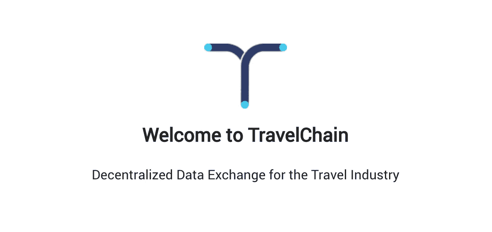
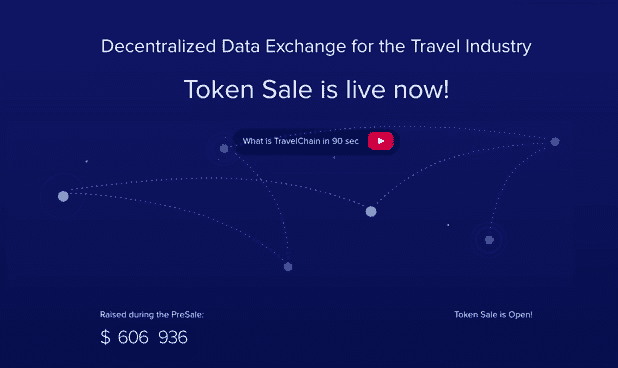
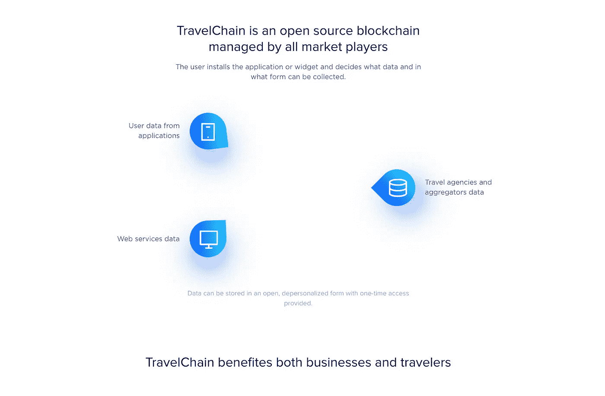
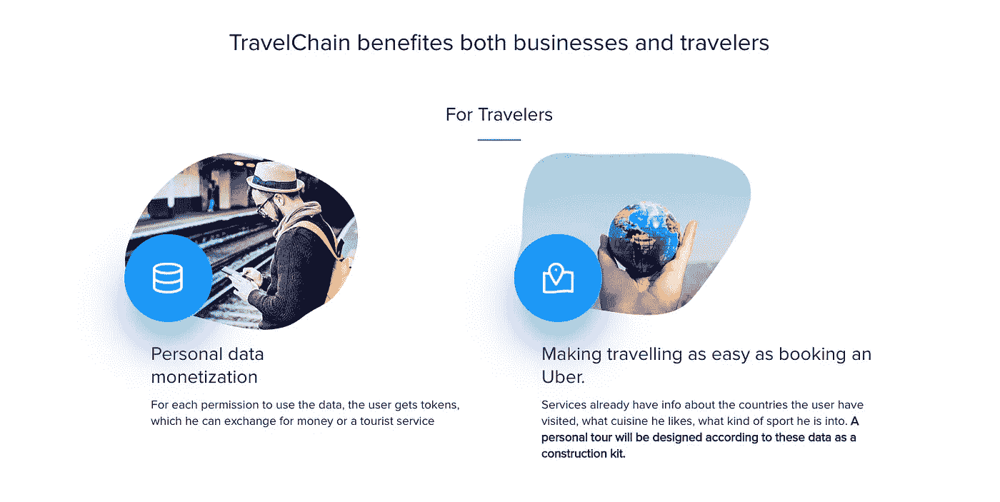
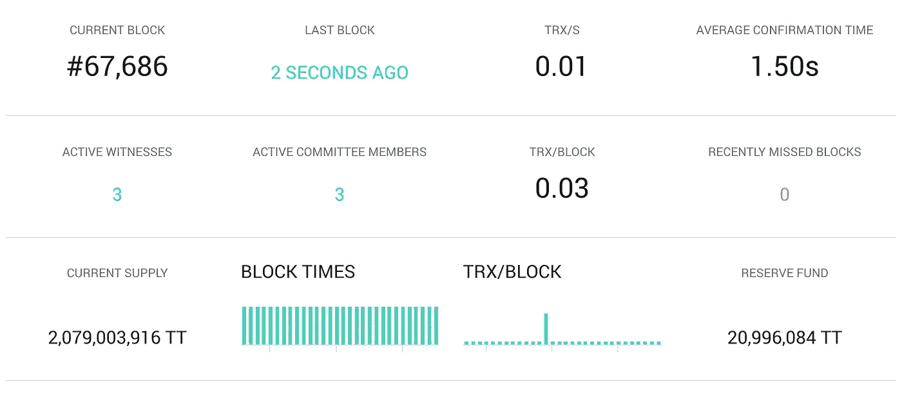
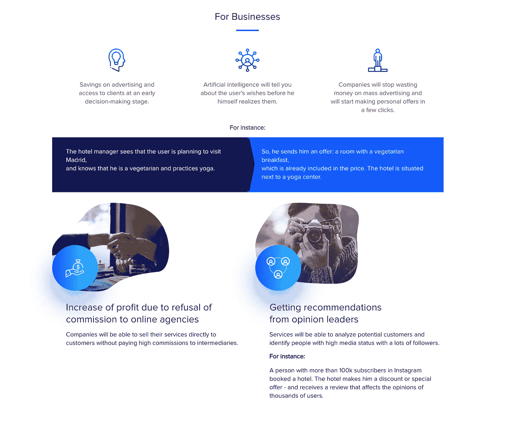
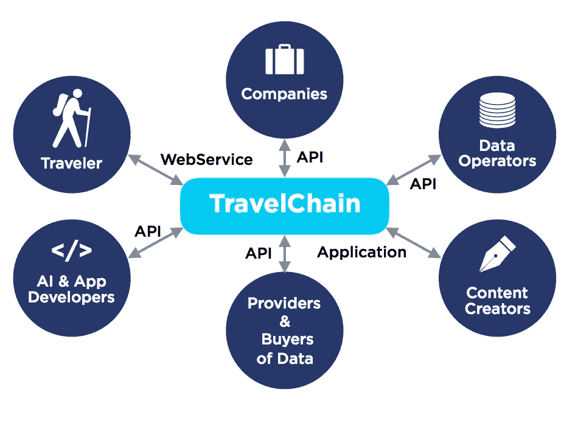
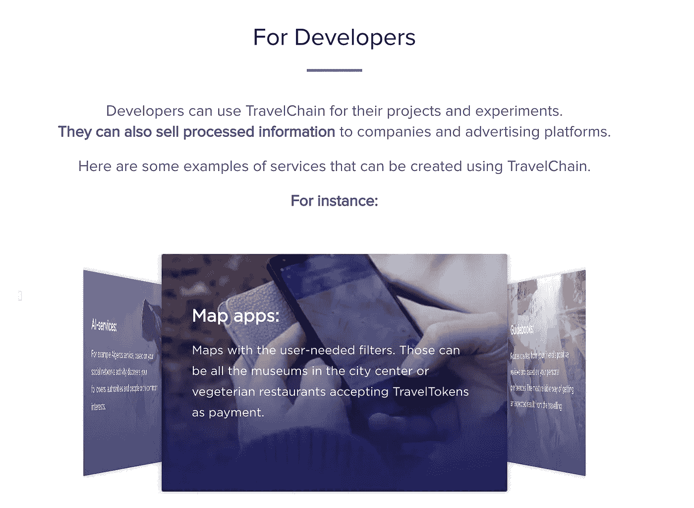
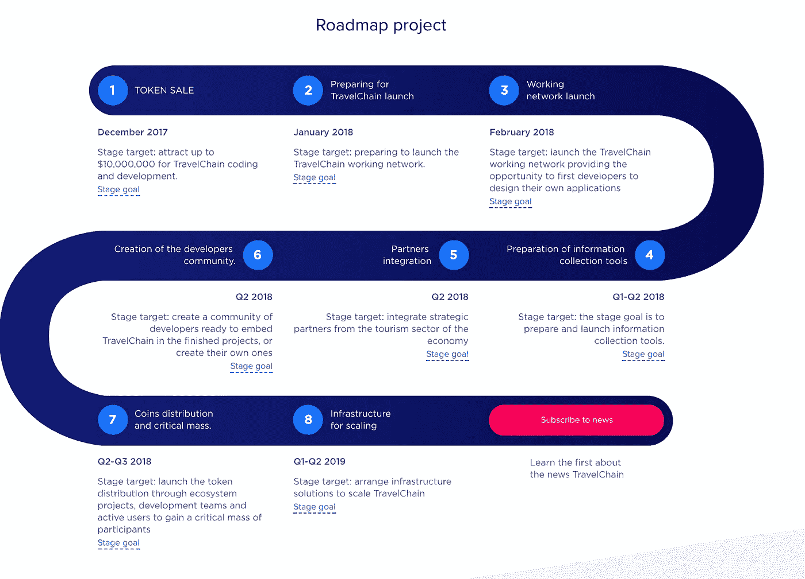
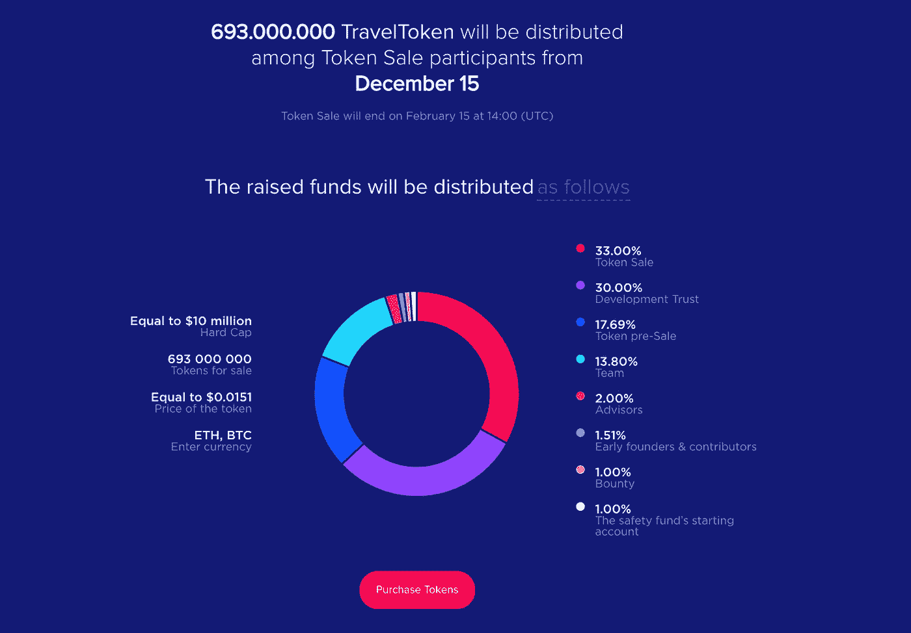

# TravelChain.io 简介

> 原文：<https://medium.com/hackernoon/introducing-travelchain-io-81c5236fe447>

## 什么是 [TravelChain.io](http://bit.ly/2kwn7T3) ？

TravelChain 是**位于区块链的分散平台**，它提供**可访问的真实智能数据，让企业更好地了解他们的客户**，并**帮助旅行者体验最佳的客户服务**。TravelChain 是智慧旅游生态系统的核心。

一份有据可查的[**白皮书**](https://travelchain.io/WhitePaper.pdf) 解释了一切是如何运作的。此外，还有一份面向技术人员的白皮书**。**

**这是 Youtube 上的一个快速演示。**

# **那又怎样？对我有什么好处？😏**

****

****对于旅行者:**嗯，简而言之，你可以**通过与公司**分享你的数据来获得 TravelTokens 的报酬——你愿意分享什么样的数据完全取决于你自己！**

****travel token**(*TT*)是 TravelChain 生态系统中使用的货币。**

****

**TravelChain 如何处理这些数据？TravelChain 有一个保存所有数据的分散数据库。**

**公司可以从分散的交易所购买数据。有了准确的数据，公司可以改善服务，让您的旅行体验大大改善。**

****

**旅游业绝对是一个竞争激烈的行业，只有几家大公司占主导地位。TravelChain 通过提供个性化定制服务，帮助小公司挑战大公司。**

**这里有一个图表来说明它是如何工作的。**

****

****开发者**有能力与 TravelChain 整合，出售处理过的数据(前提是用户允许！)**

****

# **Travelchain 路线图**

****

**TravelChain 目前处于第一阶段。如果你认为合适，可以随时挑战！**

## **但是等等，还没完呢！**

# **TravelChain 将于今天(12 月 15 日)发布 ICO！**

****

**最近发布的所有 ico，这有什么不同吗？Easy — TravelChain **有一个服务** ( *旅行者向交易所*出售数据)和**一个产品** ( *公司从交易所* ) **结合一个平台**([*travel chain . io*](http://travelchain.io))。**

**TravelChain 为桌面带来价值。**

****

**不要相信我的话！为了保持透明，TravelChain 发布了大量文档。**

**[***白皮书***](https://travelchain.io/WhitePaper.pdf)*——[***商业计划书***](https://travelchain.io/Business-plan.pdf)——[***概述***](https://travelchain.io/Overview.pdf)*——[***技术白皮书***](https://travelchain.io/technical_whitepaper.pdf)****

****感谢您的阅读，请看看 TravelChain，看看它是否值得您花费时间。****

****如果你觉得这有用，请给我一些掌声，让更多的人可以看到这一点！****