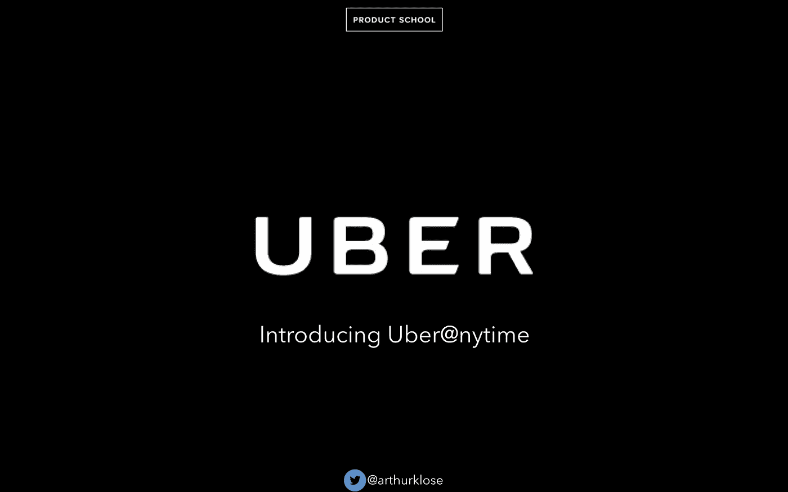
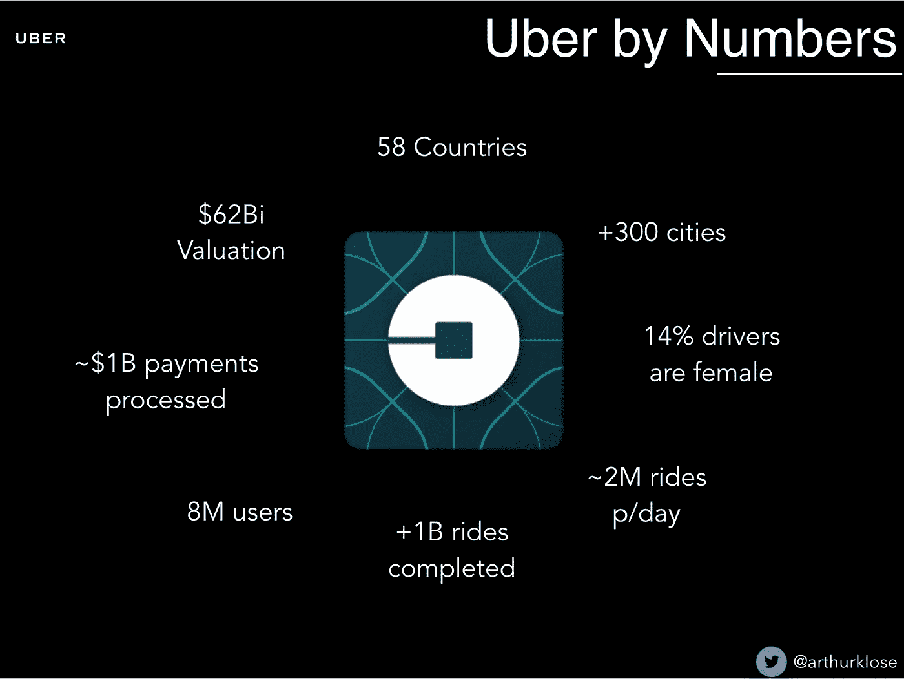
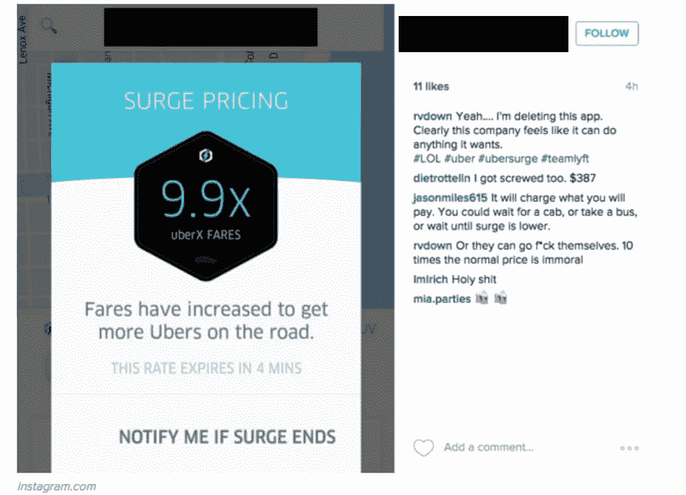
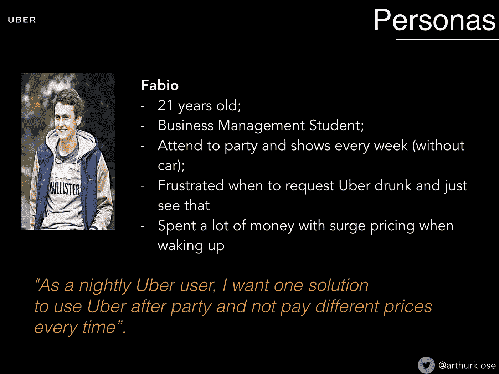
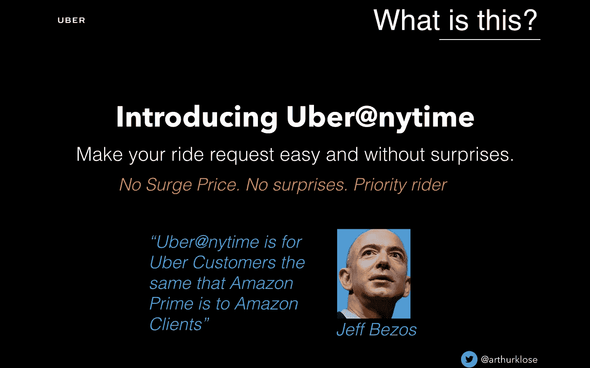
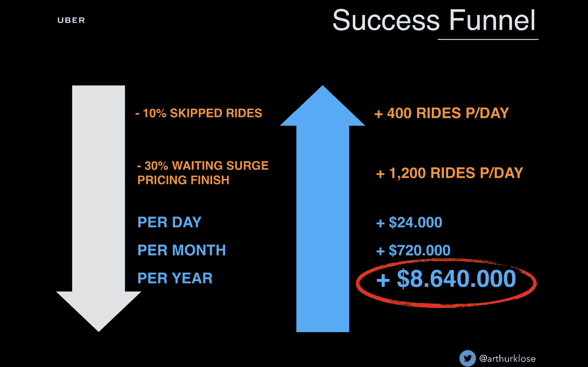
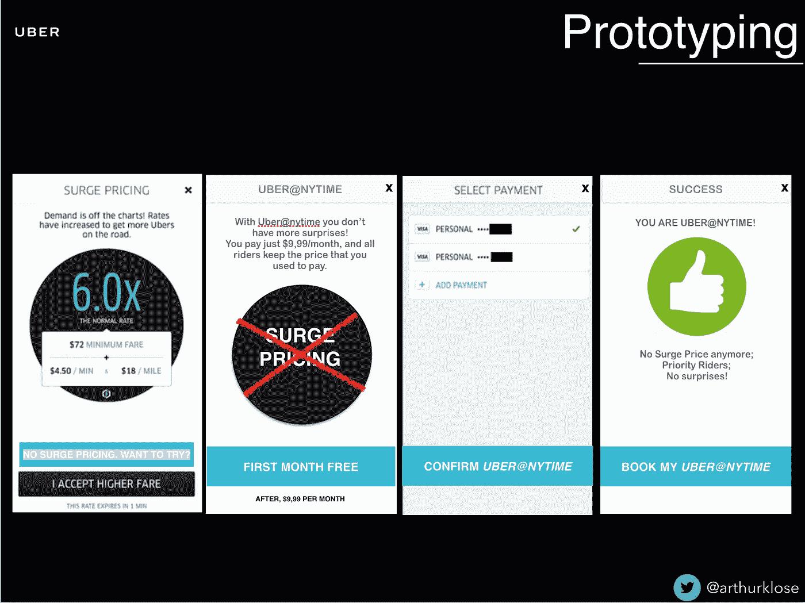
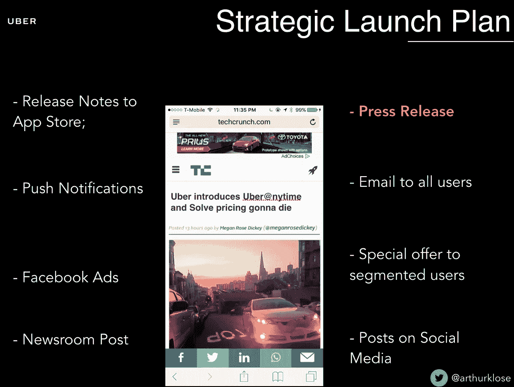
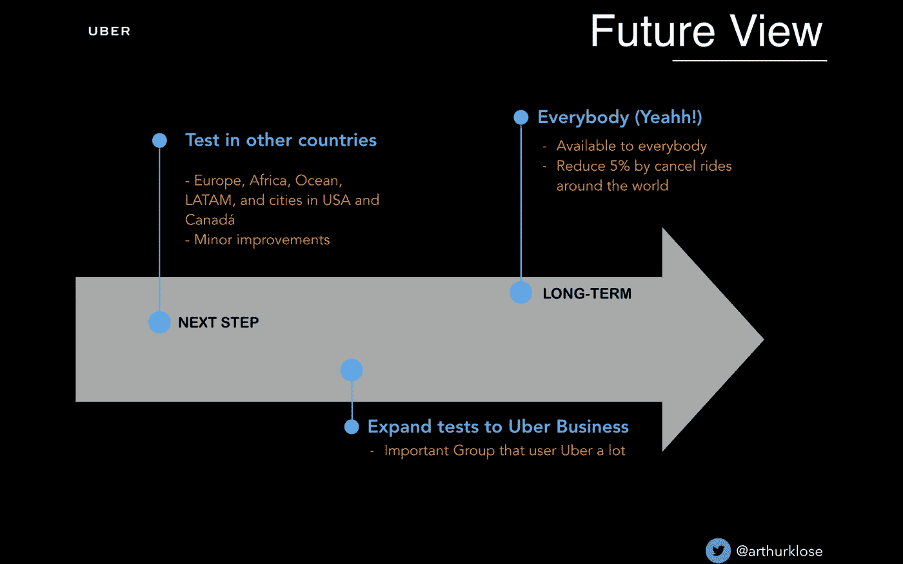

# 介绍优步@纽约时报

> 原文：<https://medium.com/hackernoon/introducing-uber-nytime-200c82af1676>

## 如何优化优步的请求，因为当动态价格出现时，大约 80%的人放弃或等待一段时间来请求一个驱动程序？

> 这里可以看葡萄牙语版[。](/product-hero/apresentando-o-uber-nytime-459e95fb681d)

在回到巴西在 [Youse](http://www.youse.com.br) ( *一家试图扰乱这里保险市场的保险技术公司*)工作之前，我在休假，除了其他事情之外，我还获得了:

*   为独角兽工作(嗨[美图](http://meitu.com)！);
*   志愿教老人使用科技(想你了， [@CTNbayArea](http://twitter.com/CTNbayArea) )
*   在斯坦福大学学习，遇到像索菲-夏洛特·莫阿迪这样的好人(那是我在那里的老师)；
*   并且成为第一个被产品学校批准的国际学生(这让我从卡洛斯·G·德·维伦布罗西娅那里学到了很多东西)

这是一个非常紧张的时期，给了我很多学习和愿望，其中之一是在巴西开始类似的事情([成为**产品移动课程**，在 **8** 版本](/gestao-produtos/product-mobile-course-223-sonhadores-e-centenas-de-produtos-melhores-a48db866810b)中已经有超过 **230** 参与者，看到巴西产品社区变得越来越强大。

所有这一切都是在我参与产品工作几年后才有可能实现的，我花了一点时间做课程的最后一个项目，为优步设计一个新功能。

# 这是什么？

嗯，过去几年我一直致力于开发解决问题、让生活变得更轻松、更酷的应用程序。我甚至赢得了苹果的 BestApps(2 倍)、Tela Viva Movel(3 倍)等奖项，并因此被列为巴西最优秀的移动专业人士之一。但是我也没有时间去拿驾照。

但在共享经济时代，有了优步、99、Cabify、Easy 这样的应用，没有 CNH(我们这里称之为驾照)也可以活得很好(而且非常好)。

> PS:还有 VAH！(这是我在[*【EBAC】*](http://www.ebac.art.br)*的学生莱安德罗的一个耸人听闻的想法)这就像是旅行的谷歌，它可以搜索分类应用程序中的价格，而无需你逐个打开，甚至还提供折扣。*

然而，这种供求关系创造了像动态价格这样的东西，它根据时间和需求使价格变得更贵。如果你在里约热内卢或者在圣保罗下着雨的星期五下午 5 点尝试过使用优步，你会记得这个名字。

然后画了一个想法:订阅，这样在@ny 时间没有价格变化。

# 了解业务

为了构建这个想法，我首先更好地了解了优步和他的客户(包括我)。从公司开始，我看了一些数据:

*   在 58 个国家提供；*(目前:75 个国家)*
*   300 个城市有售；*(目前:450 个城市)*
*   超过 10 亿次乘坐体验；*(目前:20 多亿)*
    *PS:数字来自 2016 年 4 月。*

我对我的网络进行了研究，发现:

*   大约 85%的受访者已经受到动态价格至少 1 倍的影响；
*   82%没有在动态价格出现的同时完成比赛请求；
*   20%的人每周乘坐 3 次以上。

*Ps:刚想起来 2016 年 4 月的调查回答。*

更别说因为这个有那么多负面评价…

我也想到了一些人:Aquis(灵感来自我的小朋友 [Aíquis Rodrigues](https://medium.com/u/9c9e9aa550cb?source=post_page-----200c82af1676--------------------------------) )，一个年轻的主管，没有钱包，没有车，经常使用优步，每天回家参加会议。当出于某种原因(如下雨的星期三和节前的星期四)他支付的金额与他习惯支付的金额大不相同时，他感到非常失望。还有 Fábio(受好故事的启发，住在我童年好友兼室友的隔壁， [Fábio Nogueira](https://medium.com/u/7fa820a340?source=post_page-----200c82af1676--------------------------------) )。

收集一些数据，做一些计算，并与我进行的研究相关联，仅在巴西，优步每天就进行了大约 20，000 场比赛。考虑到 20%的取消通常是因为价格更高，优步损失了大约**3500 场比赛/天**，大约**150 万美元/月**。

但正如优步的使命是:

> 为世界各地的所有人提供可靠的交通工具

我一直在想:**如何优化请求，因为当动态价格出现时，大约 80%的人会放弃或稍作等待来请求司机？**

答案是:**优步@nytime！**

# 它是如何工作的？

Bezos Approves!

优步@纽约时报是一个 9.99 美元的订阅模式(第一个月免费)，防止出现*动态价格*。
客户继续正常支付行程费用，但除了请求乘车时的优先权之外，还有没有惊喜的优势(如*动态价格*)。

# 度量标准。如何衡量？

在我多年的旅途中，我明白了仅仅把一个特征放在空中而没有任何东西可以分析是没有用的。甚至在开发之前就开始了。你的假设是什么？质疑本身！
在这种情况下，我在**激活**和**保持**之间分类，主要验证项目:

**激活:**

*   出现动态价格时，使用优步@纽约时报的用户比例是多少？
*   有多少用户尝试了这项服务？
*   服务推出后，*(即使有动态价格)*要求乘坐的百分比是多少？

**保留:**

*   第一个免费月过后，有多少用户保持订阅？
*   优步@纽约时报的用户增加了平均比赛次数吗？

在另一个计算中，仅在巴西，假设比赛的平均价格是 **$15.00** ，优步会有更多的钱**$ 864 万**。

根据比较， **40%** 更多的出行等于每月 46，000 次多一点。

这里我们有一些数据:

*   如果**使用的客户中有 50%** 在试用期后保持订阅，则更多**23 万美元/月、**和几乎**300 万美元/年。**
*   如果优步@纽约时报订阅用户的每日比赛次数增加 **12%** ，则为**216，000.00 美元/月**，超过**2，500，000.00 美元/年。**

以及其他一些可以分析的指标:

*   每个用户的每日行程增长；
*   *的下降跳过*的请求。

# 如何向用户展示这一点？

讨论一些有争议的想法，帮助设定场景，甚至看到流程中的缺陷。因此，由于大多数用户在动态价格出现时会放弃打电话，所以使用行动号召来引起注意，它不会取消，引起一点好奇心，并激活触发器，以有用的信息/促销作为奖励，并促进用节省的信用卡支付。

# 听起来不错。那发射呢？

使用 360 度披露策略可以让特性更加清晰可见，并帮助你获得用户来测试它们。当我们在应用程序领域谈论它时，我们有一些可以加强披露的东西，例如:

*   发行说明；
*   推送通知，
*   应用内，
*   基于用户行为的特别优惠。

当然，与公关、广告、社交媒体相结合，杠杆效应会大得多。
*PS:大家排好队是必不可少的。也就是说，在开始大揭露的行动之前，注意这种一致性是很重要的，不要忘记像支持团队的训练这样的事情。*

# 下一步？

在其他国家测试模型，与优步企业一起测试…

# 结论

在那一年，[优步](https://hackernoon.com/tagged/uber)对 app 进行了[的重新设计，甚至隐藏了动态价格](/uber-design/designing-the-new-uber-app-16afcc1d3c2e)[的显示，这招致了很多批评](http://www.bbc.com/news/technology-36619414)。

然而，我认为这项工作的验证是看到该类别中的一些应用程序创建订阅程序(每个都有其特殊性)，如:

*   优步本人[，他开始在纽约和三藩市测试订阅模式](https://www.forbes.com/forbes/welcome/?toURL=https://www.forbes.com/sites/briansolomon/2016/09/27/unlimited-uber-rides-new-york-100-dollars-subscription-october/&refURL=https://medium.com/product-hero/apresentando-o-uber-nytime-459e95fb681d&referrer=https://medium.com/product-hero/apresentando-o-uber-nytime-459e95fb681d)；
*   Easy，[推出了 Easy Club，从更实惠的每月赛车计划到与应用程序合作伙伴的独特优势](http://exame.abril.com.br/seu-dinheiro/easy-cria-planos-mensais-de-corridas-com-3-primeiros-meses-gratis/)。

但是，如果制作一部虚构的故事片已经很酷了，我甚至不会告诉你，在日常生活中这样做，并且看到所有这些事情真实地发生，是多么酷！产品管理世界是一个非常棒的地方\o/

## 你喜欢吗？分享和鼓掌，宝贝！:)