# 在屏幕上绘画——创造性编码介绍之二

> 原文：<https://medium.com/hackernoon/introduction-to-creative-coding-part-2-d869832d9ffb>

## 用 Javascript 绘制和创建动画

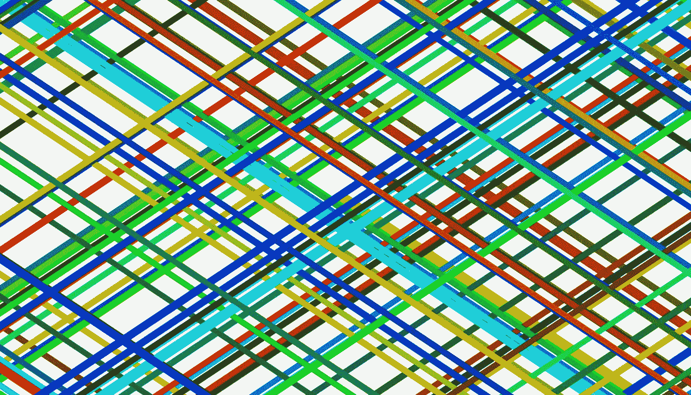

这是《创造性编码基础》的第二部分——我一年来每天学习编码的指南。

在这里下载你需要跟随龙的文件:【https://github.com/GeorgeGally/creative_coding】

所以[上一篇](/@radarboy3000/creative-coding-basics-4d623af1c647#.ptbiutpfh)有点无聊。只是在创作一幅油画。所以让我们做些酷的东西...

一旦我们创建了一个画布，我们想开始在它上面画画。我们这样做，就像在处理中一样，使用绘制循环:

```
var ctx = createCanvas(“canvas1”);function draw(){
  *// do some stuff*
}
```

像处理，绘图功能，所有的行动发生。这实际上只是一个花哨的 requestAnimationFrame 调用，它一直在循环，并在窗口中寻找绘制函数。老实说，你真的甚至不需要知道这里发生了什么，除了这以 60fps 重复(并且可以通过设置全局变量 *frameRate* 来调整，例如:*frame rate = 120；*)。

*如前所述，我在编码中使用的许多东西都是基于* [*处理*](https://processing.org/) *的做事方式，通常只是稍微修改一下，以适合我喜欢的工作方式。最棒的是，随着你的进步和库的建立，语法越来越容易记住，你可以更快地找到代码中更有趣的地方。*

好了，让我们开始玩吧。这里有一个基本的 html 文件，我们可以继续使用它作为模板:

```
<!DOCTYPE html>
<html>
<head><meta charset="utf-8">
<title>mouseTest</title><link rel="stylesheet" href="css/[reset.css](https://raw.githubusercontent.com/GeorgeGally/creative_coding/master/css/reset.css)" type="text/css" media="screen" />
<link rel="stylesheet" href="css/[style.css](https://raw.githubusercontent.com/GeorgeGally/creative_coding/master/css/style.css)" type="text/css" media="screen" /><script language="javascript" src="js/[canvas.js](https://raw.githubusercontent.com/GeorgeGally/creative_coding/master/js/canvas.js)"></script>
<script language="javascript" src="js/[creative_coding.js](https://raw.githubusercontent.com/GeorgeGally/creative_coding/master/js/creative_coding.js)"></script></head><body><script type="text/javascript">var ctx = createCanvas(“canvas1”);function draw(){
  console.log("mouseX:" + mouseX + "mouseY: " + mouseY);
}</script>
</body>
</html>
```

这里没有什么特别的，一个标准的 HTML5 文档设置。就像我到目前为止向您展示的所有内容一样，您再也不需要编写这些代码了。但是让我快速解释一下(然后进入有趣的部分)…

让我们在您的浏览器中查看我们的开发人员工具控制台。从 Chrome go 的下拉菜单中:查看->开发者->Javascript 控制台(或者 mac 上的 Cmd-三角乐队或者 PC 上的 Control-Alt-I)，弹出我们的 Javascript 控制台，大概是这样的:

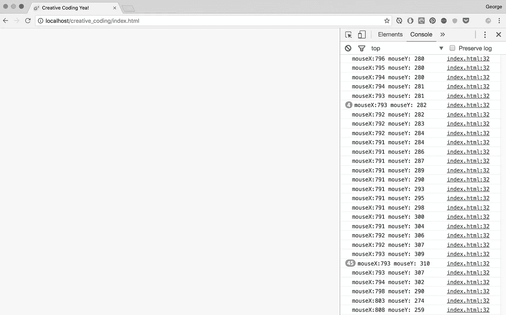

Press Cmd-Alt-i for developer tools, and you should seeing the log of your mouse position.

控制台是你创造性编码中最好的朋友，它会给你错误所在的行号提供线索。

所以在上面的代码中，draw 函数不断地执行，我们可以看到我们的鼠标位置。

鼠标位置由一些更全局的变量定义: *mouseX* 和 *mouseY* ，它们来自一个事件监听器。但是现在，甚至不需要担心那个。

现在让我们开始画画吧！把我们的绘图函数改成这样…

```
function draw(){ *// syntax: fillStyle can be colour, 
  // or hash: ctx.fillStyle = "#cc0000"; 
  // or an rgb value: ctx.fillStyle = rgb(red, green, blue);
  // red, green and blue values are between 0 and 255* ctx.fillStyle = "red"; *// syntax: ctx.fillEllipse(x, y, circle_width, circle_height)*
  ctx.fillEllipse(mouseX, mouseY, 20, 20);}
```

你应该能画出这样的东西:

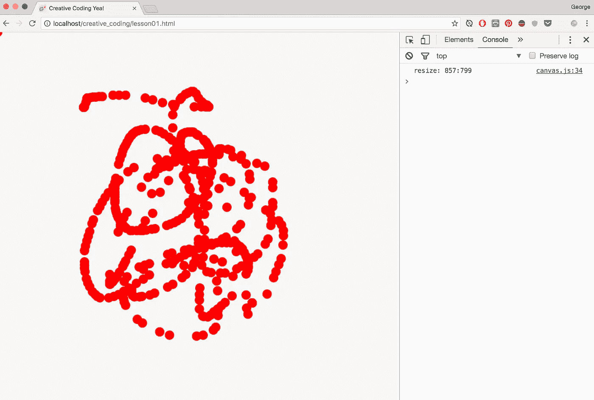

Look mom, it’s art .Drawing with mouse position.

太棒了。

CTX . filllellipse 在屏幕上的某个位置画一个特定大小的圆——在本例中是在位置 *mouseX* 和 *mouseY* 处，大小为 20。(请记住第 1 部分— ctx 只是一个引用我们画布的变量)。

*ctx.fillStyle* 添加一种颜色。你可以使用任何标准的 html 格式，比如 *#ff0000* 或者 *"red"* 。或者特殊功能: *rgb(红、绿、蓝)*；

RGB 值从 0 到 255。我们还可以使用 rgba 为颜色设置一个从 0 到 1 的 alpha(或透明)值:

```
*// syntax: ctx.fillStyle = rgba(red, green, blue, alpha);
// alpha is a value between 0 and 1* ctx.fillStyle = rgba(255, 0, 0, 0.1);
```

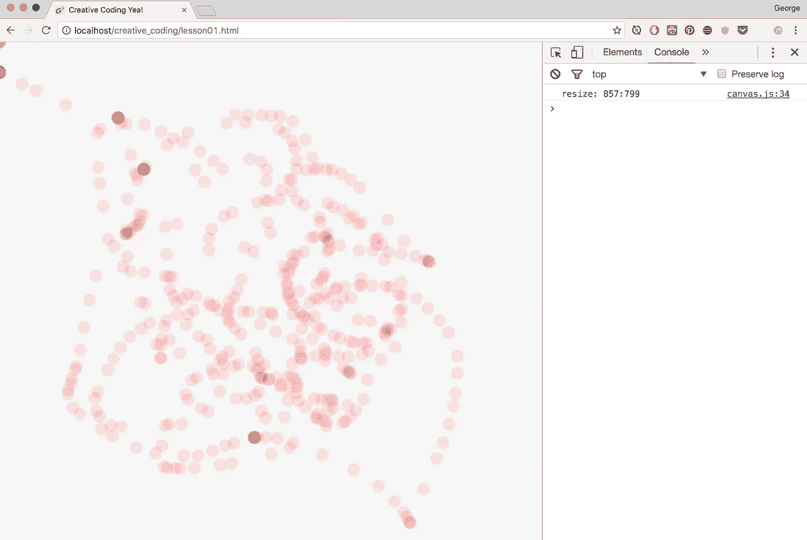

Using rgba(255,0,0, 0.1) we’d get something like this. But is it art?

让我们画一个实心的正方形来代替:

```
ctx.fillStyle = “#00aeef”;
*// syntax: ctx.fillRect(x, y, rect_width, rect_height)*
ctx.fillRect(mouseX, mouseY, 20, 20);
```

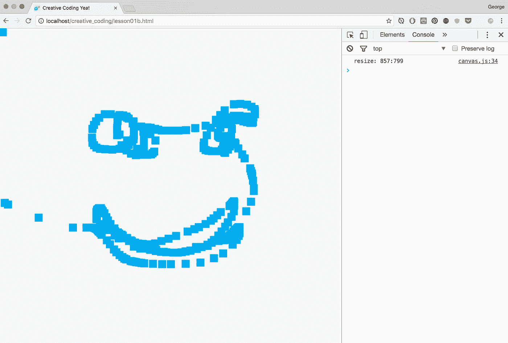

Drawing squares, I’m using fill of ctx.fillStyle = “#00aeef”;

如果我们只想在按下鼠标的时候画画呢？我也为你做了艰苦的工作...我们有一个名为 *mousePressed* …的全局变量，现在您需要知道的只是用一个 *if 语句*测试条件，如下所示:

```
if(something) {
 *// do something*
}
```

所以我们的 draw 函数应该修改成这样:

```
function draw(){**if (mousePressed) {**
  ctx.fillStyle = "#00aeef";
  ctx.fillRect(mouseX, mouseY, 20, 20);
  **}**
}
```

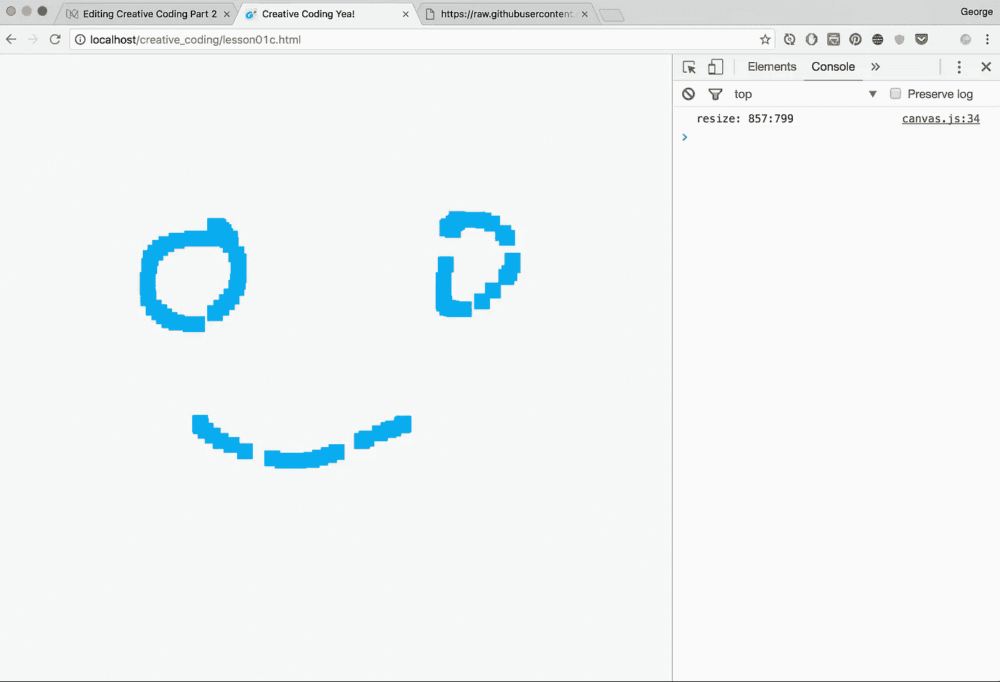

Woop woop. We can draw.

我们也可以用下面的语法绘制只有轮廓的圆和正方形:

```
*// setup stroke colour*
ctx.strokeStyle = rgb(255, 0, 0);
*// draw stroked rectangle*
ctx.strokeRect(mouseX, mouseY, 20, 20);
*// draw stroked circle*
ctx.strokeEllipse(mouseX, mouseY, 20, 20);
```

我们会得到这样的结果:

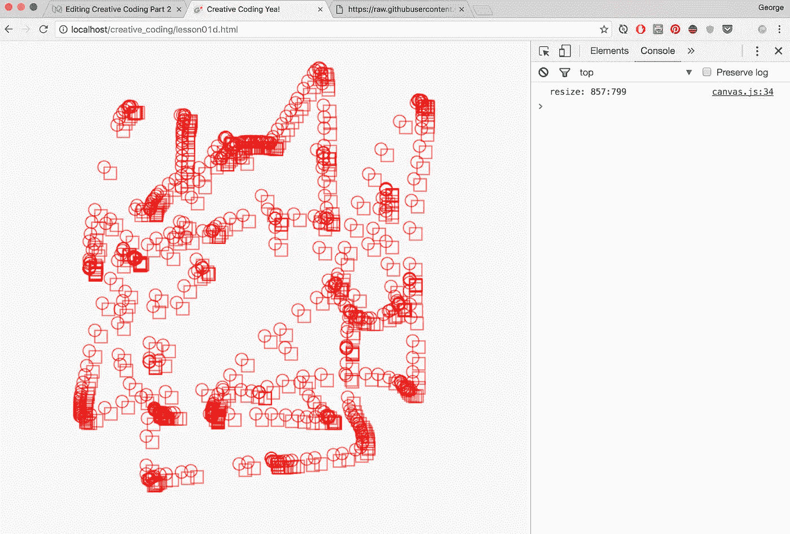

Stroked circles and rectangles

所以你可能会注意到一些恼人的事情——圆形和矩形从它们的中心点延伸出来的方式不同。解决这个问题的两个简单方法…

减去矩形宽度和高度的一半:

```
*// setup stroke colour*
ctx.strokeStyle = rgb(255, 255, 0);
*// draw stroked rectangle starting from half it's width and height*
**ctx.strokeRect(mouseX-10, mouseY-10, 20, 20);**
```

…或者通过使用我创建的函数: *centreFillRect()* 或*centerstrokerect()*(记得我提到过我的规则，如果我需要做一件事三次，我就需要创建一个函数，嗯，就是这种情况……)

```
*// setup stroke colour*
ctx.strokeStyle = rgb(255, 255, 0);
/*/ draw stroked rectangle starting from half it's width and height*
**ctx.centreStrokeRect(mouseX, mouseY, 20, 20);**
```

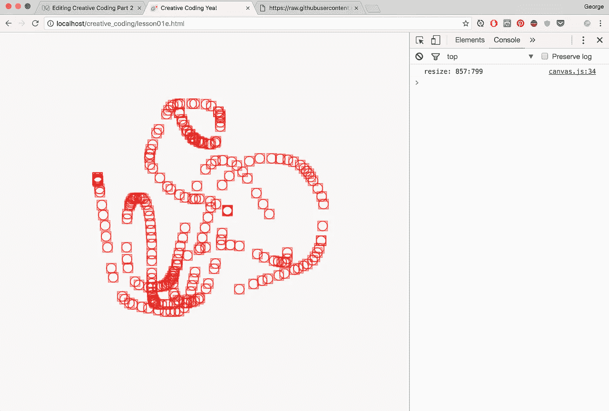

Ok, that’s better. Circles inside squares

我们也可以用 for 来调整线条的宽度，例如*CTX . line width = 4；*

好的，所以这些画都很好。但是，让我们变得更有想象力，让机器来做这项工作…

所以让我们做一个球。首先我们需要添加一些变量来保存球的位置。让我们把球放在页面的中间(记住，我们的 canvas.js 让我们可以访问页面的宽度和高度——或者是宽度*和高度*或者是高度或者是宽度*和高度*因此:

```
var ball_x = w/2;
var ball_y = h/2;
```

让我们给球一个随机的速度。我们这样调用一个 *random()* 函数:

```
*// syntax: random(min_value, max_value)* 
var speed_x = random(-5, 5); 
var speed_y = random(-5, 5);
```

我们也可以用 *randomInt()* 来求一个随机整数(整数)，如下所示:

```
// syntax: randomInt(min_value, max_value)
var speed_x = randomInt(-5, 5);
```

要移动我们的球，我们需要将它的当前位置(球 x 和球 y)与它的速度(速度 x 和速度 y)相加，就像这样:

```
ball_x = ball_x + speed_x;
ball_y = ball_y + speed_y;
```

这有一个捷径，当你添加一些东西到它本身的时候: *+=*

```
ball_x += speed_x;
ball_y += speed_y;
```

*同样，从自身减去某个东西(-=)以及乘以(*=)再除以自身(/=)也有一个捷径。*

好了，让我们把它们放在一起:

```
var ctx = createCanvas("canvas1");var ball_size = 20;
var ball_x = width/2;
var ball_x = height/2;
var speed_x = randomInt(-5, 5);
var speed_y = randomInt(-5, 5);function draw(){ ball_x += speed_x;
  ball_y += speed_y; ctx.fillStyle = rgb(255,0,0);
  ctx.fillEllipse(x, y, ball_size, ball_size);} 
```

太棒了…但不是…

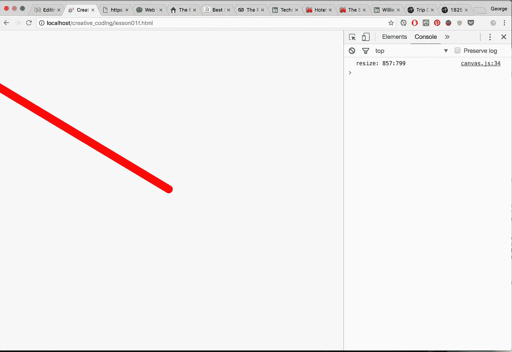

Where’d the ball go?

是的，球离开边缘消失了。

让我们用一个 *if 语句*来解决这个问题。

如果你用简单的英语大声说出代码，通常会很容易:“如果球越过了页面的侧面或底部，让我们再次将球放在页面的顶部或左侧……如果球不到页面的顶部或左侧(即是 ball_x < 0 还是 ball_y < 0)让我们把它放回右边还是底部……"

在代码中，我们会这样做:

```
if (ball_x < 0) {
 ball_x = w;
}if (ball_y < 0) {
 ball_y = h;
}if (ball_x > w) {
 ball_x = 0;
}if (ball_y > h) {
 ball_y = 0;
}
```

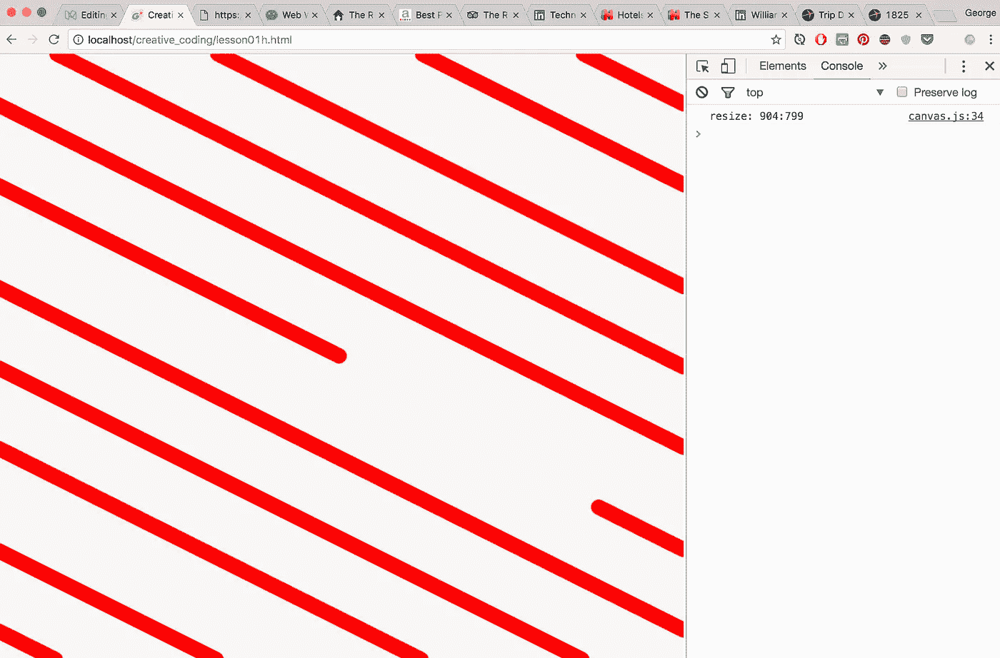

Look ma, robot stripes!

太棒了。

现在，让球在边缘反弹……我们这样做，只是让球从另一边运动，我们只是逆转它的速度……我们这样做只是把速度乘以-1(因为，你知道，数学)。

```
*// multiply speed by negative number to change direction*
speed_x = speed_x * -1;
```

我们也可以使用简写*=

```
if (ball_x < 0) {
  *// same as speed_x = speed_x *-1*
  speed_x *= -1;
 }if (ball_x > w) {
  *// same as speed_x = speed_x *-1*
  speed_x *= -1;
 }*// then do same for ball_y...*
```

但是即使这样也有点重复…所以让我们通过使用*或*来简化，在代码中是这样写的:||

所以我们可以写:

```
*// ball wall hittest*if (ball_x < 0 || ball_x > w) {
  speed_x *= -1;
}if (ball_y < 0 || ball_y > h) {
  speed_y *= -1;
}
```

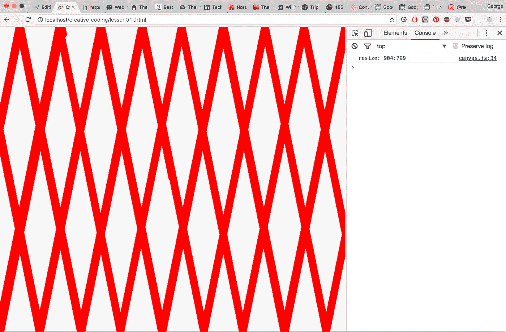

Boom! Robo art!

但是我们不想要条纹，我们想要一个球。在 Javascript 中，你必须在每次循环时手动清空屏幕，否则事情只会一个接一个地发生。这是通过在每个循环开始时使用 *clearRect()* 函数来完成的…

```
/*/ clears the whole screen*
ctx.clearReact(0,0,w,h); 
```

但是因为我们几乎总是清空整个屏幕，所以我简化了一个函数:

```
*// clear with a rgb*
ctx.background(255,255,255);
```

你也可以只传递一个值，这会给你一个灰度值:

```
*// same as going ctx.background(255,255,255);*
ctx.background(255);
```

现在我们有一个弹跳球…

我们还可以在背景中添加一个 alpha 值，以产生一种酷酷的轨迹效果:

```
*// same as ctx.background(255,255,255, 0.1);*
ctx.background(255, 0.1);
```

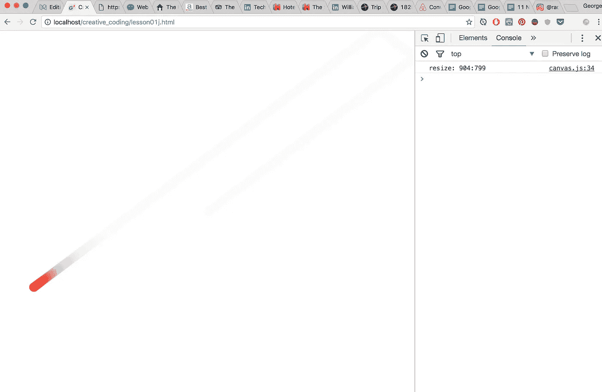

Note that an alpha of 0.1 will always leave too much of a trail. There’s a technical reason for this, that makes kinda sense, but easiest just set alpha higher, like 0.2

我们需要解决一个小问题…因为球的 x 和 y 点是从中心测量的，你会注意到球在反弹之前实际上有点偏离边缘…所以我们需要调整每一边球的一半大小。

以下是完整的代码:

```
var ctx = createCanvas("canvas1");
var ball_size = 20;
var ball_x = width/2;
var ball_y = height/2;
var speed_x = randomInt(-5, 5);
var speed_y = randomInt(-5, 5);function draw(){ ctx.background(255, 0.2); ball_x = ball_x + speed_x;
  ball_y = ball_y + speed_y; **if (ball_x < ball_size/2 || ball_x > w - ball_size/2) {**
   speed_x *= -1;
  }
  **if (ball_y < ball_size/2 || ball_y > h - ball_size/2) {**
   speed_y *= -1;
  } ctx.fillStyle = rgb(255,0,0);
  ctx.fillEllipse(ball_x, ball_y, ball_size, ball_size);}
```

嘣，我们有了我们的球…

但是同样，这段代码对我来说有点重复…所以，是的，我做了一个函数…叫做 *bounce()*

```
*// syntax: bounce(pos, min, max, size)*
if (bounce(ball_x, 0, w, ball_size) {
  speed_x *=-1;
}
```

我实际上用了一个更简洁的版本…当我们谈到向量的时候我会讲到它)…

下面是最终的代码:

```
var ctx = createCanvas("canvas1");var ball_size = 20;
var ball_x = width/2;
var ball_y = height/2;
var speed_x = randomInt(-5, 5);
var speed_y = randomInt(-5, 5);function draw(){ ctx.background(255, 0.2); ball_x = ball_x + speed_x;
  ball_y = ball_y + speed_y; **if (bounce(ball_x, 0, w, ball_size)) {**
    speed_x *=-1;
  } **if (bounce(ball_y, 0 ,h, ball_size)) {**
    speed_y *=-1;
  } ctx.fillStyle = rgb(255,0,0);
  ctx.fillEllipse(ball_x, ball_y, ball_size, ball_size);}
```

现在我们得到了一个合适的弹跳球…

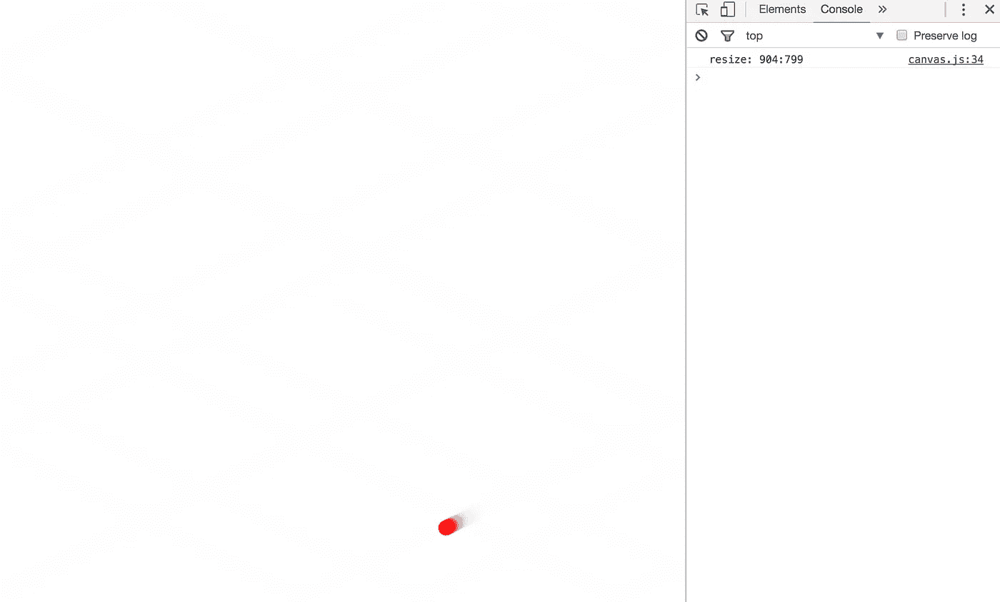

A simple bouncing ball, the humble start to a particle system…

这就是第二部分的内容。希望你喜欢。当球碰到墙时，试着改变球的大小和颜色，就像上面的图片一样，看看你是否能解决它出现的几个问题…

下面是[第三部分……](/@radarboy3000/how-to-make-particles-1cbeee937593#.jxk5vd1a3)

*(可以在这里关注我和我的#code365 进度:*[*https://www.instagram.com/radarboy3000/*](https://www.instagram.com/radarboy3000/)*)*

这些教程的所有代码和库都可以在这里找到:[https://github.com/GeorgeGally/creative_coding](https://github.com/GeorgeGally/creative_coding)(一定要为每个新教程做一个 git pull，因为我一直在更新这些)。

*边注:我的库很大一部分是抄袭/改编自*[*Seb Lee Delisle*](http://seb.ly/)*。*

*如果我走得太慢，也请让我知道速度如何……*

[](http://bit.ly/HackernoonFB)[](https://goo.gl/k7XYbx)[](https://goo.gl/4ofytp)

> [黑客中午](http://bit.ly/Hackernoon)是黑客如何开始他们的下午。我们是阿妹家庭的一员。我们现在[接受投稿](http://bit.ly/hackernoonsubmission)并乐意[讨论广告&赞助](mailto:partners@amipublications.com)机会。
> 
> 如果你喜欢这个故事，我们推荐你阅读我们的[最新科技故事](http://bit.ly/hackernoonlatestt)和[趋势科技故事](https://hackernoon.com/trending)。直到下一次，不要把世界的现实想当然！

