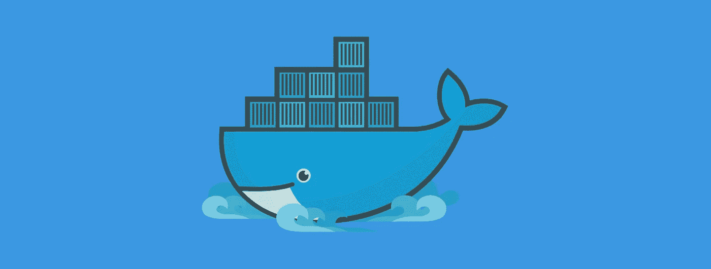
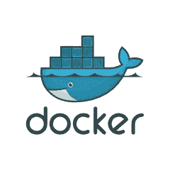

# Docker 简介

> 原文：<https://medium.com/hackernoon/introduction-to-docker-a7d9e1f6c0b3>

本指南将解释如何在日常工作中使用 Docker，并继续进行持续的[开发](https://hackernoon.com/tagged/development)。

# 本指南的目标

本指南将:

*   给你讲解一下 [Docker](https://hackernoon.com/tagged/docker) 的基础知识。
*   向您展示如何在整个开发过程中使用 Docker。
*   用 BuddyWorks 和 Docker 演示部署过程的自动化。

本指南的内容需要基本的 Git 知识— [你可以在这里](https://buddy.works/guides/first-steps-with-git?utm_source=medium&utm_medium=post&utm_campaign=docker&utm_content=link)学习 Git。

# 你为什么要关心 Docker？

作为一名开发人员，您可能知道在您的机器上运行一个应用程序(例如，一个网站)之前，您需要首先配置它的环境。这样做所需的任务列表可能很长，包括:

*   正在安装数据库版本 xx.xxx
*   正在安装文件服务器版本 yy.yyy
*   安装软件包 a 版本 xy.zzz
*   诸如此类…

## 环境管理既麻烦又昂贵

环境中的每个变化，如数据库版本变化、添加新包或任何其他依赖项，都意味着:

*   每个开发人员都必须在他的机器中引入这种特殊的变化
*   在发布时，所有的更改都必须引入到生产服务器中

没有合适的工具，很难跟踪依赖关系。然而，不管有没有它们，与配置相关的问题往往会出乎意料地出现，并且很难调试和修复。这就是为什么多年来我们测试了各种方法来排除它们。

# 喜欢你读的吗？[点击这里查看全文](https://buddy.works/guides/docker?utm_source=medium&utm_medium=post&utm_campaign=docker&utm_content=link)。

> [黑客中午](http://bit.ly/Hackernoon)是黑客如何开始他们的下午。我们是 [@AMI](http://bit.ly/atAMIatAMI) 家庭的一员。我们现在[接受投稿](http://bit.ly/hackernoonsubmission)并乐意[讨论广告&赞助](mailto:partners@amipublications.com)机会。
> 
> 如果你喜欢这个故事，我们推荐你阅读我们的[最新科技故事](http://bit.ly/hackernoonlatestt)和[趋势科技故事](https://hackernoon.com/trending)。直到下一次，不要把世界的现实想当然！

