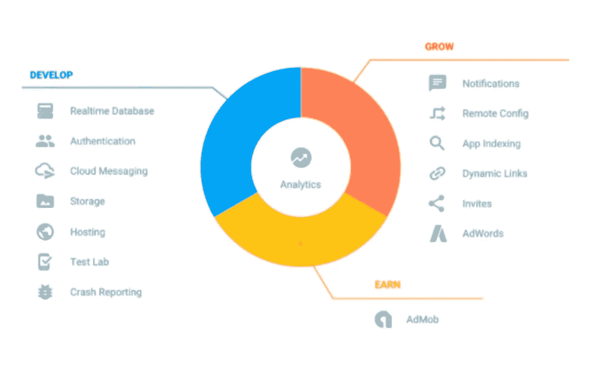
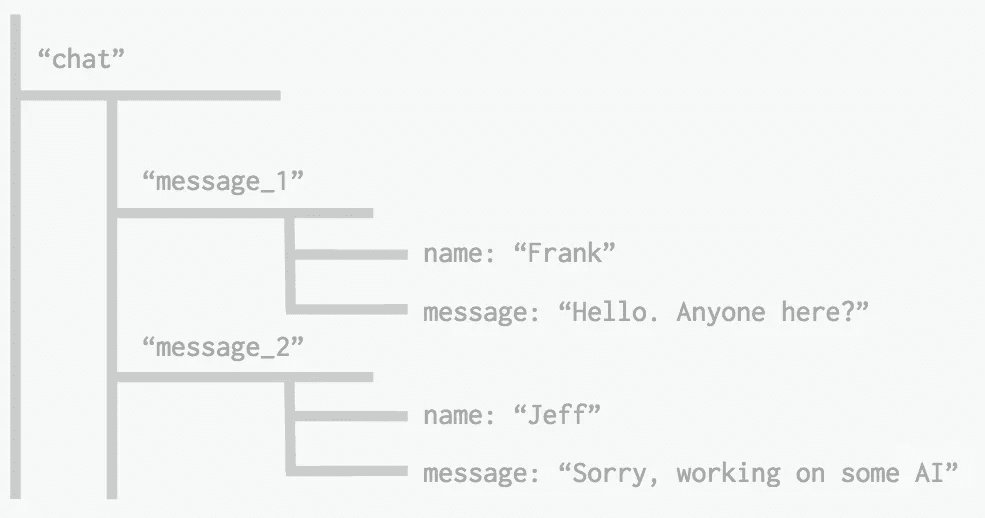
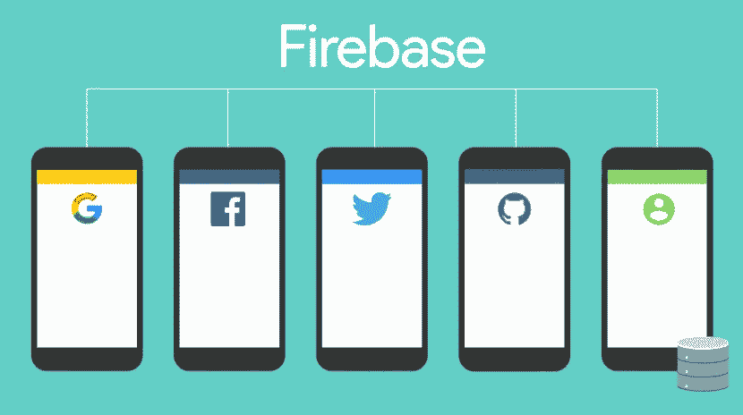
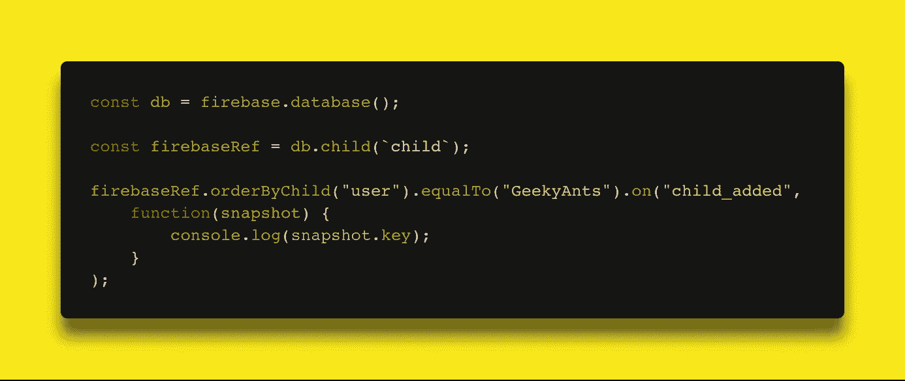
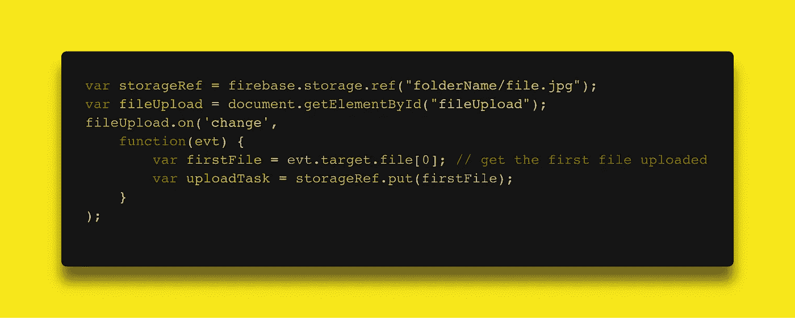
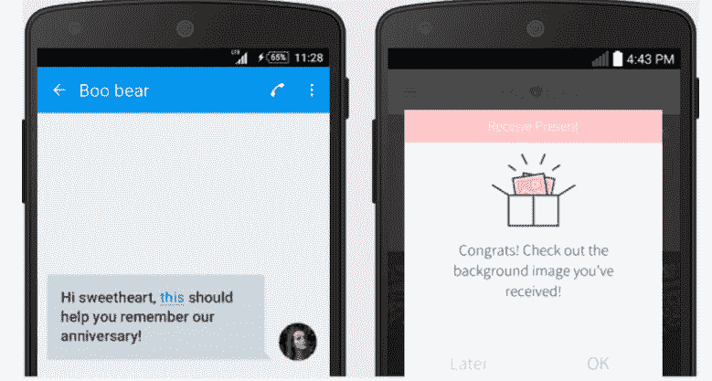
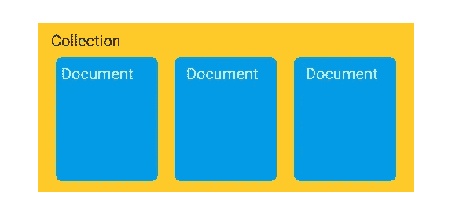
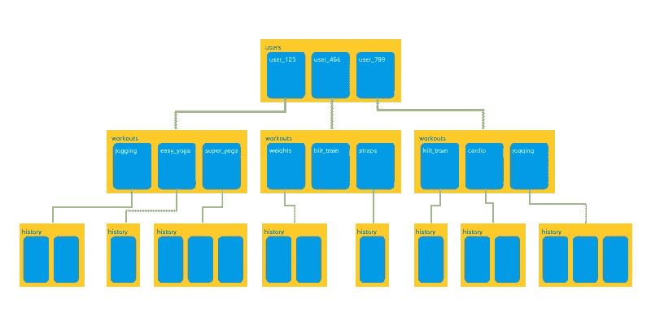
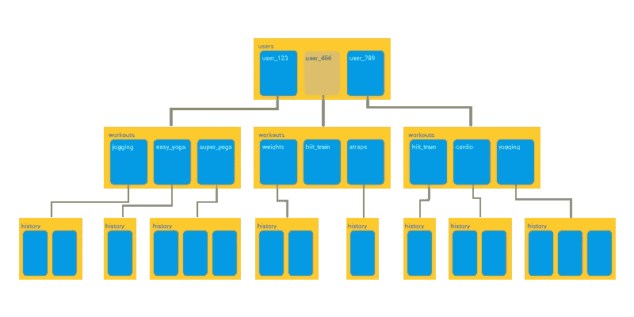
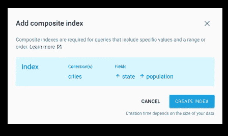

# Firebase 简介🔥

> 原文：<https://medium.com/hackernoon/introduction-to-firebase-218a23186cd7>

## 一个关于 Firebase 的简短帖子，它是新的 NoSQL 数据库——云 Firestore

如今市场上有各种各样的服务器端技术，开发人员很难决定哪种后端最适合他们的应用程序。

在本帖中，我们将探索其中一个名为 Firebase 的选择🔥以及它提供的所有工具和服务。

# [燃烧基地](http://firebase.google.com/official/site‎)

Firebase 是一个移动和 web 应用程序开发平台，为开发人员提供大量工具和服务，帮助他们开发高质量的应用程序，扩大用户群，并获得更多利润。

## 简史

回到 2011 年，在 Firebase 成为 Firebase 之前，它是一家名为 Envolve 的初创公司。作为 Envolve，它为开发人员提供了一个 API，可以将在线聊天功能集成到他们的网站中。

有趣的是，人们使用 Envolve 传递的应用程序数据不仅仅是聊天消息。开发人员使用 Envolve 在他们的用户之间实时同步应用数据，例如游戏状态。

这使得 Envolve 的创始人[詹姆斯·坦普林](https://twitter.com/JamesTamplin)和[安德鲁·李](https://twitter.com/startupandrew)将聊天系统和实时架构分开。2012 年 4 月，Firebase 作为一家独立公司成立，提供具有*实时功能的后端即服务。*

在 2014 年被谷歌收购后，Firebase 迅速发展成为当今移动和网络平台的多功能巨头。

## 消防基地服务

Firebase 服务可以分为两组:

开发和测试您的应用

*   [**实时数据库**](https://firebase.google.com/docs/database/)
*   [Auth](https://firebase.google.com/docs/auth/)
*   [**测试实验室**](https://firebase.google.com/docs/test-lab/)
*   
*   **[**云功能**](https://firebase.google.com/docs/functions/)**
*   **[Firestore](https://firebase.google.com/docs/firestore/)**
*   **[云存储 ](https://firebase.google.com/docs/storage/)**
*   **[**性能监控**](https://firebase.google.com/docs/perf-mon/)**
*   **[**速成报道**](https://firebase.google.com/docs/crash/)**
*   **[**主持**](https://firebase.google.com/docs/hosting/)**

**培养和吸引你的观众**

*   **[**Firebase Analytics**](https://firebase.google.com/docs/analytics/)**
*   **[**邀请**](https://firebase.google.com/docs/invites/)**
*   **[**云消息**](https://firebase.google.com/docs/cloud-messaging/)**
*   **[**预测**](https://firebase.google.com/docs/predictions/)**
*   **[**AdMob**](https://firebase.google.com/docs/admob/)**
*   **[**动态链接**](https://firebase.google.com/docs/dynamic-links/)**
*   **[Adwords](https://firebase.google.com/docs/adwords/)**
*   **[**远程配置**](https://firebase.google.com/docs/remote-config/)**
*   **[**App 索引**](https://firebase.google.com/docs/app-indexing/)**

# **实时数据库**

**Firebase 实时数据库是一个云托管的 NoSQL 数据库，允许您在用户之间实时存储和同步。**

**实时数据库实际上只是一个大的 JSON 对象，开发人员可以实时管理它。**

****

**Realtime Database => A Tree of Values**

**只需一个 API，Firebase 数据库就能为您的应用程序提供数据的当前值和该数据的任何更新。**

****

**实时同步使您的用户可以轻松地从任何设备访问他们的数据，无论是 web 设备还是移动设备。实时数据库还帮助您的用户相互协作。**

**实时数据库的另一个惊人的好处是，它与移动和 web SDKs 一起提供，允许您在不需要服务器的情况下构建自己的应用程序。**

**当您的用户离线时，实时数据库 SDK 使用设备上的本地缓存来提供和存储更改。当设备联机时，本地数据会自动同步。**

**实时数据库还可以与 Firebase 身份验证集成，以提供简单直观的身份验证过程。**

# **证明**

****

**Firebase Authentication 提供后端服务、易于使用的 SDK 和现成的 UI 库，用于向您的应用程序验证用户。**

**通常，建立自己的认证系统需要几个月的时间。即使在那之后，你也需要一个专门的团队来维护这个系统。但是如果你使用 Firebase，你可以用不到 10 行代码建立整个系统，它将为你处理所有的事情，包括像账户合并这样的复杂操作。**

**您可以通过以下方法验证您的应用程序用户:**

*   **电子邮件和密码**
*   **电话号码**
*   **谷歌**
*   **脸谱网**
*   **推特**
*   **&更多！**

**使用 Firebase 身份验证使构建安全的身份验证系统变得更加容易，同时也改善了最终用户的登录和登录体验。**

**Firebase 身份验证是由创建谷歌登录、智能锁和 Chrome 密码管理器的同一批人构建的。**

# **Firebase 云消息传递(FCM)**

****

**Firebase Cloud Messaging (FCM)在您的服务器和设备之间提供了可靠且高效的连接，允许您在 iOS、Android 和 web 上免费发送和接收消息和通知。**

**您可以发送通知消息(2KB 限制)和数据消息(4KB 限制)。**

**使用 FCM，您可以使用预定义的细分市场轻松定位消息，或者使用人口统计和行为创建自己的细分市场。您可以向订阅了特定主题的一组设备发送消息，也可以像单个设备一样精确。**

**FCM 可以立即传递消息，也可以在用户当地时区的未来某个时间传递消息。你可以发送自定义应用程序数据，如设置优先级、声音和到期日期，还可以跟踪自定义转换事件。**

**FCM 最好的一点是几乎不涉及任何编码！FCM 与 Firebase Analytics 完全集成，为您提供详细的参与和转化跟踪。**

****

**您还可以使用 A/B 测试来尝试不同版本的通知消息，然后选择最符合您目标的版本。**

# **Firebase 数据库查询**

**Firebase 简化了通过查询从数据库中检索特定数据的过程。查询是通过将一个或多个过滤方法链接在一起而创建的。**

**Firebase 有 4 个订购功能:**

*   **orderByKey()**
*   **orderByChild('child ')**
*   **orderByValue()**
*   **orderByPriority()**

**请注意，如果您使用了`on()`或`once()`方法，您将只能从查询中接收数据。**

**您还可以使用这些高级查询功能来进一步限制数据:**

*   **startAt('值')**
*   **endAt('值')**
*   **equalTo('child_key ')**
*   **limitToFirst(10)**
*   **极限时间(10)**

**在 SQL 中，查询的基础包括两个步骤。首先，从表中选择列。这里我选择了`Users`列。接下来，您可以使用`WHERE`子句对查询进行限制。从下面给出的查询中，我将得到一个名为`GeekyAnts`的用户列表。**

****

**您还可以使用`LIMIT`子句，它将限制您从查询中返回的结果的数量。**

****

**在 Firebase 中，查询也包括两个步骤。首先，创建对父键的引用，然后使用排序函数。或者，您还可以附加一个查询函数来实现更高级的限制。**

****

# **如何存储数据？=> Firebase 存储**

**Firebase Storage 是一个独立的解决方案，用于从 iOS 和 Android 设备以及网络上传用户生成的内容，如图像和视频。**

**Firebase 存储专为**扩展您的应用、提供安全性、**和**确保** **网络弹性而设计。****

**Firebase 存储使用简单的文件夹/文件系统来组织数据。**

****

# **Firebase 测试实验室**

**Firebase Test Labs 提供了大量的移动测试设备来帮助你测试你的应用。**

**Firebase Test Labs 提供 3 种测试模式:**

## **仪器测试**

**这些测试是你使用 Espresso 和 UI Automator 2.0 这样的框架专门为测试你的应用而编写的**

*   **机器人测试**

**这个测试是为那些只想放松，让 Firebase 担心测试的人准备的。Firebase 测试实验室可以模拟用户触摸，并了解应用程序的每个组件是如何工作的。**

*   **游戏循环测试**

**测试实验室支持游戏 app 测试。它附带了一个支持使用“演示模式”的测试版，游戏应用程序在模拟玩家动作的同时运行。**

# **远程配置**

****

**远程配置本质上允许我们立即向用户发布更新。无论我们希望改变屏幕的配色方案，应用程序中特定部分的布局，还是显示促销/季节选项，使用服务器端参数都是完全可行的，无需发布新版本。**

**远程配置使我们能够:**

*   **快速轻松地更新我们的应用，无需向 app/play 商店发布新版本。**
*   **根据使用它的用户/设备，轻松设置一个段在我们的应用程序中的行为或外观。**

# **Firebase 应用程序索引**

****

**若要让您的应用程序内容被 Google 索引，请在您的应用程序中使用您在网站上使用的相同 URL，并验证您同时拥有您的应用程序和网站。谷歌搜索抓取你网站上的链接，并在搜索结果中显示出来。然后，在他们的设备上安装了你的应用程序的用户，当他们点击一个链接时，直接进入你的应用程序中的内容。**

# **Firebase 动态链接**

**深层链接是带你去某个内容的 URL。大多数网络链接都是深层链接。**

**Firebase 现在可以把深度链接修改成动态链接了！动态链接允许用户直接进入应用程序中的特定位置。**

**动态链接有 3 个基本用途**

*   **将移动网络用户转化为原生应用用户。**

****

*   **提高用户到用户分享的转化率。通过转换应用程序的用户，当应用程序与其他用户共享时，您可以跳过用户从商店下载时显示的通用消息。相反，你可以向他们展示个性化问候信息。**

****

*   **从第三方安装驱动器。你可以使用社交媒体网络，电子邮件和短信可以用来增加你的目标受众。当用户安装该应用程序时，他们可以看到您的活动的确切内容。**

****

# **Firestore**

****

**Cloud Firestore 是一个 NoSQL 文档数据库，让您可以在全球范围内轻松存储、同步和查询您的移动和 web 应用程序的数据。**

**虽然这听起来可能类似于实时数据库，但 Firestore 为平台带来了许多新的东西，使其成为与实时数据库完全不同的东西。**

## **改进的查询和数据结构**

**实时数据库以一棵巨大的 JSON 树的形式存储数据，而 Cloud Firestore 采用了一种更加结构化的方法。Firestore 将其数据保存在称为文档的对象中。这些文档由键值对组成，可以包含任何类型的数据，从字符串到二进制数据，甚至是类似 JSON 树的对象(Firestore 称之为映射)。这些文档又被分组到集合中。**

****

**Firestore 数据库可以由多个集合组成，这些集合可以包含指向子集合的文档。这些子集合可以再次包含指向其他子集合的文档，依此类推。**

****

**您可以构建层次结构来存储相关数据，并使用查询轻松检索您需要的任何数据。所有的查询都可以随着结果集的大小而扩展，所以你的应用从第一天开始就可以扩展。**

**Firestore 的查询是*浅薄的。*我的意思是说，在 Firestore 中，你可以简单地获取你想要的任何文档，而不必获取包含在它的任何链接子集合中的所有数据。**

****

**You can fetch a single document without having to grab any of its sub-collections**

## **向 Firestore 查询**

**假设您在 Firestore 中创建了一个包含城市列表的集合。因此，在发出查询之前，您必须将数据库存储在一个变量中。**

****

**这里，`citiesRef`是包含城市集合的变量。现在，如果您想要查找首都城市的列表，您可以编写如下查询:**

****

**这是 Firestore 中的另一个查询示例。假设您只想查看数据库中人口超过 100，000 的两个城市。**

****

**但是云 Firestore 可以让查询变得更加容易！在某些情况下，云 Firestore 可以跨多个领域自动搜索您的数据库。Firestore 将引导您自动建立索引，帮助 Firestore 使查询变得极其简单。**

****

## **更好的可扩展性**

**虽然 Firebase 的实时数据库能够扩展，但当你的应用变得非常流行或者你的数据库变得非常庞大时，事情就会变得疯狂。**

**Cloud Firestore 基于谷歌的云基础设施。这使得它比实时数据库更容易扩展，容量也更大。**

## **多区域数据库**

**在 Firestore 中，您的数据会自动复制到各个地区。因此，如果一个数据中心由于一些不可预见的原因离线，你可以确保你的应用程序的数据在其他地方仍然安全。**

**Firestore 的多区域数据库也提供了很强的一致性。对数据的任何更改都将反映在数据库的每个副本中。**

## **不同的定价模式**

**实时数据库根据您在数据库中存储的数据量向用户收费。**

**云 Firestore 也向您收取相同的费用，但其成本明显低于实时数据库，并且 Firestore 的定价不是基于存储的数据量，而是由您执行的读/写次数决定的。**

**查看这篇博文，了解更多关于云 Firestore 的信息:**

** [## 面向实时数据库开发人员的云 Firestore

### 嘿，你听到大新闻了吗？我们刚刚宣布了云 Firestore 的测试版，这是一个新的数据库，可以让您…

firebase.googleblog.com](https://firebase.googleblog.com/2017/10/cloud-firestore-for-rtdb-developers.html) 

您还可以通过这个代码实验室更好地了解云 Firestore 的工作原理:

 [## 云 Firestore 网络代码实验室

### 我们就快到了——在我们可以向 Firestore 写文档之前，我们需要公开 Firestore 的安全规则和…

codelabs.developers.google.com](https://codelabs.developers.google.com/codelabs/firestore-web/index.html?index=..%2F..%2Fgdd17#0) 

# Firebase 的最新更新

## [机器人脚本](https://firebase.googleblog.com/2017/12/firebase-test-lab-december-2017-update.html)

Firebase 测试实验室有一项叫做 **Robo Test** 的令人惊叹的服务，它允许我们不必编写任何测试脚本就可以测试我们的应用程序。通过 Robo Test，你可以让 Firebase 完全测试你的应用程序，甚至可以填写特定的表单字段和按钮！

现在 Firebase 推出了另一个很酷的测试功能，叫做**机器人脚本。**使用 Robo 脚本，您可以记录 Firebase 在应用程序中采取的一系列行动。

当你运行一个附加了 Robo 脚本的 Robo 测试时，Firebase 首先会遍历你从 Robo 脚本中记录的动作，然后像往常一样浏览应用程序。

## [火情预测](https://firebase.google.com/docs/predictions/)

Firebase 现在带有机器学习功能，可以用来分析应用程序的数据，并根据用户的预测行为创建动态用户组。

Firebase 预测可以与远程配置一起工作，通过提供基于每个用户行为的定制体验来提高转化率。

或者，它可以与 Notifications composer 协作，将正确的消息传递给正确的用户组。

火基预测也可以和 A/B 测试一起评估你的预测策略的有效性。

我是 [Rajat S](https://medium.com/u/ae259dddfc25?source=post_page-----218a23186cd7--------------------------------) ，是 [GeekyAnts](https://geekyants.com/?utm_source=medium&utm_medium=article&utm_campaign=blog) 的技术内容作家。有抱负的程序员还有很长的路要走。一个热爱漫威电影的铁杆 DC 漫画迷。😛在[推特](https://twitter.com/rajatk16)和[脸书](https://www.facebook.com/rajat.k16)上关注我，了解[极客聚会](https://geekyants.com/?utm_source=medium&utm_medium=article&utm_campaign=blog)上发生的所有令人惊奇的事情。

感谢 [Aditya Srivastava](https://medium.com/u/4cdcd353f0e?source=post_page-----218a23186cd7--------------------------------) 和 [Rahul Raj](https://medium.com/u/3349bab4000d?source=post_page-----218a23186cd7--------------------------------) 对这篇文章的帮助，以及帮助我理解关于 Firebase 和 Cloud Firestore 的一切。Aditya 和 Rahul 都是在 GeekyAnts 工作的软件开发人员。

感谢你阅读这篇 11 分钟长的帖子！请吧👏如果你喜欢的话。**