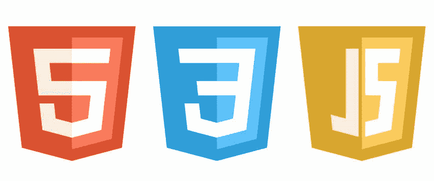
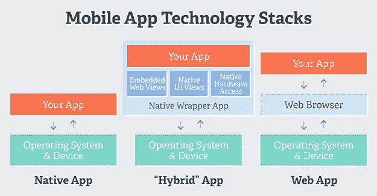

# 混合移动应用简介

> 原文：<https://medium.com/hackernoon/introduction-to-hybrid-mobile-apps-c97720b30557>

# 什么是混合手机 App？

> 混合应用是一种使用浏览器窗口显示界面的移动应用。

混合移动应用程序由 HTML、CSS 和 JavaScript 构建，包含在本机包装器中，以便可以安装在移动设备上。这可以在不必学习本地编程语言(例如 Swift、Java)的情况下完成。

这意味着所有不同的平台都有一个代码库，比如 iOS 和 android。

这属于由三种类型组成的移动应用类型的分类:

*   本机:使用特定于平台的编程语言(如 Objective C 或 Java)开发
*   移动网站:使用 HTML、CSS 和 JavaScript 等网络技术开发，只能通过移动网络浏览器访问。它们实际上是 web 应用程序。
*   混合:跨平台，可以访问本地 API(主要通过插件)

例如，使用 Ionic Framework 开发的混合移动应用程序的架构由两个概念组成，人们必须尽快熟悉这两个概念:WebView 和 Apache Cordova。

# 什么是网络视图？

可以把它想象成一个运行在移动应用程序范围内的浏览器，它使用一个框架，比如模仿原生 UI 的 Ionic。这个浏览器实现了用 HTML、CSS 和 JavaScript 编写的代码。

特定移动操作系统上的应用程序通过像 [Cordova](https://cordova.apache.org/) 这样的工具运行。它提供了用 JavaScript 编写的 API 来与移动设备的本机功能进行交互，例如访问摄像头或麦克风。

WebView 与 Cordova 的 API 进行通信，然后再与移动设备进行通信。

如今网络浏览如此普遍，以至于你可以使用[电子](http://electron.atom.io/)构建桌面应用程序。

# 为什么要走混合动力？

在回答这个问题之前，我想你应该先阅读一下关于混合移动应用的 [*神话？*](https://devdactic.com/myth-hybrid-development/) 西蒙写的[Devdatic.com](https://devdactic.com/)。

这将回答上面的问题，同时，我的观点是，如果你已经知道 web 开发和/或有使用 Angular 或 React 等框架的经验，选择混合移动开发是扩展你的技能和利用你当前编码技能的好方法。毕竟，我喜欢创造东西，对我来说这是一个很好的开始。

# 可供选择的事物

在混合开发的世界中，很少有替代/框架可用。其中之一是 [Ionic Framework](https://ionicframework.com/) ，随着今年早些时候的下一个版本，它为混合应用提供了更好的性能。它也有一个巨大的和有益的社区来帮助你摆脱困境。

我还没有尝试过但认为值得一提的其他选项包括编译到本机的框架，如 [React Native](https://facebook.github.io/react-native/) 和 [NativeScript](https://www.nativescript.org/) 。

想要收到更多像这样的文章吗？订阅我 [**这里**](https://patreon.us17.list-manage.com/subscribe?u=ad4c168a6d5bb975f2f282d54&id=39e959cecd) **。有时，我会向我的订户发送“从未见过”的内容。**

**如果您有任何疑问，请在 Twitter 上 ping 我**

 [## 阿曼·米塔尔·🖖(@阿曼本人)|推特

### 阿曼·米塔尔·🖖的最新推特(@阿曼本人)。# book blogger @ https://t.co/UQvyNf1OTC |开发者| #Nodejs |…

twitter.com](https://twitter.com/amanhimself)