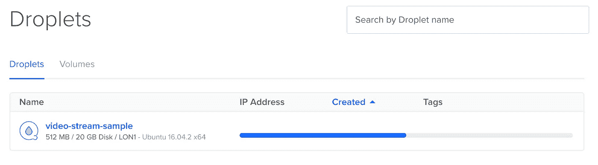
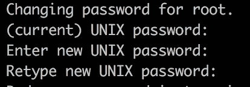
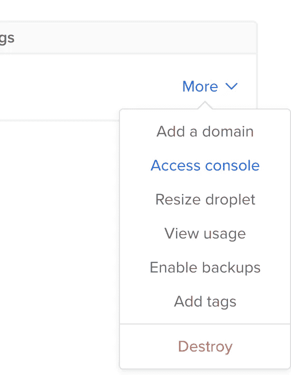
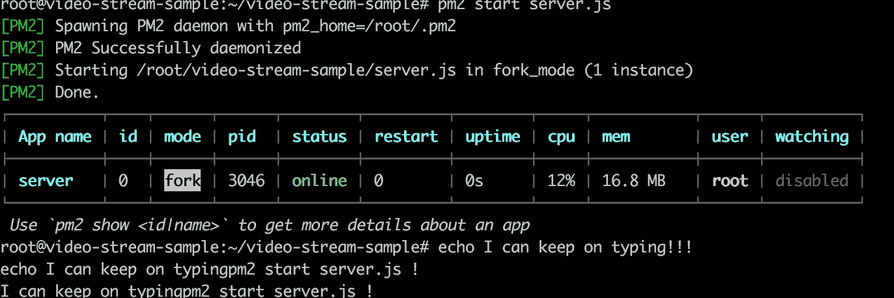

# Node.js 云部署简介

> 原文：<https://medium.com/hackernoon/introduction-to-node-js-cloud-deployment-2c27a6d5feb6>


[Thomas Kvistholt](https://unsplash.com/@freeche)

当你想在真实的生产环境中测试，而不是使用你的计算机作为服务器和部署你的 [Node.js](https://hackernoon.com/tagged/nodejs) 应用程序时，你通常必须使用亚马逊或 [DigitalOcean](https://hackernoon.com/tagged/digitalocean) 上的服务器。

这是一个基本的例子，不会涉及如何设置 DNS，SSH 或反向代理。例如，我将使用 DigitalOcean 部署 Node.js 视频流的上一篇[文章](/@daspinola/video-stream-with-node-js-and-html5-320b3191a6b6)中的示例。

> **免责声明**:我没有得到任何形式的赞助，这是考虑到价格和声誉我决定使用的服务。

# **数字海洋**

他们在云中提供服务器，他们称之为 droplets，最低层的价格为 5 美元(这对测试和小流量网站来说绰绰有余)。

当你创建一个 droplet(基本上是服务器实例)时，当你创建一个 droplet 并且该 droplet 存在的每个小时(即使停止)你被计费 0.001 美元。

创建服务器非常简单:

*   用有效的 paypal/信用卡[在这里](https://www.digitalocean.com/)创建一个账户；
*   选择“创建 droplet”，在这里你至少需要选择系统分布(ubuntu、fedora、Debian…)、计费计划、数据中心区域和主机名(你可以选择预装了某些程序的环境，这个例子从头开始)；
*   点击 create 后，应该不会花很长时间来启动和运行服务器实例，对于这个例子，我将使用 Ubuntu



*   部署后，您将收到一封电子邮件，其中包含该 droplet 的 IP、用户和密码，打开您的终端并键入:

```
ssh root@[server IP]
```

这将提示一个(是/否)只是说是，然后是用户和密码。请注意，第一次连接时，您必须在电子邮件中输入两次密码，然后输入新密码



(current) UNIX password is the one you just typed!

*   它应该在运行 ubuntu 的干净服务器上，你也可以通过浏览器的 droplet 选项来访问它



*   为了安装节点，我通常使用 nvm，它允许我在节点版本之间快速切换，所以只需下载它:

```
wget -qO- https://raw.githubusercontent.com/creationix/nvm/v0.33.2/install.sh | bash
```

您可能需要用`exec bash`重新加载 bash 来运行 node 的安装

```
nvm install 8.2.0
```

这样你就有了一个服务器，在世界的某个地方，可以使用 Node.js。仍然没有文件，我们什么也做不了…

**注意:**为了避免在使用服务器时被计费，可以创建您的 droplet 的快照(这有相关的成本，但通常比您保持服务器 24/7 开放的成本低)并销毁现有的 droplet，当您想要回来时，只需使用快照创建一个新的服务器。

# **转移文件**

要在服务器中获取您的项目，您有一些选项，如:

*   Filezilla —是一款 FTP 软件，允许您访问您的服务器文件夹，并向其中上传/下载文件；
*   Scp —使用命令行，您可以让通过以下方式传输文件:

```
scp -r [localfiles] [user@remoteServer:[destinationFolder]]
```

一个真正的应用是:

```
scp -r ./video-stream-sample root@111.11.11.111:video-stream-sample
```

*   克隆 git 存储库:

```
git clone [url]
```

在我的例子中，我将克隆我之前介绍的文章的 repo:

```
git clone [https://github.com/daspinola/video-stream-sample.git](https://github.com/daspinola/video-stream-sample.git)
```

将代码中的任何“localhost”更改为服务器 IP，并在尝试从任何位置访问链接 *"http:\\[serverIP]:3000"* 时遵循 repo 指令，示例将按预期工作！

**与 PM2 一起管理**

您可能会问“我想在不打开本地计算机上的另一个服务器实例的情况下继续进行更改，但是由于 node 正在运行，我无法执行更多的命令”。

为了避免在继续运行命令的同时使用 pm2 来管理节点实例，应该这样使用:

*   npm install -g pm2 (-g 以全局方式设置它，这样您就可以在各种项目中使用它，而无需添加依赖项)
*   而不是运行节点应用程序，比如

```
node server.js
```

相反，你运行它

```
pm2 start server.js
```



The result is something like this

这样，当应用程序在后台运行时，您可以继续管理您的服务器。

无论何时你想知道正在运行什么，你可以运行`pm2 list`并删除一个进程。你可以在这里找到 PM2 的可用资源。

# 您还应该配置

如前所述，这只是介绍如何在远程服务器而不是您自己的计算机上设置您的应用程序，DigitalOcean 会向您发送一封电子邮件，其中包含您也应该配置的安全内容，并且要发送到生产环境，您不应该暴露 IP 地址，因此必须使用 DNS 和反向代理，以避免出现问题。一些配置是:

*   SSH 密钥，更安全，你不必在每次连接时都输入密码(点击这里查看)；
*   DNS 要有一个域来访问，而不是 IP(检查它[这里](https://www.digitalocean.com/community/tutorials/how-to-point-to-digitalocean-nameservers-from-common-domain-registrars))；
*   用 [nginx](https://www.digitalocean.com/community/tutorials/how-to-install-nginx-on-ubuntu-16-04) 反向代理。

# **结论**

希望这将有助于您的应用程序的部署，使您离发布更近一步。已经在使用另一项服务，或者想要一个参考但没有谈到的最后步骤的例子，让我现在！

30 篇文章的第 7 篇，每周至少发表一篇文章的项目的一部分，从闲思到教程。留下你的评论，在[迪奥戈·斯诺拉](https://medium.com/u/fef03c291e56?source=post_page-----2c27a6d5feb6--------------------------------)上关注我，然后回到你的精彩项目中去！