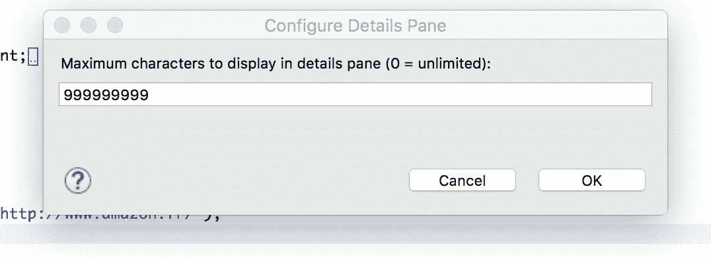
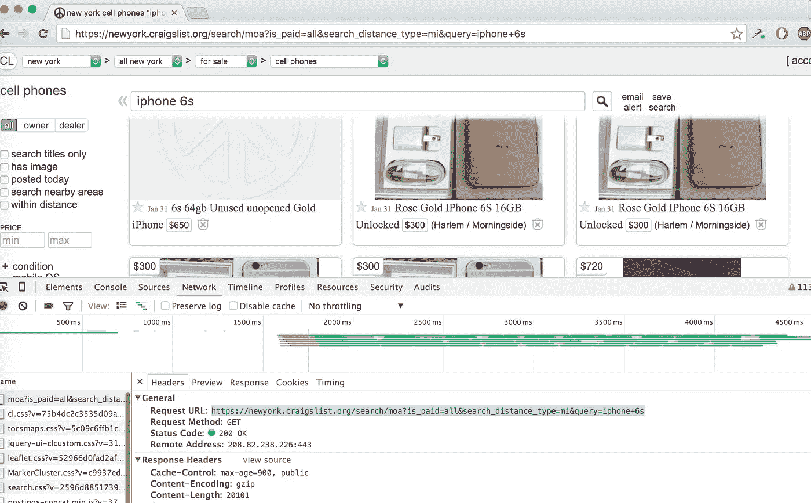
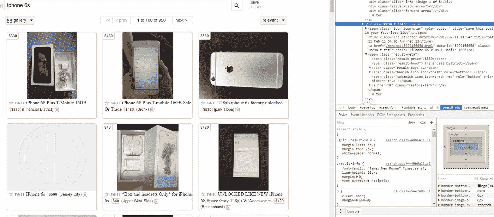

# Java 网页抓取简介

> 原文：<https://medium.com/hackernoon/introduction-to-web-scraping-with-java-3d8a8d0f250b>


[网页抓取](https://hackernoon.com/tagged/web-scraping)或爬行是通过下载和解析 HTML 代码从第三方网站获取数据，以提取您想要的数据。

因为每个网站都不提供干净的 API，或者根本不提供 API，所以当涉及到提取网站信息时，web 抓取可能是唯一的解决方案。
许多公司使用它来获取有关竞争对手价格、新闻聚合、大量电子邮件收集的信息…

几乎所有东西都可以从 [HTML](https://hackernoon.com/tagged/html) 中提取，唯一“难以”提取的信息是内部图像或其他媒体。

在这篇文章中，我们将看到在 [Java](https://hackernoon.com/tagged/java) 中获取和解析数据的基本技术。

***本文节选自我的新书*** [***Java 网页抓取手册***](https://www.javawebscrapinghandbook.com/?utm_source=medium&utm_medium=blogpost&utm_campaign=post1) ***。这本书将教你高尚的网络搜集艺术。从解析 HTML 到破解验证码，处理大量使用 Javascript 的网站等等。***

# 先决条件

*   基本的 Java 理解
*   基本 XPath

你将需要带有 HtmlUnit 的 Java 8

如果您正在使用 Eclipse，我建议您在细节窗格中配置最大长度(当您单击 variables 选项卡时),这样您将看到当前页面的整个 HTML。



# 让我们刮刮克雷格列表

对于我们的第一个例子，我们将从 CraigList 获取商品，因为他们似乎没有提供 API，以收集名称、价格和图像，并将其导出到 JSON。

首先让我们看看当你在 CraigList 上搜索一个项目时会发生什么。打开 Chrome 开发工具，点击网络选项卡:



搜索 URL 是:

```
[https://newyork.craigslist.org/search/moa?is_paid=all&search_distance_type=mi&query=iphone+6s](https://newyork.craigslist.org/search/moa?is_paid=all&search_distance_type=mi&query=iphone+6s)
```

你也可以使用

```
[https://newyork.craigslist.org/search/sss?sort=rel&query=iphone+6s](https://newyork.craigslist.org/search/sss?sort=rel&query=iphone+6s)
```

现在你可以打开你最喜欢的 IDE 了，是时候编码了。HtmlUnit 需要一个 WebClient 来发出请求。有许多选项(代理设置、浏览器、启用重定向…)

我们将禁用 [Javascript](https://hackernoon.com/tagged/javascript) ，因为我们的示例不需要它，并且禁用 Javascript 会使页面加载更快:

HtmlPage 对象将包含 HTML 代码，你可以用`asXml()`方法访问它。

现在，我们将获取标题、图像和价格。我们需要检查一个项目的 DOM 结构:



使用 HtmlUnit，您有几个选择 html 标签的选项:

*   `getHtmlElementById(String id)`
*   `getFirstByXPath(String Xpath)` - `getByXPath(String XPath)`返回一个列表
*   很多其他的，rtfm！

因为没有我们可以使用的 ID，所以我们必须创建一个 [Xpath](http://www.w3schools.com/xsl/xpath_syntax.asp) 表达式来选择我们想要的标签。

**XPath** 是一种选择 XML 节点的查询语言(在我们的例子中是 HTML)。

首先，我们将选择所有具有类别``result-info`的`<p>`标签

然后我们将遍历这个列表，为每个项目选择名称、价格和 url，然后打印它。

然后，我们将使用 [Jackson](https://github.com/FasterXML/jackson) 库把结果放到 JSON 中，以 JSON 格式映射条目，而不只是打印结果。

首先，我们需要一个 POJO(普通旧 java 对象)来表示项目

**Item.java**

然后将其添加到 pom.xml 中:

现在我们要做的就是创建一个项目，设置它的属性，并将其转换为 JSON 字符串(或文件……)，并稍微修改一下前面的代码:

# 更进一步

这个例子并不完美，还有很多可以改进的地方:

*   多城市搜索
*   处理分页
*   多标准搜索

你可以在这个 [Github repo](https://github.com/ksahin/introWebScraping) 中找到代码

我希望你喜欢这篇文章，欢迎在评论中给我反馈。

*这篇文章是摘自我的新书:* [***Java 网页抓取手册***](https://www.javawebscrapinghandbook.com/?utm_source=medium&utm_medium=blogpost&utm_campaign=post1) ***。*** *本书将教你高贵的刮网艺术。从解析 HTML 到破解验证码，处理大量使用 Javascript 的网站等等。*

*原载于 2017 年 12 月 1 日*[*ksah . in*](https://ksah.in/introduction-to-web-scraping-with-java/)*。*