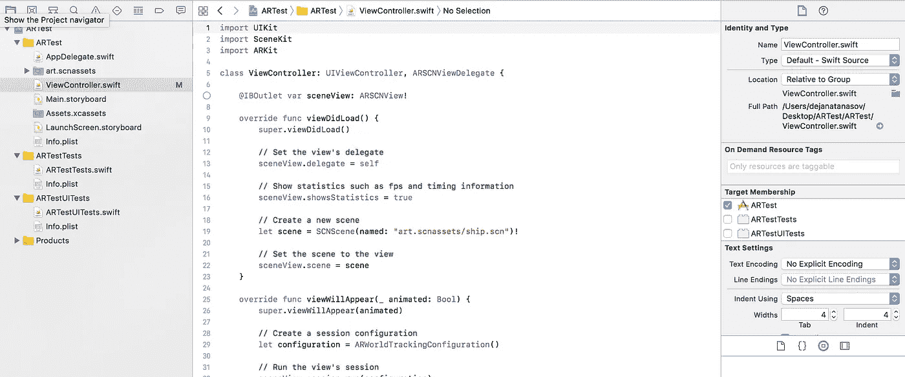
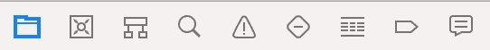
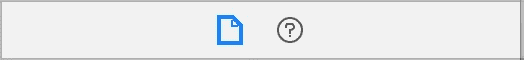
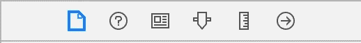
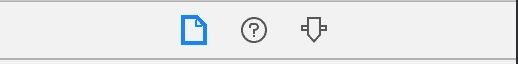
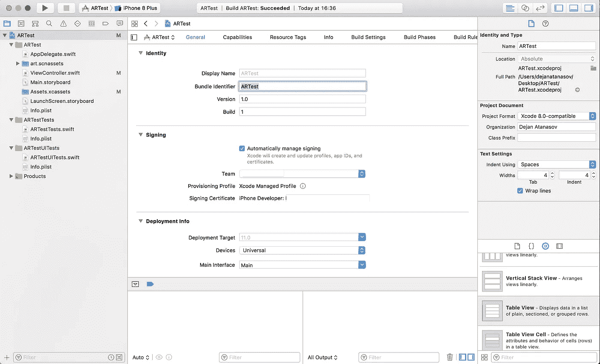
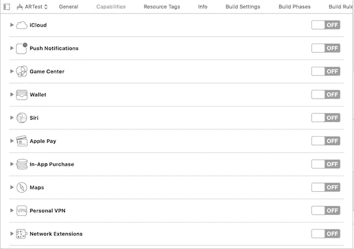
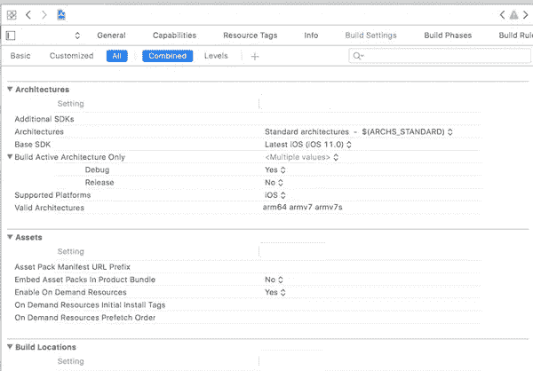

# Xcode 9 简介

> 原文：<https://medium.com/hackernoon/introduction-to-xcode-9-94205e83a985>

## 了解 Xcode 的基础知识

Originally posted on [**theappspace.com**](http://theappspace.com/introduction-xcode-9-swift-ios/)

成为一名伟大的软件开发人员的一部分是掌握你的 [**IDE**](https://en.wikipedia.org/wiki/Integrated_development_environment) 。通过了解你的环境是如何工作的，你会变得更有效率。这就是为什么我想花一些时间在新的 Xcode 9 上。如果你是 iOS 开发的初学者，这是一个完美的教程。让我们开始…🚀

# 左侧栏

在左上角的侧边栏，我们可以看到许多可用的选项卡。这可能是使用最多的区域，因为它包含了 Xcode 提供的许多关键特性，称为`navigators`。我会开始一个一个地解释它们(从左到右)。

1.  **项目导航器(** ⌘ + 1 **)** - 你的文件管理器。无论您需要对文件做什么，这里都有。此导航器使您能够添加、删除、编辑或分组文件。始终将该选项卡保持在焦点上。
2.  **源码控制导航器(** ⌘ + 2 **) -** 一个超级有用的源码控制导航器。它集成了对 GitHub 账户的支持，这使得你可以直接从侧边栏管理你的存储库，并且无需使用其他工具就可以将修改推送到云端。这仅在 Xcode 9 中可用。
3.  **符号导航器(** ⌘ + 3 **) -** 该导航器将使您能够快速跳转到特定的方法或属性定义**。**不用在文件中寻找你要找的方法，只需点击你需要的文件，然后点击所需的方法或属性定义。对于包含许多代码行的文件非常有用。您可以在分层列表或平面列表中显示符号。
4.  **找导航器(** ⌘ + 4 **) -** 我经常用的东西。这将对给定文本进行全局搜索，并返回匹配的结果。您还可以在搜索中包含各种过滤器。
5.  **发布导航器(** ⌘ + 5 **) -** 这是一个保存所有由于你的编码而出现的错误和警告的地方。错误显示为红色，而警告显示为黄色。它将为您提供正在发生的事情的详细日志。您可以显示构建时或运行时问题。
6.  **测试导航器(** ⌘ + 6 **) -** 用于运行编写好的测试用例。这个导航器是你的 [XCTest 的](https://developer.apple.com/documentation/xctest)的快捷方式。
7.  **调试导航器(**⌘+7)——每当应用程序崩溃时，这个标签会自动打开。它将为您提供应用程序停止的确切行，并在控制台中为您提供原因。此外，您还可以找到关于应用程序的内存、CPU、磁盘和网络消耗的有用信息。
8.  **断点导航器(** ⌘ + 8 **) -** 另一个我调试常用的选项卡**。**从这里，你可以很容易地设置断点并监视它们的活动。我真的很喜欢这个功能的简洁。
9.  **报表导航(** ⌘ + 9 **) -** 从这里控制你的持续集成。您应该创建一个 bot，它将为您提供关于您的 bot 和在服务器上执行的集成的详细信息。

 [## 使用 Swift 4 的 iOS 版谷歌地图 SDK 应用空间

### 许多 iOS 应用程序使用谷歌地图。这是一个非常普遍的特征，所以我决定在谷歌上准备一个终极指南…

theappspace.com](http://theappspace.com/google-maps-sdk-ios-using-swift-4/) 

# 右侧边栏

在 Xcode 的另一边移动。在右侧，您可以看到另一个带有各种标签的侧边栏。但是，不像左边的工具条，这个工具条包含了一组不同的标签(取决于你的位置)。在这一侧，标签被称为`inspectors`。

## Swift/Objective-C 文件

如果您点击 Swift/Objective-C 文件，您将看到以下选项卡。

您将在不到 10%的项目中使用这些选项卡，但是让我们涵盖它们。

1.  **文件检查器-** 该检查器提供了关于所选文件的基本细节和设置。它分为三个主要部分。

*   **身份和类型** -为您提供文件在目录中的位置信息，并允许您在 Finder 中打开它。此外，您可以设置文件的位置，无论它是绝对路径还是相对路径。
*   **目标会员**——如果你的文件在项目中没有得到认可，你应该首先搜索这里。这告诉项目该文件属于它的目标。确保您的目标始终处于选中状态，否则将无法找到该文件。
*   **文字设置-** 我个人没用过这部分。您可以在这里设置缩进和其他文本设置。这些设置仅适用于选定的文件。

2.**快速帮助检查器** -为您提供所选类的文档。例如，在您的文件中找到一个`String`类，并将光标移动到那个单词上。将会出现一个关于这个类的快速解释。

## 故事板文件

如果你点击一个. storyboard 文件，在右角你会看到一组新的标签。

1.  **文件检查器—** 这个检查器包含了我在上面解释过的相同细节，只是增加了一些新的部分。

*   **界面生成器文档-** 启用自动布局、特征变化和安全区域。此外，您可以设置整个故事板的全局色调，并决定是否要将所选的 UIViewController 用作启动屏幕。
*   **本地化-** 显示您所有的本地化文件。您可以启用/禁用要在故事板中显示的语言。

2.**快速帮助检查器-** 信息同上。

3.**身份检查器-** 控制 UIViewController 的身份。我们所理解的身份，分配一个定制类，提供一个故事板 ID，这样你就可以通过代码访问视图控制器，以及`User Defined Runtime Attributes`，在这里你可以添加各种样式属性，而不是通过代码添加它们(例如:`layer.cornerRadius`)。

4.**属性检查器-** 该检查器用于调整所选对象的属性。每个对象都包含自己的一组属性。例如，`UILabel`包含调整文本、文本颜色、字体、背景颜色等设置。您也可以使用`@IBInspectable`添加自己的属性。

5.**尺码检查员-** 我想这个名字说明了一切。任何与对象大小相关的内容都可以在这里找到。不管 x、y、宽度和高度值如何，您都可以找到自动布局约束，或者如果您没有使用自动布局，可以自动调整大小。

6.**连接检查器-** 用于代码和使用`@IBOutlet`的视图控制器之间的通信，并通过`@IBAction`分配动作。

我会穿过。可以在任何项目中找到的 xcassets 文件。它是用来存放你的资产的。

这三个选项卡中的两个已经为您所熟悉。

*   **属性检查器**-**-**从这里，您可以调整所选资产的属性。最常见的属性是图像压缩、渲染类型、设备支持、比例(矢量或单独)等。

# 页眉

列表中的下一个是标题。我们将在 Xcode 的最顶端，左右侧边栏的上方一点。

左侧
你可以找到像运行和停止你的项目建设，管理你的目标的方案，或挑选和下载一个新的模拟器。

**右侧** 一个可以给编辑器应用不同选项的地方。我会从左到右解释它们。

1.  **标准编辑器** **-** 该控件代表编辑器的默认视图。
2.  **助理编辑器** **-** 通过使用助理编辑器，你的编码区域将会分割成两部分。左边代表你的文件，右边只代表你的方法定义。它所做的是，忽略写在你的方法中的代码，只显示方法定义。如果您的类包含大量代码，这将非常有用。
3.  **版本编辑器-** 分割你的编码区域并添加一个你的类的副本，告诉你自上次提交后你做了什么改变。这用于版本控制，为您提供了更改内容的比较。

接下来的三个图标位于右上角，代表边栏和调试区域的显示和隐藏。如果您的屏幕空间不足(例如，在 MacBook Pro 13 英寸屏幕上工作)，并且希望将更多注意力放在编码区域，则可以使用它。🤓

# 项目设置

我们已经完成了对编码区域的探索。现在让我们继续做一些更复杂的事情。不涉及代码的东西。我们将浏览项目设置。我相信你以前见过这个屏幕，所以我将直接开始解释标签。👇*我只解释最常用的*。

General

1.  **通用-** 名字就说明了一切。在这里，您可以找到针对特定目标的设置。

*   **身份-** 控制应用名称、捆绑包标识符、版本号和内部版本。号，
*   **签名** **-** 处理预置描述文件的部分。基本上，它对应用程序进行签名，以便发送应用程序版本进行测试或生产。
*   **部署信息-** 从这里，您可以添加最小的 iOS 版本支持，决定应用程序是通用的还是只有 iPhone 或只有 IPad，并添加默认的故事板文件。
*   **应用图标和启动图像-** 分配应用图标和闪屏资产。

2.**功能-** 包含您可以使用的具有各种服务的交换机。默认情况下，所有的服务都是关闭的，你需要激活你所需要的服务，方法是进入你的[应用 ID](https://developer.apple.com/account/ios/identifier/bundle) 。因此，如果你想使用推送通知、后台服务或[应用内购买](http://theappspace.com/swift-add-app-in-app-purchases-ios-app/)，请确保开关设置为开。

Capabilities

3.资源标签- 你可以给资源分配标签，它们都会在这里结束。我从来没有用过这个功能，但是如果你想了解更多，你可以查看这里的。

4.**信息-** 该选项卡显示您激活的[的属性。plist](https://developer.apple.com/library/content/documentation/General/Reference/InfoPlistKeyReference/Articles/AboutInformationPropertyListFiles.html) 文件。在这里，您可以添加/编辑/删除属性信息。

5.**构建设置** **-** 苹果官方文档很好地解释了这一部分……*“构建设置是一个变量，包含关于产品构建过程的某个特定方面应该如何执行的信息。例如，构建设置中的信息可以指定 Xcode 将哪些选项传递给编译器。* "
该选项卡包含许多与构建过程相关的设置。从分配预置描述文件到添加第三方库的目录路径。每个目标都有自己的构建设置。

Build Settings

6.**构建阶段-** 为您提供了一个包含在编译中的所有文件的列表。你所有的框架，资产。swift 文件，故事板将在这里显示，并有添加或删除的选项。此外，还有一个运行脚本特性，您可以在其中添加自己的 shell 脚本。

7.构建规则- Xcode 让你有可能编写自己的规则。如果你有不错的脚本技能，你几乎可以写任何东西。比如转换。css 文件转换成。控件中的文本添加格式规则。rtf 文件。

## 我希望你喜欢这个教程，它能帮助你了解 Xcode 的基本功能。如果您觉得本教程有帮助，请👏或者分享这个故事，让别人也能找到。🙇

## 查看我的最新项目:

 [## 足球比分预测赌注

### 我们提供专业的足球比分预测投注提示，胜率高。每个比赛模拟包含一个…

apps.apple.com](https://apps.apple.com/app/football-score-prediction-bets/id1517623538)  [## 足球博彩技巧和比分——赌进球 Google Play 上的应用程序

### 我们提供高胜率的专业足球技巧。每个比赛模拟包含一个预测，代表…

play.google.com](https://play.google.com/store/apps/details?id=betting.tips.goals)  [## 缩放个人资料图片和故事

### ZoomPic for Instagram 是匿名查看大型高清个人照片和故事的最简单、最方便的方式…

apps.apple.com](https://apps.apple.com/app/zoom-profile-picture-stories/id1514925024)  [## Instagram 的长视频故事

### Instagram 的 Long Story 是一个非常棒的工具，允许您录制或选择任意长度的视频并进行转换…

apps.apple.com](https://apps.apple.com/app/long-video-story-for-instagram/id1511499427) 

## 阅读更多我在媒体上的作品:

 [## 引入干净的 Swift 架构(VIP)

### 忘了 MVC 吧，现在！

hackernoon.com](https://hackernoon.com/introducing-clean-swift-architecture-vip-770a639ad7bf)  [## 使用 Swift 4 在 iOS 上使用 Google Maps SDK 的终极指南

### 许多 iOS 应用程序使用谷歌地图。这是一个非常普遍的特点，所以我决定准备一个终极指南…

medium.freecodecamp.org](https://medium.freecodecamp.org/how-you-can-use-the-google-maps-sdk-with-ios-using-swift-4-a9bba26d9c4d)  [## SWIFT —带有 XIB 文件的自定义 UIView

### 用 XIB 文件定制 UIView 是 iOS 开发中非常常见的做法。自定义 UIView 类不包含 XIB 文件…

medium.com](/theappspace/swift-custom-uiview-with-xib-file-211bb8bbd6eb)  [## 如何将 Spotlight 支持添加到您的 iOS 应用程序

### Swift 教程将使您的应用程序在 Spotlight search 中可用

hackernoon.com](https://hackernoon.com/how-to-add-spotlight-support-to-your-ios-app-4a89054aff89)  [## 核心数据关系

### 理解一对一和一对多关系

hackernoon.com](https://hackernoon.com/core-data-relationships-d813ed66ba8c)  [## 了解 Xcode 9 中的自动布局

### 所有你需要知道的关于自动布局

hackernoon.com](https://hackernoon.com/understanding-auto-layout-in-xcode-9-2719710f0706) 

## 订阅我的时事通讯: