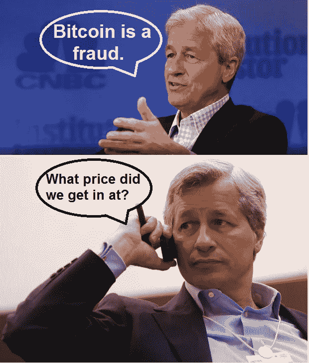
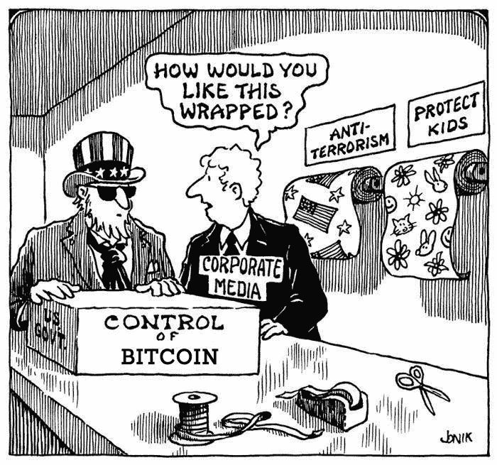
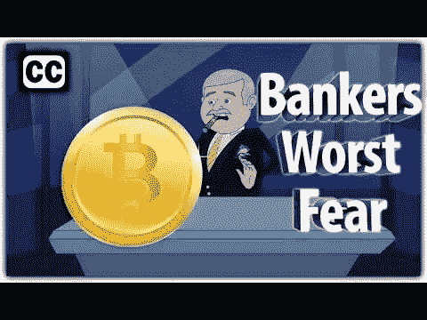

# 为什么我们需要比特币

> 原文：<https://medium.com/hackernoon/investment-case-for-the-best-cryptocurrencies-6357866ea133>

在过去几年参与加密货币领域后，我做了三点观察。相信我，我收集这些信息是因为我确保在我参加的每个社交聚会上，比特币都是话题。通过这次经历，我发现不相信加密货币会起作用的人是那些:

1.  我不明白在我们当前的金融体系中，钱是如何被创造出来的
2.  从加密货币的成功中损失最大，就像我们的朋友杰米·戴蒙
3.  只是完全不懂技术，所以他们害怕自己不知道的东西

## 谁控制着美国的货币供应？

大多数人都知道美联储银行通过货币政策控制货币供应。然而，大多数人认为美联储银行是一个政府实体。**不是！！！**联邦储备银行是一家私人实体，像其他私人公司一样，其股东每年可获得 6%的股息。

## 谁是美联储银行的股东？

当然是华尔街银行。哪些？“哦，我们很抱歉，这是私人信息”，但我相信你可以做出一些猜测。

所以，让我们考虑一下。我们有一个私人实体控制着美国政府的货币供应。除了美国人民的福祉之外，还有人认为华尔街银行可能有其他的议程吗？我当然知道。别忘了感谢这些家伙，他们在 2008 年毁掉了所有人的生活，却逍遥法外。

## 我相信你们很多人都听说过美联储银行使用 2%的目标通胀率，但这到底意味着什么呢？

使用 2%的通胀目标基本上意味着你口袋里的美元比前一年贬值了 2%。不要相信我。1913 年，国会立法成立了美联储银行。在那一年，1 美元可以买 16 条面包。今天，同样的一美元甚至不能给你买一片面包。为此，你可以尽情感谢华尔街。然而，最终将发生的是恶性通货膨胀，这正是我们今天在津巴布韦和委内瑞拉看到的情况(这就是为什么比特币在这些国家的交易价格是其两倍)。它可能不会在 20 年、50 年甚至 100 年后发生，但它最终会发生，因为我们当前的体系已经崩溃。

## 有没有想过你的 100 美元存入银行后会发生什么？很多人认为它藏在金库里，不是吗？

**绝对不行！！**你存入银行的每 100 美元。他们转过身，把你辛辛苦苦挣来的 94 美元借给像乔这样需要付账的人。乔将那 94 美元存入他的账户，银行转而又贷出 88 美元给莎莉。这个循环一直持续到有人吹哨。本质上，一旦你辛苦赚来的钱存入你的银行账户，它就不再是你的了。大银行知道他们即将失去对美国货币供应的控制，他们会尽一切可能阻止这种情况的发生。

## 你觉得纽约州对比特币的法律最严厉是巧合吗？

在 50 个州中，纽约州是唯一一个要求企业申请 Bit-license 才能运营任何与加密货币相关的法律实体的州。这是该州根深蒂固的金融影响的结果。银行知道他们陷入了困境，并希望尽可能地让加密货币难以成功。

主流媒体也出色地将比特币描绘成资助犯罪活动的一种手段。但是，我问你？**当今非法市场上最常用的金融工具是什么？**

不是比特币。实际上是美元。然而，比特币确实可以类似于美元使用，但仅仅因为人们发现了该技术的负面应用并不使其成为“暗钱”。想想俄罗斯人是如何应用脸书的技术来影响美国选举的。我们认为脸书是“黑暗之网”吗？当然不是。人们害怕他们不知道的东西，这是常见的谬误。

## 为什么银行对比特币这样的加密货币如此恐惧？

原因有很多，但我会在这里给你一些要点。

1.  它是完全分散的。没有一家公司或个人或实体拥有或控制比特币。这是一个点对点的系统，就像我们很多其他心爱的应用一样——优步、Postmates、Airbnb 等等，但是没有集中化
2.  只有两种方法阻止比特币**。你可以**关闭互联网**或者**关闭世界电网**。这是阻止比特币的唯一方法。是的，你可以用不成熟的监管阻碍它的发展，但你无法阻止它。**
3.  它不受任何形式的货币政策或政治影响。想象你的钱实际上是你的。多么疯狂的想法。此外，这使得比特币成为通用货币或储备货币的完美候选货币。
4.  世界各地的人都可以看到区块链上发生的每一笔交易，你的身份隐藏在一长串字母和数字中，类似于一个人的银行账号。
5.  如今，信用卡向客户收取总交易金额的 3-5 %,并需要 3-5 个工作日进行资金结算。其他人觉得这很古老吗？加密货币交易可以即时广播，所以你可以马上知道你的资金何时被发送或接收，加密货币每笔交易的成本不到 0 . 25%。

给你提个醒。既然你已经意识到了这些好处，任何时候你读到一篇文章声称华尔街银行或某种形式的政府将发行自己的数字货币来废黜比特币，你都可以继续下去，不要再看了。因为无论是作者还是他们的消息来源都不知道他们在说什么。

# 摘要

从最简单的意义上来说，加密货币**获得了现金、黄金和信用卡支付网络的所有好处，同时留下了所有的负面影响**。加密货币可以立即结算所有交易，无论大小，就像**现金**一样，同时记录区块链的交易。加密货币可以保存和转移价值，像**黄金**，但是没有购买和储存金条的成本和麻烦。加密货币可以在世界上的任何地方发送或接收资金，就像信用卡支付网络一样，而这样做的成本只是它的一小部分。

如今，似乎每个人不仅对比特币有自己的看法，也有自己的价格目标。有无数银行家说比特币被高估了，这是本世纪的泡沫，但我们一生中从未见过这样的技术。这无疑是自互联网发明以来最具创新性的技术，因为区块链是一项变革性的技术，可以应用于每一个行业。

**如果我们拿比特币的市值，通过一个合适的镜头来分析，会怎么样？**如前所述，像比特币一样，加密货币采取现金、黄金和信用卡支付网络的形式。好吧，我们来分析一下。

**美国的货币基础:**4 万亿美元

**全球黄金市场价值:**:8 万亿美元

信用支付网络的价值:让我们用我们 22 万亿美元的国债

总计:34 万亿美元

**比特币市值:**1910 亿美元

**差异:**——34 万亿美元= 1910 亿美元 ***充足的增长空间***

# 谢谢大家！

我希望你们喜欢这个星期的报道！我有一个惊人的 5000 人阅读了我上周的帖子，我感谢所有的赞美之词。下周，我将把我的重点转回到深入挖掘市场上的一些较小的硬币。