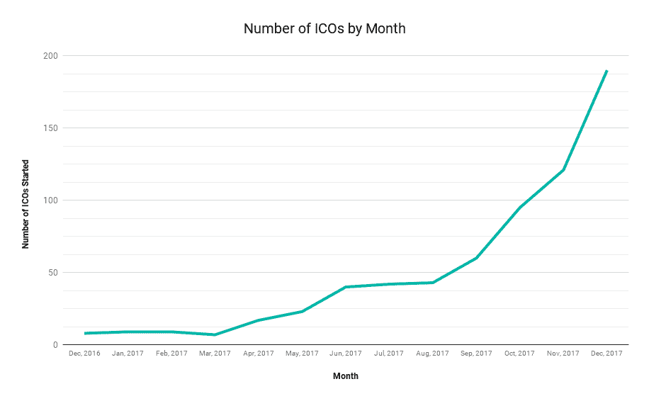
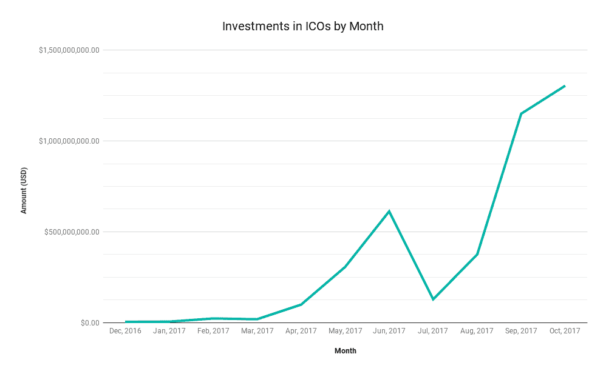

# 早期投资者在 ico 上获得了 50，000%的回报

> 原文：<https://medium.com/hackernoon/investors-are-making-50-000-returns-on-icos-32432bc741d1>

# 早期投资正在获得巨大回报

S&P 的平均回报率是 10%。在过去的一年里，比特币的回报率达到了前所未有的 1000%。但精明的加密货币投资者正在投资 ico，并使 ROI 高达 50，000%。停下来想一想。这意味着，在 2017 年初，100 美元的投资可以获得 5 万美元的回报。对于一年的交易来说还不算太寒酸。

ico(初始硬币发行)是一个相对较新的现象，投资者用加密货币(通常是以太坊)换取早期项目的股份。这种早期投资传统上受到高度监管。加密货币提供了一种绕过这些监管的方法。ico 让你在第一时间进入市场，而不是等到公司发展到足够大的规模才进行投资。

# 在一些国家被禁止

并非每个市场都对 ico 藐视监管感到兴奋。今年早些时候，中国和韩国都禁止了 ico，美国也开始打击违反安全法的 ico。尽管如此，许多投资者对 ico 提供的早期投资机会持乐观态度。

想象一下，如果你能在 2004 年脸书开始的时候参与进来。还是正在进行早期融资的谷歌？ICOs 让这一切成为现实。

# 2017 年的最高回报

2017 年，ico 投资者获得了一些令人难以置信的回报。该团伙的一些头目列举如下:

## 科莫多岛

*   **投资回报率:他们 ICO 中的 100 美元=今天的 14，151 美元**
*   **一句话:**隐私聚焦以太坊
*   **重要原因:** Komodo 是另一个在区块链上创建应用程序的平台。关键在于它对 ico 的关注。它允许任何人无缝地创建自己的区块链、发行代币和 ICO。它是基于 zcash fork 构建的，因此与以太坊不同，它提供匿名使用和交易。

## 避难所

*   **投资回报率:他们 ICO 中的 100 美元=今天的 36，600 美元**
*   一行程序:让区块链与其他区块链交流。
*   **为什么重要:**企业创建和维护自己的区块链有很多例子。方舟旨在让不同区块链之间的沟通变得容易。Ark 有一个潜在的网络，而不是一堆独立的数据存储和平台。随着越来越多的区块链被创建，对该网络的需求可能会增加。

## 光谱蛋白

*   **回报:他们 ICO 中的 100 美元=今天的 50，834 美元**
*   **一行程序:**关注隐私的加密货币
*   **为什么重要:**Monero 和 Zcash 等注重隐私的加密货币最近受到了很多关注。Spectrecoins 之所以出名，是因为它通过在 TOR 网络中运行来提供网络隐私。

# ico 的平均回报超过比特币

2017 年的顶级 ico 提供了 1000%的投资回报——但平均回报呢？ICO 回报仅仅是运气的问题吗？

红树林资本合伙人对 232 个 ico 的分析得出结论:

“如果一个人盲目投资每一个 ICO，包括大量失败的 ICO，这将带来 13.2 倍的回报。”http://www.mangrove.vc/ico-report2017

ICOs 的投资回报率为 1，320%，甚至超过了比特币在过去一年中的惊人涨幅。

不幸的是，随着 ico 作为一种筹资机制越来越受欢迎，越来越多的项目试图利用它们。去年 11 月，加密货币初创公司“Confido”在一个 ICO 中筹集了 37.5 万美元，然后消失得无影无踪。今年早些时候筹集了 2.32 亿美元的 Tezos 等其他公司卷入了多起诉讼，投资者要求他们退款。这一领域缺乏监管导致了一个任何事情都可能发生的蛮荒西部。投资者应该准备好做他们的研究，并以怀疑的态度对待所有潜在的投资。

# 这个领域才刚刚起步

2017 年是加密货币的分水岭。但是这种趋势才刚刚开始。

有几个积极的迹象表明 ico 将继续存在:

1.  **ico 的数量正以指数速度增长。**

据 Smith & Crown 称，下个月计划推出 190 个 ico，而且每天都有更多的 ico 上市。与 2016 年推出的少数 ico 相比，这是一个巨大的增长。

**2。进入这一领域的资金数量呈上升趋势**

*筹资总额基于 Smith 和 Crown 的数据，由各公司报告。

尽管 7 月和 8 月出现短暂下滑，但 ICO 投资已经复苏，并显示出指数增长的迹象。

**3。进入这一领域的壁垒仍然很高，但正在稳步下降**

目前，投资 ico 的门槛相当高。你必须持有以太坊，这是许多投资者刚刚了解的。你必须学会如何解读白皮书，并且必须有足够的技术来理解你的 EC20 令牌将如何被存储。如果你想在 Etherdelta 这样的早期交易所进行交易，就要准备好学习如何使用 metamask，手动管理自己的以太坊交易。

随着这些进入壁垒在接下来的一年中被打破，我们很可能会看到对这一领域的更多兴趣和活动。

# 怎么投资？

所以你是加密货币投资者。你持有比特币和一些替代币，并准备进入更广阔的 ICO 投资世界。你可以这样开始:

**1。获得以太坊**。

一些 ico 接受比特币或其他加密货币，但以太坊是迄今为止最受欢迎的

当谈到 ICO 投资时，最广泛接受的加密货币。一旦 ICO 代币进入交易所，它也是交易的首选货币。

**2。研究。研究。研究。**

与需要严格筛选的 IPO 不同，公司进行 ICO 几乎不需要监管工作。至少你应该了解创始人是谁，他们有多少影响力，他们提供了什么样的象征。一些 ico 用谷歌广告瞄准投资者，或者奖励在有限时间内投资的奖励代币。好的营销策略没有错(它们可以表明一个好的团队)，但要认识到它们何时被用来对付你。

**3。只投资你能承受的损失。**

ico 是一项*极高风险的投资。你只应该自由投资*

收入，他们应该是你整体投资策略的一小部分。亿万富翁投资者马克·库班建议投资不超过 10%的比特币。更加谨慎地对待 ico。大多数创业公司都会失败，即使是资金雄厚的公司，所以即使前景乐观，也要做好失去投资的准备。

# 一个勇敢的新世界…

去年，ICO 投资者获得了令人难以置信的回报。他们允许任何人投资早期公司，并为初创公司提供急需的资金来源。下一年会出现类似的结果吗？在 Coin and Crypto，我们相信 ico 提供了巨大的潜力和巨大的风险。

## 喜欢这篇文章吗？我们现在有电报信号组了！

我们发布**简单有效的交易信号**。所以你可以花更少的时间做技术分析，花更多的时间**得到结果。**
👉[https://t.me/coinandcrypto](http://telegram.coinandcrypto.com/medium)

参考

1.  史密斯和皇冠 ICO 上市[[https://www.smithandcrown.com/icos/](https://www.smithandcrown.com/icos/)
2.  2017 年 ICO 报告[[http://www.mangrove.vc/ico-report2017](http://www.mangrove.vc/ico-report2017)
3.  令牌返回数据[[https://www.tokendata.io/](https://www.tokendata.io/)
4.  ICO 禁令[[https://TechCrunch . com/2017/09/28/south-Korea-has-banned-icos/](https://techcrunch.com/2017/09/28/south-korea-has-banned-icos/)]
5.  比特币价格历史[【https://www.coindesk.com/price/】T21
6.  qtum[[https://qtum.org/en/](https://qtum.org/en/)
7.  科莫多[[https://komodoplatform.com/en](https://komodoplatform.com/en)
8.  方舟[[https://ark.io/](https://ark.io/)
9.  Spectrecoin [ [https://spectreproject.io/](https://spectreproject.io/) ]