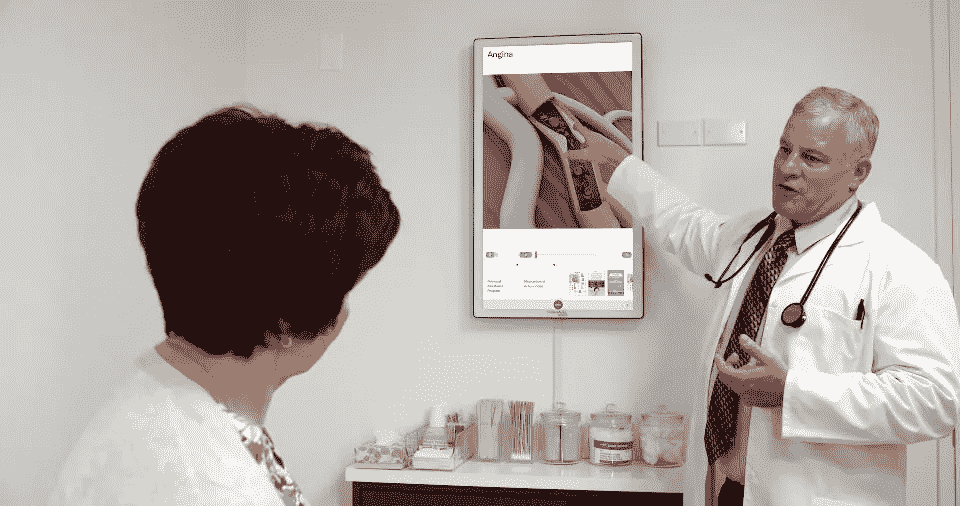
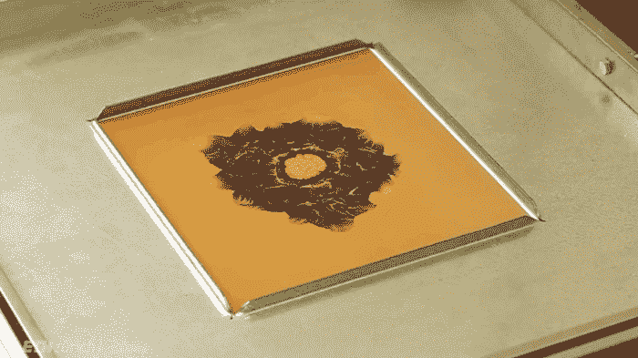
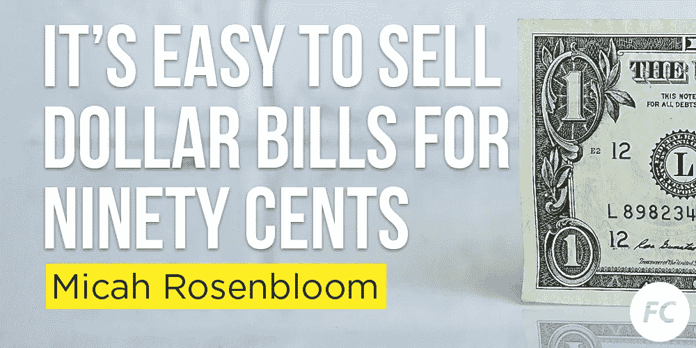
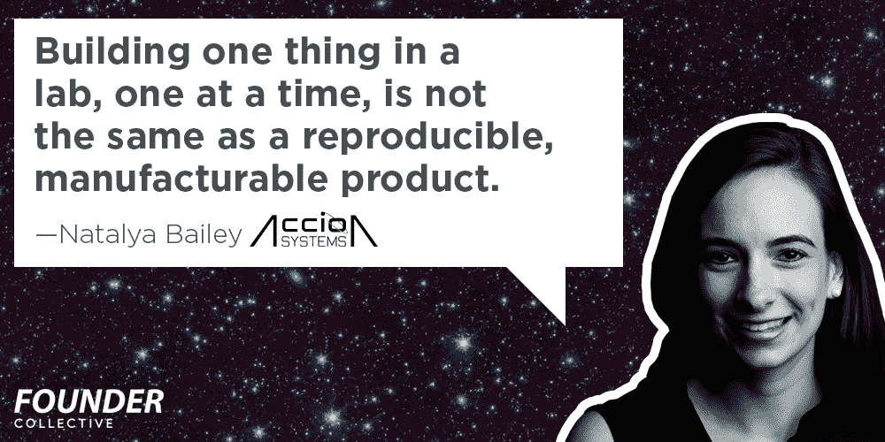

# 隐形独角兽:无人谈论的十亿美元科技公司

> 原文：<https://medium.com/hackernoon/invisible-unicorns-the-billion-dollar-tech-cos-no-one-talks-about-9c9397b30558>

*原载于刺儿头&怪，方正集体***迅—* [*报名这里*](http://eepurl.com/crytmH) *！**

**

*上周, [Outcome Health 从高盛和谷歌筹集了第一轮资金——5 亿美元，估值 50 亿美元。这家公司于 2006 年由当时的大学生 Rishi Shah 和 Shradha Agarwal 创立，他们在医生办公室放置电视和平板电脑，播放健康内容，然后出售上面出现的医药广告。Outcome Health 在 40，000 个医生办公室安装了屏幕，大约占美国诊所的 20%,并与 100 个合作伙伴合作制作内容。在最初的 11 年里，这种对 billboard 商业模式的巧妙改造依靠自力更生和债务融资，在 2016 年创造了 2 亿美元的收入，同比增长 100%。](https://www.bloomberg.com/news/articles/2017-05-31/outcome-health-valued-at-5-billion-on-initial-fundraising-of-500-million)*

*此外，该公司是由女性共同创立的规模更小的十亿美元科技创业公司的一部分。有了这笔资金，Shradha Agarwal 加入了思科的 Sandy Lerner、Epic 的 Judith Faulkner、Lynda.com 的琳达·温曼、Eventbrite 的 Julia Hartz、Houzz 的 Adi Tartarko 和 Honest Co .的杰西卡·阿尔芭等精英行列*

*尽管他们的成就取得了惊人的成功和新闻价值，但除了其家乡芝加哥媒体之外，很少有关于该公司的报道。即使是 5 亿美元的融资在初创公司/科技媒体上也鲜有提及 TechCrunch、Recode、VentureBeat 或 Wired 都没有发表任何相关报道——尽管《福布斯》的亚历克斯·康拉德写了一篇精彩的简介。事实上，在过去的十年里，几乎没有关于这家非凡公司的科技报道(即使使用它以前的名字，Context Media)。*

*客观来看，Outcome Health 55 亿美元的估值将使其成为纳斯达克 3300 家公司指数中第 245 家最有价值的公司，超过 Dunkin Donuts 或猫途鹰，仅次于史泰博。这将是《华尔街日报》十亿美元创业公司排行榜上[第 21 家最有价值的公司。几乎没有人谈论它。这引出了几个有趣的问题:](http://graphics.wsj.com/billion-dollar-club/)*

*有多少价值数十亿美元的创业公司在我们的眼皮底下？*

*为什么这家公司十多年来一直未被媒体发现？*

*更重要的是，被资助的创业公司能从他们身上学到什么？*

# ***迪士尼结合怀旧&科技***

**

*迪士尼的研究小组开发了一种叫做“[计算热成型](http://igl.ethz.ch/projects/thermoforming/computational-thermoforming-2016.pdf)的技术，它结合了 3d 打印、图形位移映射和真空成型，创造了一种建造电影道具的新方法。这些技术都有 30 多年的历史了，但是结合起来，创造出全新的东西。这是一个很好的提醒，新的视角可以像新技术一样有用。*

## ***网络上的其他怪异现象***

*   *两名设计师重新发行图形标准手册，并在 Kickstarter 上出售，赚了 190 万美元。[ [快速代码设计](https://www.fastcodesign.com/90126734/order-the-new-design-office-that-spun-off-a-1-9m-kickstarter-business)*
*   *“Monkeylectric 每年的销售额为 100 万美元。有圣诞热潮，在夏天，燃烧的人碰撞。”《纽约时报》*
*   *一根细绳上的海绵可能会取代内窥镜，成为检测食管癌最简单的方法。[T](https://www.nytimes.com/2017/05/31/business/smallbusiness/led-night-bike-lights.html?_r=0)T[何电报](http://www.telegraph.co.uk/news/health/news/11751447/Pill-on-a-string-can-detect-cancer-without-need-for-biopsy.html)*
*   *YouTube 上有五分之一的人观看拆箱视频。从字面上看，人们打开盒子。[[F](https://www.fastcodesign.com/90126734/order-the-new-design-office-that-spun-off-a-1-9m-kickstarter-business)幸运*
*   *一名少年通过建造一个帮助人们在线订购限量版至尊服装的机器人赚了 35 万美元。[ [连线](https://www.wired.com/2017/05/using-bots-to-buy-supreme-limited-edition-streetwear/)*
*   *麻省理工学院正在努力开发变形意大利面。[ [快速代码设计](https://www.fastcodesign.com/90127153/this-mit-invented-pasta-packs-flat-then-snaps-into-crazy-shapes)*

# *方正集体新闻*

## *不要被 GMV 诱惑*

*Micah Rosenbloom 解释了为什么创始人应该小心使用 GMV(商品总价值)作为核心指标。摘录如下:*

> **一旦初创公司获得风险投资，成长的压力会导致创始人依赖松散的指标，而忽视证明或修正核心基本面。有些人指责风投和其他企业家。我怪人性。我们都被进步所激励，我们觉得更多的人、更多的销售、更多的风险投资都是进步的标志。**
> 
> *初创公司必须注意活动和进步之间的区别。我看到 GMV(商品总值)成为衡量成功的标准，但实际上，它是衡量市场活动的标准，不一定是一家稳健的企业。如果你仅仅依靠 GMV 的增长来筹集资金，那么在核心问题得到解决之前，你就有可能筋疲力尽，正如我在 2000 年《握手言和》爆发时所经历的那样。*

**

## ***博士转 CEO***

*方正集团非常幸运，在这个星球上最伟大的两个研究机构哈佛大学和麻省理工学院之间拥有一间办公室。我们希望帮助更多的博士成为首席执行官，所以我们开始了一系列的帖子，首先是对 Accion Systems 联合创始人兼首席执行官娜塔莉亚·贝利的采访，她解释了她如何在不到一年的时间里从麻省理工学院的一个实验室发展成为一家卫星推进公司。*

**

## ***投资组合新闻***

*   *[B](https://techcrunch.com/2017/03/07/google-is-acquiring-data-science-community-kaggle/) [uzzfeed](https://twitter.com/ActuallyJZ/status/867747700535701505) 给了彭博一张后台通行证，为他们扩张的视频帝国*【彭博】**
*   *[Lorem](https://techcrunch.com/2017/06/02/lorem-seed-funding/) 筹集了 110 万美元，将小企业和网络开发者联系起来，以获得快速援助*【TechCrunch】**
*   *领先的数据科学社区 Kaggle 宣布了其第一百万名成员*【Kaggle】**
*   *Formlabs 宣布了一款新的基于 SLS 的 3d 打印机 Fuse 1 和一个名为 Form Cell 的机器人工厂。*【表单实验室】**
*   *[郁金香](https://techcrunch.com/2017/06/06/tulip-the-app-platform-for-manufacturers-picks-up-13-million-from-nea/)，制造商应用平台，从 NEA*【TechCrunch】*获得 1300 万美元*
*   *在陈/扎克伯格的支持下，安德拉从尼日利亚扩展到乌干达*
*   *[突如其来的咖啡](https://www.fastcodesign.com/90126502/what-does-helvetica-taste-like-finally-we-know)发布了基于著名字体的新口味，Helvetica *【快速代码设计】**

******

> *[黑客中午](http://bit.ly/Hackernoon)是黑客如何开始他们的下午。我们是 [@AMI](http://bit.ly/atAMIatAMI) 家庭的一员。我们现在[接受投稿](http://bit.ly/hackernoonsubmission)并乐意[讨论广告&赞助](mailto:partners@amipublications.com)机会。*
> 
> *如果你喜欢这个故事，我们推荐你阅读我们的[最新科技故事](http://bit.ly/hackernoonlatestt)和[趋势科技故事](https://hackernoon.com/trending)。直到下一次，不要把世界的现实想当然！*

**