# iOS 11 和更多技术在战壕里

> 原文：<https://medium.com/hackernoon/ios-11-and-more-tech-in-the-trenches-e9a2cb8a16b2>

[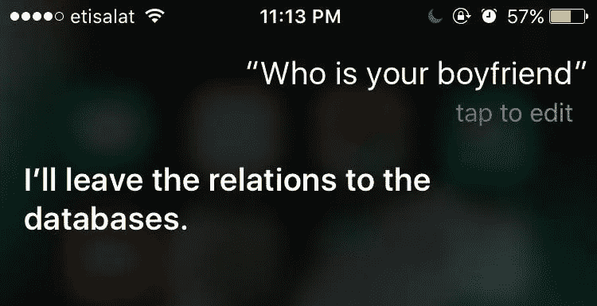](http://bit.ly/2yvR8J9)

Photo Credit, [30 Jokes Only Programmers Will Get](https://hackernoon.com/30-jokes-only-programmers-will-get-a901e1cea549) by [Pavel Malos](https://medium.com/u/9b486c1ffe07?source=post_page-----e9a2cb8a16b2--------------------------------)

## **Heyo 黑客正午读者，**

让我告诉你关于[我们的头条新闻](https://hackernoon.com/dive-into-the-details-of-ios-11-is-apple-still-detail-oriented-fe70af065a7d)。这位来自上海的 iOS 11 beta 用户直言不讳，详细描述了苹果新操作系统的许多设计缺陷，并在 [LifeHacker](https://lifehacker.com/ios-11-is-full-of-tiny-design-inconsistencies-1818539659) 和 [WIRED](https://www.wired.com/story/can-apples-iphone-x-beat-facial-recognitions-bias-problem/) 上获得了好评。非常刺激。我们在一天内创造了超过一年的阅读量。

[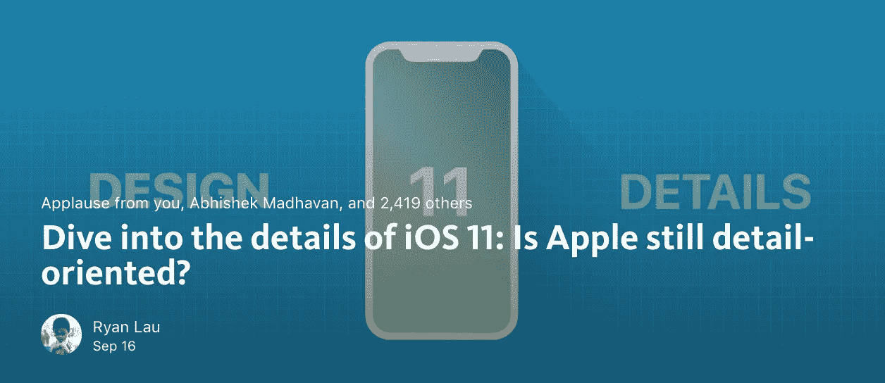](https://hackernoon.com/dive-into-the-details-of-ios-11-is-apple-still-detail-oriented-fe70af065a7d)

— [Ryan Lau](https://medium.com/u/597c97c289af?source=post_page-----e9a2cb8a16b2--------------------------------)

在我们进入其余的 20 大科技故事之前，我想让你知道我们将欢迎[周刊赞助商加入社区](https://goo.gl/em6Dhi)。除了帮助我们保持正常运转，这些赞助商还必须与我们改进技术的目标保持一致。[与 Hacker Noon](https://goo.gl/em6Dhi) 的每周赞助将推动品牌印象、推荐流量、长期 SEO，并包括一次与你真实的原创采访(本周的是，“ [*在线收集信息的未来*](https://hackernoon.com/the-future-of-gathering-information-online-56dd8aa69a93) ”)。

[**今天投标这些赞助**](https://goo.gl/em6Dhi) **。**我们更希望我们的早期赞助商是社区的现有成员，剧透一下，该表单提供了许多黑客中午的号码，由本周的赞助商提供支持， [Paperform](http://bit.ly/2yvR8J9) 。

# [黑客正午](http://hackernoon.com)上的下一个最佳 19 个科技故事:

[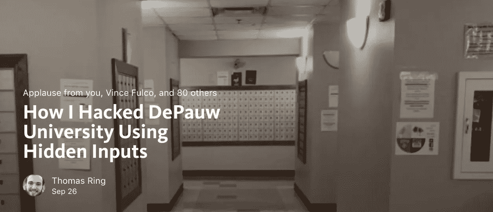](https://hackernoon.com/how-i-hacked-depauw-university-using-hidden-inputs-79377c3dca7e?source=collection_home---1------0----------------)

— [Thomas Ring](https://medium.com/u/4ebd3e2f9271?source=post_page-----e9a2cb8a16b2--------------------------------)

[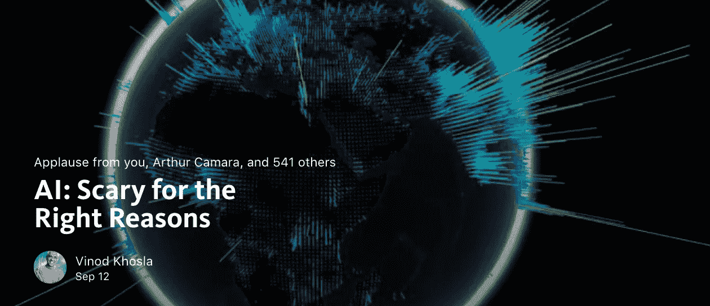](https://hackernoon.com/ai-scary-for-the-right-reasons-185bee8c6daa)

- [Vinod Khosla](https://medium.com/u/3dc350c75361?source=post_page-----e9a2cb8a16b2--------------------------------)

[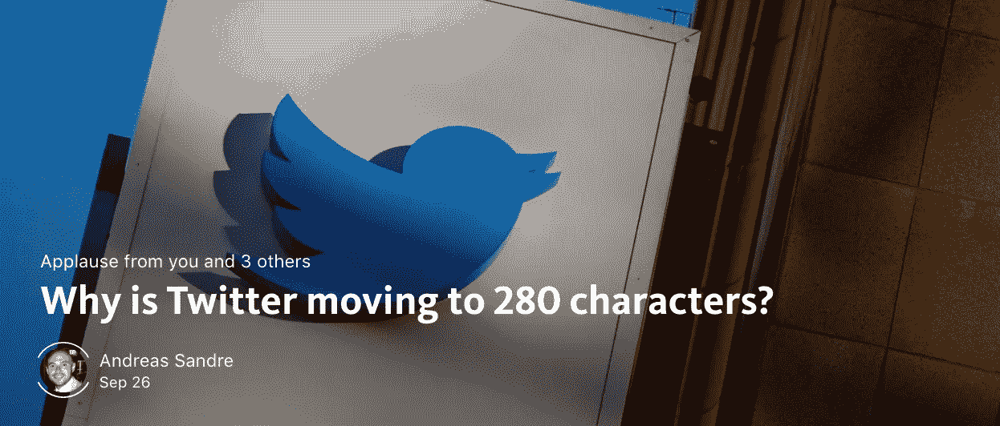](https://hackernoon.com/why-twitter-is-moving-to-280-characters-800cea71b06c)

— [Andreas Sandre](https://medium.com/u/82dc761889d9?source=post_page-----e9a2cb8a16b2--------------------------------)

[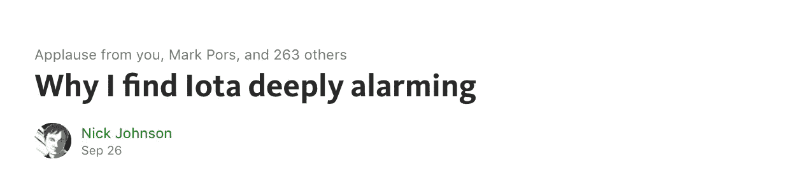](https://hackernoon.com/why-i-find-iota-deeply-alarming-934f1908194b)

— [Nick Johnson](https://medium.com/u/b070f640fe4a?source=post_page-----e9a2cb8a16b2--------------------------------)

— [Stefan Wolpers](https://medium.com/u/8ee338df1554?source=post_page-----e9a2cb8a16b2--------------------------------)

[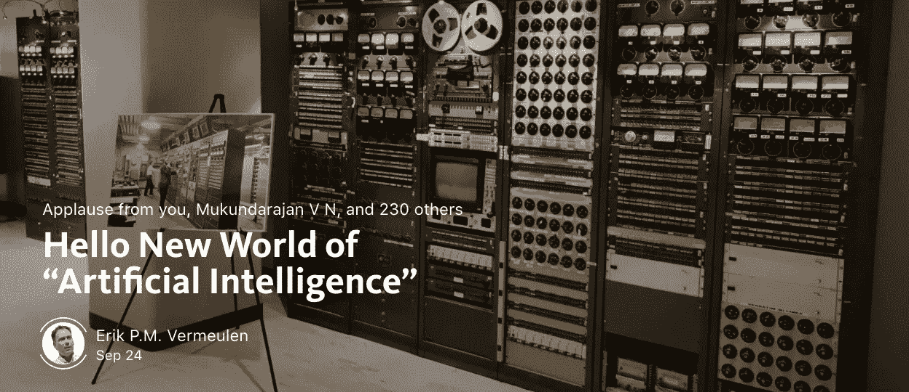](https://hackernoon.com/hello-new-world-of-artificial-intelligence-e49c4010908)

— [Erik P.M. Vermeulen](https://medium.com/u/9eaa7a0096d3?source=post_page-----e9a2cb8a16b2--------------------------------)

[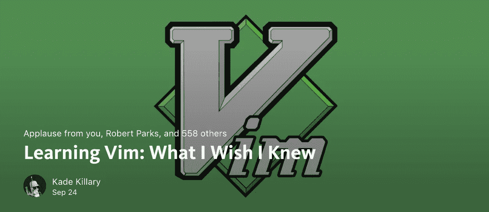](https://hackernoon.com/learning-vim-what-i-wish-i-knew-b5dca186bef7)

— [Kade Killary](https://medium.com/u/b9e689f6ec62?source=post_page-----e9a2cb8a16b2--------------------------------)

— [Robert Cooper](https://medium.com/u/3f6e1adb0f22?source=post_page-----e9a2cb8a16b2--------------------------------)

— [Assaf Elovic](https://medium.com/u/bf912a8da233?source=post_page-----e9a2cb8a16b2--------------------------------)

[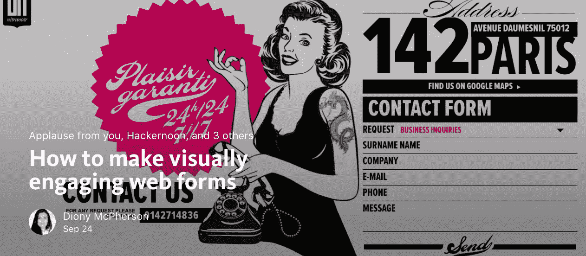](https://hackernoon.com/how-to-make-visually-engaging-web-forms-cdf5c9c7b348)

— [Diony McPherson](https://medium.com/u/76d303a6dcc5?source=post_page-----e9a2cb8a16b2--------------------------------) (our weekly sponsor)

[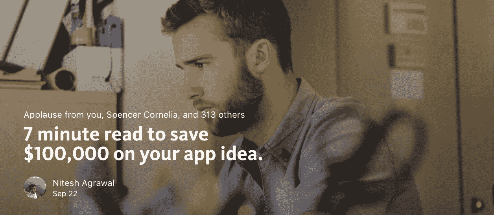](https://hackernoon.com/7-minute-read-to-save-100-000-on-your-app-idea-2d17db675a1)

— [Nitesh Agrawal](https://medium.com/u/520aadd1ce3c?source=post_page-----e9a2cb8a16b2--------------------------------)

[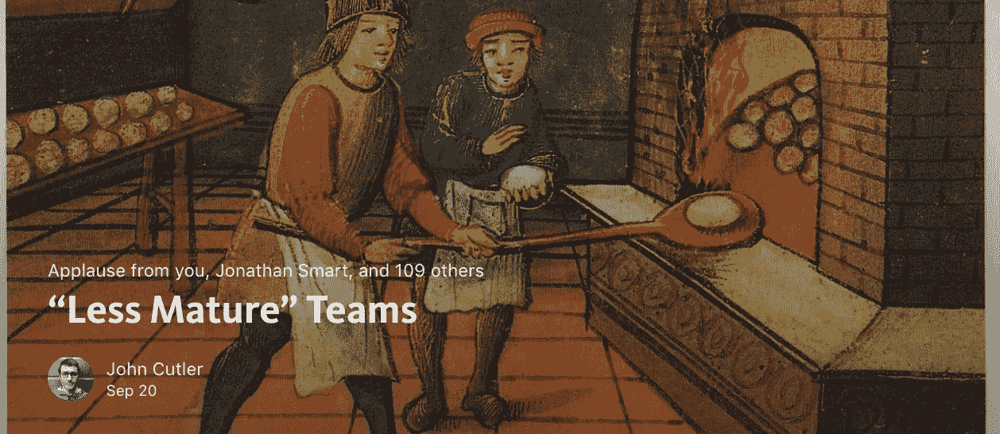](https://hackernoon.com/less-mature-teams-e509dd0b6bd4)

— [John Cutler](https://medium.com/u/4c3f4fe11e6b?source=post_page-----e9a2cb8a16b2--------------------------------)

[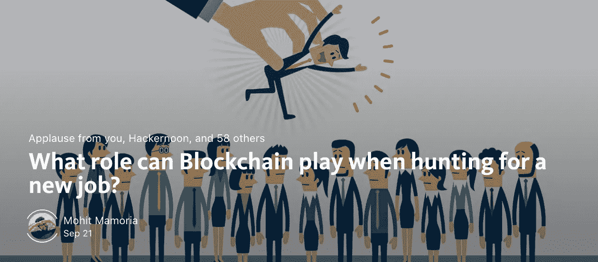](https://hackernoon.com/what-role-can-blockchain-play-when-hunting-for-a-new-job-1ede32aa0711)

— [Mohit Mamoria](https://medium.com/u/24f7fbc09357?source=post_page-----e9a2cb8a16b2--------------------------------)

— [Rotem Mizrachi-Meidan](https://medium.com/u/60e6105b5bc7?source=post_page-----e9a2cb8a16b2--------------------------------)

[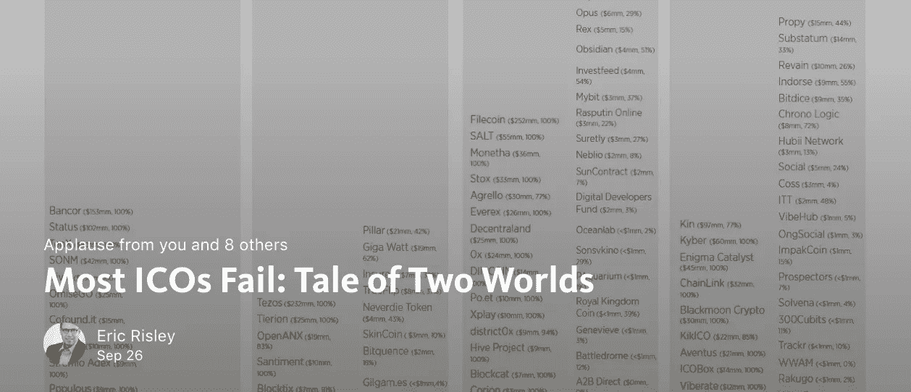](https://hackernoon.com/most-icos-fail-tale-of-two-worlds-d1ab7625ff66)

— [Eric Risley](https://medium.com/u/b3f390f88750?source=post_page-----e9a2cb8a16b2--------------------------------)

[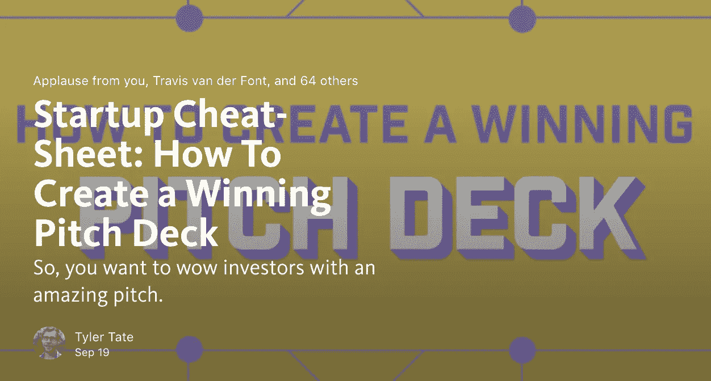](https://hackernoon.com/startup-cheat-sheet-how-to-create-a-winning-pitch-deck-c8037bcacc23)

— [Tyler Tate](https://medium.com/u/54eb94107940?source=post_page-----e9a2cb8a16b2--------------------------------)

— [Sean Johnson](https://medium.com/u/dcc36e66f842?source=post_page-----e9a2cb8a16b2--------------------------------)

[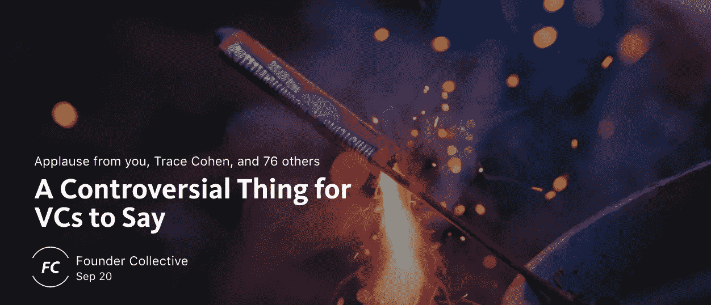](https://hackernoon.com/a-controversial-thing-for-vcs-to-say-56b573ad010a)

- [Founder Collective](https://medium.com/u/f49435c6fa9?source=post_page-----e9a2cb8a16b2--------------------------------)

好好享受这一周，如果我能帮上什么忙，请随时给我发短信。直到下一次，不要把世界的现实想当然。

亲切的问候，

[大卫·斯穆克](http://www.davidsmooke.net/)，[@阿米](http://twitter.com/@ami)