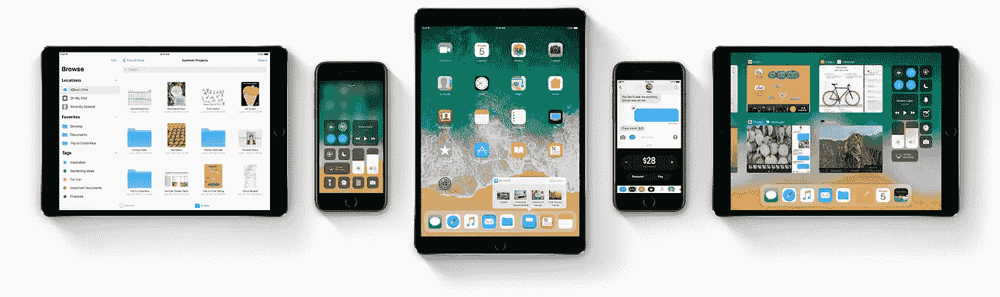
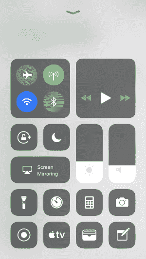
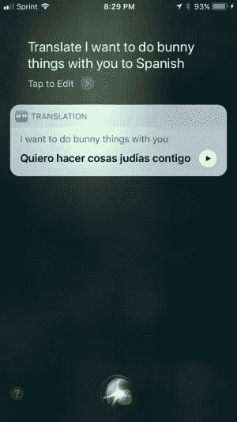
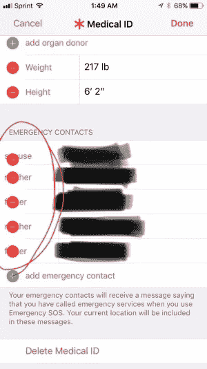

# iOS 11:好的，坏的，完全不能用的

> 原文：<https://medium.com/hackernoon/ios-11-the-good-the-bad-and-the-completely-unusable-8e6e70efb505>

地球上的每个书呆子都应该知道， [iOS](https://hackernoon.com/tagged/ios) 11 昨天在 2017 年 WWDC 上公布了。宣布了对移动操作系统的几项改进，包括改进的控制中心，通过 [Apple](https://hackernoon.com/tagged/apple) Pay 的个人对个人支付，完全重新设计的应用商店，以及对每个人的一些重大改进，好吧，也许只是少数人最喜欢的数字助理 Siri。

其中一些变化让社区大吃一惊，因为苹果今年实际上成功地压制了关于 iOS 的谣言。今年大多数的“泄露”都是纯粹的推测和猜想，但是惊人的数量也击中了隐喻的要害。

其中一个主要变化是一个名为 Files 的新应用程序。文件应用程序给了 iOS 用户一些我们非常缺少的东西，访问某种文件系统。不仅如此，文件还将与 Box、Dropbox、Adobe 等云应用集成。这与 iPads 上新的拖放功能相结合，将前所未有地扩展 iOS。当然，原生文件系统访问在 Android 上已经存在很多年了，但是我离题了。

这篇文章的目标是记录 iOS 11 测试版的发展。这意味着这个帖子将随着时间的推移不断增长，直到今年秋天 iOS 11 的最终发布，所以请继续查看。我想记录功能、错误、兼容(和不兼容)的应用程序，以及任何想到的东西。如果你有任何建议或补充，请在下面留言！(请看我博客上的[原帖，保持更新！)](https://blog.cwatsondev.com/ios-11-the-good-the-bad-and-the-completely-unusable/)

# iOS 11 beta 1

我对第一个开发者测试版的第一印象是你对第一个测试版的期望；它有问题，某些应用程序拒绝启动，我不能使用一些最好的功能，因为我的家人或朋友都没有安装测试版。也就是说，我很喜欢我目前所看到的。

## 什么管用

几乎所有应该起作用的东西都在不同程度上起作用。新的应用程序商店获得大拇指！设计更新早就应该了，我觉得他们真的做得很好。新的“今日”标签显示了应用程序提示、新闻、建议等，非常巧妙。他们还增加了一个新的专用游戏标签，以便将应用程序和游戏分开，并提供更集中的体验。

新的控制中心太棒了！这种外观需要一些时间来适应，但我很高兴我们终于对它的内容有了一点控制。最后有一个音量滑块可能是 iOS 11 中最好的整体改进。我也很高兴他们终于给了我另一个使用 3D Touch 的理由。

iMessage 应用中的新应用抽屉是另一个显著的改进。我在使用 iMessage 应用程序时遇到的最大问题之一是，找到我想要的应用程序需要很多步骤。现在，我可以滑动到我想要的应用程序，选择它，然后完成。A+苹果。

## 什么不起作用

我已经发现了一些错误，我相信还会有更多的错误出现。这是第一个测试版，所以我预计事情会有问题。其中一个 bug 实际上也很有趣。我可以告诉你这是什么，但我认为下面的截图本身就是一个足够好的解释。对于半 nsfw 的内容，我提前道歉。

对于那些不说西班牙语的人来说，邦尼是科内霍，而 T2 是犹太人，T4 是犹太人的意思。因此，上面的实际翻译应该是*Quiero hacer cosas de conejos contigo*。相反，她最后告诉我的是“我想和你一起做犹太人的事情”，这并不具有相同的内涵。

除了令人捧腹的翻译错误，我还发现了几个 UI 错误。主要是一些小事情。首先是在健康应用程序的医疗 ID 部分。添加紧急联系人时，删除图标会叠加在关系上。

在新文件应用程序中，如果你进入浏览选项卡并选择编辑，屏幕底部的选项卡就会消失。我发现的唯一找回它们的方法是选择一个标签并点击返回，或者重启应用程序。

多任务处理也有点不靠谱。关闭一个正在运行的应用程序会导致某种 UI 中断。没什么大不了的，但是很明显。

当我发现新的东西时，我会继续更新这个列表，如果你发现了别的东西，我也会感谢你的评论和截图！

## 损坏的应用程序

我没有安装整个应用商店，所以这显然不是一个包罗万象的列表，但我会列出我发现的完全不可用的应用。

*   [FabFocus](https://blog.cwatsondev.com/ios-11-the-good-the-bad-and-the-completely-unusable/[FabFocus%20-%20portraits%20with%20depth%20and%20bokeh%20on%20the%20App%20Store](https://itunes.apple.com/us/app/fabfocus-portraits-with-depth-and-bokeh/id1080434313?mt=8)

感谢您的关注！请务必访问我的博客上的[原文以获取更新。](https://blog.cwatsondev.com/ios-11-the-good-the-bad-and-the-completely-unusable/)

> [黑客中午](http://bit.ly/Hackernoon)是黑客如何开始他们的下午。我们是 [@AMI](http://bit.ly/atAMIatAMI) 家庭的一员。我们现在[接受投稿](http://bit.ly/hackernoonsubmission)，并乐意[讨论广告&赞助](mailto:partners@amipublications.com)机会。
> 
> 如果你喜欢这个故事，我们推荐你阅读我们的[最新科技故事](http://bit.ly/hackernoonlatestt)和[趋势科技故事](https://hackernoon.com/trending)。直到下一次，不要把世界的现实想当然！

