# iOS 11 vs iOS 10:UI 和交互方面的对比回顾

> 原文：<https://medium.com/hackernoon/ios-11-vs-ios-10-comparison-review-in-ui-and-interaction-f13e89da1432>

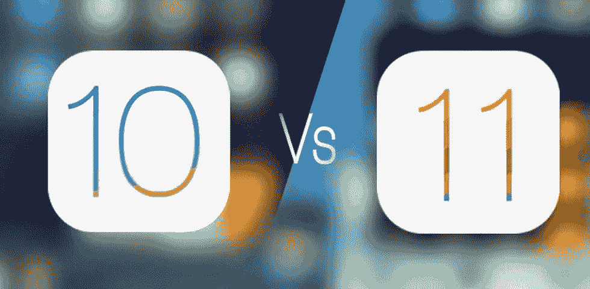

iOS 11 于 2017 年 6 月 5 日在全球开发者大会上公布并向开发者发布了首个测试版，面向消费者的稳定版于 2017 年 9 月 19 日在大部分国家发布。**相比 iOS 10** ，iOS 11 的 UI 和交互有什么特别的变化吗？iOS 11 vs iOS 10，哪个更好？让我们来看看。

# 主页

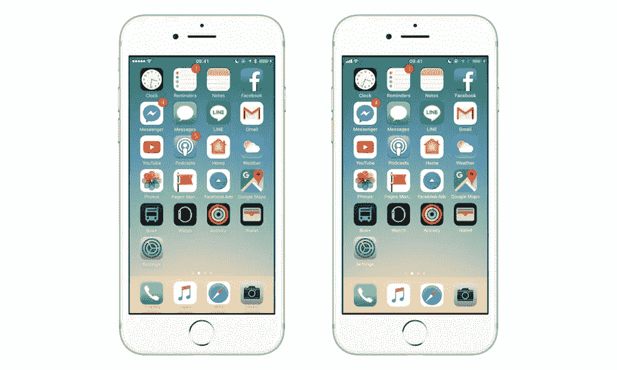

**iOS 10 vs iOS 11:首页**

整个 iOS UI 设计采取更流畅的变化。左上角的导航从小圆点变成了经典的信号栏。Dock 中的应用程序名称已被删除，应用程序名称字体变得更粗，这使得应用程序相对更清晰，更容易阅读。

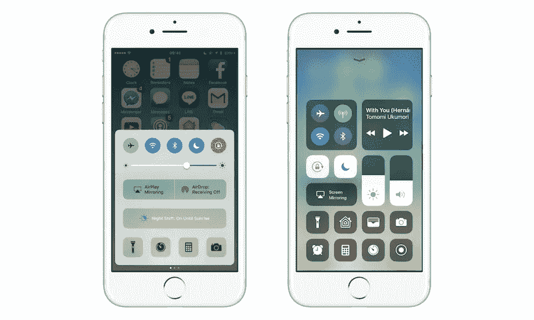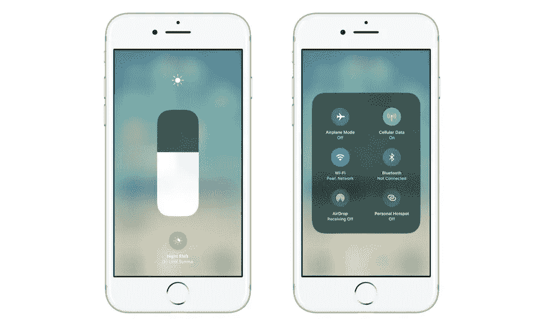

**iOS 10 vs iOS 11:控制中心和语音**

控制中心的调节是 iOS 11 中最大的亮点之一，用户可以自定义常用的功能块，并可以通过 3D Touch 调节亮度和音量，控制栏从水平变为垂直柱状，节省了控制中心的面积。布局变得更加合理，令人耳目一新。

# 核标准情报中心

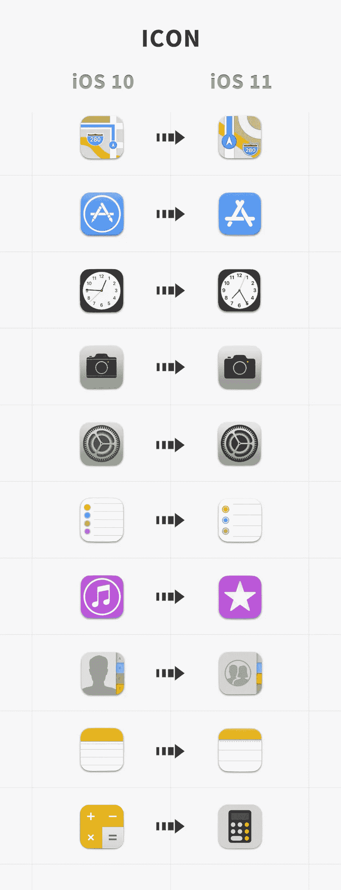

**iOS 10 vs iOS 11:图标**

有 10 个图标变化比较明显:地图、App Store、时钟、相机、设置、联系人、提醒、iTunes store、联系人、笔记、计算器。地图、时钟、相机和联系人的这些变化更加人性化。

经典的 App Store 图标发生了重要的变化，最初的笔和尺子，表达“工具”的性质，现在已经变成了三根棍子，形成了一个代表稳定结构的三角形，它更有可能强调 App Store、开发者和用户之间的关系。

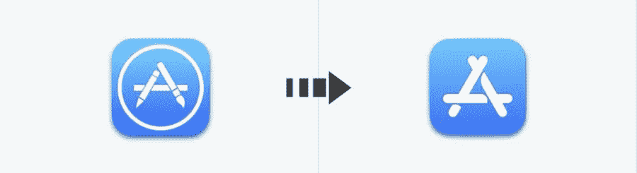

**iOS 10 vs iOS 11: App Store**

计算器的图标变化更彻底，从扁平风格到更圆，我们推断[苹果](https://hackernoon.com/tagged/apple)向早期的 iPhone OS 致敬。

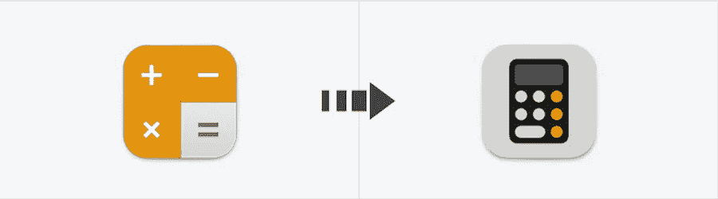

**iOS 10 vs iOS 11:计算器**

还有一些其他图标也进行了相应的改变，整体变得更简单，对比度变得更深，符合 [iOS](https://hackernoon.com/tagged/ios) 11 的整体风格。你也可以在这里找到 iOS 的[矢量图标](https://www.mockplus.com/blog/post/7-ways-to-get-vector-icons-for-uxui-design)。

# 应用商店

App Store 的新设计突出了卡片视图，使用了大面积阴影，增强了页面层次和对比度。这种大胆的布局增强了应用商店的设计感和艺术感，突出了层次和导航。

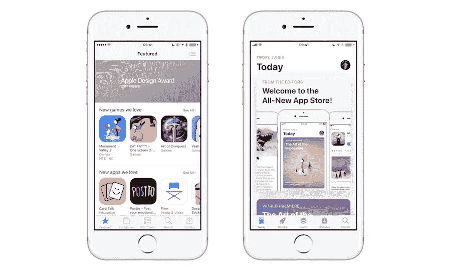

**iOS 10 vs iOS 11: App Store 首页卡片视图**

# 通知

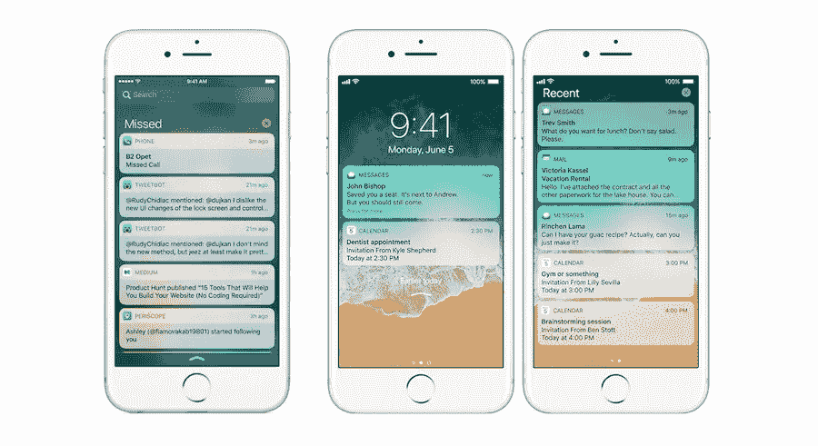

**iOS 10 vs iOS 11:通知**

在新的通知中，当我们从顶栏向下滑动通知时，背景不再使用玻璃模糊，与锁屏一样，保留顶部的时间和日期；当屏幕垂直切换时。

时间和日期会呈现在左侧，右侧放置通知信息，设计风格和控制中心统一了模块化的设计风格，相比 iOS 10 它变得更加简洁大方，更加符合使用习惯，空间利用更加合理。

# 锁定屏幕

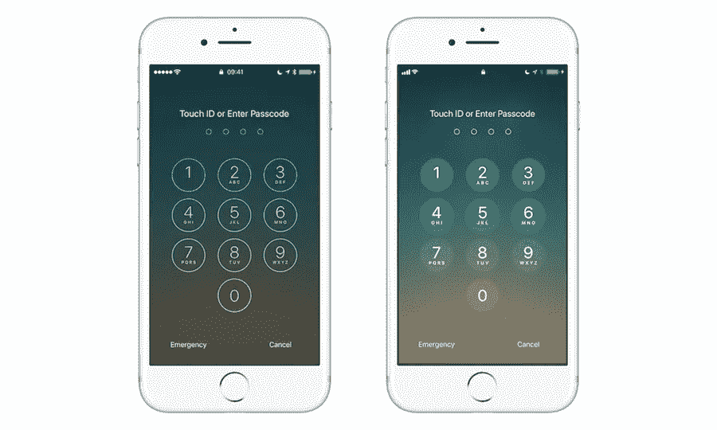

**iOS 10 vs iOS 11:锁屏**

iOS 11 中锁屏的数字键变得扎实，这样的设计提高了界面的可读性，减少了细框细线对阅读的干扰和影响。

除了 iPhone，iOS 11 对于 iPad 的表现可以用非常惊艳来形容，尤其是在[交互](https://www.mockplus.com/blog/post/complete-beginners-guide-to-interaction-design)方面，iOS 11 让 iPad 焕然一新。

# 新码头

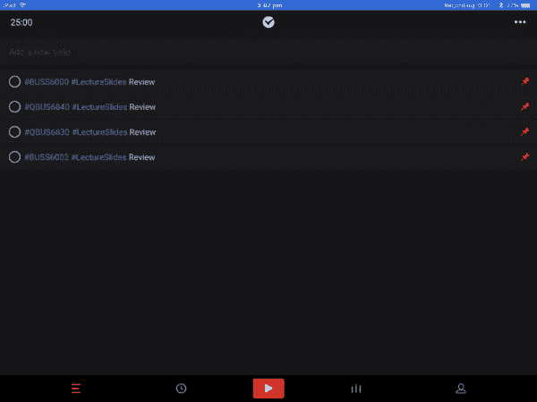

**停靠在 iOS 11**

iOS 11 for iPad 最大的变化是更新了一个新的 Dock，类似于 MacOS Dock 上的体验。首先，Dock 可以显示多达 15 个应用程序，最近使用的三个应用程序将显示在分区右侧的 Dock 中，处于 Handoff 状态的应用程序将出现在最右侧的 Dock 中。

新的 Dock 可以从底层调出，取代了之前的控制中心。值得一提的是，当一个应用程序已经启动时，我们可以从屏幕底部调用 Dock 并打开一个应用程序，将其拖动到界面上，该应用程序将以悬停框的形式出现在界面的右侧

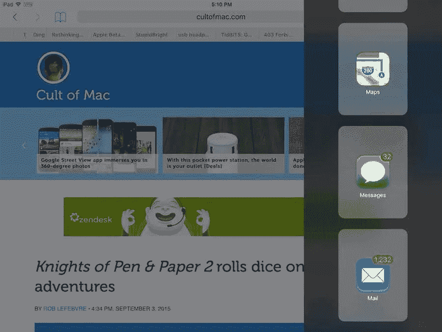

**iOS 10 中的 Dock**

新 Dock 和悬浮窗口的结合，解决了 iOS 10 中分屏状态下只能在应用列表中滑动查找应用的问题。与 iOS 10 中的 [Slide Over](https://support.apple.com/en-in/HT207582) 最大的区别:虽然在 iOS 10 中使用 Slide Over 无法使用主应用程序，但现在你可以在操作悬停框的同时交互和操纵主应用程序，大大改善了体验。

# 应用切换器

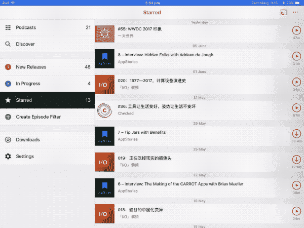

**iOS 11 中的应用切换器**

最让我印象深刻的不止是我终于不再觉得双击 Home 键调出主页很难了。从屏幕底部调出 Dock 后，我可以继续打开应用程序切换器。

整个过程非常流畅，不仅减少了由于突然切换到物理操作带来的不适，也增强了使用系统的沉浸感。如果你想返回主页，不需要点击主页按钮，只需点击应用切换器中的空白区域。

# 拖放

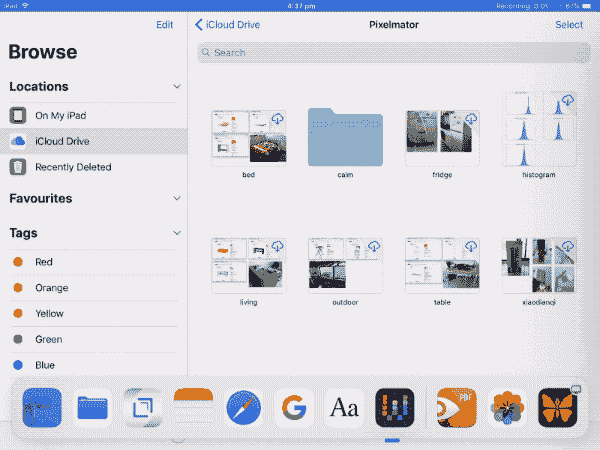

**Drap&iOS 11 中的 Drop**

文件拖放终于在 iPad 上实现了。您可以轻松地从悬停框中拖放文件。只需拖出选定的文件，然后它们将形成一个堆栈，可以轻松地批量拖到主应用程序中，

# 次级菜单

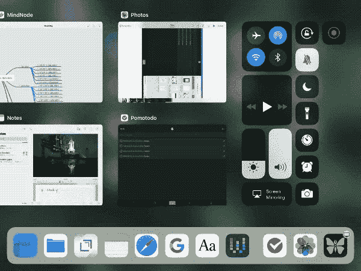

**iOS 11 中的二级菜单**

另一点值得一提的是新的二级菜单。到目前为止，iPad 尚未支持 3D Touch，但通过长按应用程序或通过控制中心可以实现 3D Touch 的类似效果。

在分析了 iOS 10 和 iOS 11 的区别后，我们可以看到 iOS 11 主要增强了线条的整体感，字体和图标都得到了加深和加粗，对比度更高。所有的变化都代表了用户体验的平静演变和微调。

iPhone 的 iOS 11 更流畅，更侧重于视觉效果和操作体验的细节；而 iOS for iPad 可以说是可圈可点，尤其是在交互上，不仅让 iPad 成为了一个更有生产力的设备还让开发者获得了更大的自由和平台，让 iOS 应用生态系统更加高效实用。

在**对比 iOS 11 和 iOS 10** 之后，我们可以看到 iOS 无论是在交互还是 UI 上都保持着创新和力量。另外，也要看到苹果背后的人文精神和用户体验。在产品设计过程中，也要保持产品的沉稳流畅，使产品鲜活生动。